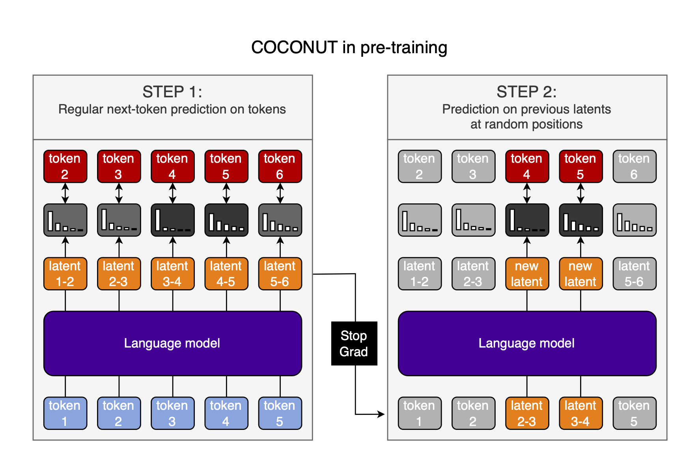

# COCONUT: Parallel pre-training

In [Training Large Language Models to Reason in a Continuous Latent Space](https://arxiv.org/abs/2412.06769), Hao et al. post-train language models to use their own output hidden statess as inputs for the next step using a method called "Chain of Continuous Thought" (COCONUT):


The authors autoregressively generate Chain of Thought (CoT) data between the questions and answers in QA-pairs, and train the model to produce the correct answer. Then, they slowly replace CoT tokens with the output hidden states of the LLM at the previous step and train on that data. This is done with a schedule that increases the number of tokens replaced by hidden states over the course of training. They control when hidden-state-recycling happens by manually inserting \<bot\> and \<eot\> tokens and recycling the hidden states between them.

Unfortunately, this technique is only learned in post-training, because it has to be done autoregressively, which is way too inefficient for pre-training (where maximum parallelism is required).

A parallelized, pre-training-friendly approach to COCONUT would be preferable. I have an idea for how to do this. It has its weaknesses, but might be a good first step in the right direction.

*Thanks to [stochasm](https://x.com/stochasticchasm) for very helpful discussions about this article.*

## COCONUT in pre-training

Here is the process I envision:

1. Do a normal forward pass through the model and calculate the loss and gradients
2. Repeat the forward pass, but replace the inputs at some positions with the previous-position hidden-state-outputs
3. Calculate the loss & gradients again
4. Only now, update the model parameters



### Wastefulness

Obviously, doing two forward passes on the same data is very wasteful.

There is an obvious way to reduce the impact: Only do this every $n^{th}$ forward pass. Yes, that reduces the model's exposure to hidden-state inputs, but we still train COCONUT during pre-training, and so get *a lot* of COCONUT data even if $n=100$.

And importantly, we have to weight the cost of doing this against the cost of doing a similar amount of COCONUT training autoregressively during post-training. So the questions are: 1) How much cheaper is incorporating COCONUT in pre-training from time to time than doing the same amount of hidden-state recycling during post-training? 2) How much more sample efficient is COCONUT in post-training? The exact tradeoff between these two points determines if this method is worth it, and must be determined empirically.

A second efficiency improvement would be to only compute the new forward pass at the positions that use hidden-state-inputs. On the one hand, this would make the computation cheaper, but on the other hand, it would train the model to only ever see a single recycled hidden state in its context window at a time, which might be a disadvantage. Again, the tradeoff between these two must be evaluated empirically.

### Schedule

At the very beginning of pre-training, token embeddings and model hidden-states are mostly random. Thus, looping the hidden states will likely provide very little training signal, and might interfere with the model's ability to learn from the token inputs.

Therefore, a schedule is likely needed, where we start with no hidden-state-recycling, and gradually increase the probability of a hidden-state-recycling step, as well as the number of hidden states to recycle per step.

## Choose the looping position with entropy

An optional extension is to not choose the positions at which we loop hidden states randomly, and then post-train exactly as in the COCONUT paper, but instead use the entropy of the output distribution to determine at which position to loop hidden states. I will get to why I think this is a good idea in a bit, but first explain how it works. As seen in the illustration below, the difference to choosing positions randomly is small:


When we input a token, and get an uncertain response&mdash;a high-entropy probability distribution when decoding the output hidden states with the language head&mdash;we take the output hidden states from the *previous* token position, and use them as inputs to the model during the second forward pass, just like before.

### What is the advantage of this?

The key to seeing the advantages of determining the looping-positions through entropy is that hidden-state-recycling enables Breadth-First Search (BFS) (with pruning of very unlikely next-tokens). The authors of the paper show this experimentally: when they decode the hidden states they will recycle, the probability distributions get sharper and sharper with each thought. Clearly, the model considers multiple possible branches of the search tree at once, and starts pruning them.

And BFS is exactly what we want when the model is uncertain about the next token. In such a high-entropy situation, we want to explore multiple paths at once, which hidden-state-recycling allows us to do. Thus, using the entropy to decide when to start and stop looping hidden states is likely optimal.

*So why am I using the hidden state from before the high-entropy position as an input to the high-entropy position?* Well first off, this might be the wrong approach, and it might be better to loop the high-entropy hidden states into the next token position, instead of taking the previous token position's hidden states as inputs at their position. My intuition for preferring the former is that it would more closely resemble a CoT towards a difficult-to-predict token. However, I recognize that this is slightly contradictory, and which is better should ultimately be evaluated empirically (again).

### Inference

If we use the model's own output probability distribution to decide when to start recycling hidden states, we can also decode the hidden states during inference and use their entropy to decide when to stop recycling, and start moving into token-space again.

Then, we don't need to manually insert the \<bot\> and \<eot\> tokens which force us to pre-determine the number of latent thoughts. This gives us increased flexibility, and more dynamic compute. The model can now freely switch between token-space and hidden-state-space during inference.

### Post-training

If switching between token-space and hidden-state-space during inference is a good idea, how do we encourage it during post-training?

I think letting the model rip and simply setting an entropy threshold to either recycle hidden states or tokens should just work (in conjunction with reinforcement learning (RL)). If we are using RL, then the generations with the correct mixture of hidden-state-recycling and CoT tokens will be rewarded, and ones with a poor mixture will be punished. If the assumption that high entropy requires BFS is correct, then this will move the model towards an optimal generation policy.

To stress it again, this is an optional extension to the main parallel-pre-training-of-COCONUT idea. If it doesn't work, it doesn't contradict the idea of parallel pre-training, and doesn't even inherently contradict the use of entropy during pre-training. We could then simply use the exact pre-training technique from the paper.

### Open questions

Besides the question of which hidden states to recycle, [stochasm](https://x.com/stochasticchasm) also brought up the following two points which made me think:

1. *How would entropy-based hidden-state-recycling work at the start of pre-training, where we don't yet have meaningful probability distributions?* I think the answer is simply that if we have no meaningful probability distributions, then entropy-based placing of hidden-state-recycling is the same as placing it randomly. As the model is trained more, the probability distributions will become more meaningful, and we will move towards the technique we want to train. Additionally, we would use a schedule even with random placement of hidden-state-recycling, as discussed in [the section "schedule"](#schedule), so it should be dealt with anyway.
2. *Is the hidden-state-recycling in conflict with token-inputs?* A few points on that: 1) I think it might be a little, and will be writing another article in part about this. 2) But if it is, it's a general problem with COCONUT, not just this extension to it. It seems to work pretty well in the paper. 3) As for the entropy-based token-choice, if anything, it should reduce the conflict, because (if I'm right) it's the optimal strategy. Thus, hidden-state-recycling will encourage probability distributions similar to predicting on tokens, and the two input-modalities will be more compatible.

## Advantages

So what are the advantages of this approach?

- Training hidden-state-recycling from the start might move the weights into a more favorable loss basin for post-training as done in the paper
- Even if we only do the second forward pass with hidden-state-recycling $1\%$ of the time, this still represents a lot of data, and not that much cost
- Using entropy-based measures represents a more end-to-end approach that allows for more dynamic compute allocation, and doing this during pre-training will likely increase its effectiveness

I have no idea if this is actually worth it, but it seems like a sufficiently interesting idea to at least share it.

## Citation

```bibtex
@misc{snimu2024coconut,
    title={COCONUT: Parallel pre-training},
    author={Sebastian M\"uller},
    year={2025},
    month={jan},
    url={https://github.com/snimu/blog/blob/main/contents/COCONUT-parallel-pretraining/article.md}
}
```
