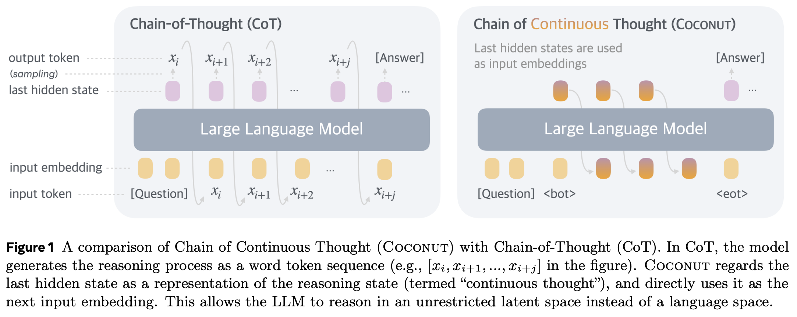
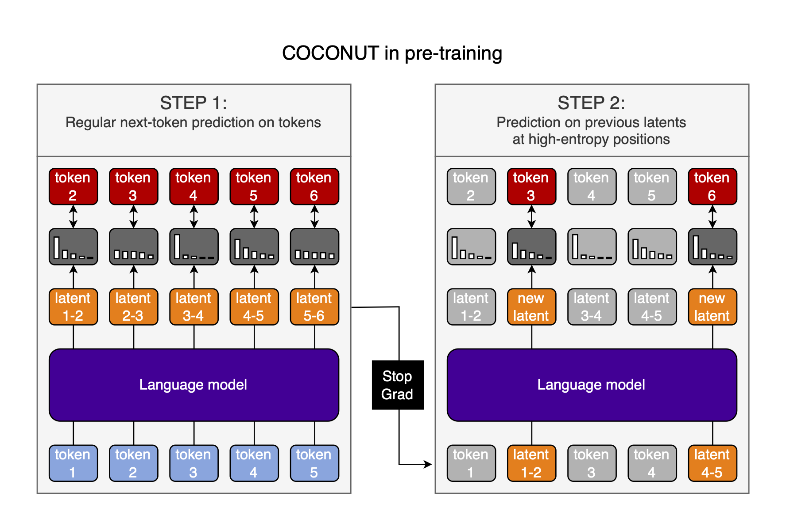

# COCONUT: Parallel pre-training

In [Training Large Language Models to Reason in a Continuous Latent Space](https://arxiv.org/abs/2412.06769), Hao et al. post-train language models to use their own output hidden statess as inputs for the next step using a method called "Chain of Continuous Thought" (COCONUT):



The authors autoregressively generate Chain of Thought (CoT) data between the questions and answers in QA-pairs, and train the model to produce the correct answer. Then, they slowly replace CoT tokens with the output hidden states of the LLM at the previous step and train on that data. This is done with a schedule that increases the number of tokens replaced by hidden states over the course of training. They control when hidden-state-recycling happens by manually inserting \<bot\> and \<eot\> tokens and recycling the hidden states between them.

Unfortunately, this technique is only learned in post-training, because it has to be done autoregressively, which is way too inefficient for pre-training (where maximum parallelism is required).

A parallelized, pre-training-friendly approach to COCONUT would be preferable. I have an idea for how to do this. It has its weaknesses, but might be a good first step in the right direction.

## COCONUT in pre-trainings

Here is the process I envision:

1. Do a normal forward pass through the model and calculate the loss and gradients
2. Measure the entropy of the output distributions
3. Repeat the forward pass, but:
    - Replace the inputs at some positions with the previous-position hidden-state-outputs
    - Do this where the output probability distributions in the first forward pass have the highest entropy &rarr; have the highest uncertainty
    - We can either control the total number of tokens to be replaced by saying the top-k tokens are replaced, or set an entropy threshold and replace all tokens whose prediction entropy exceeds that threshold
4. Calculate the loss & gradients again
    - Option 1: Only at positions that have previous hidden-states as inputs
    - Option 2: Everywhere
    - The former allows us to use a kv-cache from the first forward pass and improve efficiency significantly
    - The latter teaches the model to deal with having multiple hidden-state-inputs in its context window, and lead to better performance
    - Which is better in this tradeoff is an empirical question
5. Only now, update the model parameters

See the following illustration:



## Wastefulness

Obviously, doing two forward passes on the same data is very wasteful.

There is an obvious way to reduce the impact: Only do this every $n^{th}$ forward pass. Yes, that reduces the model's exposure to hidden-state inputs; but we still train COCONUT during pre-training, and so get *a lot* of COCONUT data even if $n=100$.

And importantly, we have to weight the cost of doing this against the cost of doing a similar amount of COCONUT training autoregressively during post-training. So the questions are: 1) How much cheaper is incorporating COCONUT in pre-training from time to time than doing the same during post-training? 2) How much more sample efficient is COCONUT in post-training, and does that make up for the pre-training cost?

A second efficiency improvement would be to only compute the new forward pass at the positions that use hidden-state-inputs. As discussed before, this would make the computation cheaper, but would train the model to only ever see a single recycled hidden state in its context window at a time.

## Inference

If we use the model's own output probability distribution to decide when to start recycling hidden states, we can also decode the hidden states during inference and use their entropy to decide when to stop recycling, and start moving into token-space again.

Then, we don't need to manually insert the \<bot\> and \<eot\> tokens which force us to pre-determine the number of latent thoughts. This gives us increased flexibility, and more dynamic compute. The model can now freely switch between token-space and hidden-state-space during inference.

*Why is this relevant?* I think that switching between token-space and hidden-state-space during a single long thought is ideal. Hidden-state-recycling allows a type of Breadth-First Search (BFS) as demonstrated in the paper, while tokens allow you to write down very concrete conclusions or facts, and make use of them in further reasoning. Basically, pure token-based CoT requires backtracking to emulate BFS, while hidden-state-recycling gives this to you for free; but BFS is not the only relevant reasoning strategy, and some techniques are almost certainly better suited for token-space than hidden-state-space.

Importantly, BFS is exactly what we want when the model is uncertain about the next token. In such a high-entropy situation, we want to explore multiple paths at once, which hidden-state-recycling allows us to do. Thus, using the entropy to decide when to start and stop looping hidden states is likely optimal.

## Post-training

If switching between token-space and hidden-state-space during inference is a good idea, how do we encourage it during post-training?

I think letting the model rip and simply setting an entropy threshold to either recycle hidden states or tokens should just work (in conjunction with reinforcement learning (RL)).

If we are using RL, then the generations with the correct mixture of hidden-state-recycling and CoT tokens will be rewarded, and ones with a poor mixture will be punished. If the assumption that high entropy requires BFS is correct, then this will move the model towards an optimal generation policy.

## Advantages

So what are the advantages of this approach?

- Training hidden-state-recycling from the start might move the weights into a more favorable loss basin for post-training as done in the paper
- Even if we only do the second forward pass with hidden-state-recycling $1\%$ of the time, this still represents a lot of data, and not that much cost
- Using entropy-based measures represents a more end-to-end approach that allows for more dynamic compute allocation, and doing this during pre-training will likely increase its effectiveness

I have no idea if this is actually worth it, but it seems like a sufficiently interesting idea to at least share it.

## Citation

```bibtex
@misc{snimu2024coconut,
    title={COCONUT: Parallel pre-training},
    author={Sebastian M\"uller},
    year={2025},
    month={jan},
    url={https://github.com/snimu/blog/blob/main/contents/COCONUT-parallel-pretraining/article.md}
}
```
