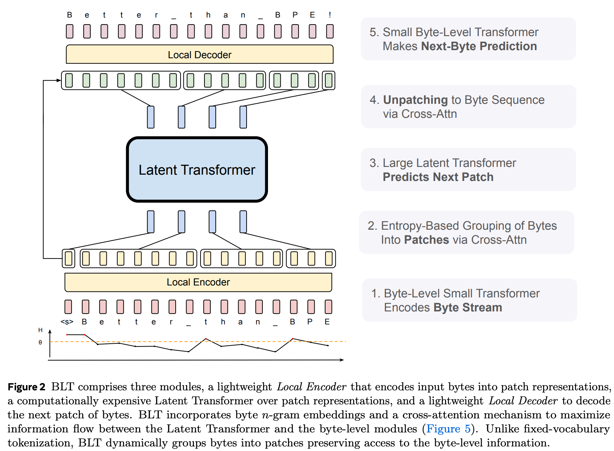
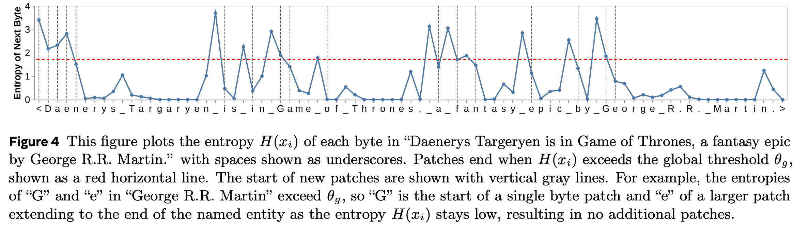
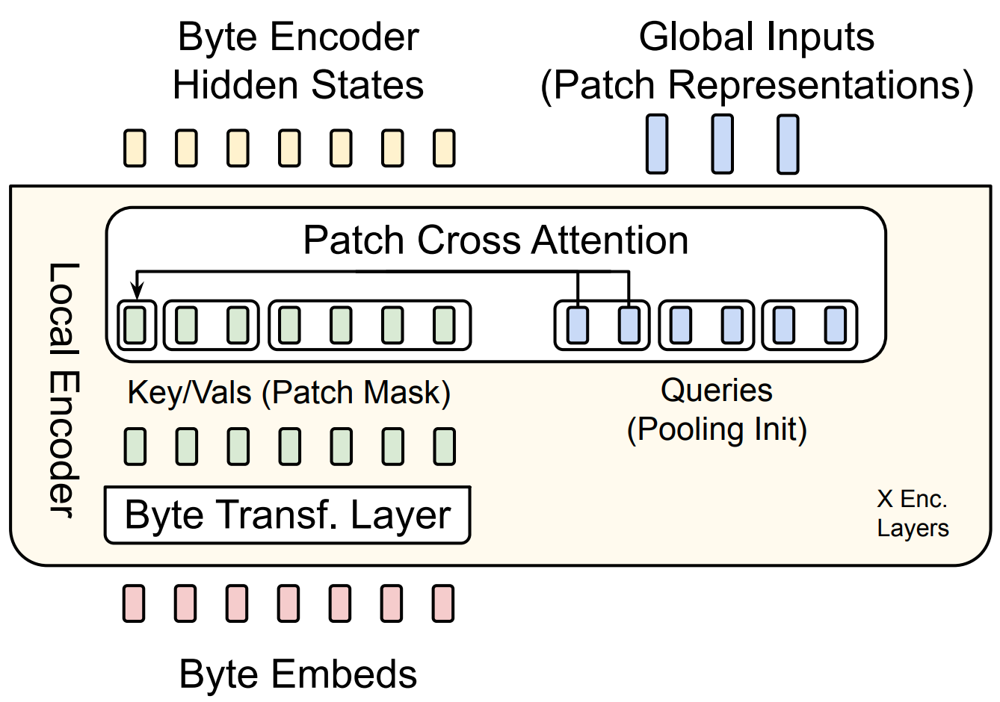
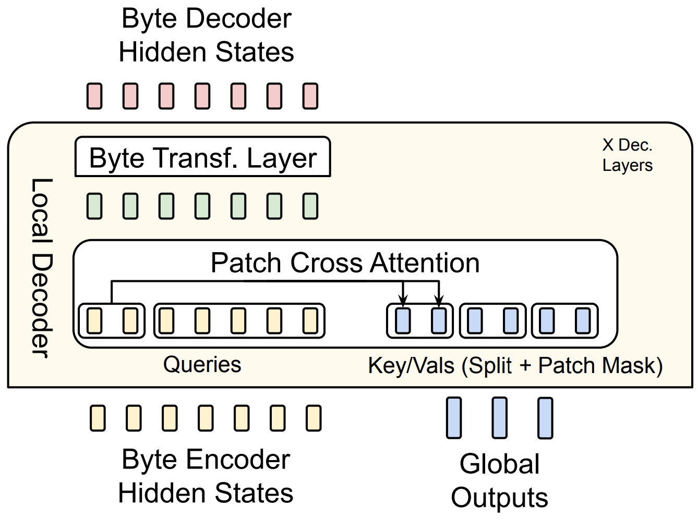
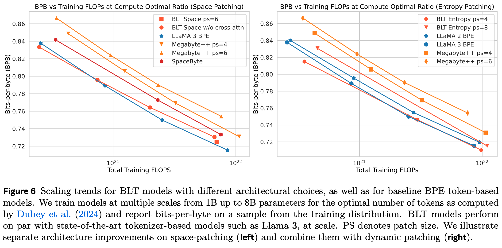
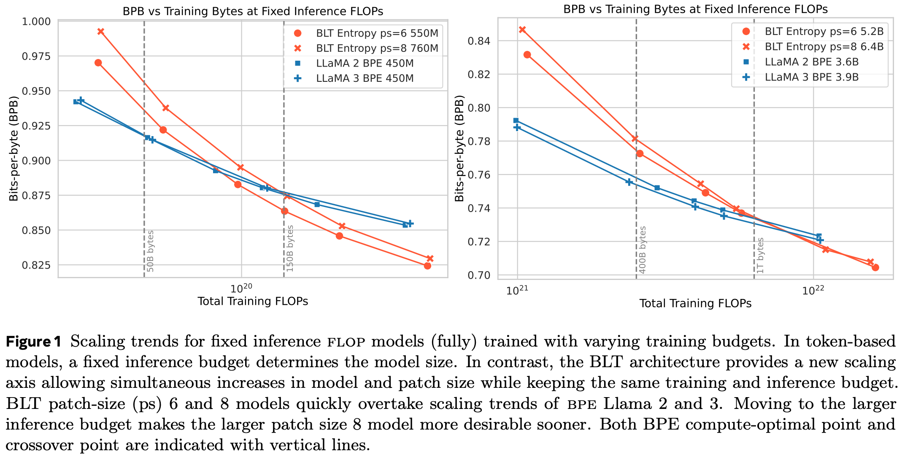
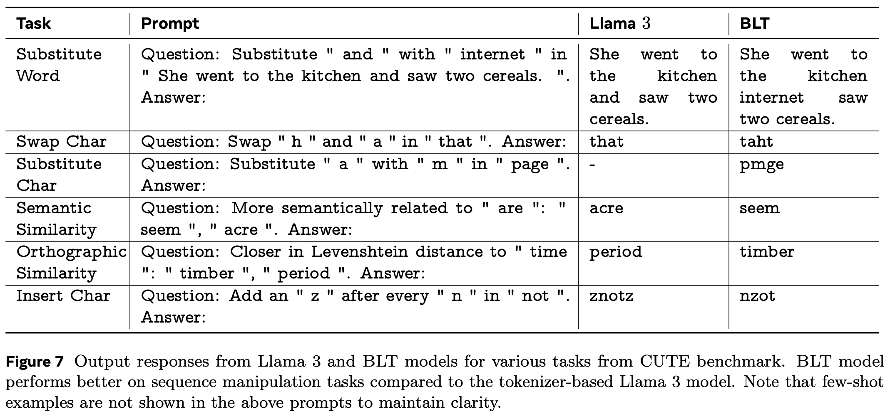
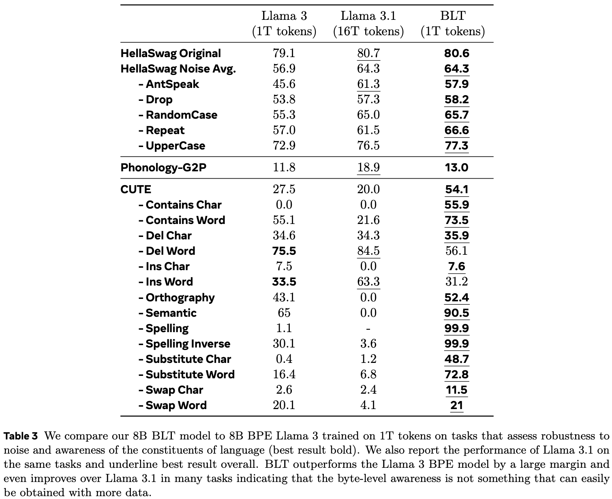
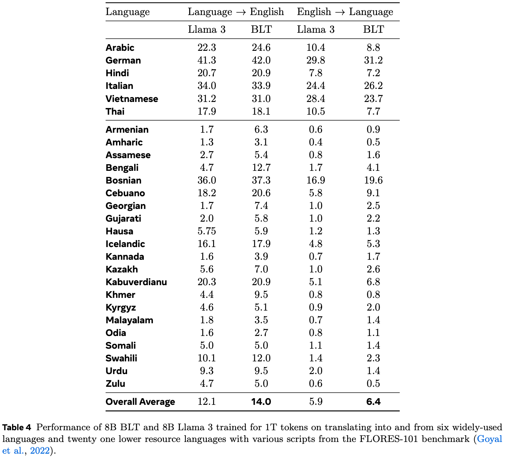

# On the Byte Latent Transformer

My understanding of the [Byte Latent Transformer paper](https://arxiv.org/abs/2412.09871).

This is a long read and contains some speculation. It probably helps to read the paper first, but I've tried to make the explanations work either way.

## The goal

The goal of the paper is to use bytes (characters) as inputs in a transformer, without increasing the sequence length of the model compared to a normal transformer with Byte-Pair Encoding (BPE) tokens.

This is desireable because it allows the model to have access to much more fine-grained information about the input than possible with BPE. As we will see later, it can also lead to superior scaling properties. Both of these are a big deal.

However, some bytes are much easier to predict than others. While retaining byte-level information, we would like to group many adjacent easy bytes into one patch and predict them all at once, while grouping far fewer&mdash;potentially only one&mdash;more difficult byte(s) into another patch to predict at once. This would allow us to work on what are effectively large tokens (the patches we group bytes into) to predict all at once, while keeping difficult-to-predict bytes separate, and predicting them one-by-one or in small patches.

> The semantic differentiation between patch and token comes down to tokens being groups of bytes that are determined independently of the test time inputs, while patches are dynamically created from bytes, at test time.

## The model

The basic setup is this:

1. Find some way to group bytes into tokens dynamically, depending on the difficulty of predicting the next byte
2. Use cross-attention to encode the bytes into the resulting patches
3. Use a normal, large transformer to predict the next patch
4. Use cross-attention again to decode that next-patch prediction into the next group of bytes

Step 1 happens entirely in the dataloader, asynchronously from the rest of the model.

Figure 2 gives a good overview of the overall architecture:

Let's go through each part of the architecture.

### Grouping bytes into tokens

There are many ways to group bytes into tokens. However, a very promising approach is to use the information that is already available at the model outputs. This was popularized by [entropix](https://github.com/xjdr-alt/entropix), which uses the uncertainty of the model's next-token prediction (in normal transformers using BPE tokens) to adjust their sampling strategy. For example, always pick the most likely token when the model is consistently confident about its predictions, but insert "thinking" tokens (like "wait" or "...") manually into its context window when it is consistently uncertain.

We could use the same information about model certainty to find out which bytes are easy to predict, and which ones are difficult.

There is just one problem with this: if you use a model's uncertainty about the next byte to estimate the difficulty of predicting the next byte, you cannot use that estimate at the model's input for predicting *that very next byte*.

So instead, the authors train a second next-byte prediction model first. It is a tiny transformer that works exclusively on bytes and is very efficient, because it can use sliding-window attention (&rarr; the attention matrix is not a problem despite very long byte sequences; though this is optional), and has a very small parameter count (&rarr; very little compute per byte, because most cost in short sequences comes from the MLP, not the Attention mechanism). Because that model is trained on the same dataset and task as the main model we want to train, it is safe to assume that its uncertainty about the next byte will correspond closely to the main model's uncertainty.

Thus, the authors first train this tiny "entropy model" on the same dataset and task as the main model, and then use its next-byte prediction uncertainty to group bytes into tokens. They specifically use the entropy of the output distribution at each position as the uncertainty estimate, and group bytes by starting a new patch after every byte for which the next-byte prediction entropy exceeds some threshold.

> The entropy is low if the probability mass of the outputs is very concentrated&mdash;the model is confident about which is the most likely next byte&mdash;and high if the probability mass is spread out.

The method becomes apparent from Figure 4 of the BLT paper:

Note that the byte they show on the x-axis is the *current* byte, while the entropy shown in the diagram is the *next* byte's entropy. This results in the following patches (taken from Figure 3):

By controlling that threshold, we can control how many bytes are grouped into a single patch on average.

### Embedding bytes

Bytes consist of 8 bits. This inherently means that there are only 256 possible bytes. Therefore, the vocabulary size is extremely small, which is great!

However, when using the BLT with raw byte-embeddings, it underperforms compared to BPE-based models. Why is that?

Here is my intuition: [embeddings are the middle of the model](https://github.com/snimu/blog/blob/main/contents/embeddings-thoughts/article.md); their parameters are produced by a backward pass through an entire transformer over the whole dataset. Yes, most tokens are just re-combinations of other tokens, but their embeddings contain global statistics about the *specific* combination of smaller tokens (ultimately, the bytes). Providing the model with token-statistics relative to the entire training dataset gives it a huge leg up.

To replicate this, the authors add n-gram embeddings to the byte embeddings. At each byte-position, they take the n-gram over the current and (n-1) previous bytes, and map it to an embedding. This n-gram embedding is added to the single-byte embedding.

This presents a big problem: there is a gigantic number of n-grams over just a few bytes. There are 256 possible bytes at each position. How many possible unique combinations of length four are there, let alone of length eight? The numbers are ridiculously large.

To remedy this, the authors do two things:

1. They pre-define a limited vocabulary size. Then, they map multiple n-grams to a single embedding using a hash function, which is very efficient.
2. They don't use n-gram embeddings at the output (because why would they? The individual bytes contain all the necessary information), so the linear layer at the output is very small (just num_embeddings * 256 parameters).

This makes the use of n-grams realistic. Still, their best setting uses 4 million total embeddings. Even with a hash function and mapping multiple n-grams to a single embedding, this uses up a lot of memory (and all of these embeddings must be trained!).

However, the compression by mapping multiple n-grams to a single embedding should not be underestimated. First, because there are an absurd number of 8-grams, and secondly because that is not all they do. They actually add up the embeddings of 3-, 4-, 5-, 6-, 7-, and 8-grams! While they don't say why they do this, I think that it has a specific advantage: it helps to de-compress the embeddings. If multiple 8-grams share the same embedding, then the same 8-gram embedding could be created by multiple different 3-gram embeddings. This way, the different 8-grams can be distinguished even if they share embeddings. And with n-grams of mutliple sizes, this can be done even if the embeddings are shared between different n-gram sizes, as long as that sharing is done cleverly. How? Well an 8-gram could be made up of several different 3-grams, but while each of those shares embeddings with multiple other 8-grams and 3-grams, they don't share embeddings with *this* 8-gram or each other. By adding all the n-gram embeddings together, we can emulate having far more embeddings than we actually have. On the other hand, I very strongly doubt that this is sufficient to fully de-compress the embeddings.

Ultimately, though, it works very well, as you will see in the [results section](#results--benefits).

> One last note: it is very important to add the n-gram embeddings to the byte embeddings, instead of replacing the byte embeddings with them. Because multiple n-grams are mapped to the same embedding, the model would otherwise not be able to distinguish between them.

### Encoding bytes into patches: The Local Encoder

We have an entropy model and the main Byte Latent Transformer. That BLT in turn consists of three parts: the Local Encoder, the Latent Transformer, and the Local Decoder.

**The Local Encoder is a simplified transformer.** It consists only of a self-attention layer followed by a cross-attention layer.

Removing the MLP means removing most parameters and computational cost, which is important because this model is applied to each byte individually. By making this lightweight, we can shift the majority of the computation to the Latent Transformer, which works on much shorter sequences: the patches. To further reduce computational cost in long sequences, the Local Encoder uses sliding-window attention. The self-attention and cross-attention layers can be repeated, but aren't in most experiments in the paper.

The cross-attention layer has an attention mask that ensures that each patch receives information only from the corresponding bytes. Thus, the self-attention layer mixes byte information over decently long distances (the sliding-window size), and the cross-attention layer puts this semantically enriched information into each patch.

**The model dimension of the Latent Transformer is larger than that of the Local Encoder.** To make the dimensions of the queries (patches) and keys (bytes) match, the patches are split along their dimension into multiple vectors, each assigned to one attention head in cross-attention. The query is thus different between cross-attention heads, while the key is the same. The outputs of the different heads are then concatenated to form the final output of the Local Encoder / input to the Latent Transformer.

**The Latent Transformer patches are initilized from the byte embeddings.** Each patch of the Latent Transformer corresponds to a set of bytes. It is also split into multiple attention heads, as explained above. Each head has the same dimension as the byte embeddings and Local Encoder outputs. We initialize each patch-head from the corresponding byte embeddings by pooling the byte embeddings once, and moving the resulting vector into each head. If, for examle, we had two heads but only one byte, we would simply copy that byte-embedding into both heads. If we had eight bytes for the patch, we would pool them, for example by taking the mean, and then copy the result into the two patch-heads.

My intuition about this is that initializing the patches by pooling the bytes lets the Latent Transformer know which bytes are present in the patch. The cross-attention from the Local Encoder, on the other hand, provides it with information about the specific ordering of these bytes, and some semantics associated with it.

However, there is an additional aspect to this: by using n-gram embeddings, we already provide the Latent Transformer with information about the order of the bytes and their semantics. I suspect that more cross-attention layers could achieve the same, but using n-grams is cheaper up to a certain point.

Why do we still need cross-attention at all? Again, I can only speculate, but it's probably to encode more long-range byte-information into the patch than the n-gram can provide without needing an effectively infinite vocabulary. Encoding long-range information into the patch in a learned manner allows us to usefully include information about byte-combinations that weren't seen during training. Finally, since multiple n-grams are mapped to the same embedding, additional information about the order of the bytes is required to properly make use of them.

So in the end, the choice between longer-range n-grams and cross-attention is a trade-off.

> Sidenote: I suspect that focussing more on cross-attention is more scalable, and ultimately cleaner, but n-grams might be needed for the entropy model (and using short n-grams is obviously no problem).

The paper provides a diagram of the Local Encoder in Figure 5:

### The Latent Transformer

The Latent Transformer is a standard transformer, and makes up the vast majority of the model's parameters. As explained before, th is important, because it means that most parameters are only ever applied to patches, not bytes. This model does most of the actual work. It has access to byte-level information through the Local Encoder, and can produce byte-level predictions through the Local Decoder.

Let's repeat what information is present at the input of each patch:

1. *Which bytes are present* in the patch. From the byte embeddings
2. *In which order* the bytes are present, plus some semantics. From the n-gram embeddings
3. *Long range connections and precise ordering* between the bytes. From the cross-attention layer; long-range connections come from the self-attention in the Local Encoder, and precise ordering form the cross-attention (is needed because multiple n-grams are mapped to the same embedding &rarr; it's possible that there are byte orders that could not be differentiated between without cross-attention)

### Decoding bytes from patches: The Local Decoder

This works very similarly to the encoding process, as shown in the second part of Figure 5:

**The Local Decoder is larger than the Local Encoder.** It is multiple layers deep. I speculate that this is because at the input, most information is provided by the embedding layer and pooling of bytes, while unpooling of bytes is not possible (merging bytes into a patch is easy because the whole point is to combine their information, but how would you know how to split a patch? Which byte would you write which piece of information into? That's what cross-attention is for!). Thus, the Local Decoder must spend more effort decoding the patches into bytes than the Local Encoder must spend encoding them.

**Initializing keys and values.** During training, we know the number of bytes in the next patch, and can thus prepare an appropriate number of queries to decode the queries (heads produced from the single patch) from. During inference, however, we don't know that number. So how do we know how many bytes to decode a patch into? And how do we best initialize the keys and values of the Local Decoder? While I haven't seen it explicitly stated in the paper, from Figure 5 I surmise they might use one of the following two methods.

Method 1.

1. Use the entropy model to predict the next bytes autoregressively, until one of these predictions exceeds the entropy threshold (this is parallelized during training of course); use this to determine the number of bytes to decode
2. Use the latents (hidden states) of the entropy model *for all those predictions* as the initial inputs to the Local Decoder, from which the keys and values are produced
3. Use the cross-attention from the patch to fix the errors of the entropy model's predictions

--- create image for this ---

This makes a strong assumption: the very weak entropy model is good enough at predicting the next byte that it can be used to determine an appropriate number of bytes to decode (and initialize and thus bias the Local Decoder inputs, but that's not a big deal because Cross-Attention can fix it). That makes me think that this is not the method they use.

Method 2.

1. Produce a byte prediction with the entropy model
2. Use the latents of that prediction as the initial values for the keys and values of the Local Decoder
3. Correct the prediction using the patch prediction and the Local Decoder
4. If the entropy model's prediction exceeds the entropy threshold, you are done with the patch
5. Else, you append the predicted byte to the inputs and go to step 1 with the new input-byte sequence (and use the Local Decoder's kv-cache of the previous byte predictions in the current byte prediction)

--- create image for this ---

For this method, you have to move a bunch of data between the entropy model and the Local Decoder. Additionally, you have to work with only these two for a while, without the Local Encoder or Latent Transformer during inference, but during training, you can parallelize this all and can thus just use the teacher-forced entropy model's predictions all at once and do a single forward pass on the Local Encoder, Latent Transformer, and Local Decoder. I don't know how this switch, and the general setup, works with large-scale infrastructure. Ultimately, this method doesn't require the entropy model to be as good as the BLT, so it is likely the method of choice.

> One question I have is whether at inference time, we should measure the entropy of the next-byte predictions of the BLT itself, and only keep the bytes up to and including the first difficult prediction. I don't think that this is done, but it might be a good idea. It would be reminicent of speculative decoding.

## Results & Benefits

The results presented in the paper are very promising.

### Better scaling properties

I will be showing you loss curves, but they say "Bits per byte"; this is simply the perplexity, changed and normalized to measure the same thing between tokens and bytes, so that the two are comparable.

In most tasks, the BLT learns about the same amount of information per training token-equivalent as a BPE model at the same parameter count. However, there is an important property of the BLT: **the larger the model, the larger you can make the patches.** This means that when you make the model larger, you need to call it less often. This translates almost completely into FLOP savings, because the Local Encoder and Decoder don't need to grow with the Latent Transformer in order to be able to increase the patch size, which means that you get a large part of the scaling for free, FLOP-wise.

When you train on the same number of FLOPs, but scale the model and learning bytes / tokens to be Chinchilla-optimal for a BPE model (so ca. 20 tokens per parameter), you will get very similar results between the two models:

> They include results for the inferior space patching on the left, and compare not only to Llama, but also to Megabyte, another byte-level model. "ps" stands for "patch size".

But if you compare the two models on the same number of training FLOPs, at a constant *inference FLOP budget*, the BPE model has a much better scaling curve:

> Notice that the BLT model is larger at the same number of training bytes and FLOPs. Also notice that in the beginning&mdash;having consumed only few training bytes&mdash;the BLT is worse than the BPE model, but becomes better at the same FLOPs quickly, and keeps improving relative to the BPE model. In other words, its scaling laws are superior.

This is because can make the BLT model much larger than the BPE model for the same number of inference FLOPs&mdash;because it has, on average, larger patches. When you increase training FLOP budget by increasing the model size, you also increase the average patch size, which means that you can scale your model by a larger factor than you would think. Now, you don't have a Chinchilla-optimal ratio of tokens to parameters, but you have a far stronger model at the same cost as the Chinchilla-optimal BPE model.

Just to drive this home: you can use a larger model for the same number of tokens and still spend the same amount of FLOPs in the BLT model. But in the Chinchilla-optimal setting, the BLT model is small enough that its patch size is similar to the BPE model's average number of bytes per token, so you get similar performance for the same number of FLOPs.

In conclusion, the BLT has far better scaling properties than BPE models when looked at from an inference perspective, which is what users and providers are interested in.

### Better understanding of the content of patches

A BLT understands far better which bytes each patch is made of than a BPE model.

This enables several abilities.

**Noise resistance In HellaSwag.** The BLT is better than a BPE model at the following tasks (text taken directly from the paper, modified only to render nicely in markdown):

"(a) *AntSpeak*: This strategy converts the entire text into uppercase, space-separated characters. (b) *Drop*: Randomly removes 10% of the characters from the text. (c) *RandomCase*: Converts 50% of the characters to uppercase and 50% to lowercase randomly throughout the text. (d) *Repeat*: Repeats 20% of the characters up to a maximum of four times. (e) *UpperCase*: Transforms all characters in the text to uppercase."

**Phonology.** The BLT is better at knowing how to pronounce words just from their spelling.

**CUTE.** The [CUTE benchmark](https://arxiv.org/abs/2409.15452) is a set of tasks that require the model to make byte-level edits to an input. Some examples from Figure 7 of the BLT-paper:

Some comments on these:

- Substitute words: I don't quite know why this would be a character-level task. The words are simply tokens, so byte-level information is not necessary. The only reason I can see is that the words in the instruction contain leading and trailing spaces, which might break up the tokens.
- Semantic similarity: I don't understand why byte-level information would help with understanding semantic similarity between words. Tokens encode semantic understanding very well, so this is surprising to me.
- Orthographic similarity: That's a great task! It requires an understanding of the Levenshtein distance, and an application of that understanding to bytes and words.

Here are the results for all these byte-level tasks (Table 3 of the BLT paper):

> Bold results are the better results between Llama 3 and the BLT; underlined results are best among all three models.

Note that the BLT is better than Llama 3 at every single byte-level task except "Insert word" and "Delete word". I believe that that's because those are actually token-level tasks. If done on common tokens, it gives BPE-trained models an advantage over byte-level models. It would be desirable for the BLT to also be better at these tasks, or at least reach parity with BPE models. Maybe this will happen on its own as the Latent Transformer and its training dataset are scaled up.

#### Adversarial robustness

While the individual components were all mentioned in the paper, I haven't seen it stated explicitly that they would improve adversarial robustness, so here it is for completeness: understanding the byte-level information is very useful for adversarial robustness.

- No undertrained tokens. No "SolidGoldMagikarp" or similar glitch tokens, because the model will know immediately which bytes the word is made up of.
- Byte-level understanding. You know what each of the bytes in the input means, so there is no way to confuse the model through mis-spellings, mixing uppercase and lowercase, etc.

### Beter translations

Translation from English into another language, and vice versa, is both easier for the BLT than for a BPE model, see Table 4 of the BLT paper:

My guess for why the BLT is better at translation than BPE models is that tokenizers are usually specialized for English, and models mostly trained in English. If you a tokenizer for a low-resource language, one of two things will happen:

1. The tokenizer contains tokens that are specialized to the language but are undertrained and thus weaken model performance in general
2. The tokenizer doesn't contain such tokens, and has to construct the words from other tokens; this has the effect of much longer sequences in the low-resource lnaguage than in English, which might confuse the model

The BLT has none of these problems, because it works directly on bytes.

### Math

While the authors didn't explicitely test for this, I strongly suspect that byte-level information would help a lot with mathematical reasoning.

If "123" and "321" are both single tokens, you cannot use the most common algorithms to multiply the two, because those algorithms rely on byte-level information. Instead, such a model would have to rely strongly on memorization. Having access to byte-level information would thus allow the BLT to learn math much more easily, and in a much more generalized way.

I think that the dynamic patching would also be very helpful for math. In the equation "10 \* 5", you don't have to know the individual digits of "10", because a far simpler algorithm for multiplication can be used. But for "1566.922 \* 90905.8", having a fine-grained view of every digit would be very useful. You'd automatically adapt the sequence length and thus the test-time compute budget to the difficulty of the problem.

### Using existing BPE models

It is possible and even easy to convert existing BPE models into a BLT. The trick is to simply take the existing transformer backend and use it as the Latent Transformer. This leads to much faster convergence than training from scratch, which effectively means that the training FLOPs already spend on the BPE model are not wasted.

> Sidenote: It should be possible to also re-use a much smaller BPE model to initialize the entropy model, but it isn't mentioned in the paper (of course, it would also save way fewer training FLOPs than doing this for the Latent Transformer, but it would still be worthwhile if it works).

## Speculation

I want to collect a few ideas of mine and put them down here. They are extremely speculative, and not part of the paper, so you can skip them if you want. Read on at your own peril.

### Using the entropy model's latents as inputs to the Local Encoder

We are already using the entropy model's latents as inputs to the Local Decoder. Why not use them as inputs to the Local Encoder as well?

The obvious answer is that the entropy model does next-byte prediction, so it's unclear if there is sufficient information about the current byte in those latents. It might actually degrade performance. However, it should be possible to add them to the byte-embeddings, as we do for the n-gram embeddings.

And this also explains why we would want to use them at all: we could reduce the length of n-grams we use so that we have a smaller total vocabulary. The n-grams are there to impart information about the relationship between the previous n bytes into the current byte, but a transformer can obviously do the same. So reducing n and using a smaller vocabulary would be a good trade-off, if the latents can successfully be used (which is unclear to me).

### Mixture of Tokenizers

In a way, the BLT works at two levels of resolution: the byte-level, and the patch-level, which is a bunch of bytes pooled together (for example, averaged). There is cross-attention between the two to get a unified view, but the input to the Latent Transformer is ultimately a mixture of the two.

This reminds me strongly of [Ensemble everything everywhere](https://arxiv.org/abs/2408.05446), where techniques for improving adversarial robustness of CNNs are explored. One of these is to provide the input image at multiple resolutions at the input, by stacking it along the channel dimension. The number of channels in the next layer stays unchanged, but this technique alone increases adversarial robustness accuracy from 0% to 41% *withough adversarial training* (on a specific benchmark, read the paper for details).

The authors explain this via a analogy to human eyes, but [the best explanation I've seen](https://x.com/jd_pressman/status/1856866399920295955?s=46) comes from [John David Pressman](https://x.dom/jd_pressman). To understand it, here is a small background on adversarial attacks: You have a true class and a target class. Your goal is to fool the model into predicting the target class, while keeping the input as close to the true class as possible. What could you do with that? You could produce an image that looks like one thing to a human but another to the model. For example, a stop sign that is unequivocally a stop sign to humans, but fools a self-driving car into speeding up. This works because CNNs are biased towards working on high-frequency parts of an image. It is easy to fake features of your target class in one frequency, while keeping features of the actual class in all other frequencies.

Why doesn't this work when using multi-resolution inputs?  The more frequencies you have to do this in, the fewer frequencies remain to hide the actual class in, and you will have to change the input to be more and more obviously the target class. For example, instead of applying un-noticeable noise to the stop-sign's red paint, you'd have to change it to a clearly different traffic sign.

Coming back to the BLT, again, it works at two resolutions: the byte-level, and the patch-level. What if we simply combined more resolutions?

We could simply use several entropy thresholds at the same time, and use cross-attention between the differently sized patches (in addition to the bytes).

**Possible advantages.** There are multiple possible advantages to this, not just adversarial robustness:

- *Better adversarial robustness:* see above
- *Reduction in the required n-gram size:* if we have two resolutions of patches, one with twice as many bytes as the other, then the high-resolution patches would give a rough estimate of an n-gram for the bytes in the low-resolution patch. Why? The low-resolution patch contains information about which bytes are in it, while the first high-resolution patch contains information about which bytes are in the first half of the low-resolution patch, and the second high-resolution patch contains information about which bytes are in the second half of the low-resolution patch. This gives an ordering of bytes. By doing this at different resolutions instead of just one patch-size and the bytes, we emulate the multi-depth n-grams that the BLT uses. This is especially true if we include a single self-attention layer for every patch resolution, like we do with the bytes.
- *Better inclusion of multi-modality:* [see below](#multi-modality)
- **Better token-level understanding.** In the end of the [better understanding of the content of patches](#better-understanding-of-the-content-of-patches) section, we saw that the BLT is worse than a BPE model at "Insert word" and "Delete word", which are token-level tasks. By mixing information at different levels of resolution, the gap might be closed.

While this comes at the cost of increased complexity and (very slightly) increased FLOPs, I believe that it is worth trying.

**Posslible setup.**

We cannot mix all resolutions in a single cross-attention layer, so which order should we mix them in?

I suggest going from the lowest to the highest resolution, as we are already doing with the normal BLT.

We want to end up in the lowest-resolution setting, to minimize sequence length, so this has to go to the beginning anyway. Then, mixing higher- and higher-resolution patches into the main patches, up to and including bytes, seems like it would provide the most consistent refinement of the Latent Transformer's inputs.

--- create image for this ---

Of course, we could instead mix different resolution patches in a pairwise manner, then mix the results of that mixing, etc. But this makes no more semantic sense than mixing the patches from lowest to highest resolution, and would be more complicated.

### Multi-modality

One reaction I've seen online right after the paper was published to arXiv is that this is amazing because it would allow for byte-level multi-modality. I'm not so sure about this, but here are some thoughts about how this might be done.

The obvious answer is to encode pixel values (from 0 to 255 per channel) as bytes. A big question right here: *What would be the equivalent to n-gram embeddings for pixels?* Some possibilities:

- Encode every combination of pixel values over the channels of a pixel as an embedding.
- Run a CNN or other locally-acting model over groups of pixels. For a CNN, the 3x3 or 5x5 matrix would act several times on each pixel (unless stride is high), so we could capture more information by adding the outputs of the model from all positions in which the current pixel is included in the kernel. Then, shape this correctly and add it to the pixel embedding.

You could of course vary both of these wildly, and combine them if you want. However, at the end of the day, you would still have hundreds of thousands to millions of pixels at the input of the Local Encoder. Yes, [pixels in images are highly redundant](https://arxiv.org/abs/2111.06377), so we could choose a very high entropy threshold and group the pixels into large patches&mdash;as large as or even larger than the patches we normally use for images, in fact. But this would still be costly because of the Local Encoder's large input size, and&mdash;if we output in pixel space&mdash;the Local Decoder's large output size. At some point, a million forward passes for a single image is too expensive even with a really small model. And this doesn't even mention the entropy model, which I don't even know how to design here. I guess an aggressive sliding-window attention setup would help, but what would that do to performance?

The obvious alternative is to just use a Mixture of Tokenizers and project the regular old image patch embeddings into the Local Encoder's input space. You could even use more, smaller patches, and then pool them into larger patches and use the whole entropy-model-and-cross-attention mechanism. This seems like a good compromise, and a likely improvement over the status quo.

### Post-training

I have two ideas for post-training.

#### Measuring the cumulative entropy

If you remember back to the [Grouping bytes into tokens](#grouping-bytes-into-tokens) section, we determine patch boundaries by ending a patch after a byte's prediction entropy exceeds a threshold, and include that byte in the patch.

Why do we use absolute entropy *per byte*? In theory, we could have a hundred low-entropy bytes in a single patch this way, and would have to predict them all at once. Wouldn't it be better to use cumulative entropy since the last patch? Then we'd always predict at a similar level of difficulty, which is obviously desirable.

The answer I came to is "yes, but this is an inherently sequential process because each patch depende on the previous one". Therefore, if we want to be able to parallelize the entropy-based patching, which we do, we need to look at the byte entropies independently.

***However!*** This is not the case during inference. We have to autoregressivly predict the next k bytes with the entropy model anyway to be able to know how many bytes to decode, and to initialize the Local Decoder. So here, using the cumulative entropy of the bytes since the end of the previous patch is strictly better than using individual byte entropies (if it works).

It should be possible to train the model to make use of that with just a bit of post-training, where the inefficiency of the sequential process is acceptable. (Maybe we wouldn't even need post-training, but my bet is that we do.)

#### End-to-end training

There is a good reason for keeping the entropy model and the BLT separate: patching requires synchronization, which is very bad for large models. The information flow in the BLT is this (during training):

1. Predict the next byte with the entropy model
2. Determine the patch boundaries from the prediction entropy and initialize patches from the byte embeddings according to those boundaries &larr; synchronization bottleneck (everything up to and including this is done in the dataloader at inference time)
3. Propagate the patches, bytes, and entropy model latents to the BLT
4. Go through the Local Encoder, Latent Transformer, and Local Decoder

If we could post-train the entropy model with the gradients from the BLT

...train end-to-end through entropy model's latents...might improve entropy estimates and Local Enc & Dec inits...

## Citation
