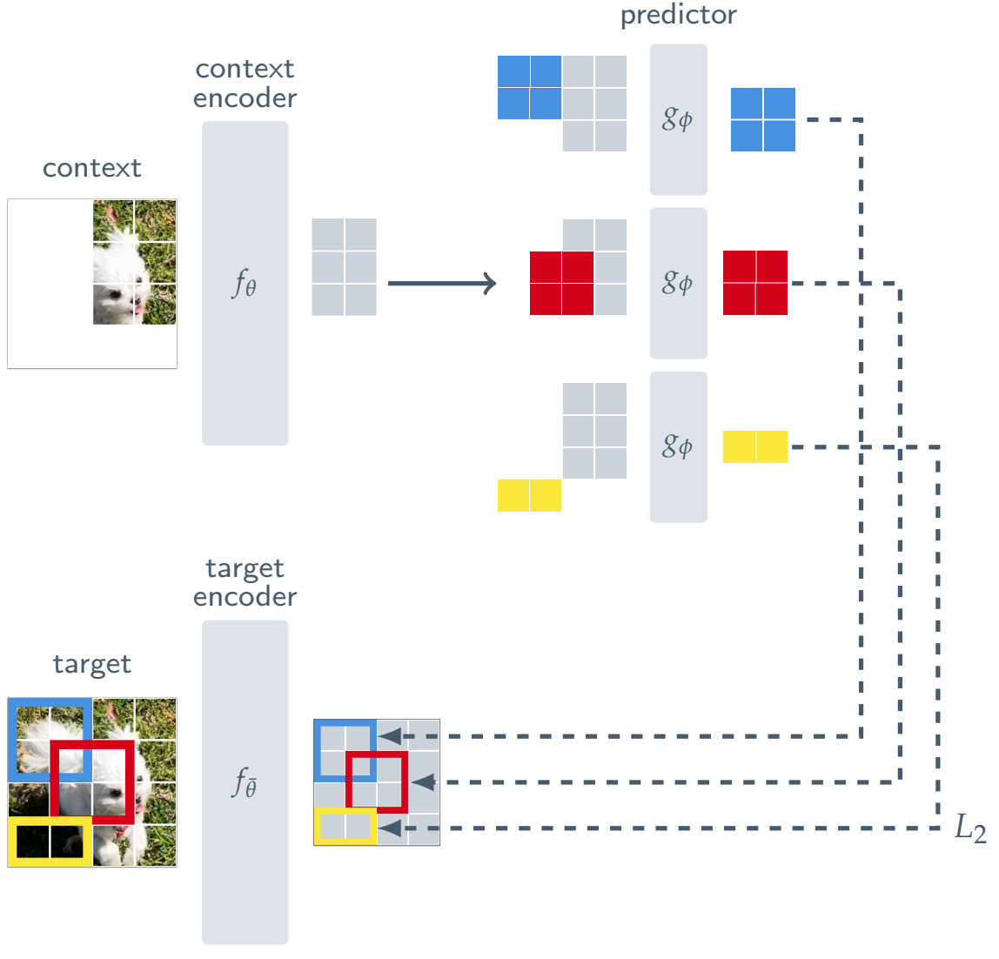
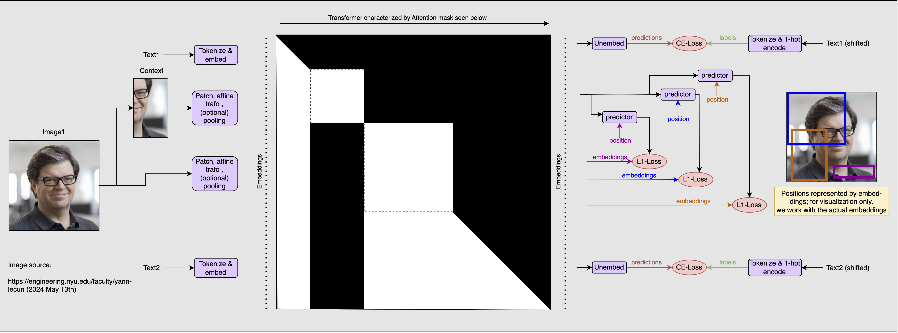
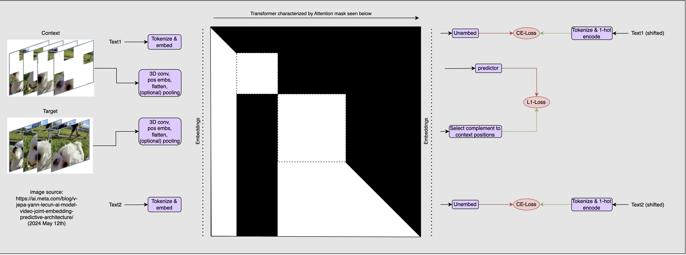
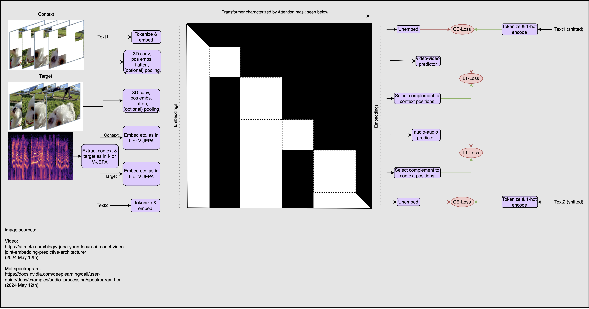
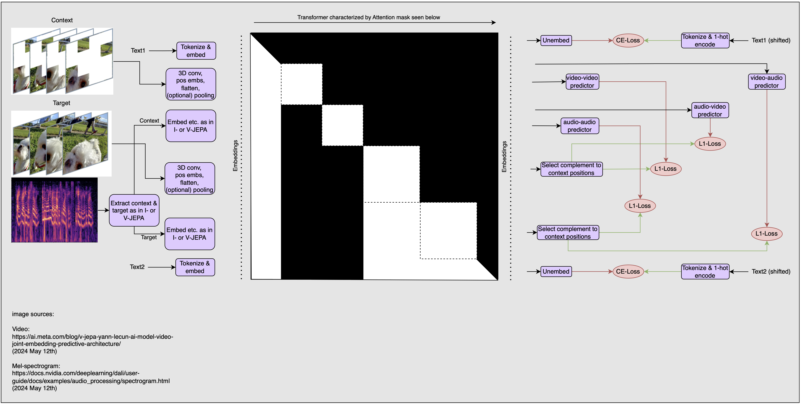
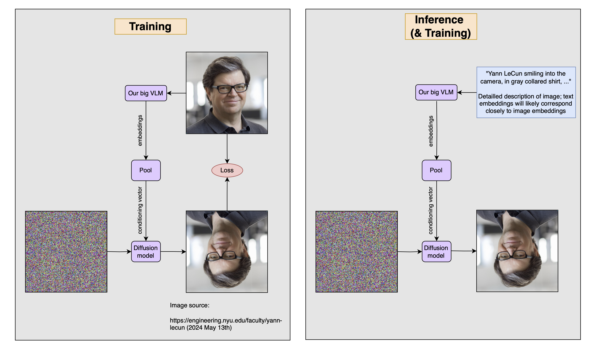

# JEPA in LLMs

Autoregressive LLMs benefit from multi-modality if they are trained for image-understanding instead of -generation, as demonstrated in [MetaMorph](https://arxiv.org/abs/2412.14164).

We can take this further and incorporate JEPA into LLMs. The bidirectional mask and JEPA-task are great for image understanding, and should thus work well for VLMs. While mode collapse is a problem for JEPA, we can prevent it by training on text in addition to images.

## I-JEPA

[I-JEPA](https://arxiv.org/abs/2301.08243) uses the following training method (image from paper):



You encode part of an image using the context encoder $f_{\theta}$, and the whole image using the target encoder $f_{\bar{\theta}}$. Then, you use a predictor $g_{\phi}$ to predict different, overlapping parts of the target embeddings from the context embeddings. Predicting in the embedding space allows for a very abstract understanding of images to develop, in which irrelevant details can be ignored but semantically meaningful ones can be included.

A central challenge is that if $f_{\theta}$ and $f_{\bar{\theta}}$ must be the same to make comparisons in latent space meaningful, but because of that, a trivial solution is for them to always return $0$. To avoid this, the parameters $\bar{\theta}$ are not exaclty equal to $\theta$, but its exponential moving average (EMA). This avoids representation collapse.

Now, let's look at how to put I-JEPA into the end-to-end VLM model:



For any image, however interleaved with text or other images, we will apply the JEPA task. However, we use the same model&mdash;the VLM&mdash;for both the context and the targets, masking out the context for all subsequent tokens to avoid cheating. Using the same model for the context and targets means that we cannot use the EMA-trick from the I-JEPA paper.

However! There is already a way built into our training that will avoid representation collapse: text prediction.

I doubt that it is easier for the encoder to learn to return a constant value for images but still do well on text tasks, than it is to become good at image- and text-tasks. This is especially true because producing semantically meaningful image-embeddings will enable much better performance on text-tasks, which will further discourage representation collapse. In fact, because all this happens in the context of both text and of other images, the encoder is actively encouraged to produce semantically meaningful representations in intermediate layers instead of only at the output, so that they are maximally useful at every single layer for those other tasks (see "the deep embedding alignment hypothesis" from the [VILA paper](https://arxiv.org/abs/2312.07533)). I would even go so far as to claim that if we train models on interleaved text and images, then as long as the images are useful for the text-task, even just including the image-embeddings without any explicit loss will lead to CLIP-like alignment between the image and text hidden states.

To make this more mathematical, let's look at the formulation used in the [V-JEPA paper](https://arxiv.org/abs/2404.08471) (which we will revisit later). The basic task is this (I changed the symbols so that they correspond to those used in the I-JEPA paper):

$$
\mathrm{minimize}_{\phi, \theta} ||
g_{\phi}(f_{\theta}(x, \Delta_{y}) )
- f_{\theta}(y) ||_1
$$

Here, $\Delta_y$ is the position of the target embeddings that the predictor should recover from the context embeddings. It is easy to see that this allows for the trivial solution of $f_{\theta}(x) = \mathbf{0}$ and thus lead to representation collapse.

To ameliorate this issue they use the following formulation instead:

$$
\mathrm{minimize}_{\phi, \theta} ||
g_{\phi}(f_{\theta}(x, \Delta_{y}) )
- \mathrm{sg}(f_{\bar{\theta}}(y) ||_1)
$$

We write $\mathrm{sg}$ for stop-grad. This works, but is unavailable to us (or would be difficult to implement and break parallelism, not to mention be inefficient in memory). However, what we do have is different modalities and tasks: $x_{\mathrm{im}}$ and $y_{\mathrm{im}}$  for image- and $x_{\mathrm{txt}}$ and $y_{\mathrm{txt}}$ for text-tasks. Then what we have is the following:

$$
\mathrm{minimize}_{\phi, \theta} ||
g_{\phi}(f_{\theta}(x_{\mathrm{im}}, \Delta_{y_{\mathrm{im}}}) )
- f_{\theta}(y_{\mathrm{im}}) ||_1

+ \mathrm{CE}(
f_{\theta}(x_{\mathrm{txt}}), y_{\mathrm{txt}})
$$

where $\mathrm{CE}$ is the cross-entropy loss. This should prevent representation collapse as well as, if not better than, using the EMA-trick, as long as enough text data is used in training.

With that out of the way, let's get a bit deeper into the concept shown above:

- We mask out the context for all subsequent tokens. This is for two reasons:
  1. So that the context- and target-encoder, despite being the same model in the same forward pass, are independent of each other. This means that the JEPA task is actually difficult.
  2. Because the model will not take in any context during inference, instead only being given the full image as in the targets. It should therefore not learn to rely on the context.
- For that second reason, we must also share positional embeddings between context and targets
- By training on the context, we are basically training the model to work with different image sizes and aspect ratios, essentially enabling dynamic compute at inference time. To make good use of this, we should vary the context-size over training.
- We can train this all in the context of other text and images, which is how we are going to use this during inference.
- If there are now too many image-tokens compared to text-tokens, you could use attentive pooling such as in the  [V-JEPA paper](https://arxiv.org/abs/2404.08471) or the [Idefics2 paper](https://arxiv.org/abs/2405.02246) to reduce the number of image tokens.

If this works as I think it will, it will mean that all of this image-understanding will be put into the VLM that actually gives you answers, or acts on your inputs, instead of an independent model glued to an LLM after the fact.

And it is not limited to images; we can also use this on video! Let's get on to V-JEPA.

## V-JEPA

It is easy to extend the I-JEPA setup to V-JEPA:



Two comments:

- If you use the convolutional kernel used in the V-JEPA paper (shape $2 \times 16 \times 16 \times d$, where $d$ is the model dimension), it should be possible to use an arbitrary number of frames here, as long as their number is divisible by $2$.
- If you want to use different masking strategies on the same clip, you can simply include several contexts behind each other (and mask them all out for later tokens). There is no need to include the target several times; it includes the full clip anyway, and the choice of target embeddings happens at the output of the transformer.

Of course, we can also easily extend this to more modalities.

## V-JEPA with videos and audio

Let's do V-JEPA with both video and audio data. I can think of at least two sensible variants of this, and I don't know which is better, so I'm just going to present both.

### Variant 1

First off, let's go the naive route and simply concatenate a video clip and the corresponding audio clip, wrapped in \<video\>- and \<audio\>-tags respectively.



I've left it up to the user to determine if they want to use I-JEPA or V-JEPA on the audio, because that's not quite the point.

A few comments:

- In the setup as shown, the audio part of the context sees the video targets but not vice versa. This implies prioritizing visual over auditory information, as the audio part has the corresponding video as context.
- How long the video clip is before a single log-mel-spectogram comes into context is a decision that depends mostly on the intended downstream task; for robotics, it should probably be short video clips interspersed by short spectrograms, to decrease latency in sensing. For other tasks, it might be more effective to use longer video clips. Thus, it could be useful to vary the length of the video clips during pre-training
- I wonder if it makes sense for the video- and audio-clips to share positional embeddings. This way, the temporal alignment between the two would be obvious. I think that that's an empirical question, though.

### Variant 2

A possible second variant of this would allow for the V-JEPA task to be applied between video and audio:



If the audio-context comes before the video-targets, it doesn't have the video to guide it in predicting the audio-targets.

- Advantage: this makes this a more difficult task, and thus encourages more learning.
- Disadvantage: this makes it so that the implicit alignment between video and audio is mediated only through how much each helps with subsequent tasks (the next audio- or video-clip, or piece of text), instead in the current task.

Using the mask and input-order shown here allows the audio-to-video and video-to-audio JEPA task, which is not sensibly possible if we group context and targets strictly by their source.

- Potential advantage: this may enable us to make the model work even harder and thus learning even more general embeddings.
- Potential disadvantage: it might encourage representation collapse by explicitly aligning the embeddings of inputs of very different modalities, and concentrating too much of the loss to JEPA-tasks, which would take away the potency of the regularization effect of text-prediction with actual labels. It may be better to simply encourage the video-audio alignment implicitly, but that is something that should probably be determined experimentally.

There is another potential difficulty: I think that in order to do audio-to-video or video-to-audio prediction, there have to be as many audio- as video-frames, each of the same resolution and aspect ratio. Therefore, you need to either split or repeat the log-mel-diagram so that it fits in shape (or be clever with the prediction task, so that it works even when the shapes don't match exactly). I'm unsure about this, though.

> I'm sure that there are more variants, but these two convey the central ideas for doing multi-modality easily and end-to-end.

Obviously, a bit of creativity is sufficient to expand this to almost arbitrary input modalities. But there is another potential upside to the modality- and task-dependent masking strategy shown above: we can add more downstream tasks to the model, and train those capabilities into the transformer model itself.

## Adding downstream tasks

You could add downstream tasks to the training.

I'm not sure if it is worth the additional complexity, but there are five potential advantages:

1. You could extract even more skills and knowledge from a single data point this way.
2. You could specialize your model this way.
3. You can better make use of metadata and other data sources that don't neatly fit into the mostly autoregressive model task.
4. Downstream tasks with actual labels help with avoiding representation collapse.
5. You can actually just use the models that you've trained on downstream tasks for those downstream tasks.

What would be some examples of downstream tasks that could gain you these advantages?

- **Translation:**
  Many videos on YouTube have closed captions in many languages. I'm not sure how to neatly fit these into the autoregressive language model, but if you could train a few decoders&mdash;one per language&mdash;to get these multi-lingual captions from the audio embeddings, you could naturally make use of that data. And if a small decoder can produce multi-lingual transcriptions of audio, then the VLM shouldn't have a problem learning to do this in downstream tokens.
- **Segmentation, depth- and normal-estimation:**
  You could produce labels for these offline and then train on them. This might improve the model's understanding of 3D-scenes. I consider this a form of specialization, but if your model can also produce multi-modal outputs, it would be great for 3D- or video-generation abilities.
- **SLAM from video:**
  Simultaneous localization and mapping in known environments could actually be a continuous learning tasks for robots. It would also force the model to essentially have that map in an encoded form in its activations, meaning that it should be able to just inherently use it.

If you can do all of these and more with fairly small decoders&mdash;like the predictors in JEPA&mdash;then most of the skill must be learned by the VLM itself.

One downstream task that I'm especially excited about is using the highly semantically meaningful image embeddings to train diffusion models.

### Image generation

I believe that really good image-embeddings potentially allow you to train really good diffusion models, in a way that they are highly controllable. It would also allow you to use what amounts to high-quality image-captions without aquiring actual captions.

To do that, we simply make use of the extremely high-quality image-embeddings that we get, and use those to condition the diffusion model. Because our image-embeddings should be very close to the embeddings of a very detailed textual description of the image, we can simply take those image-embeddings, pool them, and use the result as a conditioning vector in training a diffusion model. We should then be able to use the same VLM to embed any text, pool the embeddings, and condition the diffusion model with them. This is shown below:



Two points on this:

1. Obviously, the pooling needs to be able to handle different sequence lengths at its input, because text will differ in length from both other text and images.
2. This is an important (though not the only) reason for why you should probably sprinkle some text-guidance into your training.

It seems like this would do two things:

1. Making dataset generation much easier. You only have to collect images now, without descriptions for them (or only a few of them with descriptions)
2. If the VLM is very good, this would likely give much more consistent conditioning vectors to the diffusion model than text-embeddings would, because texts don't correspond uniquely with images, and leave out lots of information, but semantically rich embeddings of images are very unique and meaningful. This means that the diffusion model will have a much easier time learning to interpret the conditioning vectors, and thus be more controllable.

This has been done in [MetaMorph](https://arxiv.org/abs/2412.14164), but they generate SigLIP embeddings from SigLIP embeddings autoregressively with a causal mask.

Of course, this can easily be extended to any modality that the VLM can take as an input. In fact, this is how it is always done: in pure LLMs, the output embeddings are decoded into token probabilities by an additional small module (a fully connected layer). In multi-modal in- and output transformers, images and audio are also generated via a small decoder that takes in the model's output embeddings.

## Additional advantages

Alright, so we can now train VLMs end-to-end, avoid the distinction between language- and image-foundation-model limiting visual understanding, avoid pitfalls of CLIP, easily extend those advantages to arbitrary modalities, extract way more information per sample from any given multi-modal data than before, and easily get more semantically meaningful guidance vectors for diffusion models. Is that really all?

Well, I can think of one more potential advantage that would speak to this method: we can spend a lot of training compute *per sample*. This is good when our dataset size is a limiting factor.

## Citation

```bibtex
@misc{snimu2025llmjepa,
    title={JEPA in LLMs},
    author={Sebastian M\"uller},
    year={2025},
    month={jan},
    url={https://github.com/snimu/blog/blob/main/contents/llm-jepa/article.md}
}
```
