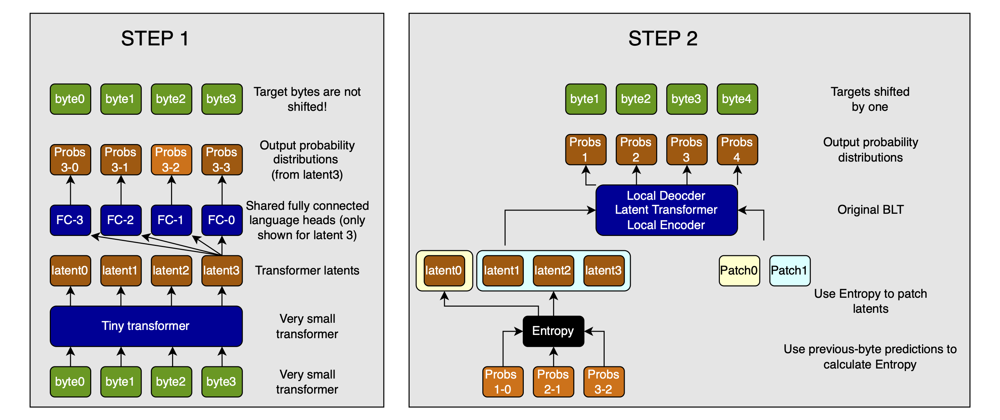

# End-to-end BLT: measure entropy in end-to-end Byte Latent Transformer

The [Byte Latent Transformer](https://arxiv.org/abs/2412.09871) is a promising approach for dynamically merging bytes into patches based on the entropy of byte-level predictions by a tiny language model.

However, that tiny language model is separate from the main BLT. Its outputs are used only to compute the entropy and thus group bytes into patches, not in the actual generation of the final output. The authors even state in their summary and outlook that solving this problem is an interesting research direction.

Here is a proposal for a solution (assumes some knowledge of the BLT).

> Note: This is most likely worse than the original BLT, but I wanted to register the idea publicly anyway. Maybe someone else can build on it, or at least find it entertaining / interesting.

## End-to-end with tiny transformer

The obvious first step is to put the tiny transformer (with really small MLPs and sliding window attention (SWA)) before the Local Encoder. Use the output of these layers to compute the entropy and group bytes into patches. However, two problems emerge:

1. We have to make sure that the output of this tiny transformer has some semantic meaning so that the entropy in turn means something. In the separate model used in the paper, this is achieved by simply training the tiny transformer independently on causal prediction with the same training data as the main model (but that is what we want to avoid).
2. In the paper, they calculate the entropy on the output of the language head of the tiny transformer, so on the next-byte probabilities. This means that if we want to do the same, we have to be able to meaningfully apply the language head to this tiny transformer's output. To be clear, this is cheap&mdash;the byte vocabulary is very small&mdash;but it requires the loss to encourage the tiny transformer to output something that can be reasonably decoded into the byte vocabulary. Since the loss is applied to the last layer of the Local Decoder, this is by no means guaranteed (the Local Encoder, the very large Latent Transformer, and the Local Decoder are all between the loss and the tiny transformer).

So how do we get the tiny transformer to output semantically meaningful predictions that can be decoded into the byte vocabulary?

## Adding a next-byte loss

Well, let's just apply a secondary loss here!

On first glance, a next-byte loss should not be a problem. We try to predict the next byte right here, and then propagate the latent to the rest of the model to let it refine the prediction. And maybe this would work! However, I see a potential issue: by forcing the tiny transformer to make a next-byte prediction, we are getting it to encode information about its guess about the next byte into its latents, instead of information about the current byte and its context (a.k.a. the previous bytes). This likely means that there is much less raw information available to later layers of the BLT.

## Predicting previous & current bytes

So what can we do?

Well, we can just predict backwards. To make this task non-trivial, we should predict $x_{-n:}$, or the previous $n-1$ bytes plus the current one. This task is non-trivial, because it requires the model to encode multiple byte embeddings into one. On the other hand, I suspect that it would at least not be harmful compared to not adding a secondary loss, because the rest of the BLT needs that information anyway. And because the language head is so small, this would be cheap.

Now, we can use the same backend to choose how to group bytes into patches, and contribute directly to the output calculation.

### Will previous-byte entropy correspond to next-byte entropy?

For this to work with backward prediction, the difficulty of backward prediction must correspond byte-by-byte with the difficulty of forward prediction. Otherwise, the patching we choose would not make any sense for the BLT, and the whole exercise would be pointless.

If the current byte would have been hard to predict into the future, then the semantic contrast (speaking loosely) to the previous bytes must be high. If that is the case, a tiny transformer will have a harder time incorporating the information from the previous bytes into the current one's representation, and thus uncertainty about the previous byte will be higher.

This means that if we look at the immediately preceding byte, high entropy will mean the current byte is hard to predict from the preceding sequence.

And while the task is certainly easier than next-byte prediction in a transformer with a causal mask, we can simply use a smaller transformer and/or change our entropy threshold to calibrate the patch size that will be produced.

> Sidenote: predicting the current byte in addition to the previous ones is important so that the tiny transformer will retain information about the current byte in its latents and we can use those in the rest of the BLT.

### Visualizing the architecture

Here is a visualization of the proposed architecture:



### Concerns

There are just two concerns left:

1. The quality of the gradients
2. Non-DL operations

#### Gradient quality

Every operation here is differentiable: entropy calculation, thresholding, and indexing can all be backpropagated through. However, the quality of the gradients is most likely diminished greatly by the indexing operation.

Iff this is a problem, we can simply add the byte embeddings back to the tiny transformer's latents as a skip connection, and then continue with this. This way, the original information is preserved and the embedding layer learns well.

#### Non-DL operations

The forwad pass basically has to pause to compute the patches. This is not very nice, but I don't think that it's too bad. Would love to hear feedback on this, though (through my [X profile @omouamoua](https://x.com/omouamoua)).

## Citation

```bibtex
@misc{muller2024TTSIsModelScaling,
    title={End-to-end BLT: measure entropy in end-to-end Byte Latent Transformer},
    author={Sebastian M\"uller},
    year={2024},
    month={dec},
    url={https://github.com/snimu/blog/blob/main/contents/end-to-end-blt/article.md},
}
```
