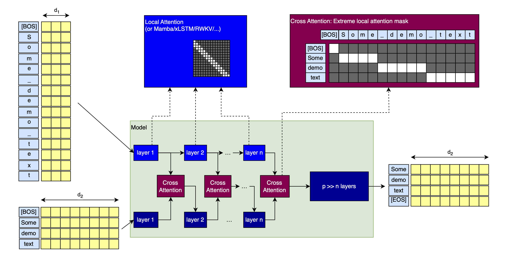

# Idea: Fixing tokenization

Tokenization causes many issues in LLMs.

Inpired by Stanislav Fort et al.'s ["Ensemble everything everywhere: Multi-scale aggregation for adversarial robustness"](https://arxiv.org/abs/2408.05446) paper, here is a proposal for a way to cheaply mitigate those:



**Background: Ensemble everything everywhere**

"Ensemble everything everywhere" works on CNNs for images. One part of their pipeline making CNNs more adversarially robust is using the same image at different resolutions as the input:


This is one important technique that enables adversarial robustness in CNNs, without explicitely training them for it.

 We can do the same for tokens.

**The pipeline**

As shown above, we can run two models in parallel, both with a causal attention mask (a decoder-decoder model?). One (with model dimension d1) uses a byte level tokenizer, the other (dimension d2) a normal one. There is Cross Attention between them to get byte-level info into the normal tokens.

This will be cheap:

- The byte-level model is likely only needed in first few layers (or even just the first layer) to incorporate byte-level info into the main model branch.
- d1 << d2
- The byte-level branch can use very local attention (or RWKV/Mamba/xLSTM/...), which means that the extreme sequence length is not a problem.

The added decoder working at the byte-level can likely help the model recognize and fix tokenization issues, at very little additional cost. Of course, it will only be able to do so at the input, not the output, but that seems like a big step already.

And who knows, it might also confer additional adversarial robustness, like in "Ensemble everything everywhere".

**Variations**

- You could use an arbitrary number of tokenizers, from byte-level to ones with million token vocabs, as long as they are all different enough from each other (else, what's the point?).
- You could extend the decoder-decoder along the entire length of the model, using cross-attention up until the final layer. I don't think this is necessary, but it's worth an ablation.
- You could make the cross-attention more local. After all, the attention matrix is of size $s_{\mathrm{byte-level}} \times s_{\mathrm{normal}}$, where $s$ is the sequence length. Reducing this size is likely worth it, and fixing tokenization issues is likely possible with very local attention. The extreme of this attention pattern is shown below:


**Conclusion**

I don't have the time or money to implement this, but I think it's promising, so please somebody pick this up and keep me updated :)

**Citation**

To cite this article, please use the following BibTeX entry (or adapt it similarly):

```latex
@misc{mueller2024fixingtokenization,
    title={Fixing tokenization},
    author={Sebastian M\"uller},
    year={2024},
    month={sep},
    url={https://github.com/snimu/blog/blob/main/contents/fixing-tokenization/README.md}
}
```
