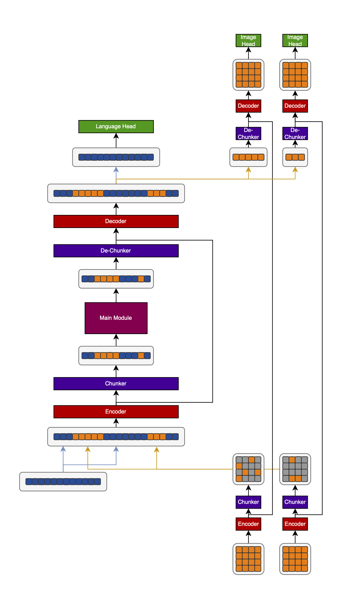
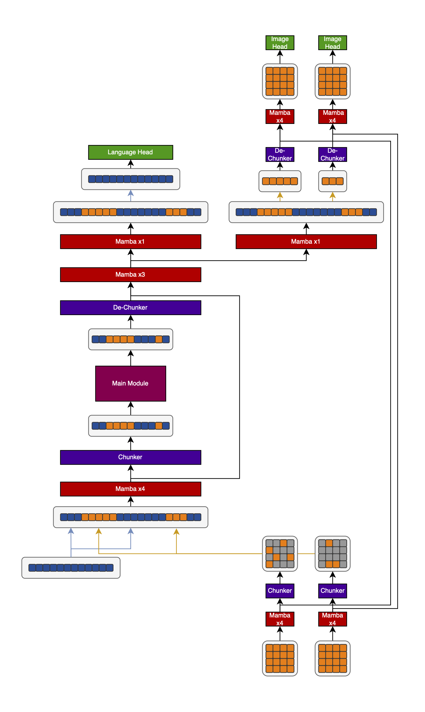

# H-Net VLMs: some loose thoughts

H-Net (LINK) is a brilliant paper that ...

It is currently defined for text only. In this article, I will speculate how one could extend it to images, video, and world models (so video + action inputs).

This article assumes that you've read the paper.

## Easy wins

The simplest way to do an H-Net VLM is to put the text- and image-bytes into the same stream and run a normal H-Net over them. Let's get some easy improvements to this paradigm out of the way.

First off, bytes of images should have different embeddings than bytes from text. This is pretty straightforward but important because it allows the model to treat the modalities differently.

Secondly, we can look at how the dimensionality of the vectors is increased as we step into a higher level of abstraction. The typical thing to do in order to change the dimension of a vector is to use a linear layer, but that interferes with the gradient and that's bad. So instead, the H-Net authors borrow a technique from SpaceByte (LINK): to increase dimensionality, concatenate a learned vector to the input, to decrease it just throw away the excess entries. This allows for a clean gradient. Just like we use different byte embeddings for the text- and image-parts of the VLM, we can use different learned vectors to extend the vector dimension for the text- and image-parts.

## More speculative improvements

Now, I want to discuss more speculative, complex improvements to the pipeline.

### Separating text and images

Text is a far more compressed modality than images, to the point where raw text-bytes express significantly more information than raw image-bytes. Therefore, simply putting both together at the same input can lead to problems. The solution is to first compress the images into tokens of approximately the same information density, or "meaning-compression", as the text-bytes, and only then merge them.

What I imagine doing is running an H-Net encoder and chunker over all the images independendly in a batched manner, then flatten the images and put them in the right position in the image-text-sequence, and only then running the normal H-Net pipeline.

And at the output, the inverse would have to be done: after the last decoder for the text-bytes is run, I would extract the bytes belonging to each input image, and expand them in a batched manner with their own decoder and dechunker layer.

> Sketch of an H-Net VLM. Blue are text-embeddings, orange are image-embeddings. The images are shown an a 2D grid at the input and output for illustration, but the embeddings are flattened throughout the entire model.

You could say that we should instead simply set a different compression target for the images than for the text using the auxiliary loss. That's simpler, and it's very legitimate; however, compressing the individual images first is fairly cheap because it can be done in a batched manner, which means that the sequence length is very limited, and it does have a big advantage: it means that the two different modalities are merged later, and can thus be treated individually first before being forced to live in the same representation space.

Additionally, having an image-only encoder and decoder (and chunker and de-chunker) could be useful for increasing the resolution. Often during training, the models are trained at a low resolution for most of the batches, and only at the end is the resoution increased. This save a lot of compute at basically no performance degradation. Doing the same with the H-Net might be difficult because it would require the model to radically change the compression ratio. However, if we simply slap another encoder and decoder layer around the model (initialized to the weights of the previously outermost encoder and decoder layers), we can increase image resolution to our heart's content. Since the same isn't possible for text, the two must be separated in the way that I've shown.

It might be even better to run a few Mamba layers over the pure text before interleaving text- and image-embeddings, but I haven't drawn that in because it doesn't seem quite as important, and it's even more added complexity.

However, at the output, I would go a step further and separate the modalities even more strongly. My intuition for doing so is that the output latent will be decoded directly into the actual output (text, and image, ...), so it should be optimized to make it as easy as possible to decode it into *the specific output modality*. If the same latent is decoded into multiple modalities which are significantly different, then it has to fulfill two very different jobs and cannto be as specialized anymore. That still works, because the latent can learn to be the supreposition of two discrete latents which are distinguished by the prediction head of each modality, but it's suboptimal.

To prevent this issue, I would instead only share the same layers between the modalities up to some more abstract latent, deeper inside the model, and then run individual decoder layers on each. Concretely, I'd do the following:

- Run the combined text- and image-sequence through three out of the four decoder layers (they use four in the paper so I'll stick with it)
- Run the combined text- and image-sequence through a fourth decoder layer (keep the images for maximum context to the text), then throw away the images, decode the text-predictions with a text-head, and apply a loss only for the text-predictions
- Run the combined text- and image-sequence through a different fourth decoder layer (keep the text for maxmium context to the images), then throw away the text, decode the images by de-chunking them in a batched manner and running another decoder over them, and apply a loss only for the image-predictions

> H-Net VLM with early modality-specific splitting.

This has multiple advantages:

- The predictions are made from a shared abstract representation, which will be strengthened by the combined gradients from both modalities
- At the same time, the output latents for text and images can be produced from the shared latent from individual weights, allowing a specialization to each modality
- And yet, both still have the full context in both modality-branches of the decoder

### Bidirectional attention for images

TODO

- flattened image + causal pred = strong bias which is unnatural
- bidirectional attention per image is better
- solution:
  - In the batched encoding and chunking layer, use bidirectional attention instead of Mamba (you can have like two layers of attn then two layers of Mamba for its bias toward compressing representations which is good for chunking, but starting with bidir attn for understanding the imag in a more natural way, which should help the Mamba layers and the chunking and the representation given to the next step)
    - preserves temporal causality
    - without treating 2D space the same way as 1D time, which would be dumb
  - At the output, just do the inverse
    - for training, this obviously just works
      - though it makes image prediction trivial
      - solution: heavy masking at input
    - for inference, it's completely fine if we simply want to understand an image
    - but that violates causality if we want to generate one!
      - solution: add a VAE loss to the image-only parts of the model
      - this forces it to have the same representation at the output of the image-only-encoder and the input of the image-only-decoder
      - which would enable us to simply loop the latents in the autoregressive part of the model, then decode all the generated latents in parallel with the bidirectional attention decoder
      - just run the full model including the encoder once on the generated image after it has been generated to update the align the model's internal representations with what it has actually generated
      - question: would this also encourage the text part to share a representation? after all, the use the same backend. the splitting of modalities at the output might mean that no, it doesn't, but if it does, it would immediately enable us to do latent looping there as well (need to specifically train it of course)
- H-Net provides a unique way to add autdio-information to the model:
  - Deeper stages of the model have a higher model dimension than ones closer to the in- and output
  - For reducing the dimensionality, this switch is done by just cutting away the excess part of the vector (I have ideas for what to do with those parts, but I'll get to them in another article)
  - For increasing the dimensionality, the missing part of the vector is added by concatenating a learned vector of the dimensionality that is missing
  - This vector could encode information about sound in the video!
  - We can get the vector by running another, smaller H-Net in parallel that just encodes the audio
    - appending a single vector three times per forward pass requires very little communication, so the second model could be run in parallel very easily
  - Audio and video are always synched, so adding one audio vector per video frame makes sense
  - If the reduction / increase in dimensionality is small, the audio model can be much smaller than the video model (it can also be smaller otherwise by just reducing its dimensionality)
  - The only issue I can see with this is that we'd either have to chunk the audio-model outputs the same way as the video model outputs, or interpolate between the chunks in an appropriate way, which would add a lot of complexity

### Use a diffusion model

TODO

### Extending to video

TODO

- bidir etc. still great
- but is there a way to merge the same patch over time?
  1. patch images
  2. merge each patch with the same patch from the other frames in batched manner
  3. bring the patches of each frame back into image shape, then bidirectionally merge over space
      - how would you handle patches that are now merged across multiple images?
      - answer: just leave them out; fill with pad vector that you mask out in the bidir attn
  4. Bring the patches into the normal autoregressive order and apply the normal H-Net
      - this can then be done arbitrarily often, though it will likely only lead to spacial merging because the edges of the frames aren't aligned correctly
      - So I guess it makes sense to do a few layers of encoders with temporal merging followed by spacial merging, before going into the fully unrolled sequence
  - This is very complicated, so not sure if it's worth it
    - Video tends to be much more compressible over time than space
    - Imagine a blue sky background over hundreads of frames; we can compress the hell out of that
    - So if it works it should be worth it (but we might need to dismiss the per-image bidirectional attention, unfortunately)
- can add audio information by replacing the learned vector used to extend the dimensionality with audio information
  - this can use a much smaller H-Net for audio
  - temporal chunking must be the same, but only use one vector for each video frame, so no spacial chunking needed
  - low communication overhead: single vector per frame can be sent once per encoder layer, then copied to all the patches at the target location

### World models

- Are just video models with additional action input which gets added to the frame representations
- But you can add the action information to the model just like the audio information above
