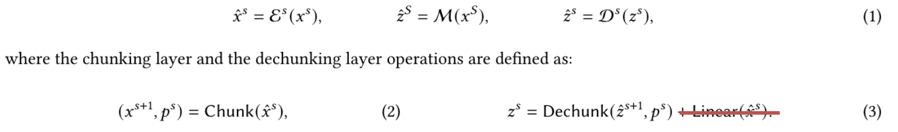
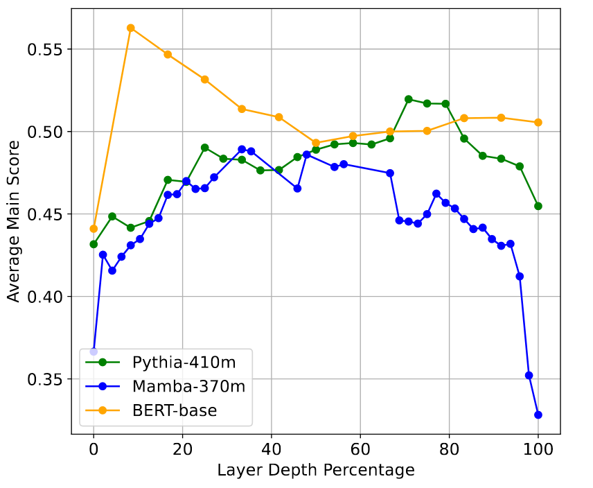

# Various thoughts on the H-Net

I have just read the [H-Net paper](http://arxiv.org/abs/2507.07955) and it inspired a lot of thoughts around it. I'll put some of those in dedicated articles, and the rest here.

This article assumes that you've already read the paper, or at least chapters 1 and 2.

I'll split it into two parts: interesting ways to use the H-Net, and scattered thoughts about the architecture, including how to combat the variance in compute- and memory-requirements over different sequences, the biggest challenge of the H-Net.

## Interesting uses for the H-Net

First, two potential use-cases for the H-Net that I didn't see in the paper (I might have simply overlooked them, though): embedding models, and dynamic chunking as a tool for science.

### H-Net as an embedding model

The hierarchical structure of the H-Net means that byte-embeddings get compressed into more compact representations, which are compressed into even more compact ones, and so on. What you get from the cascade of encoders is a set of vectors which are progressively smaller, and encode progressively more abstract information.

That's a perfect setup for [late interaction](https://arxiv.org/abs/2004.12832) RAG:

- Doing late interaction search makes full use of the information that is available
- We can do a sort of hybrid search, where we search for very abstract, semantic similarity with some vectors, and more lexigraphic similarity with others
- And that might be used to improve efficiency: the abstract vectors are much smaller than the ones closer to the bytes, so doing late interaction with them is much cheaper. This can be taken advantage of by first filtering out all chunks that aren't a semantic fit, and then searching with more granularity among the remainder. And of course, this  can be done in multiple stages if the hierarchy of the H-Net is deep enough

It's effectively a set of [Matryoshka embeddings](https://arxiv.org/abs/2205.13147), but along the sequence dimension instead of the model dimension.

Of course, you wouldn't do that with a causal model, but I see nothing in the way of making the model bidirectional. You can use bidirectional attention where you use attention, you can run one Mamba layer forward and the next backward, you can take the immediate last and next byte into account when chunking, the smoothing module can be adapted, etc.

The only issue I can see is that the chunker might not work very well with a masked prediction objective, because the masks (which should on average span several bytes) might interfere with it (though they could also be another forcing function teaching the model to guess what's behind the mask better, so that it can draw the boundaries more confidently).

If the chunking is problematic with masked language modelling, I could see another solution: turning the model into an autoencoder by doing bidirectional prediction of the exact input sequence (which is unmasked), while removing the residual connection from the encoder output to the decoder input like so:

If either of these methods work, [Layer by Layer](http://arxiv.org/abs/2502.02013) suggests that the outermost layer activations shouldn't be used for embeddings:

The H-Net's main module is pretty large, so we can simply pick and choose the best layer index to take our activations from. But the encoders and decoders are small, so the choice is more difficult. Essentially, for all levels of hierarchy but the deepest (which consists of the main module), we need to determine whether we use the encoder or decoder activations. If we use the encoder activations, I suggest using the output of the second-to-last encoder layer, because that's the layer furthest away from the input that isn't yet hyper-specialized for the chunking operation (one would hope). For the decoder, using the output of the first layer seems best, because it mixes the output of the main module and the residual from the encoder, leading to a more fine-grained representation, but is still three layers away from the final output. Ultimately, the best choice of layer is an empirical question though, and there is no guarantee that this is actually as good as I would hope.

### Dynamic chunking as a tool for science

The authors have shown that H-Net is amazing as a DNA model. A model that is great at predicting DNA and performing downstream tasks on it is of course very useful (and such an H-Net could be used for embedding search over DNA chunks, [see above](#h-net-as-an-embedding-model)), but there's more:

If the model has multiple levels of abstraction, it will will dynamically merge base pairs into evermore abstract representations. How it groups the base pairs might be very interesting for science!

It might actually make sense to train multiple H-Nets with different initializations and data order on overlapping sets of DNA data (and whatever other modifications you can think of), then comparing the groupings of base pairs (and of more abstract concepts down the hierarchy) between them. Where these grouping overlap, we might find universally meaningful, context-dependent chunks of base pairs which could turn out to be very useful for the field of biology in their own right.

As a concrete example, imagine a model pre-trained on lots of DNA, then post-trained to predict the risk of different diseases based on a person's genes. If this model is an H-Net, could we give it the genome of an afflicted person, and see how it's chunked compared to non-afflicted people's genes, to identify the genes that are risk factors? Obviously, we'd need moe than one person for this, but this could work as a fairly universal interpretability tool for science. And of course, this isn't limited to DNA models.

## Thoughts on the architecture

In this section, I'll speculate about the architecture of the H-Net. These thoughts are purely theoretical, but they will inform what experiments I'll try out once I get to it. Feel free to try them out yourself though! I'd appreciate a citation, but I certainly won't get around to trying all of them myself. All of them are independent from each other, and none of them are guaranteed to work.

### Improving how the model dimension is changed

The encoder and decoder of the H-Net act on much longer sequences than the main module, so to make up for the increased compute requirement, they have a lower model dimension than the main module.

To achieve this, the model dimension of course has to be actively changed. It has to be increased when stepping down into the main module, and decreased again when stepping back up into the decoder. The typical way to do this would be to use linear layers in between, but those interrupt the residual layer and therefore destroy gradient flow (which is especially important in multi-level hierarchies, but already unacceptable for one level of hierarchy). To avoid this problem, the authors borrow a technique from [SpaceByte](https://arxiv.org/abs/2404.14408): to increase dimensionality, we concatenate the small vector with a learned vector of the right dimension. To reduce dimensionality, we simply cut off and discard the excess vector-entries.

This process preserves gradient flow and thus works well, but I see a potential improvement to both parts (the up- and the down-projection).

#### Down-projection

In the down-projection, I find it inefficient to just throw away a part of the activation vectors. While yes, the model can make use of the full dimensionality in intermediate layers, and concentrate all that information at the part that isn't discarded, it's still lost model capacity (or rather, data-transport capacity, which is also important).

To make up for that, we'll borrow a trick from [modded-nanogpt](https://github.com/KellerJordan/modded-nanogpt): adding the input embeddings to the residual at every layer. They perform `x = x_lambda * x + x0_lambda * x0`, where the two lambdas are learned scalars, `x` is the residual at the input to the current layer, and `x0` are the original token embeddings.

We can do the same with the discarded part of our vector!

Imagine that the model dimension at level `s+1` is 2048, and at level `s` it's 1024. Then in the normal H-Net, half of the output vector of the main module is simply discarded. We would instead take that half of the output, and add it to each part of the de-chunked input to the decoder at level `s` in a learned weighted sum.

What if the dimensions don't add up?

Let's say the dimension at level `s+1` is still 2048, but that at level `s` is 1536. Then, we won't cut off a vector of dimension 1024 fitting perfectly the dimension at level `s`; instead we will cut off a vector of dimension 512, and will miss another 1024 entries! Well, we can make up for that by using the same trick that is used to increase vector dimensionality already: concatenate a learned vector. Then, we won't waste the cut-off part of the vector, and the operation will still work.

And if the dimension at level `s+1` is 2048 but that at level `s` is 512, we can simply cut the cut-off vector of dimension 1536 into three vectors of dimension 512 and add each of them at the input of a different layer of the decoder.

#### Up-projection

It makes a lot of sense to concatenate a learned vector when going from level `s` to level `s+1`. It's simple, preserves the gradient, and can add a useful biads to the activations.

However, I think it could be better to make that added vector data-dependent. This is a great opportunity for adding other modalities in (in a video H-Net, you could add audio information here; but I'll get into that in another article). But for a pure text model, we can still find a use for this cutoff: just run a second encoder a model dimension that is equal to the missing dimensionality, on the same data but with only a single layer, chunk the parts in the same way as the main input, and concatenate the results to the chosen input vectors.

This way, we can get add a second view at the data. Looking at modded-nanogpt again, their value embeddings do exactly that, and it seems to work very well. This makes me fairly confident that this addition is valuable. Of course, it only works if using the chunking determined from the main path of the model on the outputs of this second encoder doesn't somehow muck up the model. In my understanding it doesn't, but I'm not completely certain about that.

This of course leaves the second encoder with sparse gradients which only flow into the selected bytes. With enough training, this should still work, but it would be better to get gradient signal for every single input byte. To do this, we could add the output of the second encoder to the residual from the main encoder to the decoder using the same trick as in the [down-projection section](#down-projection) to align their dimensionalities.

### Value embeddings

Speaking of value embeddings, those could be done in the same way as the [up-projection](#up-projection):

- Use a secondary, tiny encoder on the input sequence
- Use the byte-boundaries determined by the main encoder's chunking module
- Repeat this process until you are at the right level of the hierarchy
- Make use of the resulting additional inputs however you want

I suggest using them like the value-embedding in modded-nanogpt, by performing a weighted sum between the attention-values and these additional vectors (the value embeddings), before applying the attention operation. Other uses are possible too, though.

### Improving the residual

There is a residual connection from the output of the encoder to the input of the decoder.

I will first explain its purpose and how exactly it's designed, then state the proposed improvement and two potential upsides to that improvement, then finally discuss some different ways to design it.

#### What the residual is for

It gives the decoder much more fine-grained information, and provides a gradient signal to every byte position. The main module only uses the encoder's output at some byte positions, which are meant to have all the required abstract information about the input encoded in them. However, this means a loss of fine-grained information for the decoder, and that the gradient will only flow through the selected bytes.

The residual fixes both of these problems:

- In the forward pass, I view it as the main input to the decoder, whereas the main module's output act as (highly influential) abstract guidance
- In the backward pass, it means that a gradient flows into every byte position

This residual has a linear layer applied to it. This is required because the output of the encoder fulfills three jobs:

1. It provides the input to the chunking module
2. Selected outputs are used as the inputs to the main module
3. The outputs are used for the residual

The linear layer is used to disentangle the representationsf or these different tasks. While the authors say that it's used to disentangle the representations of the chunker and the residual, that akes little sense to me. The chunker is already disentangled by `Wq` and `Wk`, one linear layer for each of its components. The point seems to be to disentangle the representation of the input and the output of the main module.

The linear layer is placed at the residual instead of the main module because it interferes with the gradient from its input, and since the main module's gradient is far more important than the residual's, we place the linear layer at the residual.

> Remember, the encoder, main module, and decoder are all pure ResNets. There is a continuous residual stream going through all of them, preserving a high-quality gradient. We want to avoid interrupting that gradient as much as we can.

#### The proposed improvement to the residual

My question is: why not try to preserve the continuous residual stream on all branches of the model? Put another Mamba or transformer layer with its own local residual on the residual from the encoder to the decoder, and you achieve just that. You will also get a more expressive transformation, which is nice for inference.

Why the gradient is improved has hopefully been sufficiently explained, so I'll provide more detail on the inference improvements now.

Here is how inference on a 1-stage H-Net works:

1. Assume you have just produced a full token and start from after a boundary
2. Forward pass through all modules, but only produce a single copy of the main module's output, and a single byte output that you sample from that
3. Run the byte through the encoder and chunker again
4. If it's a token boundary, return to 1.
5. If it's not a token boundary, return to 2. to produce a second copy of the main module's hidden state

For a multi-hierarchy model, this process will be incremented once for the single forward pass of the main module. And for the next token at the outermost level of the hierarchy, it will be incremented again, whether or not there was a token boundary in the main module or not.

In any case, we will only call the main module once for every token that we produce, but each token can require multiple passes through the encoder and decoder. If the compression ratio is high, and/or there are many levels in the hierarchy, then the encoders and decoders need to be called a lot of times before the main module is called once. If the vast majority of the parameters are in the main module, that might constitute a problem, because the encoder and decoder might be too dumb to perform their jobs.

As done in the paper, it is useful to have the encoder and decoder at each subsequent level of the hierarchy have more parameters than those in the previous level. In other words, as the sequence length shrinks, compute per token increases every time. This way, the encoder and decoder are powerful enough to produce sensible outputs for many iterations from the same hidden state of the main module.

Replacing the linear layer on the residual from the encoder to the decoder with a more expressive layer will make it fulfill two jobs at once: (1) allow for different representations at the in- and output of the main module, and (2) add more compute along the high-detail path of the model which can be called many times for every time the low-detail path (the main module) is called.

And that's in addition to the improved gradient flow from having a residual in the residual.

**IMPORTANT:** There is one important detail that we have to take care of for this change to work. When using a linear layer to transform the residual, that linear layer is initialized to zero. This ensures that the main module gets enough gradients in the beginning that the model doesn't learn to simply route around it for more greedy decoding. If we want to achieve the same effect, the sum between the de-chunked output of the main module and the output of the residual must be weighted, those weights must be scalar and learned, and they must be initialized to 1.0 for the main module and 0.0 for the residual. That's trivial to do though, and doesn't interfere with the gradient to any relevant degree. It has the additional advantage that the learned weights are a great interpretability tool.

#### Mamba or transformer?

The H-Net paper spends a lot of time on the question of what type of mixing-layer to use: a Mamba 2 layer, or a transformer layer consisting of an attention layer with a sliding window of size 1024 and an MLP?

They determine that Mamba is better, because it's better at compressing the local information into the bytes that are passed to the main module. However, they still use attention in the main module, and even in the first and last layer of the second encoder and decoder of the 2-stage H-Net. Clearly, attention is more expressive, it's just worse for the chunking mechanism they chose.

Therefore, I suggest placing a transformer layer with a sliding window on the residual, not a Mamba layer. We don't use the residual's output to chunk anything, so all we're looking for is maximum expressiveness, which attention + MLP provide.

Of course, we can additionally replace the MLP with a sparse MoE, making the layer even more expressive at the same cost.

### Mixture of Experts

It's an obvious step to make every MLP in every transformer layer in the H-Net an MoE: while the H-Net provides sparsity and hierarchy along the sequence dimension, an MoE provides sparsity along the model dimension.

But there is an additional advantage to using MoEs: they could be used to undo the H-Net's biggest weakness.

What is the H-Net's biggest weakness? Both during training and during inference, different sequences will be compressed to a different degree, and will thus use up different amounts of compute. That's one of the main points of the architecture! However, this causes issues during training and inference: the compute- and memory-requirements aren't predictable, and can vary wildly from batch to batch. This means that we either have to provide enough memory to deal with the worst possible batch, and thus get really low GPU usage for most of the batches, or accept the inevitable OOM error at some point, which is terrible.

However, a Mixture of Experts can come to the rescue: in it, the router provides a relevance score for the given input token to each expert, and we pick the top-*k* experts to actually use (and weight by their relevance score, as far as I know). We could simply vary *k* dynamically depending on the compression ratio of the chunking module, and almost completely make up for the variance that the H-Net brings with it!

However, we need to vary the compute *up* when the average compression in a batch is *high*, and *down* when it is *low*. That's the exact opposite of what we want! So instead, we need to work with fairly large batches, and do the selection per-sample:

- If the mean compression in the batch is high, we *increase* compute significantly in the few samples that are poorly compressible, and keep it constant in the easy-to-compress samples
- If the mean compression in the batch is low, we keep compute in the many poorly compressible samples constant, and *decrease* compute significantly in the few easy-to-compress samples
- If the mean compression in the batch is medium, we increase compute a bit for the hard-to-compress samples, and decrease it slightly for the easy-to-compress ones

This allows us to always keep the *total* memory- and compute-requirements constant for each batch. Of course, during training, the compression will rise predictably over the course of many batches, and we can make up for that by simply increasing the batch size or sequence length, but this method can be used to filter out the noise in-between.

If this works (and I have to be upfront about not knowing as much as I'd like to about MoEs, so it could easily just not work), then it would be a very nice improvement to the practical usability of the H-Net!

There are two additional effects of this methods, both of which could be good or bad.

The first is that it might allow the model to compress more agressively. That's because if the model compresses a sequence more strongly, it will simply spend more compute via more experts to make up for that. That's good if you want strong sparsity along the sequence dimension at the cost of less sparsity along the model dimension, or bad if you don't.

The second is that the MoE will have to learn to make use of a varying number of experts. I guess that that's good, because it gives another dimension for dynamically scaling compute at inference time, but I'm not certain if it doesn't muck up gradients, or the specialization of experts, or something else.

As for disadvantages, I can see one: it's way more complex than normal MoE training.

### Latent Looping

Latent looping à la [Geiping et al.](http://arxiv.org/abs/2502.05171) is a good fit for the H-Net architecture: The encoder and decoder of the H-Net can act as the Prelude and Coda respectively, and the main module as the recurrent module.

I initially thought that this could be used to controll the compute and memory requirements, but it only works for varying sequential compute, not parallel (though varying the number of steps in truncated BPTT does at least vary memory requirements).

Still, like with MoEs, varying the number of latent loops up when compression is low and down when it is high could allow the model to compress more agressively.

And if we do this, I can now think of four ways to vary compute dynamically during inference time:

- Vary the compression ratio of the H-Net (not sure how well it works, but the authors mentioned that)
- Vary the number of active experts per forward pass
- Vary the number of latent loops
- Vary the amount of CoT that the model produces in language space

This would probably enable us to build a slider that continually increases compute spent (though the exact ratio of the different ways to increase compute would have to be optimized at every point I suspect).

### Chunking with more comparisons

The way the boundaries between bytes (or higher level tokens in multi-stage H-Nets) are determined is by applying two linear layers to the output of the encoder: `W_k` and `W_q`. These produce the keys and queries, and a similarity score is calculated from the dot-product of these two, normalized to between 0 and 1. This is the boundary probability, and if it's above 0.5, a boundary is drawn.

As a baseline comparison, the authors try to predict the boundary probability from a single byte each. They don't specify how exactly they do this, but I suspect that they simply produce a score directly from the byte embeddings with a linear layer. This works worse than predicting the boundary probability via a comparison between the current and the previous byte. So naturally, I wonder if taking even more bytes into account would make this even better.

I suspect not, or at least not by much; but it should be worth a try.
