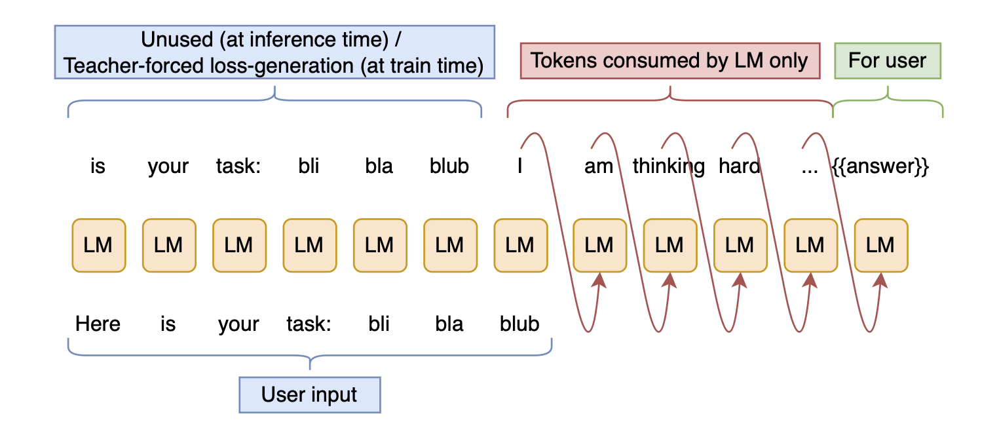
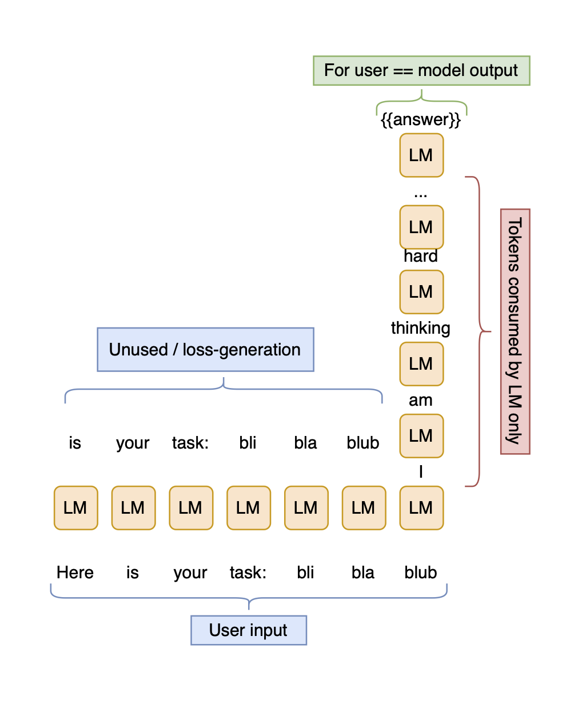

# LLM Test Time Compute Scaling *is* model scaling

Test-time-scaling is equal to model-scaling in two ways:

1. Attention weights increase in size
2. Any token produced by the model itself is internal to the model &rarr; test time scaling is layer repetition and thus depth increase

Additional hypothesis: similar to regular model scaling, "reasoning" RL improves training dynamics.

## Attention weight size-increase is similar to width-increase

[The attention matrix is a set of dynamically created weights.](https://sweet-hall-e72.notion.site/Why-are-Modern-Neural-Nets-the-way-they-are-And-Hidden-Hypernetworks-6c7195709e7b4abbada921875a951c54).
They represent a Fully Connected (FC) layer applied to the values along the sequence dimension,
and grow quadratically with the sequence length of the input.
Therefore, increasing the sequence length will trivially increase the model size.

There are two limitations to this type of scaling:

1. If the model isn't trained to do it, dynamic weight generation might produce big but dumb weights (a.k.a. you need to train the model on CoT)
2. If the model is too narrow, the similarity computation between the queries and keys might be so imprecise that it imposes *some* hard limit on the usable sequence length (though I suspect that this limit is a very high one). In other words, the static weights&mdash;Embeddings, MLPs, and Attention weights&mdash;are still a limiting factor

And clearly, this cannot be the only&mdash;or even the main&mdash;reason why CoT works well, or CoT wouldn't [work so well for RWKV](https://x.com/BlinkDL_AI/status/1857006248052359244) and other RNNs with dynamic weights of constant size (the state). More important is the depth-increase from test-time scaling.

## Any CoT-produced token is internal to the model

If you see the sampler as part of the model, then all autoregressively generated tokens are internal to the model. As long as the model doesn't interact with the environment, layers are being applied to the outputs of previous layers, so CoT is just dynamic layer repetition.

To convince yourself of this, look at the following illustration of reasoning:



And now, consider that it is equivalent to this flowchart:



However, tokens are being sampled, and the skip connection is thus collapsed.

(Often, the branches doing the actual compuation in a transformer&mdash;MLPs and Attention&mdash;are called the residual, and the input being added back in is called the skip connection, but the sum of the skip connections is called the residual stream. I find that very confusing and will thus call the residual stream the skip stream.)

### Sampler as a bottleneck

Token sampling introduces randomness at temperature $\gt 0$. More importantly, it imposes a bottleneck by reducing the skip stream to a single integer (token), which is then expanded again on the next model call. I've often read that the skip stream acts as working memory for a transformer, which is read and mutated by each layer. From that point of view, collapsing to a single token is a strong bottleneck that disrupts model-internal thinking by forcing it to compress its previous, potentially highly complex computations significantly.

### Skip stream versus kv-cache as short-term memory

However, there is a second memory mechanism in transformers: the kv-cache, a.k.a. the previous state of the Attention matrix (and similarly, some state vector or matrix in RNNs / SSMs). In the previous section, I've referred to this as dynamically generated weights; but I see them as weights encoding short-term memory-features, as opposed to e.g. MLP weights, which encode long-term, static information.

This means that:

- The skip stream is collapsed by sampling
- The kv-cache retains memory of previous complex computations
- However, the skip stream is now a single-token embedding, which is propagated through the layers and only gradually modified with the help of the kv-cache
- So the bottleneck is still real, and the kv-cache has to fight hard to get the skip stream back on track

(This makes me wonder if it would make sense to change the weight of the skip connections relative to the block outputs depending on the token position, or on the distance from the last user input token. And make the strength of this dependence learnable.)

Depth is extremely important to the reasoning strength of a model. Thus, increasing the effective model depth dynamically through CoT unsurprisingly increases model performance not only in transformers, but any modern language model architecture.

### Experimental verification (CoT as layer repetition)

I'm interested in the following experiment:

Train a model with $n$ layers. Let it think for $m-1$ steps, then evaluate the answer at the $m^{\text{th}}$ step.

Train a second model with $m\cdot n$ layers. Evaluate it at the $1^{\text{st}}$ step. How do the two models compare?

Another test: train linear probes at every $n^{\text{th}}$ layer (or, even better, at every layer). How well do the per-layer probes match the per-call outputs of the shallower model? In other words, how well does the $n^{\text{th}}$ layer probe outputs match the $1^{\text{st}}$ output of the shallower model? And the $2\cdot n^{\text{th}}$ layer probes the $2^{\text{nd}}$ output of the shallower model, etc.

While the models aren't perfectly comparable&mdash;when there are multiple tokens in the input, or multiple tokens in the final answer, the deeper model spends much more compute on the problem&mdash; this would answer an interesting question: do the `topk` probe-outputs form rough reasoning chains? How similar are they to the `topk` outputs of the shallower model's reasoning chain?

### Is this all there is to test-time scaling?

No.

o1 is trained with reinforcement learning on verifiable tasks. In that sense, it is data filtering that is adapted to the current state of the model at every step, and that matters. The dynamic layer repetition nature of reasoning models is simply one (important) aspect of the paradigm.

## CoT-sequences without teacher-forcing in training improve training dynamics

The above is pretty obviously true to me. Here is a potentially more controversial claim:

> If CoT is done during training, then it improves training dynamics.

This is inspired by the question: *if large and small model can learn the same behavior, why do we need more data to find the right set of weights in the small model?* My intuition is that we want to change the model in *behavior space*, but SGD can only change it in *weight space*. In larger models, there is a cleaner mapping between the two, so behaviors are easier to learn by SGD in larger models than in smaller ones.

More concretely: SGD always updates all weights, even if we want to keep the behavior of the model constant except for one very specific aspect. In a small model, no such behavior exists close to the current behavior in weight-space, so SGD as a form of local search cannot find it, and must contend itself with degrading most model behavior slightly in exchange for improving the behavior needed for the current batch significantly. In a large model on the other hand, far more diverse behaviors are close to the current position in weight-space, simply because there are more directions to move in. It is highly likely that there is a set of weights that preserves the current behavior very closely, while giving us the desired behavioral edit, very close to the current set of weights.

This, I believe, is the main reason why large models are better than small models. Sure, there is some absolute limit on performance set by the model size, and that limit is much higher for large models, but 1B models seem to continue to improve after $\gt 10$T tokens, so we have clearly not hit that limit. Therefore, model capacity cannot fully expain the difference between models of different sizes, and an important reason for why the large model is better is that it provides more freedom of exploration for local search algorithms such as SGD.

This same freedom of exploration is also provided by CoT. While in reinforcement learning we do eventually teacher-force the model, we do so on its own outputs instead of outside data as in regular LLM training. We also compare multiple generations and then weight their gradients by their performance, which leads to actual exploration of the model-internal states: the tokens. The effectively increased model size that this provides might help SGD find better solutions, faster.

### Experimental verification (training dynamics)

How would I verify this claim?

**Experiment 1:** Train two models:

1. A regular teacher-forced model
2. An o1-style reasoner, but trained on different CoT sequence-lengths: from $0$ to whatever you want

First, both are trained on the exact same dataset and have the exact same architecture, size, and initialization. Model $2$ then has more training compute applied, because the RL is applied to long CoT sequences, whereas model $1$ is only trained on teacher-forced inputs and targets.

Does the reasoner perform better than the teacher-forced model even without CoT at test time? If so, then it *must* be due to improved training dynamics. If not, then likely the difference comes just from the increased model depth from CoT.

*If it works*, then a second interesting experiment would be to train both models again, but train the teacher-forced one on more data, so that both use the same amount of training compute, and then compare the results. I suspect that the reasoner without CoT will not outperform the teacher-forced model in that case, but will still do so when using CoT. This is because of the increased inference budget, or more precisely, the increased effective model depth ([something that I am not alone betting on](https://x.com/kalomaze/status/1861687988805136549)).

**Experiment 2:** The second experiment is more of a prediction:

*If RL on CoT improves training dynamics, then we should expect the model to mix concepts and knowledge from many domains to freely elicit the latent capabilities associated with those.*

In more concrete terms, we should see the model mixing languages, or going on side-tangents, or ...

And&mdash;as far as I know&mdash;this is what we do see. DeepSeek's r1 model seems to switch from English to Chinese and back, for example. It also uses a distinct writing style for math that is different from the style it uses in other domains. This isn't strong evidence, but it is some.

## Conclusions

I take two things away from these thoughts:

1. The fact that "reasoners" work well is a strong signal that normal model scaling is not dead; and that it works well with such small models means that depth is more important than width in transformers (because the model itself limits the width of the embedding, but the depth is dynamically adjusted by the reasoining chain)
2. When comparing two models for the purpose of finding the better architecture, it is important to compare them not only at the same number of parameters, but also at the same number of tokens (if enabling the model to use more tokens is the point of the new architecture, then the number of tokens should simply be varied equally between both archtiectures)

## Citation

If you find this useful, please cite:

```bibtex
@misc{muller2024TTSIsModelScaling,
    title={LLM Test Time Compute Scaling is Model Scaling},
    author={Sebastian M\"uller},
    year={2024},
    month={dec},
    url={https://github.com/snimu/blog/blob/main/contents/llm-test-time-scaling-is-model-scaling/test-time-scaling-is-model-scaling.md},
}
```
