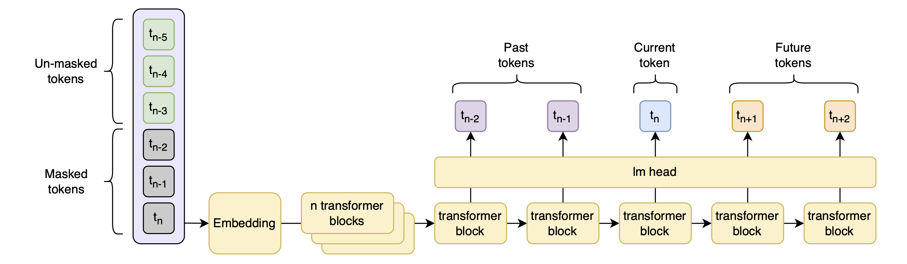

# Masked Causal Language Models

Masked Causal Language Models (MCLMs) perform multi-token prediction (MTP).

This is very easy to see: $\texttt{<mask>}$ tokens carry no information, so when we have a sequence ending in $\texttt{<mask>}$ in context, we have to predict the token after the mask without knowing what is under the mask.

--- image ---

--- more context ---

I have run experiments validating this hypothesis, based on the assumption that eval behavior will be similar to [Meta's multi-token prediction paper](https://arxiv.org/abs/2404.19737).

That is:

- At very small scales, the MTP model is slightly worse than the causal model
- At medium scales the MTP model is *significantly* worse than the causal model
- At large sclaes, the MTP model becomes better than the causal model, and moreso the larger the model gets

This is measured with *at least* 100B training tokens, often much more (in the range of 300B).

--- Figure 3 ---

A second point is that both the Meta MTP paper, and [DeepSeek V3](https://github.com/deepseek-ai/DeepSeek-V3) (which I will get into later) train extensively on Code and Math data, both of which seem to benefit greatly from MTP. In fact, the DeepSeek model benefits by far the most strongly from MTP in math and code benchmarks (see their Table 4).

My tests failed, but showed signs of the behaviors I described above. There are two caveates to the failure: 1) I trained a 2.5B parameter model at most, on 100B tokens, and 2) these tokens were fineweb-edu only, no specific math or code data was used. I also left a few avenues for optimization open. None of this means that my experiments weren't failures, just that they are early results. I write this article because I believe that the method is promising, and want to present it openly while I scrape together money and time to run more experiments.

I will present the method, what I think are some of its advantages (even compared to other MTP methods), and then my experiments and their results.

## Method

The basic method is extremely simple: train a causal language model (CLM) as you would normally, but apply a data augmentation to the input tokens: Replace groups of tokens with $\texttt{<mask>}$ tokens.

> I will distinguish between a $\texttt{<mask>}$&mdash;which is a single token&mdash; and a mask&mdash;which is a group of $\texttt{<mask>}$ tokens directly adjacent to each other.

There are two knobs to turn for tuning the process: the masking rate and the mask width. The masking rate determines how many $\texttt{<mask>}$ tokens are placed on the input sequence as a percentage of the total number of tokens, and the mask width determines how many $\texttt{<mask>}$ tokens are in each mask.

1. At each step, randomly select a mask width (the average number of subsequent tokens to mask) from a Gaussian distribution centered around a given mean value, clipped to between $0$ and $15$.
2. This mean value is determined by drawing from the tuple $(3, 8)$ with equal probability. This is inspired by R-denoising in [UL2](https://arxiv.org/abs/2205.05131).
3. If the mask width is above $0$, mask $15%$ of the tokens with randomly placed masks (where each mask consists of multiple $\texttt{<mask>}$ tokens; the mask width determined in step 1).

Letting the mask width reach $0$ from time to time, and thus not masking at all, is likely important for teaching the model autoregressive prediciton without masks.

I can think of a few immediate improvements to this:

- Linearly increase the total masking rate over training, from $0%$ to $15%$. As I will show later, the validation loss of the MCLM is lower than that of the CLM, but by an almost constant factor. This means that most of the difference comes early in training, and increasing the masking rate over the first $10-20%$ of training should be advantageous.
- Instead of randomly choosing between $3$ and $8$ as the mean value for the entire training run, linearly increase the mean value over training. This way, the model will start by only having to predict a few tokens at once, and end up predicting far more tokens at once.
- Keep the mask width smaller. Both Meta's MTP paper and DeepSeek V3 predict only a few tokens into the future. Because several masks can overlap in MCLMs, we can end up with masks widths of $30$ or more tokens. I suspect that at extremely large model and dataset sizes, predicting more tokens will be better, but at the small scales I can afford, predicting fewer tokens at once is almost certainly better.

My plan for future experiments is to 1) implement these improvements; 2) extend the fineweb-edu-100B dataset with 100B tokens from finemath to be able to measure math performance; 3) turn down the learning rate in the large runs (it was too high for the CLM, and I've gotten the impression that MCLMs need even lower learning rates).

## Advantages

I can see the following advantages from masked causal language models:

- Speculative decoding
- Better performance at scale, like with Meta's MTP paper and DeepSeek V3
- Improvements specifically at long contexts
- Improved VLMs
- MCLMs are different from CLMs only in a data augmentation &rarr; can be used with arbitrary architectures (for example, DeepSeek V3 style MTP, just slightly adjusted)

### Speculative decoding

If a model can produce multiple tokens at once (by simply appending multiple $\texttt{<mask>}$ tokens to the input), it can self-speculatively decode the next multiple tokens.

Of course, the tokens would be produced independently of each other, so true speculative decoding would only work at temperature $0$. This is because in order to preserve the model's next-token distribution on multiple independently produced tokens, we can only compare the argmax of the multiple predictions to the argmax of the next-token predictions run for validation.

However, if we just want to produce good results at arbitrary temperatures, we can do the following (not tested, but I think it should work):

1. Produce multiple token predictions at once
2. Randomly sample from each of these predictions according to the temperature and distribution
3. You now have a sequence of next tokens; run the model over it in parallel, in a teacher-forced setting
4. Use the predicted tokens until the next-token prediction in the teacher-forced setting exceeds some entropy threshold; a.k.a. until the model is no longer confident about the next token.

--- image ---

You could even sample multiple multi-token trajectories at once and test them in parallel with a clever attention mask (see, for example, [Quiet Star](https://arxiv.org/abs/2403.09629)). Then, pick either the longest sequence, or the one with the lowest cumulative entropy.

--- image ---

Again, this won't reproduce the exact output distribution of the model in single-token prediction mode, but I believe that it should still preserve its output quality. This is because CLMs are typically better at judging the quality of input trajectories than at predicting the single next token. And in autoregressive generation, errors accumulate. Thus, creating multiple tokens at once and then looking back at and judging the full token trajectory at once might actually lead to better models than just predicting one token at a time, because the latter always carries the risk of a wrong decision derailing the whole trajectory.

### Better performance at scale

Both Meta and DeepSeek have shown that MTP produces better results than single token prediction when the models and datasets are large enough. If masked causal language models perform multi-token prediction (which they obviously do), and their disadvantages don't outweigh their advantages, the same should be true for them.

### Improvements specifically at long contexts

The Meta people explain the advantages of MTP as arising as a result of the model getting better at predicting key tokens; tokens that strongly determine the trajectory of the future text. For example, the character in a book being named determines the following dialogue strongly, but using British instead of American spelling would not have a strong effect. Using one technical term versus another will have a large effect on the subsequent technical elaboration, while a single misspelling will not.

I believe that masking the tokens will have an even stronger effect on learning key tokens than other MTP schemes.

This is because in most MTP schemes, the loss is calculated over the $n$ next tokens at every position. So if a model is wrong at a key position, it will get negative feedback for $n$ tokens. But at the next position, it will be teacher-forced with the correct token, and likely produce good predictions for the next $n$ tokens, which means that it will receive low loss over $n$ tokens again. So the ratio of high- to low-loss tokens is the same as in single token prediction.

In MCLMs, on the other hand, when there is a mask over a key token and the next $n-1$ tokens, the model will receive a large loss for each of the next $n$ tokens. But if all input tokens are un-masked, the model will receive a low loss for only the single next token prediction. This means that masked tokens, if they lead to high losses, will make up a larger percentage of the loss than similar high-loss key tokens will in other MTP schemes.

Here is an idea for how to cleverly place masks to train in-context learning (ICL) in long sequences, illustrated with a technical document:

1. Leave the early part of the document un-masked, so that the model will have the definitions of all terms in context later on
2. Mask half the key terms and the explanations following them in the later parts of the document, so that the model will be forced to truly understand what each term means in order to correctly predict the next term

The same can be done with main characters in books, place names when giving directions, etc.

There is a second thing that MCLMs force the model to learn, which other MTP schemes don't: infilling.

When a key token is masked, then later in the text, the model will have to figure out which token was masked from the tokens that surround it. Otherwise, next-token prediction will be more difficult. Learning infilling in this way may have several advantages:

- Teaches dealing with unclear instructions, incomplete data, etc.
- Improves judgements of the quality of the text

Both of these are speculative, of course.

### Better VLMs

[Images are much more redundant than text](https://arxiv.org/abs/2111.06377). Masked prediction on them is very effective. On the other hand, autoregressive image generation a là Grok3 obviously works, too. So how about we simply combine them?

If we do, we get multi-token predictions in both images and text, which should advantage both, but both through the same method, which might help align the two.

--- images ---

### Interoperability with other methods

Data augmentation is obviously independent of the model architecture, as long as the model uses sequences of tokens. Here are some ideas for combining MCLM with other methods.

#### DeepSeek V3 style MTP

I believe that masking input tokens enables a cool extension of DeepSeek's method for multi-token prediction: predicting previous and current tokens, in addition to multiple future tokens.

Here is how DeepSeek does MTP:

--- image ---

They predict the next token by applying a language head to the hidden states of some transformer layer. Then, they feed those hidden states through another transformer layer and use the same language head to predict the token two ahead of the current token, and so on. I can see many advantages to this:

- The language head is shared, so will get $n$ times as much training signal than in single-token prediction
- The model is forced to learn realistic uncertainty about the next token, because if it is too certain about the most likely next token, then&mdash;even if that *is* the most likely next token&mdash;it will experience high losses anytime the next token is not the most likely one. In other words: language models mut learn probability distributions, but the labels they are trained against are 1-hot. They must thus learn the probabilities from the contradictions in the data. Multi-token prediction makes those contradictions much more pronounced, and forces the model to learn from them early on. On a sidenote, this fact is why model distillation works so well: we don't have the true output destribution available as labels, only 1-hot samples through it, but we have very strong LLMs that have learned the true distribution well; thus, we can help smaller models learn the distributions by providing them directly as targets
- All predicted tokens depend on each other, so full trajectories can be sampled

I'm sure there is more. DeepSeek show clearly that this improves model performance by a lot, for a low cost (though to be clear, their smallest experiment is a 15.7B parameter MoE with 2.4B parameter experts, trained on 1.33T tokens, so more than 60 times over my budget).

**Here is the proposed extension:** Start the MTP process earlier in the model and explicitly predict past tokens. Apply a loss to this only where the token that should be predicted is a $\texttt{<mask>}$ token at the input.

Here is how that would look compared to the original MTP:

What would be the benefits?

- You would extend the number of target tokens from which you can productively get a training signal.
  - Normally, in teacher-forced CLM training, you get hundreds to thousands of tokens at the input, but only a single target token at the output for training.
  - This seems to me like an important reason for why LLMs are better at judging the quality of input trajectories consisting of multiple tokens than at generating a single token
  - It also severly limits the amount of training signal. As I've said before, LLMs learn from contradictions
  - MTP extends the number of target tokens per input position, and backward infilling turns this up a notch
- It adds more skills that would have to be learned implicitly by the model, and makes them explicit objectives:
  - Backward prediction is infilling; I've discussed the benefits of infilling above (TODO: link my backward prediction work here?2)
  - Predicting the current token is similar to masked language modeling (MLM), except with a causal attention mask; it might make transitioning an causal model into a bidirectional one easier (for MLM, embedding tasks, etc.)
  - Next-token prediction remains as a task!
- Backward prediction allows for backtracking, if trained correctly. This is very important, so I will repeat it: **Backward prediction allows for backtracking!**

## Results 2.5B

### Temperature 0

| metric| masked causal | causal |
| --- | --- | --- |
| cola mcc | **0.0429** | 0.0058 |
| hellaswag acc | 0.4768 | **0.4855** |
| lambada_openai pplx | 12.9870 | **12.7395** |
| lambada_openai acc | **0.4638** | 0.4619 |
| lambada_standard pplx | 12.3615 | **10.8484** |
| lambada_standard acc | 0.4762 | **0.4947** |
| mnli acc | 0.3354 | **0.3581** |
| mnli_mismatch acc | 0.3353 | **0.3694** |
| mrpc acc | 0.5221 | **0.5466** |
| mrpc f1 | 0.6012 | **0.6542**|
| piqa acc | 0.7541 | **0.7661** |
| qnli acc | 0.5103 | **0.5228** |
| qqp acc | **0.5960** | 0.4964 |
| qqp f1 | 0.2456 | **0.4393** |
| rte acc | 0.6101 | **0.6173** |
| sst2 acc | 0.5505 | **0.5768** |
| truthfulqa_gen bleu_max | 2.9663 | 3.0548 |
| truthfulqa_gen bleu_acc | **0.3501** | 0.2925 |
| truthfulqa_gen rouge1 acc | **0.3856** | 0.3231 |
| truthfulqa_gen rouge2 acc | **0.3109** | 0.2729 |
| truthfulqa_gen rougeL acc | **0.3660** | 0.3133 |
| truthfulqa_mc1 acc | **0.2277** | 0.2191 |
| truthfulqa_mc2 | **0.3715** | 0.3573 |
| wnli acc | 0.5211 | **0.5634** |

### Temperature 1

| metric | masked causal | causal |
| --- | --- | --- |
| cola mcc | **0.0429** | 0.0058 |
| hellaswag acc | 0.4768 | **0.4855** |
| lambada_openai pplx | 12.9870 | **12.7395** |
| lambada_openai acc | **0.4638** | 0.4619 |
| lambada_standard pplx | 12.3615 | **10.8484** |
| lambada_standard acc | 0.4762 | **0.4947** |
| mnli acc | 0.3354 | **0.3581** |
| mnli_mismatch acc | 0.3353 | **0.3694** |
| mrpc acc | 0.5221 | **0.5466** |
| mrpc f1 | 0.6012 | **0.6542** |
| piqa acc | 0.7541 | **0.7661** |
| qnli acc | 0.5103 | **0.5228** |
| qqp acc | **0.5960** | 0.4964 |
| qqp f1 | 0.2456 | **0.4393** |
| rte acc | 0.6101 | **0.6173** |
| sst2 acc | 0.5505 | **0.5768** |
| truthfulqa_gen bleu_max | 1.9727 | **2.0865** |
| truthfulqa_gen bleu_acc | **0.3574** | 0.3562 |
| truthfulqa_gen rouge1 acc | **0.4296** | 0.4002 |
| truthfulqa_gen rouge2 acc | **0.2693** | 0.2644 |
| truthfulqa_gen rougeL acc | **0.4137** | 0.4027 |
| truthfulqa_mc1 acc | **0.2277** | 0.2191 |
| truthfulqa_mc2 | **0.3715** | 0.3573 |
| wnli acc | 0.5211 | **0.5634** |

### 2nd Token

| metric | masked causal | causal |
| --- | --- | --- |
| cola mcc | **0.0429** | 0.0058 |
| hellaswag acc | 0.2503 | **0.2504** |
| lambada_openai pplx | Inf | Inf |
| lambada_openai acc | **0.4638** | 0.4619 |
| lambada_standard pplx | Inf | Inf |
| lambada_standard acc | 0.4762 | **0.4947** |
| mnli acc | 0.3358 | **0.3582** |
| mnli_mismatch acc | 0.3358 | **0.3694** |
| mrpc acc | 0.5221 | **0.5466** |
| mrpc f1 | 0.6012 | **0.6542** |
| piqa acc | **0.4962** | 0.4951 |
| qnli acc | 0.5103 | **0.5228** |
| qqp acc | **0.5960** | 0.4964 |
| qqp f1 | 0.2456 | **0.4393** |
| rte acc | 0.6101 | **0.6173** |
| sst2 acc | 0.5505 | **0.5768** |
| truthfulqa_gen bleu_max | 0.6442 | **0.6849** |
| truthfulqa_gen bleu_acc | **0.4357** | 0.4027 |
| truthfulqa_gen rouge1 acc | **0.4676** | 0.4529 |
| truthfulqa_gen rouge2 acc | **0.2350** | 0.2313 |
| truthfulqa_gen rougeL acc | **0.4504** | 0.4162 |
| truthfulqa_mc1 acc | **0.8825** | 0.8715 |
| truthfulqa_mc2 | NaN | NaN |
| wnli acc | 0.5211 | **0.5634** |

### Merged

| metric | masked causal (k=1) | masked causal (k=2) | causal (k=1) | causal (k=2) | Changed? |
| --- | --- | --- | --- | --- | --- |
| cola mcc | **0.0429** | **0.0429** | 0.0058 | 0.0058 | No |
| hellaswag acc | 0.4768 | 0.2503 | **0.4855** | 0.2504 | Yes |
| lambada_openai pplx | 12.9870 | Inf | **12.7395** | Inf | Yes |
| lambada_openai acc | **0.4638** | **0.4638** | 0.4619 | 0.4619 | No |
| lambada_standard pplx | 12.3615 | Inf | **10.8484** | Inf | Yes |
| lambada_standard acc | 0.4762 | 0.4762 | **0.4947** | **0.4947** | No |
| mnli acc | 0.3354 | 0.3358 | **0.3582** | 0.3582 | Yes |
| mnli_mismatch acc | 0.3353 | 0.3358 | **0.3694** | 0.3694 | Yes |
| mrpc acc | 0.5221 | 0.5221 | **0.5466** | **0.5466** | No |
| mrpc f1 | 0.6012 | 0.6012 | **0.6542** | **0.6542** | No |
| piqa acc | 0.7541 | 0.4962 | **0.7661** | 0.4951 | Yes |
| qnli acc | 0.5103 | 0.5103 | **0.5228** | **0.5228** | No |
| qqp acc | **0.5960** | **0.5960** | 0.4964 | 0.4964 | No |
| qqp f1 | 0.2456 | 0.2456 | **0.4393** | **0.4393** | No |
| rte acc | 0.6101 | 0.6101 | **0.6173** | **0.6173** | No |
| sst2 acc | 0.5505 | 0.5505 | **0.5768** | **0.5768** | No |
| truthfulqa_gen bleu_max | **1.9727** | 0.6442 | **2.0865** | 0.6849 | Yes |
| truthfulqa_gen bleu_acc | 0.3574 | **0.4357** | 0.3562 | 0.4027 | Yes |
| truthfulqa_gen rouge1 acc | 0.4296 | **0.4676** | 0.4002 | 0.4529 | Yes |
| truthfulqa_gen rouge2 acc | **0.2693** | 0.2350 | 0.2644 | 0.2313 | Yes |
| truthfulqa_gen rougeL acc | 0.4137 | **0.4504** | 0.4027 | 0.4162 | Yes |
| truthfulqa_mc1 acc | 0.2277 | **0.8825** | 0.2191 | 0.8715 | Yes |
| truthfulqa_mc2 | **0.3715** | NaN | 0.3573 | NaN | Yes |
| wnli acc | 0.5211 | 0.5211 | **0.5634** | **0.5634** | No |

### Max pooled

| metric | masked causal | causal | k |
| --- | --- | --- | --- |
| cola mcc | **0.0429** | 0.0058 | (1,1) |
| hellaswag acc | 0.4768 | **0.4855** | (1,1) |
| lambada_openai pplx | 12.9870 | **12.7395** | (1,1) |
| lambada_openai acc | **0.4638** | 0.4619 | (1,1) |
| lambada_standard pplx | 12.3615 | **10.8484** | (1,1) |
| lambada_standard acc | 0.4762 | **0.4947** | (1,1) |
| mnli acc | 0.3358 | **0.3582** | (2,1) |
| mnli_mismatch acc | 0.3358 | **0.3694** | (2,1) |
| mrpc acc | 0.5221 | **0.5466** | (1,1) |
| mrpc f1 | 0.6012 | **0.6542** | (1,1) |
| piqa acc | 0.7541 | **0.7661** | (1,1) |
| qnli acc | 0.5103 | **0.5228** | (1,1) |
| qqp acc | **0.5960** | 0.4964 | (1,1) |
| qqp f1 | 0.2456 | **0.4393** | (1,1) |
| rte acc | 0.6101 | **0.6173** | (1,1) |
| sst2 acc | 0.5505 | **0.5768** | (1,1) |
| truthfulqa_gen bleu_max | 1.9727 | **2.0865** | (1,1) |
| truthfulqa_gen bleu_acc | **0.4357** | 0.4027 | (2,2) |
| truthfulqa_gen rouge1 acc | **0.4676** | 0.4529 | (2,2) |
| truthfulqa_gen rouge2 acc | **0.2693** | 0.2644 | (1,1) |
| truthfulqa_gen rougeL acc | **0.4504** | 0.4162 | (2,2) |
| truthfulqa_mc1 acc | **0.8825** | 0.8715 | (2,2) |
| truthfulqa_mc2 | **0.3715** | 0.3573 | (1,1) |
| wnli acc | 0.5211 | **0.5634** | (1,1) |

## 1.5B

### k=1

| metric | masked causal | causal |
| --- | --- | --- |
| cola mcc | -0.016 | **0.012** |
| hellaswag acc | 0.250 | 0.250 |
| lambada_openai pplx | Infinity | Infinity |
| lambada_openai acc | 0.421 | **0.432** |
| lambada_standard pplx | Infinity | Infinity |
| lambada_standard acc | 0.419 | **0.424** |
| mnli acc | 0.321 | **0.384** |
| mnli_mismatch acc | 0.325 | **0.397** |
| mrpc acc | 0.449 | **0.507** |
| mrpc f1 | 0.450 | **0.586** |
| piqa acc | 0.496 | 0.496 |
| qnli acc | **0.504** | 0.502 |
| qqp acc | **0.619** | 0.559 |
| qqp f1 | 0.089 | **0.373** |
| rte acc | 0.498 | **0.542** |
| sst2 acc | 0.518 | **0.644** |
| truthfulqa_gen bleu_max | **3.216** | 2.970 |
| truthfulqa_gen bleu_acc | **0.299** | 0.289 |
| truthfulqa_gen rouge1 acc | 0.323 | **0.327** |
| truthfulqa_gen rouge2 acc | **0.252** | 0.245 |
| truthfulqa_gen rougeL acc | 0.299 | **0.305** |
| truthfulqa_mc1 acc | 0.882 | **0.891** |
| truthfulqa_mc2 | NaN | NaN |
| wnli acc | **0.549** | 0.535 |

### k=2

| metric | masked causal | causal |
| --- | --- | --- |
| cola mcc | -0.016 | **0.012** |
| hellaswag acc | 0.250 | 0.250 |
| lambada_openai pplx | Infinity | Infinity |
| lambada_openai acc | 0.421 | **0.432** |
| lambada_standard pplx | Infinity | Infinity |
| lambada_standard acc | 0.419 | **0.424** |
| mnli acc | 0.321 | **0.384** |
| mnli_mismatch acc | 0.325 | **0.397** |
| mrpc acc | 0.449 | **0.507** |
| mrpc f1 | 0.450 | **0.586** |
| piqa acc | 0.496 | 0.496 |
| qnli acc | **0.504** | 0.502 |
| qqp acc | **0.619** | 0.559 |
| qqp f1 | 0.089 | **0.373** |
| rte acc | 0.498 | **0.542** |
| sst2 acc | 0.518 | **0.644** |
| truthfulqa_gen bleu_max | **0.732** | 0.610 |
| truthfulqa_gen bleu_acc | **0.435** | 0.425 |
| truthfulqa_gen rouge1 acc | 0.449 | **0.455** |
| truthfulqa_gen rouge2 acc | **0.297** | 0.206 |
| truthfulqa_gen rougeL acc | 0.448 | **0.449** |
| truthfulqa_mc1 acc | 0.882 | **0.891** |
| truthfulqa_mc2 | NaN | NaN |
| wnli acc | **0.549** | 0.535 |

### Merged (1.5B)

| metric | masked causal (k=1) | masked causal (k=2) | causal (k=1) | causal (k=2) |
| --- | --- | --- | --- | --- |
| cola mcc | -0.016 | **0.732** | 0.012 | 0.012 |
| hellaswag acc | 0.250 | 0.250 | 0.250 | 0.250 |
| lambada_openai pplx | Infinity | Infinity | Infinity | Infinity |
| lambada_openai acc | 0.421 | 0.421 | **0.432** | **0.432** |
| lambada_standard pplx | Infinity | Infinity | Infinity | Infinity |
| lambada_standard acc | 0.419 | 0.419 | **0.424** | **0.424** |
| mnli acc | 0.321 | 0.321 | **0.384** | **0.384** |
| mnli_mismatch acc | 0.325 | 0.325 | **0.397** | **0.397** |
| mrpc acc | 0.449 | 0.449 | **0.507** | **0.507** |
| mrpc f1 | 0.450 | 0.450 | **0.586** | **0.586** |
| piqa acc | 0.496 | 0.496 | 0.496 | 0.496 |
| qnli acc | **0.504** | **0.504** | 0.502 | 0.502 |
| qqp acc | **0.619** | **0.619** | 0.559 | 0.559 |
| qqp f1 | 0.089 | 0.089 | **0.373** | **0.373** |
| rte acc | 0.498 | 0.498 | **0.542** | **0.542** |
| sst2 acc | 0.518 | 0.518 | **0.644** | **0.644** |
| truthfulqa_gen bleu_max | **3.216** | 0.732 | 2.970 | 0.610 |
| truthfulqa_gen bleu_acc | 0.299 | **0.435** | 0.289 | 0.425 |
| truthfulqa_gen rouge1 acc | 0.323 | 0.449 | 0.327 | **0.455** |
| truthfulqa_gen rouge2 acc | 0.252 | **0.297** | 0.245 | 0.206 |
| truthfulqa_gen rougeL acc | 0.299 | 0.448 | 0.305 | **0.449** |
| truthfulqa_mc1 acc | 0.882 | 0.882 | **0.891** | **0.891** |
| truthfulqa_mc2 | NaN | NaN | NaN | NaN |
| wnli acc | **0.549** | **0.549** | 0.535 | 0.535 |

## Advantages

- Speculative decoding
- Multi-modality
- Long context: focus on key tokens
- Is just a data augmentation &rarr; can be used with arbitrary architectures
  - Transformers vs RWKV vs Mamba vs ...
  - [Byte Latent Transformer](../byte-latent-transformer/article.md)
  - Multi-token prediction à la [DeepSeek V3](https://github.com/deepseek-ai/DeepSeek-V3/blob/main/DeepSeek_V3.pdf)
    - Allows for sensible backward-prediction!
    - Predict backward from token to masks &rarr; infilling
    - Predict current masked token &rarr; BERT with causal mask
    - Predict next token from masked tokens &rarr; multi-token-prediction
    - Would potentially fix the difficulties in learning facts, because it receives so much more feedback from the multiple prediction heads

## Small experiments

| # Parameters | val-loss CLM | val-loss MCLM | val-loss-MCLM/val-loss-CLM [%] |
|-------------|--------------|------------------|----------------------------------------|
| 13.2M       | 4.297        | 4.311            | 100.3%                                |
| 46M         | 3.319        | 3.385            | 102.0%                                |
| 240.7M      | 3.077        | 3.013            | 97.9%                                 |
| 773.2M      | 3.047        | 2.966            | 97.3%                                 |
| 1.3B        | 3.045        | 2.941            | 96.6%                                 |

