# Mixture of Tokenizers &mdash; Performance on addition

[Mixtures of Tokenizers](../mixture-of-tokenizers/README.md) (MoT) make learning math easier than using classical tokenizers.

LLMs from $6$ to $8$ million parameters in size are trained to learn pure addition of two numbers with up to $12$ digits per number. In regimes where memorization is easy, a Baseline model outperforms a slightly smaller MoT, but where memorization is not possible, the MoT is significantly better.

To test this, I compare models trained with multiple different tokenizers between a MoT and a Baseline. These represent controlled experiments for understanding MoTs, which give strong evidence that they are fit to being used on larger models and more diverse data. For a primer on MoTs, see [this article](https://github.com/snimu/blog/blob/main/contents/mixture-of-tokenizers/README.md). The specific architecture used for the experiments presented in this article is described below.

You can find the code [here](https://github.com/snimu/mixture-of-tokenizers/tree/main/mathblations). Under *ablations.sh*, you can find the ablation commands I ran.

Table of contents:

- [Model architecture](#model-architecture)
- [What's the point?](#whats-the-point)
- [Data](#data)
- [Results](#results)
- [Discussion](#discussion)

## Model architecture

I trained two models on math data:

- **The Baseline** &mdash; A normal transformer. To make up for the additional parameters in the digit embeddings, the attention layer applied to the digits, and the cross-attention in the MoT, I added one more transformer block to the baseline. Because that block includes a MLP, the baseline always has slightly more parameters than the MoT. This means that there is no way that the results of the MoT are over-estimated relative to the Baseline.
- **The MoT** &mdash; A normal transformer, but the token embeddings are enriched with digit-level embeddings through cross-attention. The digit embeddings are first mixed with a causal attention layer. I believe that this could use sliding window attention for long sequences, but for the short sequences used in my experiments, I use full causal attention. The cross-attention is masked so that each token only sees the digits that make it up (this constraint could also be relaxed, but seeing if the most restrictive way to impart information into the transformer works is intersting to me).

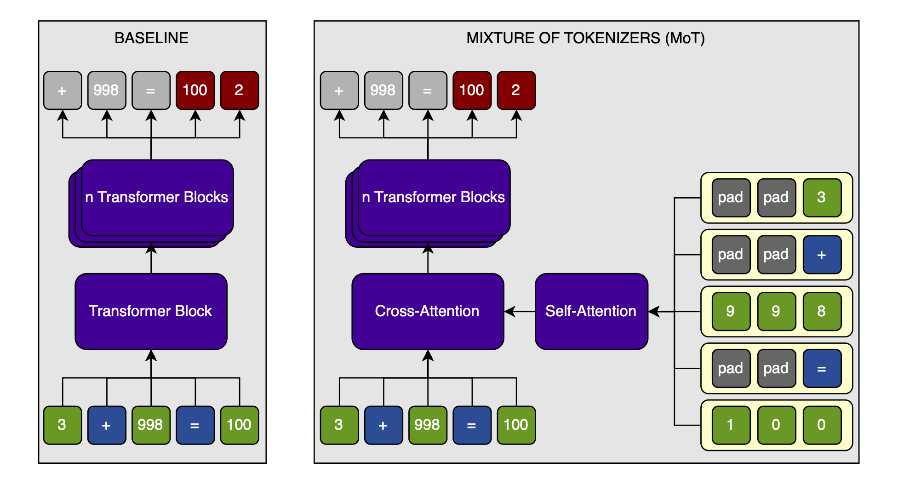

The models are modified from [this speedrun](https://github.com/KellerJordan/modded-nanogpt/blob/master/records/102024_ScaleUp1B/c0078066-c8c9-49c8-868a-ff4d4f32e615.txt) by [KellerJordan](https://github.com/KellerJordan). All norms are RMS-norms without weights. QK-norms and layer-tying between the embedding layer and the language head are used. Otherwise, the architecture is very standard.

The speedrun use [the Muon optimizer](https://github.com/KellerJordan/Muon), and so do I. The number of training steps is adapted to the difficulty of the task.

## What's the point?

I have two viewpoints of the advantages that I expect from MoTs:

1. LLMs are known to have problems that stem from tokenization. Having byte-level access to the input can help significantly, as, for example, the [Byte Latent Transformer](https://arxiv.org/abs/2412.09871) paper shows. However, working on bytes naively comes at the cost of increased sequence length. I believe that a second issue with byte-level models is that they lack something that token-level models have: [access to global, trainset-wide statistics about the specific combination of bytes that each token is made up of](https://github.com/snimu/blog/blob/main/contents/embeddings-thoughts/article.md). A MoT allows the best of both worlds: token-level information and sequence length, but access to digit-level information.
2. In [Ensemble Everything Everywhere](https://arxiv.org/abs/2408.05446), Stanislav Fort and Balaji Lakshminarayanan show that concatenating an image at multiple resolutions in the channel dimension can very cheaply increase adversarial robustness in resnets. A mix of tokenizers would enable a similar mix of resolutions, and thus a more robust model. You'd have no undertrained tokens because you always have the byte-view&mdash;and because there are so much fewer bytes than tokens, none of them are undertrained. At the same time, if you change anything subtle about the bytes, you will change the tokens radically. It will be easy for a model to detect when the byte- and token-level views don't match up as they do in training, and notice an adversarial attack that way.

## Data

All data takes the form `f(x1, x2) = y`. For example, when using addition, a sequence might look like this: `15 + 368 = 383`.

I want to compare the MoT performance to the Baseline when using different tokenizers. These tokenizers are custom, and can only tokenize numbers, and the addition-, equals-, and padding-tokens. They differ in the maximum number of digits per token only (see below).

I ablate over two variables:

- **Maximum digits per token (dpt)** &mdash; The maximum number of digits that can be in a single token. If this number is $3$, then we have $1000$ tokens, plus the addition and equality tokens (and a padding token to make all sequences the same length, for practical purposes). This defines the tokenizer.
- **Maximum tokens per number (tpn)** &mdash; The maximum number of tokens that can be in a single number. For example, if `dpt=3` and `tpn=2`, then we can represent all numbers from $0$ to $999,999$. A number like $1,000$ would be represented as `[100, 0]`; $3$ as `[3]`, and so on. This defines the complexity of the task, together with `dpt`.

Importantly, these variables apply to `x1` and `x2`; `y` can be larger, of course.

I turn the tokens into digits by simply splitting their digits up. I turn each token into `dpt` entries, so that there is a constant number of digit-embeddings per token, no matter how many digits the number contains (I make use of padding tokens). If `dpt=3`, and the number is $123$, then that number would be represented as `[1, 2, 3]`. $5$ would be `[<pad>, <pad>, 5]`, and so on. The padding always comes before the digits (though this doesn't matter as long as it is consistent). Operating tokens &mdash; "+" and "=" for addition &mdash; are similarly padded to `[<pad>, <pad>, +]` and `[<pad>, <pad>, =]`.

Here are three examples of tokens and their corresponding digits at different `dpt` and `tpn` settings:


> On padding: There is a choice between left-padding (`[<pad>, <pad>, 1]`) and right-padding (`[1, <pad>, <pad>]`). Left-padding is meant to align digits. If the number $1234$ is split in two: $123$ and $4$, then the digits corresponding to the first token are $[1, 2, 3]$; but the digits corresponding to the second are $[\mathrm{pad}, \mathrm{pad}, 4]$. Now compare this to the token $400$: which would be turned into $[4, 0, 0]$. The four in the former is at the last position to distinguish it from a 400. On the other hand, right-padding better aligns the digits with the positional embeddings: if a number is split as shown above, then putting padding between the first three digits and the single last digit will increase the distance between them as measured by the positional embeddings. I have not done any experiments on the choice between the two, and just chose the padding strategy that makes the most sense to me.

I vary `dpt` and `tpn` over the following ranges: Every combination of `dpt` $\in [2, 4]$ and `tpn` $\in [1, 3]$. I run every setting five times to get statistically significant results. For every MoT-run, there is a Baseline run with the exact same data-mixture seen in the exact same order and for the exact same number of steps, against the exact same validation data, and even with the exact same seed.

The larger `dpt` and `tpn`, the more steps I trained for. This is to ensure that the models learn addition to a meaningful accuracy.

In only ever calculate a loss against the target number (e.g., in the equation $123 + 456 = 579$, only the prediction for $579$ would have a loss calculated). This is because the other numbers are random, and the plus and equals signs always the same.

## Results

In summary, the results look very promising; MoT improves performance on addition significantly *when there are many digits per token*. This is mostly a function of how many digits are in a token, and how often an equation is seen: the MoT shows better performance when memorization is not possible. The results point towards improvements in a more general text domain from MoT.

I will first plot the full-number-accuracy over the training step; then provide a heatmap with the final full-number-accuracy of the MoT divided by that of the Baseline; and finally, tabulate the final full-number-accuracy of both models over the times that a token is expected to be seen during training, and the time each possible equation is expected to be seen during training.

### Full-number-accuracy over training steps

To get a first feel for the results, I will plot the full-number-accuracy&mdash;the accuracy of the addition, as opposed to the normal accuracy which is per-token&mdash;at a constant `dpt`. This is because my assumption is that MoT helps especially when the tokens consist of many digits. If the digits per token are constant, then varying the tokens per number should have a weak effect on the relative performance between the MoT and the Baseline.

Note that in the following, I will calculate the mean over the five training runs per model and setting.

Here it is for `dpt=4`:

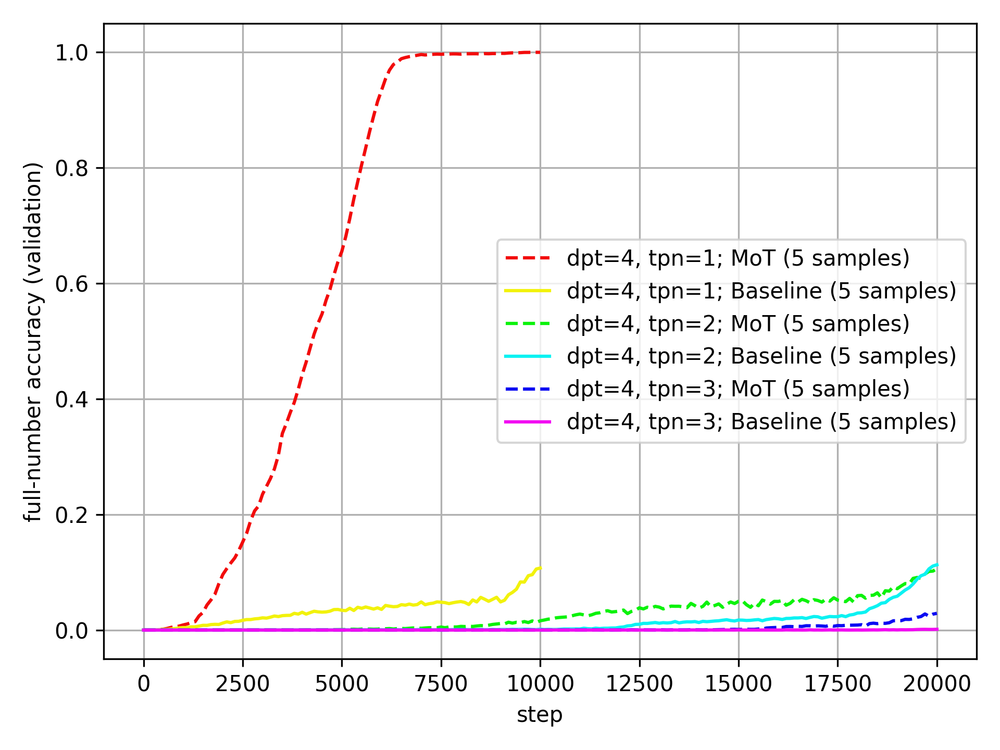

The MoT is very clearly and consistently better than the Baseline at `dpt=4`.

Here is the same plot for `dpt=3`:

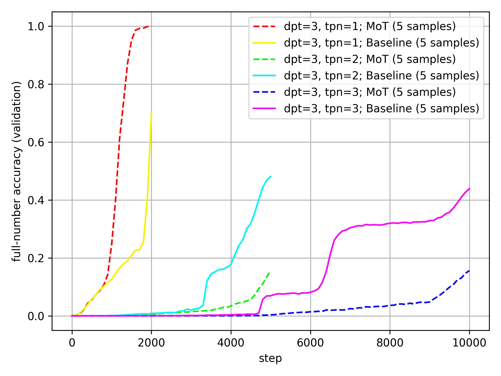

Here, the MoT outperforms for a single token per number, but not when there are multiple tokens per number.

Here is the same plot for `dpt=2`:

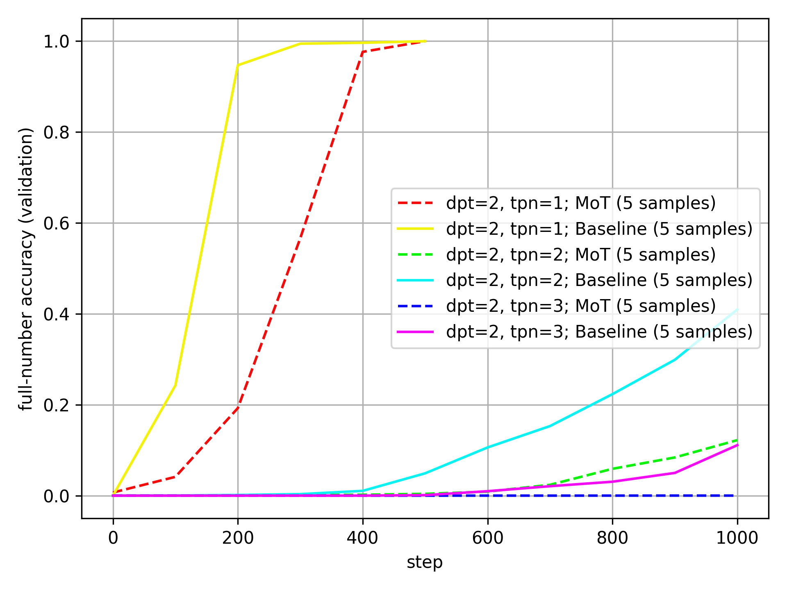

Now, the Baseline outperforms the MoT consistently.

*What might explain this pattern?*

My first hypothesis is that `dpt` to a large part determines the possible number of equations that the model might see during training. Yes, I adapt the number of training steps to `dpt`, but not nearly enough to make up for that fact. If this is true, then small `dpt` benefit memorization, while large `dpt` benefit generalization. As I made sure to make the Baseline larger than the MoT&mdash;and those extra parameters come from an extra MLP, which is usually associated with memorization&mdash;the Baseline is more likely to perform well with small numbers.

The above is always the mean over five samples, which is not resistant to outliers (and there is one extreme outlier at `dpt=4`, `tpn=2`, where one Baseline run is multiple times better than all others). To get a different view, here are the same plots with the median instead of the mean, starting again with `dpt=4`:

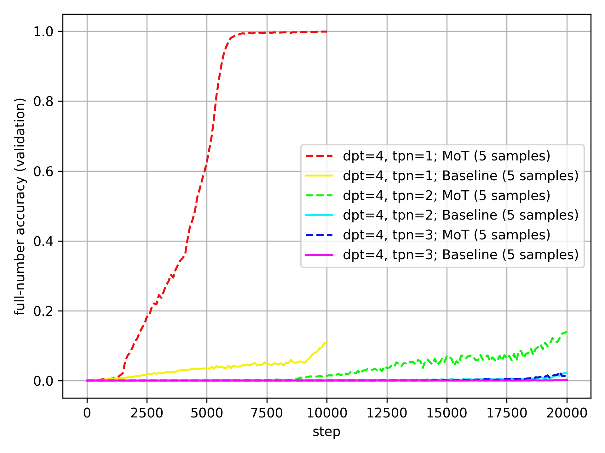

If anything, the outperformance of the Baseline by the MoT is even more pronounced than with the mean.

The same for `dpt=3`:

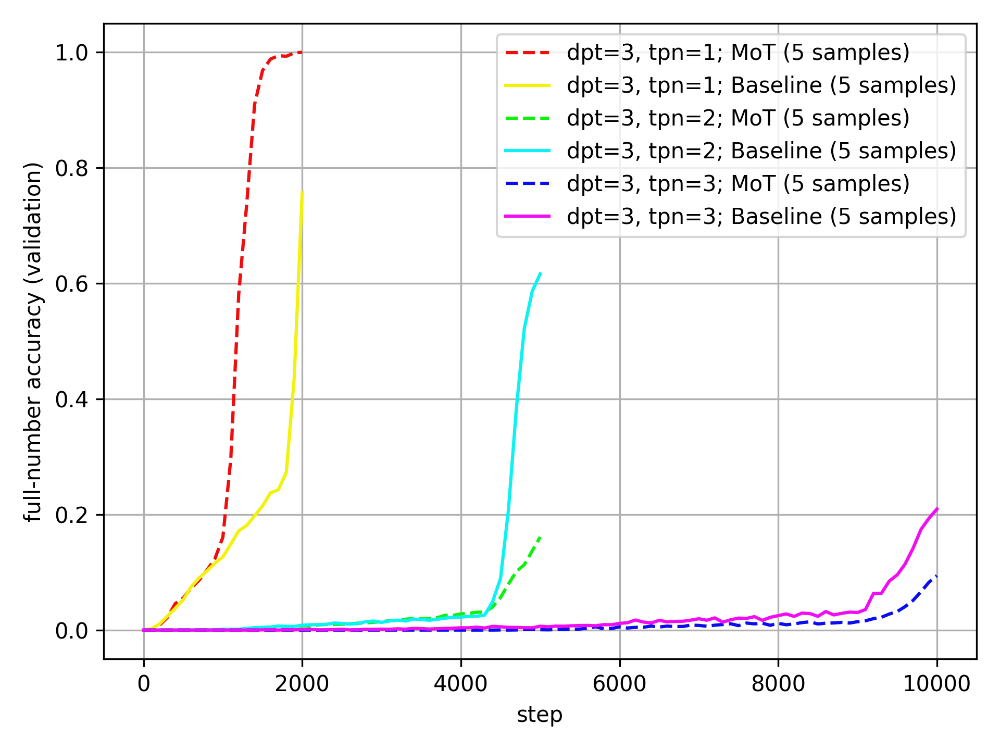

The MoT- and Baseline-results are closer together than before (though that might just be because the median run has lower accuracy than the mean run), but they follow the same trends as with the mean.

And for `dpt=2`:

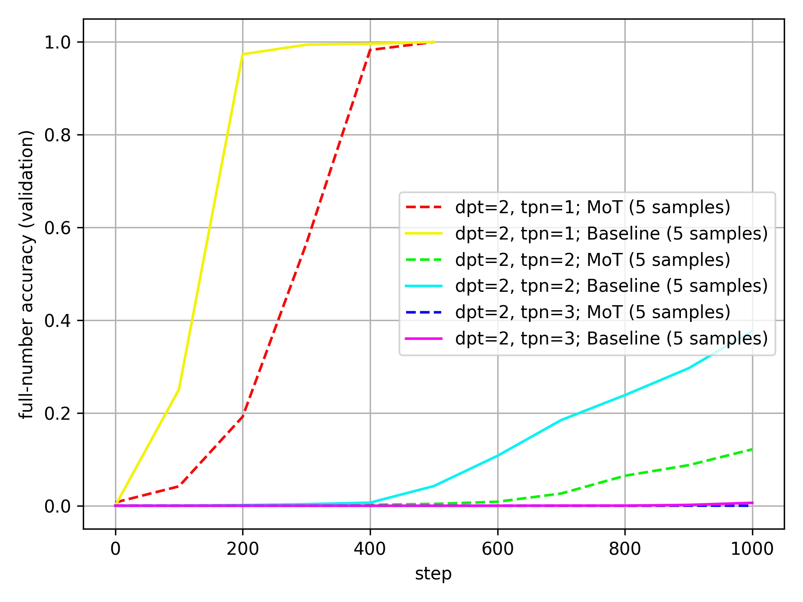

The baseline still clearly outperforms the MoT here.

#### The outlier

Just to convince you that the results at `dpt=4` and `tpn=2` are due to outliers, here are the accuracies of all the runs at these settings, together with their mean values:

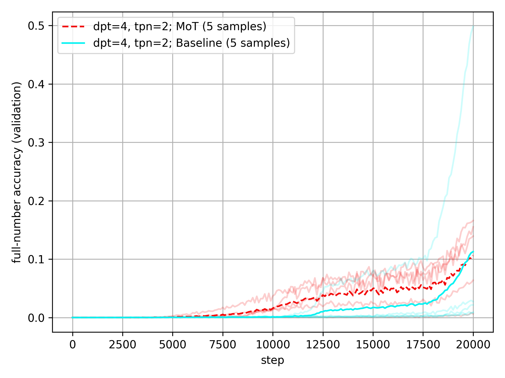

The Baseline experiences one crazy outlier that pulls its mean way up, while the MoT actually experiences one outlier that pulls its mean down a bit. I don't think that these outliers are very meaningful&mdash;they are just winning lottery tickets&mdash;and so the median values are a better measure of the trends. I will still include the mean values in all plots, though.

### Heatmap of final full-number accuracy

To see the trends in the final full-number accuracy more clearly, we can look at the accuracy of the MoT relative to the Baseline; in other words, the Mot-accuracy divided by the Baseline-accuracy.

Here are these numbers (mean over five runs per setting):

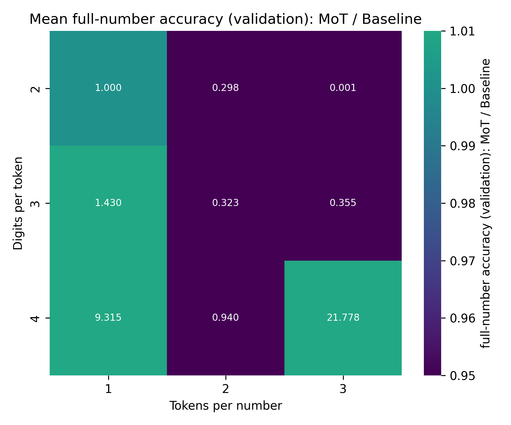

As you can see, the difference in final accuracy is quite pronounced. There is one outlier: at `dpt=4`, `tpn=2`, the MoT is unexpectedly worse than the Baseline. However, this is caused by a single outlier run. Looking at the median over the five runs, we can see the same pattern described above:

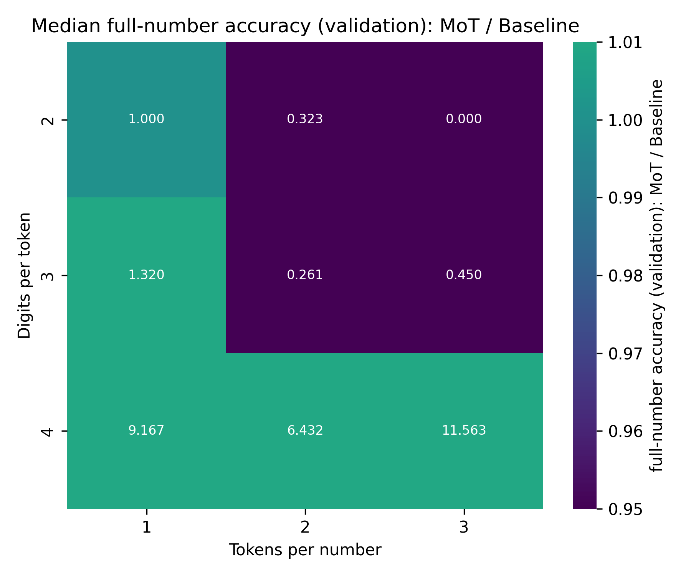

### Accuracy over expected number each token and equation is seen in training

There are two factors I want to look into more closely:

1. If there are many possible tokens per number&mdash;`tpn` is large&mdash;then the MoT might be able to outperform the Baseline simply because the digit embeddings will be seen much more often and thus be more well-trained, while the tokens will be poorly trained.
2. If there are many possible equations per token&mdash;`dpt` and `tpn` are large&mdash;then the models need to generalize addition in order to achieve high accuracy. If, on the other hand, each possible equation is seen once or more during training, then good accuracy on test can be trivially achieved by memorization.

For each metric, I again take the mean over the five runs per setting.

To do a proper analysis of these patterns, it is helpful to look at the raw data:

| dpt | tpn | times tok. seen | times eq. seen | mean val acc (MoT) | mean val acc (Baseline) | median val acc (MoT) | median val acc (Baseline) |
|---:|---:|---:|---:|---:|---:|---:|---:|
| 2 | 1 | 10,240 | 51.2 | 1.0 | 1.0 | 1.0 | 1.0 |
| 2 | 2 | 40,960 | 25.6 | 0.122 | 0.409 | 0.122 | 0.377 |
| 2 | 3 | 61,440 | 11.378 | 0.0 | 0.111 | 0.0 | 0.006 |
| 3 | 1 |  4,096 |  2.048 | 0.999 | 0.699 | 1.0 | 0.757 |
| 3 | 2 | 20,480 |  1.28 | 0.155 | 0.481 | 0.161 | 0.616 |
| 3 | 3 | 61,440 |  1.138 | 0.156 | 0.439 | 0.094 | 0.209 |
| 4 | 1 |  2,048 |  0.102 | 0.999 | 0.107 | 0.999 | 0.109 |
| 4 | 2 |  8,192 |  0.051 | 0.106 | 0.113 | 0.139 | 0.022 |
| 4 | 3 | 12,288 |  0.023 | 0.029 | 0.001 | 0.016 | 0.001 |

A few observations:

- The MoT seems to outperform the Baseline more strongly when tokens are seen rarely.
- The performance of the MoT relative to the Baseline depends heavily on the number of times each equation is seen, and the number of digits per token.
- The MoT model outperforms the Baseline whenever equations are seen fewer than one time, and underperform otherwise, with the one exception of `dpt=3` and `tpn=1`, where the MoT outperforms the Baseline despite each equation being seen, on average, more than once.

These three facts make me believe the following:

- The MoT probably helps make up for undertrained tokens (though this relationship might also be an artifact of the task complexity and ease of memorization).
- When the baseline outperforms the MoT, it is to a large degree it is better at memorizing equations. This might be due to the additional parameters, or the architecture itself.
- Access to digit-level information helps models generalize. The MoT works well.

One concern that might come is that most real tokenizers use `dpt=3` at most. However, I believe that this does not lessen the positive takeaways of these results: In reality, the MoT isn't only applied to math, and even where it is, it won't just be two-number addition. This mean that what's important is that the MoT is better in domains where memorization doesn't work, and that's what the results suggest. (On a related note, I expect this to be especially relevant for reasoners / test-time-scaling methods)

## Heatmap of L1 distance to ground truth result

The full-number accuracy is a good metric for seeing how well a model performs on math. However, there is the possibility that model A will have 50% accuracy, but in the 50% of cases where it is wrong, it is extremely wrong, while model B will have only 30% accuracy, but be very close to the correct answer in the other 70%.

The latter would point to a model that generalizes well, but hasn't memorized results much. It also points to a model that would rapidly improve with some more training data, as opposed the former option.

To measure this, I will plot the L1 distance to the ground truth result.

Here is the heatmap of the mean of the last L1 distance to the ground truth result over 5 attempts each; specifically, the MoT-L1 distance divided by the Baseline-L1 distance (lower means that the MoT is better):

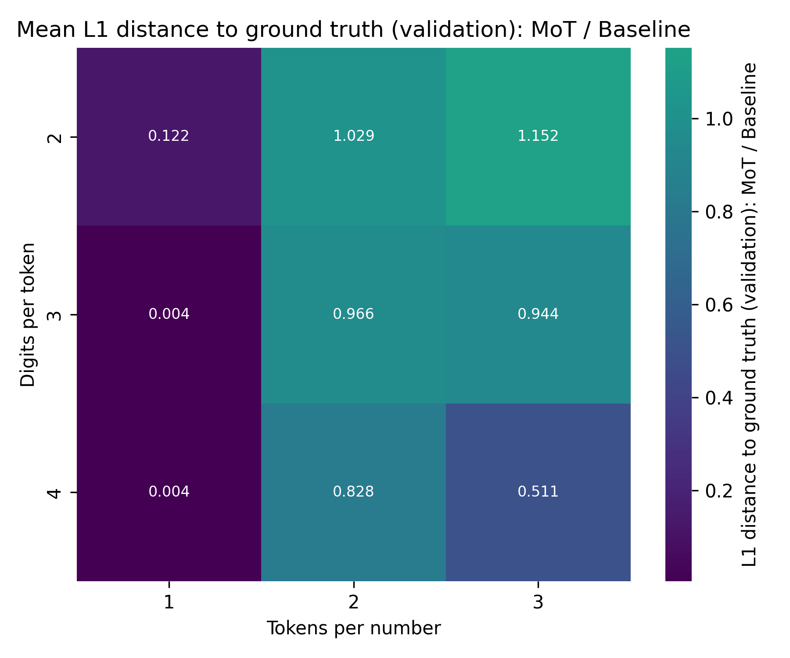

The MoT is much better than the Baseline here! Even for `dpt=3`, `tpn=2` and `tpn=3`, where the Baseline achieves significantly higher accuracy, the MoT has a lower L1 distance to the ground truth result. This further supports the hypothesis that the MoT is better at generalizing.

For completeness, here is the same plot for the median:

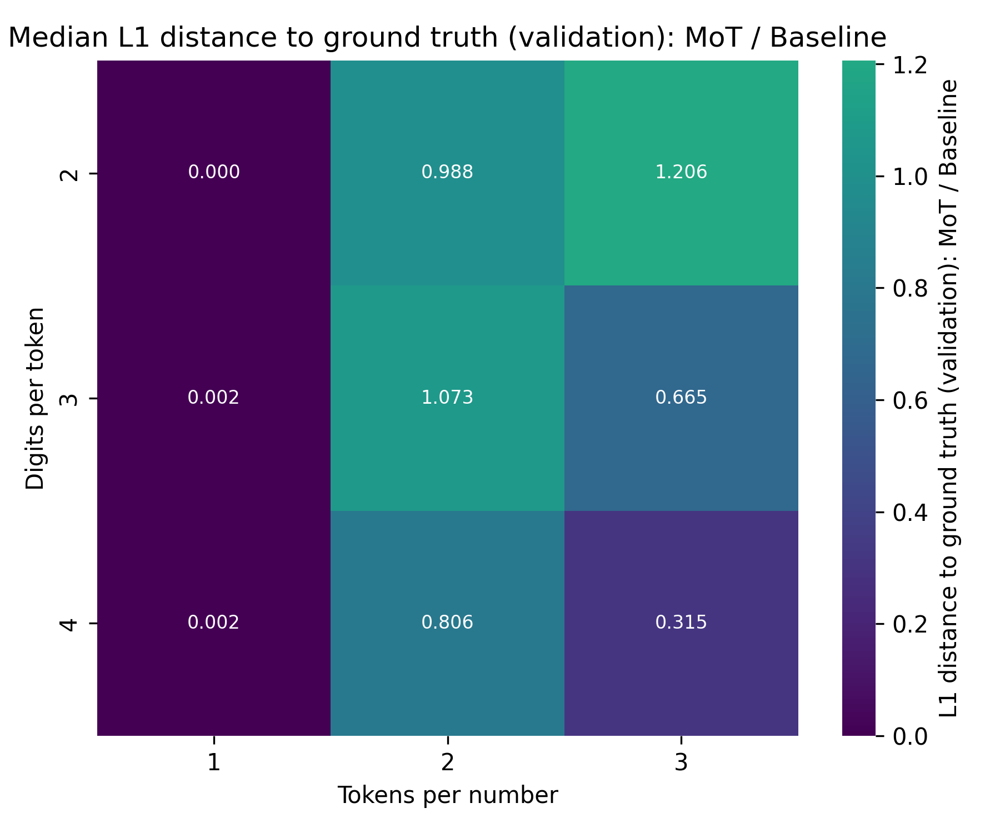

It shows very similar results.

## Discussion

The MoT outperforms the Baseline where it matters: in regimes where memorization doesn't work.

This is:

- Not from memorization
- Likely not from undertrained tokens
- Maybe from seeing lack of interaction between specific tokens

And thus, I would call these experiments highly successful.

Of course, I need to stress again that these results are preliminary, from tiny models, and on limited and very specific data. Why do I believe that the results will generalize?

1. There is plenty of work showing that byte-level models can work very well (and digits are just specific bytes).
2. In contrast to those, the MoT still uses tokens, which means that it is much closer to a normal transformer&mdash;especially in this setting, where the outputs are tokens, not bytes.

## Next steps

There are two directions of future work.

First off, [Nick Ryan](https://x.com/nickcdryan) and [stochasm](https://x.com/stochasticchasm) are working on finetuning and evaluating Llama-1b. Updates will follow.

As for the math-work, I want to try to train models to produce digit-output in addition to taking digit-inputs. I have two designs that I want to try out:

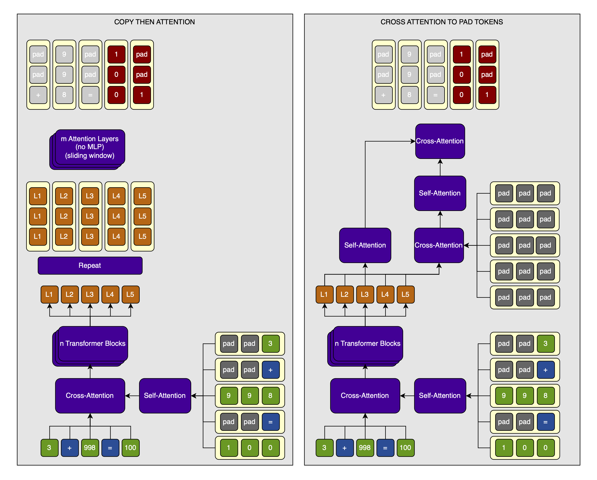

1. Do what I did above, but instead of decoding the hidden states into tokens, I copy them `dpt` times each so that I get a much longer sequence. Then, I run one or more attention layers on this sequence and decode into digits, which I train against. I won't use an MLP on the digits to avoid running that many parameters over the now much-longer sequence (this is an important point of the whole MoT design).
2. Initialize output digits to the `<pad>` embedding. Then, incorporate the output hidden states of the token transformer into the digits using cross-attention. After each cross-attention step, run self-attention over both the token-level-hidden-states and the digit-level-hidden-states. This self-attention can have a sliding window for efficiency, though I likely won't implement it for these very short sequences, exactly like I did for the inputs.

Additionally, I want to try the following two experiments:

1. Use multiplication, not just addition.
2. See if the models generalize to larger `dpt` and `tpn` settings.

I have further ideas for future experiments (though I give no guarantee that I will ever actually perform any of these):

- I might experiment with turning this into multi-token prediction by simply decoding each token-level hidden-state into `n * dpt`.
- Scale up the models.
- I might compare left-padding to right-padding.
- I might compare token- to digit-embeddings. Maybe there is even a way to tie the digit-embeddings to the token-embeddings? After all, each digit has a corresponding token.
- Try to implement a sliding window self-attention for the digit-embeddings. I'm not sure if short sequences like in two-digit addition are the right setting for this, though.

Updates for these will be forthcoming.

## Citation

```bibtex
@misc{snimu2025motmath,
    title={Mixture of Tokenizers &mdash; Performance on addition},
    author={Sebastian M\"uller},
    year={2025},
    month={jan},
    url={https://github.com/snimu/blog/blob/main/contents/mixture-of-tokenizers-math/article.md},
}
```
