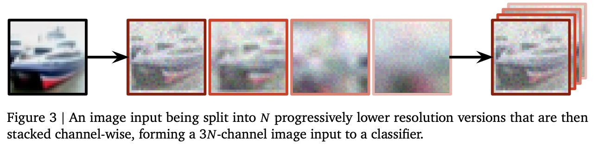
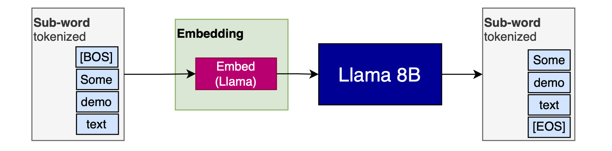
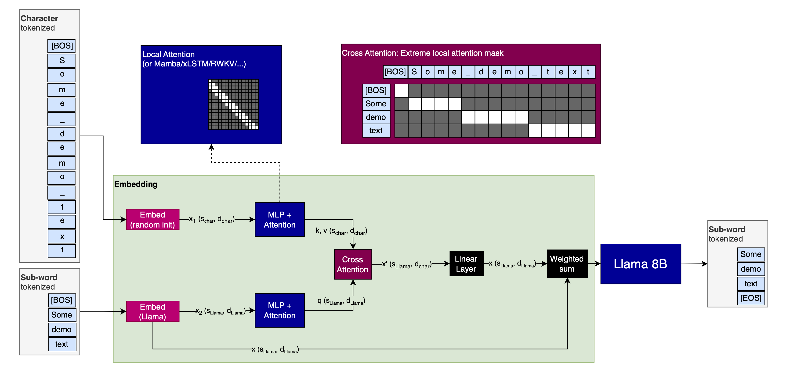
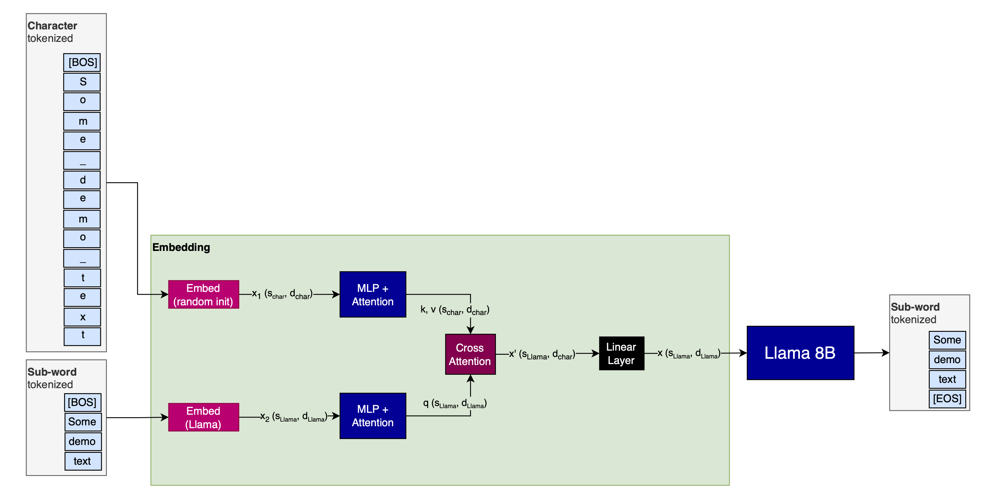
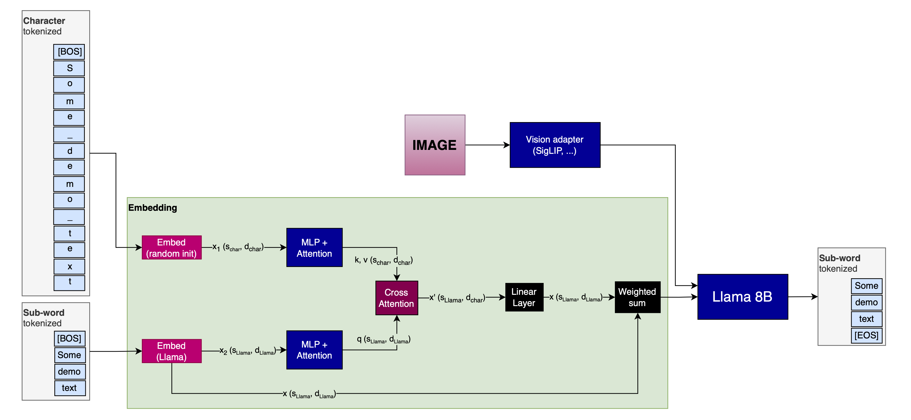
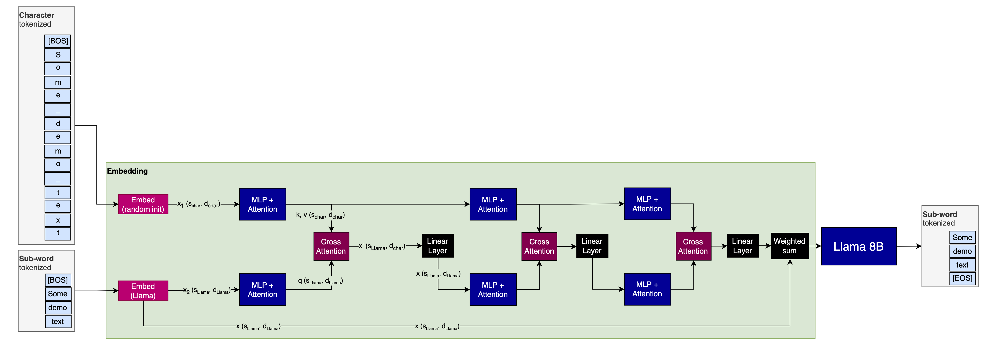

# Mixture of Tokenizers (proposal)

Tokenization causes many issues in LLMs ("how many Rs are in strawberry?", "which is larger, 9.11 or 0.9?").

Stanislav Fort and Balaji Lakshminarayanan use a mixture of image resolutions to improve adversarial robustness of image models in ["Ensemble everything everywhere: Multi-scale aggregation for adversarial robustness"](https://arxiv.org/abs/2408.05446). Here, I will propose a similar approach for tokenization in LLMs, with very little additional costs. I will also propose a way to test it.

## Background: Ensemble everything everywhere

"Ensemble everything everywhere" works on CNNs for images. One part of their pipeline making CNNs more adversarially robust is using the same image at different resolutions as the input:



This is one important technique that enables adversarial robustness in CNNs, without explicitely training them for it.

 We can do the same for tokens.

## Seeding embeddings with character-level information

Here is how a regular Llama model (used for illustration) uses embeddings:



A sub-word tokenizer is used to split the input, then the tokens are embedded using the pre-trained Llama embeddings.

Here is my proposal:



### Why would that work?

The idea is to seed the sub-word tokenizer embeddings with character tokenizer embeddings. I hypothesize that this will have two advantages:

1. Provide the model with more diverse "views" of the input, just like for images in "Ensemble everything everywhere"
2. As a special case of this, enable the model to auto-fix tokenization issues. 
   This should work because many tokenization issues are either due to undertrained tokens&mdash;which won't apply to character-level tokenizers, because their dictionary is so small that the embedding model is assured to see every possible token multiple times during training&mdash;or due to splitting up of text into inconvenent chunks&mdash;which is especially bad for math, but wouldn't apply to character-level tokenizers


### Isn't this very inefficient?

No. This seeding of the embeddings could be done very efficiently, for the following reasons:

- While the Attention operation following the character-level has to work with a large sequence-length ($s_{char}$),
  it can likely be done with a very local Attention window, which is very efficient.
  Alternatively, it could use a State-Space Model (SSM) like Mamba, RWKV, xLSTM, Griffin, or any of the dozens of others that are available.
- The cross-attention can similarly use very local,
  potentially only covering one sub-word token at a time (with the corresponding characters)
- The embedding dimension of the character-level branch of the model ($d_{char}$)
  can likely be made much smaller than that of the sub-word branch ($d_{Llama}$).

### What does the 'residual' connection from the Llama embeddings to the Llama model do?

If I trained a model from the ground up with this technique, I wouldn't use this residual.

However, to test the method, I would prepend the shown setup before Llama, start with it having a minimal impact on the Llama input, then slowly ramp it up over training. If we call the character-seeding part of the model (up to and including the cross-attention) $m_{seedind}$ and the Embedding model for Llama $e_{Llama}$, then I would linearly ramp the parameter $\alpha$ in the following equation over trianing:

$$x_{Llama} = (1 - \alpha) \cdot e_{Llama}(x) + \alpha \cdot m_{seed}(e_{Llama}(x)) $$

(This is sloppy notation, I know; it's just meant to get the point across. Orient yourself on the provided images.)

Again, **this is how I would test the method!**

### What about inference?

I would leave the residual connection away during inference, after I've ramped $\alpha$ to $1$ during training:



### Could this theoretically be turned into an image model?

Sure, just project the image-embeddings (however you generate them) directly into the Llama model:



## Variations

There are a few ways to vary the ideas presented above.

### Use $d_{char}$ everywhere

It is likely sufficient to use $d_{char}$ instead of $d_{Llama}$ in the sub-word branch, too. Then, you would only project up to $d_{Llama}$ with the one Fully Connected Layer before the actual Llama model (which you have to do anyway).

This layer then effectively serves as the Embedding model, except that its inputs are more semantically rich.

This would serve as an efficency improvement, likely at low to no performance cost.

### More tokenizers

You can always use more tokenizers.

One possibility is to use a byte-level tokenizer in addition to the others (though that would make attribution to inputs harder and less humanly interpretable).

Another possibility is to use several sub-word tokenizers, tuned for different languages, and project the embeddings of all into the ones that yield the shortest sequence length. This would yield language-specialization; and it would likely yield significant efficiency improvements, because the sequence length that the entire LM backbone is working on would be shortened.

### More layers

Instead of just one layer of MLP + Attention + Cross Attention, you could have several. I have no intuition for whether or not this would yield significant performance improvements.



### Different backbones

I've only used Llama as an example for how this could look, and how I would test the method. However, it should work just as well on different Transformer backbones. I also see no reason for what this shouldn't benefit non-Transformer architectures. And finally, it should of course be fairly simple to pre-train a model using this technique from the start (if you have that kind of budget).

## Citation

To cite this article, please use the following BibTeX entry (or adapt it similarly):

```latex
@misc{mueller2024mixtureoftokenizers,
    title={Mixture of Tokenizers (proposal)},
    author={Sebastian M\"uller},
    year={2024},
    month={sep},
    url={https://github.com/snimu/blog/blob/main/contents/fixing-tokenization/README.md}
}
```
