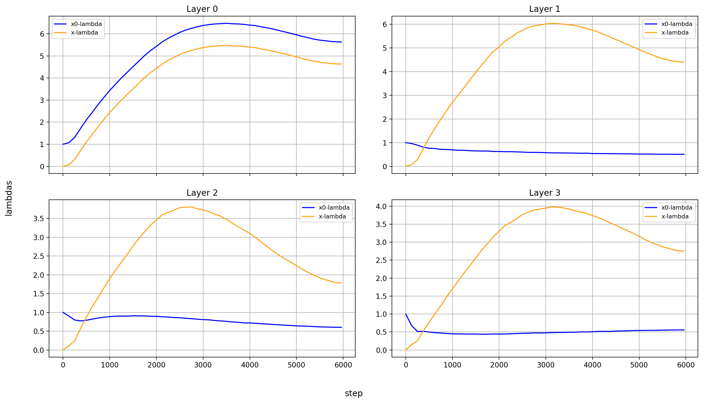
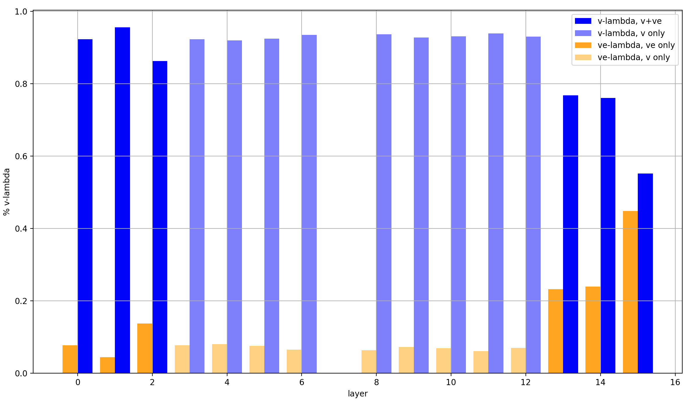

# modded-nanogpt: Looking at value embedding lambdas, U-Net lambdas, and x0-lambdas

The [modded-nanogpt](https://github.com/KellerJordan/modded-nanogpt/tree/master) [medium-track](https://github.com/KellerJordan/modded-nanogpt/blob/master/train_gpt_medium.py) makes use of multiple tricks to improve performance, which rely on learned scalar values&mdash;the lambdas&mdash;for mixing two vectors:

- U-Net: at three points in the model, the residual is modified by an earlier value of the residual via a weighted sum
- X0-Mixin: At every layer, after the U-Net skip (if it occurs at that layer) but before Attention and the MLP, the current residual and the original input embeddings are mixed in a weighted sum
- Value-Embeddings: In each Attention layer, value embeddings (extra embeddings of the input tokens) are added to the Value vector before the actual Attention operation is applied

I have measured and plotted the weights of these weighted sums. In this article, I will go through all three tricks, first explaining them shortly and then plotting the learned lambdas over training, and over the layers where it makes sense. I find several interesting phenomena, like how much the impact of middle layers is suppressed, or how the lambdas are connected to the learning rate and sequence length schedules.

> Warning: these are all from a single training run, so variations are possible.

This is for the code as of August 9th, 2025, corresponding to [this record log](https://github.com/KellerJordan/modded-nanogpt/blob/master/records/042225_GPT2Medium_Record8/075_640429f2-e726-4e83-aa27-684626239ffc.txt).

## U-Net Lambdas

The model mixes the activations at position `a` into those at the later position `b` in the following way: `x_b = x_b + lambda_ab * x_a`.

These U-Net lambdas shorten the gradient path from the output to the input (they are residual connections skipping multiple layers), and are initialized to 1.0, which means that the model is initialized to have a short effective depth (or more accurately, that the middle layers contribute fairly little).

In a way, the value of the U-Net lambdas is a skip percentage. If a lambda is at 1, the layers that it crosses are skipped by 50%; if they are 0, they are skipped 0%. I'm sure that there are also different ways to look at these lambdas, but this is the most intuitive way to me.

The following layers are connected:

- 2 &rarr; 11
- 4 &rarr; 10
- 6 &rarr; 9

This makes for three scalar values that are optimized for the entire model. Here is their development over the course of training:

I find it interesting that the amount of layer-skipping at the end of training is still very significant:

- Layers 0-2 and 11-15 are never skipped (by design)
- Layers 3-10 are skipped by ~0.4 / 2 &rarr; 20%
- Nested within them, layers 4-9 are skipped by 0.5 / 2 &rarr; 25%
- And then among those, layers 6-8 are skipped by ~0.3 / 2 &rarr; 15%

The middle layers contribute relatively little to the output! Of course, that can be made up for by scaling the norm of the middle-layer outputs (which I unfortunately didn't measure), but my guess is that it's meaningful.

## X0-Lambdas

At every layer of the model, there are two scalars used for mixing the input embeddings `x0` into the residual stream in a weighted sum: `x = x_lambda * x + x0_lambda * x0`.

I don't fully understand the purpose of this modification to the standard transformer architecture. It definitely makes for a very short gradient path to the input, and also provides a gradient to the input embeddings from every layer, speeding up their training. In the backward pass, the layers effectively act as data augmentations to the gradient, which allows for longer training with the same data and will thus be helpful for updating the embeddings. But I don't feel like that's the full story.

I have recorded the x0-lambdas for all layers over the entirety of training. Plotting all of these is very ugly, so here for my main plot I only show the final value of the x0-lambdas over the model's layers, normed so that they sum to 1 (because we care about their relative weight):

I can see three points of interest:

First, the lambdas are almost identical in layer 0. That makes sense, because in layer 0 (and only in layer 0), `x == x0`.

Secondly, at layer 8, the sign of the `x_lambda` is flipped. To reach this point, it has to cross 0! So at some point in training, layer 7 is almost completely ignored. Note the interaction with the U-Net lambdas: layers 7, 8, and 9 are skipped pretty strongly anyway, so the computation from previous layers isn't ignored even when the `x_lambda` were 0 at some point.

What is also interesting is that the x0-lambda is noticeably higher in layer 8 than in the other layers (except for the last). That may be chance, but it may also be a result of a specific architectural decision: layer 7 doesn't contain an Attention layer, only the MLP. This weakly suggests that layer 7 contributes less to the model than the other layers, and is thus overwritten more strongly with x0.

Lastly, the last layer has a very large x0-lambda, almost 80% of the input to layer 15 consists of the input embeddings (which is again achieved by the x-lambda crossing 0 and becoming negative). That makes view the final calculation as a simple embeddings calculation, like the stereotypical "king - man + woman = queen"; the transformer simply calculates the difference between the input and target embeddings. That is a common view of transformers, but it's accentuated in modded-nanogpt.

It also reveals a second purpose of the x0-lambdas: they allow the model to compare the residual&mdash;meaning, in abstract terms, the vector it plans to add to the input embeddings&mdash;to the input to which it will be added, and adjusting accordingly. That's a bit imprecise, but it helps my intuition. It reminds me of the [Hierarchical Reasoning Model](https://arxiv.org/abs/2506.21734), where (a function of) x0 is regularly used to guide the generations of the main model.

---

Now, let's look at the x0-lambdas over the layers *and* over the course of training.

First the normalized values:

What immediately jumps out to me is that the lambdas develop very smoothly in all layers *except* in layers 8 and 15. But of course, this irregularity just comes from the `x_lambda` crossing the 0-point. More interesting is that the `x_lambda` first grows relative to the `x0_lambda`, before dropping off a cliff and crossing over into negative territory.

It's also curious to me that the crossover into negative values happens so late in training. In a static setting, I would say that inverting the sign of an activation isn't a huge deal, because this can be made up for with the weights. But in this case, the weights were adapted to a positive `x_lambda` most of the training run. In that case, inverting the sign *is* meaningful, and it reminds me of embeddings-math again.

For this, it's also very important that both crossovers happen at the same time, so the two mostly make up for each other. The effects of the crossover of `x_lambda` to negative values are therefore twofold:

1. The interaction with x0 changes
2. At layers 8 and 15, the impact of x falls to 0 and then rises again

It's also noteable that layer 14 is the only other layer in which the impact of x0 exceeds the impact of x at the end of training. It's especially interesting because that's how it starts, but for a large part of the middle of training, the inverse is true.

A third phenomenon is that the impact of x rises over most of training, and then falls again at the end, *in every single layer* but the first (where it doesn't matter). This tends to happen earlier than the crossover of `x_lambda` into negative values in layers 8 and 15.

I wonder how these dynamics are connected to the learning rate schedule and the sequence length schedule (modded-nanogpt uses a block mask that increases in size over the course of training). So here is a plot of the learning rate and sequence length, relative to their absolute values (so normalized to between 0 and 1):

The learning rate is constant for the first ~2000 steps, then falls linearly to 0. The sequence length rises to half its maximum in the first ~2000 steps, then remains constant for ~2000 steps, before rising again in the last ~2000 steps.

And that is indeed very meaningful!

- The impact of x stops rising relative to x0 right around the time when the learning rate begins decaying, and the sequence length becomes constant
- In layer 14, x0 becomes more important than x right after the sequence length begins increasing again
- The `x_lambda` crossover happens shortly after that, which makes it look like it is also connected to the sequence length schedule

Especially the second and third point are curious to me. Is the solution for dealing with sequence length extension to focus more strongly on x0?

I don't know how meaningful these are, and how consistent they happen over different training runs, but the close relationship between hyperparameters and x0-lambdas make me think that there are real phenomena here.

Now let's look at the absolute values:

One interesting phenomenon is that the early layers tend to have higher absolute values than the later ones, so the impact of early layers is accentuated beyond the U-Net connections. Taking the U-Net connections into account, this means thats the effective model depth is shortened again, and middle layers add their algorithmic complexity in more subtle ways.

But it might also be connected with the [value embeddings](#value-embeddings-lambdas), which are applied to the first and last three layers. High x- and x0-magnitudes in the first three layers suppress the relative impact of the value embeddings, while low magnitudes in the last layers will keep them high. But let's re-visit this later.

Layers 8 and 15 are the layers with the lowest `x_lambda` and `x0_lambda`. I'm not sure what that means, just wanted to point it out.

## Value-Embeddings Lambdas

The value embeddings are embedding layers beside the one that forms x0. Their embeddings are added to the Values in the causal self-attention block right before flexattention is applied: `v = ve_lambdas[0] * v + ve_lambdas[1] * ve.view_as(v)`

However, that is only the case in the first and last three layers. In between, only `ve_lambdas[0]` is used to scale the Values, while `ve_lambdas[1]` remains unchanged over training. And at layer 7, there is no attention, so there are no such lambdas.

To add more complexity, the value embeddings of the first and last three layers are shared; so layers 0 and 13, layers 1 and 14, and layers 2 and 15 share the same value embeddings. This saves parameters and ensures that there is a short gradient path from the loss to the value embeddings. While additional gradient comes from the first layer which are the farthest away from the input, there is always gradient from the three layers nearest to the loss, too.

I admit that I only have some very weak intuitions for why value embeddings help. I've long held that token embeddings are a way to hold training-set wide statistics about the byte-sequence represented by the token, so I'm guessing that they add a way for the model to store more static per-token statistics which are helpful. However, that's 100% speculation and you shouldn't take it too seriously, I'm just "thinking aloud" (in my writing).

I will again plot the final values of these lambdas over the layers; however, this time both the absolute and the relative values are of interest. The absolute values are specifically interesting for the layers in which there are no value-embeddings, but the v-lambda is sitll used to scale the values. The normed values are particularly interesting (at least in my eyes) for the layers where values embeddings are applied, and we want to see how strongly they are mixed in relative to the values.

So here is the plot with the absolute values:

Some observations about the layers without value embeddings:

- The model really likes to scale the attention-values by around 6-7
- There seems to be a trend to do this more strongly in the later layers, but it's weak and I don't know if it's meaningful
- The ve-lambdas at these layers of course stay unchanged throughout training, because they are never used

Some observations about the layer with value embeddings:

- The v-lambdas always increase, though not as much as without value embeddings
- The ve-lambdas stay very low, except in the last layer
- The ratio of v-lambdas to ve-lambdas is much higher in the first than the last layers; the value embeddings seem to have little impact on the first few layers (numberially, they could still stabilize training, or add just enough to make a difference, or whatever)

To make more sense of that last point especially, let's look at the normalized ve-lambdas:

Three clear groups emerge:

1. Layers 0-2, which are affected very weakly by the value embeddings (by only around 10%)
2. Layers 13 and 14, which are affected fairly strongly by the value embeddings (by around 25%)
3. Layer 15, which uses its value embeddings almost as strongly as its input from the residual stream (with around 45% intensity)

The last point is very interesting, because as we saw before, the last layer already mixes the original embeddings into the residual stream at its input with about 50% magnitude. That's a lot of fixed values that don't depend on the token-order at all!

Finally, below you can expand a section to see the full details over training, for those who like to look at plots all day.

Per-layer ve-lambdas over training

First the normalized values:

And, for the sake of completeness, here are the un-normed values:

## Summary

I've ran the modded-nanogpt medium track training once (so don't overindex on this) and plotted all the scalar values that are being trained. Hope you enjoyed.
