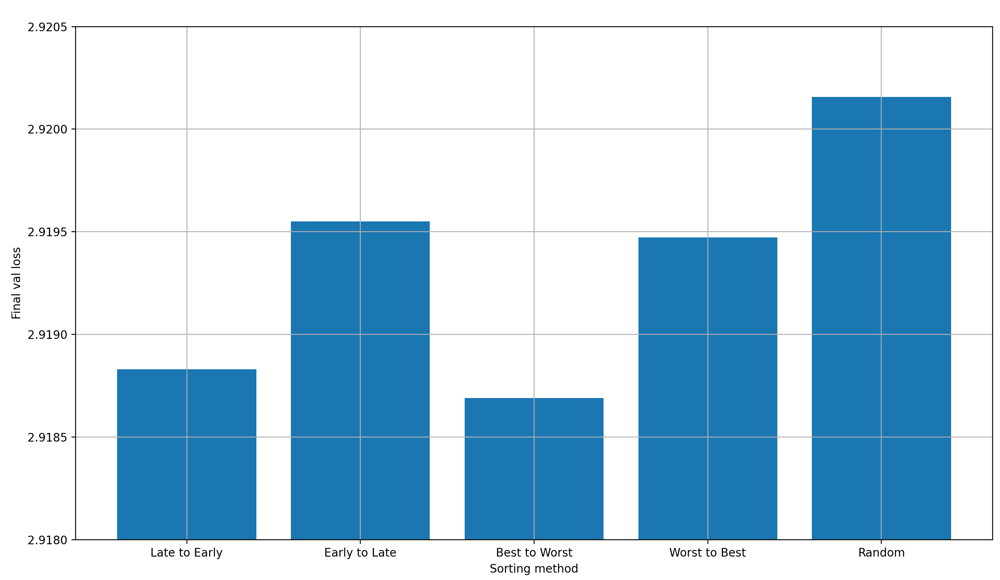
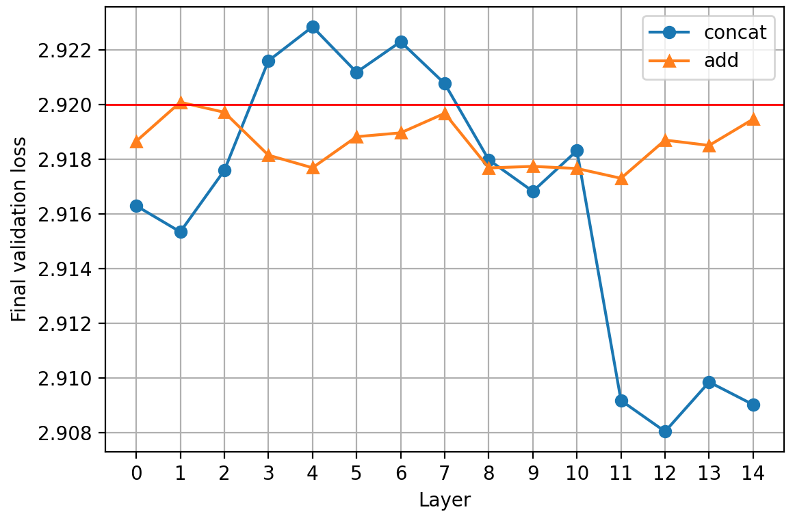

# modded-nanogpt medium World Record: Reusing intermediate activations in the output latents

I have a new world record for the modded-nanogpt speedrunning medium track (as of yet, inofficial).

It is achieved by summing the output of layer 11 to the output latents in a learned, weighted sum, which leads to a separation of concerns for early model layers: it enables them to focus only on providing context to the next layer, while not directly impacting the final prediction, because their impact has actively been removed.

This article will describe that record, as well as multiple other experiments. The record can be viewed at [PR#139](https://github.com/KellerJordan/modded-nanogpt/pull/139).

## The record

I will present the record in three steps: (1) reproducing the baseline results, (2) explaining the architectural change made to produce the record results, and (3) showing the record results.

### Baseline

The baseline comes from [PR#137](https://github.com/KellerJordan/modded-nanogpt/pull/137). I re-ran the code for 5 runs and got the following results:

- Mean final validation loss: 2.9191
- Mean time: 1393.16 seconds ~= 23.22 minutes
- T-test p-value: 0.01194797508928048

So after only 5 runs, we can be ~98.8% sure that the mean loss over an infinite number of runs would be below 2.92, our target loss.

### Record - Technique

I simply added the output of layer 11 (the 12'th layer) to the output of the final layer (layer 15, or the 16'th layer), in a weighted sum. This just means that right before applying the language head, I do this:

```python
x = norm(x) * x_lambda + norm(skip_connections[11]) * skip_lambda
```

Some details:

- `skip_connections` contain the output latents of each layer, at the corresponding position
- `x_lambda` and `skip_lambda` are learned scalar values; the former is initialized to 1.0 and the latter to 0.0, and both are actively optimized over the course of training

### Record - Results

Doing this allowed me to reduce the step count from 5590 to 5550, which lead to the following results.

These are the resulting final validation losses over 10 runs:

```python
[2.919485, 2.918384, 2.918878, 2.918476, 2.920099, 2.919609, 2.918705, 2.91872, 2.919772, 2.918594, 2.917798, 2.919295, 2.920676, 2.919743, 2.920052, 2.919843, 2.920081, 2.919675, 2.919486, 2.919177, 2.919529, 2.919678]
```

And here are simple stats about the final validation loss over these 10 runs:

- Mean: 2.9194
- Std: 0.00069
- P-value: 0.0001256

Now here are the corresponding run times:

```python
[1384.256, 1384.324, 1384.185, 1383.412, 1392.184, 1392.305, 1383.552, 1383.785, 1383.811, 1383.785, 1383.434, 1383.753, 1383.082, 1383.284, 1383.827, 1385.682, 1383.579, 1383.422, 1383.467, 1385.108, 1383.398, 1384.058]
```

And here are some simple stats about the times:

- Mean: 1384.6224 seconds ~= 23.08 minutes
- Std: 2.5382 seconds

This is a reduction in final run time of ~8.54 seconds.

### Lambdas

We don't just perform a sum between the outputs of layers 11 and 15, but a weighted sum; and those scalar weights are learned. So what values do they take?

Here are the mean final lambdas over the course of 22 runs, rounded to 3 digits:

- Layer 15 (`x_lambda`): 0.802
- Layer 11 (`skip_lambda`): -0.279

This all but confirms a hypothesis by [Larry Dial](https://github.com/ClassicLarry) which he shared in a [comment](https://github.com/KellerJordan/modded-nanogpt/pull/138#issuecomment-3362739273) in the first PR I made about this record (which I closed to re-open a new one, because the first one was sloppy). His hypothesis is this (in my own words):

The main job of each layer but the last is to provide context for the next layer, so that this layer can do its job better. But each layer output is also present in the final output latents, due to the residual stream. Thus, it directly impacts the final prediction, and the layers all perform the dual jobs of providing context and making a prediction, which might not always be the same.

The final lambdas in these experiments are evidence for that hypothesis: the output of layer 11 is actively removed from the residual stream after layer 15, which should allow layer 11 to only focus on providing context to layer 12. This improves the final performance; and therefore, the lack of a separation of concerns for layer 11 was previously a problem.

Let's see how the lambdas develop over the course of training, showing the lambdas for all runs, and their means:


Two things become very clear:

1. The lambdas develop to the same final values very reliably
2. They develop in a very smooth fashion over the course of training

### Norms

Before my record, `x` was RMS normed right before applying the language head:

```python
...  # apply the layers
x = norm(x)
...  # apply the language head
```

I created an adapted version, in which I multiply `x` by a scalar value before decoding it:

```python
...  # apply the layers
x = norm(x) * x_lambda + norm(x_skip) * skip_lambda
...  # apply the language head
```

One potential issue is that the lambdas can grow arbitrarily large, leading to output latents that are effectively un-normed. Since norming the output latents helps model performance, this might be an issue. Theoretically, the language head should be able to just learn to incorporate the constant factor from the lambdas and be fine, but sometimes learning dynamics are weird and don't work out like that.

So I tried the following:

```python
...  # apply the layers
x = norm(norm(x) * x_lambda + norm(x_skip) * skip_lambda)
...  # apply the language head
```

But it made no difference at all, so it's fine to leave out this last norm. If anything, it made performance worse; but only very, very slightly, which means nothing when done for a single run, so I wouldn't take that too seriously.

## Why I chose layer 11

I chose to add layer 11 to the output latents because I performed a simple ablation where I tried each layer output once (except for the last one, because why would I add the last layer output to the last layer output?). Be aware that I performed these ablations with the previous record's step count of 5590, not the new record's step count of 5550 steps, so the final losses are lower than for the actual record. It showed the following curve:


All but layer 1 (the second layer) reduce the final validation loss, but layer 11 (the 12th layer) reduces it the most, so I chose it.

One possible explanation for why that is has to do with another aspect of the modded-nanogpt architecture: there are skip-connections between these layers: 6&rarr;9, 4&rarr;10, and 2&rarr;11. This means that at layer 11, we effectively pass (a weighted sum of) two layers to the output, which are very far apart. Additionally, layers 9 and 10 immediately preceed layer 11, and both offer signal from multiple layers as well. Substracting the layer 11 outputs thus effectively substracts the contributions from multiple layers.

## Adding more than one layer output

After the success of skipping to the output from a single layer, I of course tried to skip multiple layers to the output.

### Setup

I tried skipping from 2 to 13 layers to see any possible trends.

Because it might be important to the final performance to choose carefully from which layer we should skip, I performed the ablations for each of the following ways to choose which layers to skip from given some number of layers `N` to skip from:

- **Best to Worst** &mdash; I took the results from [the previous section](#why-i-chose-layer-11) and sorted the layers from the best to the worst the final validation loss. So if `N=2`, then we choose the layers 11 and 10; if `N=5`, it's 11, 10, 8, 4, and 9; and so on
- **Worst to Best** &mdash; The inverse of Best to Worst; so if `N=2`, we choose layers 1 and 2; if `N=5`, we choose 1, 2, 7, 14, and 6; and so on
- **Early to Late** &mdash; Pick the layers in the order of a forward pass (0, 1, 2, ...)
- **Late to Early** &mdash; Pick the layers in the order of a backward pass (14, 13, 12, ...)
- **Random** &mdash; Randomly pick `N` layers without replacement (so no picking the same layer twice)

"Best to Worst" and "Worst to Best" might tell us something about how well final performance when adding multiple layers can be predicted from the final performance of skipping a single layer. "Late to Early" and "Early to Late" will give us information on how the final performance is impacted by the layer position. Finally, the "Random" case gives us some signal on how the final performance depends on the number of layers, independent from the layer choice (though since we only perform a single run per `N`, the signal is pretty weak).

As `N` increases, the chosen layers have higher and higher overlap, so the agreement between the different modes at `N=13` will tell us something about the level of noise inherent in the experiments.

### Experimental results and Analysis

Let's first plot the final validation losses over the sorting method:



We can clearly see that the sorting method matters significantly:

- "Best to Worst" is best. This is nice, because it means that the performance of a single-layer-skip is predictive of the performance of a multi-layer-skip with a given set of layers to skip from
- "Worst to Best" is much worse than it. However, surprisingly, it is still better than two other settings: "Early to Late" and "Random". This means that there is more to the optimal ordering of layers than just the single-layer-skip performance
- "Late to Early" is almost as good as "Best to Worst", which is a good indication that late layers are better for skipping than early ones. This could again be explained by the 6&rarr;9, 4&rarr;10, and 2&rarr;11 skips that are already in the model
- "Early to Late" supports this trend, because it's much worse; slightly worse even than "Worst to Best"
- "Random" is by far the worst option, which I find slightly confusing. Shouldn't it be average?

My main takeaway from this is that most likely, it is better to add layers to the output latents which are already close to them (though the architecture quirks of modded-nanogpt make me hesitant to generalize that statement too much). To confirm, let's plot the final validation loss over the mean distance of the skip-layers to the output latents. To be clear, I don't distinguish between the different sorting methods in this plot.


There seems to be a strong trend for the final loss to increase as the skip-layer moves further away from the output latents, with the exception of the last two layers, which shouldn't be skipped to the output.

Let's look at another important candidate: how does loss develop as we increase the number of layers we skip from?


The main trend I can make out from this plot is that the results are fairly noisy (as expected from a single run per setting); especially when 13 layers are skipped to the output latents, there should be high overlap between them.

To be able to make out any trends, lets first average over all those values, to get the final validation loss over the number of skip-layers, independent of the layer-selection method:


If we drew a trendline into this plot, it would probably tilt downward with the number of layers. However, with the level of noise present in the plot, I wouldn't trust such a trendline, so I have to say that the number of layers skipped to the output seems to matter very little. I could be wrong about this, but that's at least what my limited data looks like.

And this makes some sense to me! Let's think back to [the previous section](#why-i-chose-layer-11); specifically, how layer 11 combines representations from layers 2 and 11. If we additionally assume that the layer representations are very similar between adjacent layers, then that explains why adding more layers together at the output latents doesn't really help: with layer 11, we already have a good representation of all the layers' outputs available for substraction.

I'd like to look more closely at this plot the individual layer-selection methods, one by one. Let's start with "Best to Worst" and "Worst to Best" first:


Observations:

- "Worst to Best" starts off worse than "Best to Worse", but catches up when adding enough layers
- Both methods seem to lead to worse results as the number of skipped layers is increased

The second point would somewhat make sense to me for "Best to Worst"&mdash;we are introducing worse and worse layers over time, so it's no wonder that the final performance gets worse&mdash;but that the same trend holds for "Worst to Best" is very confusing to me. I have no explanation for it other than "random noise", but that would mean that none of these plots mean anything. I don't know what it is.

Let's move on to "Early to Late" / "Late to Early":


This looks like the reverse trend to the "Best to Worst" / "Worst to Best" trend. I find that suspicious, but at least the trends are consistent between groups of selection methods: they are the same for "Best to Worst" and "Worst to Best", and for "Early to Late" and "Late to Early". That tells me that there may actually be something to this; though, again, I'd be careful interpreting the above plots too strongly.

Finally, let's look what happens when we randomly select the layers to skip:


This shows a very clear trend of reducing loss with an increasing number of skip-layers. This means that "Best to Worst" and "Worst to Best" are the outliers that buck the trend. I have no explanation for this.

### Is there another record here?

The central question for a modded-nanogpt speedrun is of course how quickly we can go below a loss of 2.92.

To find out, I printed the time and step at which the loss at first fell below 2.92. Since the validation loss is only measured every 125 steps, I interpolate the loss between the last loss above and the first below 2.92 to find the exact time and step at which the target loss was reached. Any run that doesn't go below 2.92 is filtered out.

```python
[
    {'num_layers': 10, 'method': 'Late to Early', 'time': 1384.278, 'step': 5463},
    {'num_layers': 11, 'method': 'Best to Worst', 'time': 1386.6597, 'step': 5470},
    {'num_layers': 2, 'method': 'Best to Worst', 'time': 1388.0197, 'step': 5469},
    {'num_layers': 8, 'method': 'Late to Early', 'time': 1388.2837, 'step': 5497},
    {'num_layers': 7, 'method': 'Late to Early', 'time': 1388.8235, 'step': 5506},
    {'num_layers': 7, 'method': 'Worst to Best', 'time': 1389.227, 'step': 5501},
    {'num_layers': 7, 'method': 'Best to Worst', 'time': 1390.0296, 'step': 5510},
    {'num_layers': 5, 'method': 'Best to Worst', 'time': 1390.2005, 'step': 5466},
    {'num_layers': 11, 'method': 'Random', 'time': 1391.732, 'step': 5483},
    {'num_layers': 10, 'method': 'Worst to Best', 'time': 1391.8183, 'step': 5489},
    {'num_layers': 12, 'method': 'Early to Late', 'time': 1392.233, 'step': 5486},
    {'num_layers': 4, 'method': 'Late to Early', 'time': 1392.3788, 'step': 5489},
    {'num_layers': 6, 'method': 'Best to Worst', 'time': 1392.4251, 'step': 5499},
    {'num_layers': 11, 'method': 'Late to Early', 'time': 1393.9195, 'step': 5489},
    {'num_layers': 9, 'method': 'Early to Late', 'time': 1394.0956, 'step': 5495},
    {'num_layers': 4, 'method': 'Early to Late', 'time': 1396.4673, 'step': 5492},
    {'num_layers': 5, 'method': 'Late to Early', 'time': 1396.6771, 'step': 5467},
    {'num_layers': 8, 'method': 'Best to Worst', 'time': 1397.3103, 'step': 5533},
    {'num_layers': 12, 'method': 'Worst to Best', 'time': 1397.7569, 'step': 5502},
    {'num_layers': 13, 'method': 'Best to Worst', 'time': 1398.2254, 'step': 5495},
    {'num_layers': 10, 'method': 'Best to Worst', 'time': 1399.5497, 'step': 5522},
    {'num_layers': 4, 'method': 'Worst to Best', 'time': 1399.8777, 'step': 5512},
    {'num_layers': 5, 'method': 'Early to Late', 'time': 1399.9347, 'step': 5536},
    {'num_layers': 9, 'method': 'Worst to Best', 'time': 1399.9734, 'step': 5531},
    {'num_layers': 8, 'method': 'Early to Late', 'time': 1400.2968, 'step': 5543},
    {'num_layers': 2, 'method': 'Worst to Best', 'time': 1400.3404, 'step': 5484},
    {'num_layers': 9, 'method': 'Late to Early', 'time': 1400.6448, 'step': 5510},
    {'num_layers': 13, 'method': 'Late to Early', 'time': 1400.822, 'step': 5503},
    {'num_layers': 4, 'method': 'Best to Worst', 'time': 1400.972, 'step': 5482},
    {'num_layers': 9, 'method': 'Best to Worst', 'time': 1401.3145, 'step': 5540},
    {'num_layers': 10, 'method': 'Random', 'time': 1401.4992, 'step': 5523},
    {'num_layers': 13, 'method': 'Random', 'time': 1401.9124, 'step': 5510},
    {'num_layers': 5, 'method': 'Worst to Best', 'time': 1402.0384, 'step': 5538},
    {'num_layers': 3, 'method': 'Best to Worst', 'time': 1402.2965, 'step': 5482},
    {'num_layers': 9, 'method': 'Random', 'time': 1403.1182, 'step': 5545},
    {'num_layers': 10, 'method': 'Early to Late', 'time': 1403.3504, 'step': 5537},
    {'num_layers': 11, 'method': 'Worst to Best', 'time': 1404.372, 'step': 5533},
    {'num_layers': 11, 'method': 'Early to Late', 'time': 1406.2555, 'step': 5536},
    {'num_layers': 12, 'method': 'Late to Early', 'time': 1406.3194, 'step': 5526},
    {'num_layers': 3, 'method': 'Late to Early', 'time': 1410.8905, 'step': 5544},
    {'num_layers': 13, 'method': 'Early to Late', 'time': 1411.1785, 'step': 5544},
    {'num_layers': 14, 'method': 'Random', 'time': 1411.2291, 'step': 5536},
    {'num_layers': 3, 'method': 'Worst to Best', 'time': 1411.7569, 'step': 5520},
    {'num_layers': 6, 'method': 'Early to Late', 'time': 1415.1424, 'step': 5524},
    {'num_layers': 6, 'method': 'Random', 'time': 1416.6136, 'step': 5535},
    {'num_layers': 2, 'method': 'Early to Late', 'time': 1418.582, 'step': 5539},
    {'num_layers': 12, 'method': 'Random', 'time': 1420.4449, 'step': 5486}
]
```

Let's remember that the time to the record [described above](#the-record) is 1384.6224 seconds There is exactly one setting which improves over the case of adding the outputs of layer 11 to the output latents. The improvement is by 0.3444 seconds. Taking into account that the layer-11-record is statistically sound, while this one comes from a single run&mdash;and that we actually pick this single run from a large set of results, meaning that we use a lucky run instead of a mean, effectively p-hacking&mdash;this result is meaningless, and we can pretty confidently say that there is no better setting than skipping layer 11 to the output latents, at least by wallclock time to a loss of 2.92 on 8xH100.

However, there are multiple settings which achieve the target validation loss in significantly fewer *steps* than the layer-11-skip record. This means that adding more more layers at the output can theoretically improve performance further. And the good performance of adding only layer-11-outputs to the output latents is likely due to the skip connections in modded-nanogpt; a different architecture might benefit more strongly from adding multiple layer outputs to the output latents. And this is especially true for models with more layers than 16.

### Lambdas for multiple skips

For multiple skips, each layer's output gets its own learned lambda for the weighted sum with the output latents. I'm curious how these lambdas look.

Specifically, I have the following two questions:

1. If the final two or three layer lambdas are positive and the rest are negative, then that means that the final few layers are actively doing prediction, while the previous ones only provide context. In that case, could we simply run them in parallel and then do a learned weighted sum over their outputs?
2. Are the magnitudes of lambdas from early layers lower than those from late layers? Because their impact on the output is reduced via the residual, so less of the impact has to be removed

So I plotted the lambda value for each layer, from every single experiment. I did *not* distinguish between the different modes of layer selection, or the number of layer from which to skip to the output latents; I simply collected the lambda values. Here they are:


I find a few things interesting about this plot:

- The lambdas are much smaller before layer 9 than after. This seems to answer my second hypothesis with a resounding YES. It might *again* be a result of layers 9, 10, and 11 already receiving the activations from previous layers, via the skip connections 6&rarr;9, 4&rarr;10, and 2&rarr;11
- The lambdas in the last few layers are strongly negative, which answers my first hypothesis with a clear NO
- Most lambdas are, on average, negative, but not all, which is interesting
- The layer 11 lambda is, on average, positive! This is as opposed to the layer 11 lambda when we only skip forward layer 11, so the layer 11 lambda behaves differently when more layer outputs are added to the output latents than when only the layer 11 outputs are
- The layer 11 lambda is very different from the lambdas of the surrounding layers; that is likely a results of the skip connection between layers 2 and 11, and is nicely correlated with the performance of skipping only from layer 11 to the output latents

## Rolling skip

When Larry Dial explained his view of the skip enabling a separation of concerns by backing out early layers' contribution to the final prediction, allowing them to focus only on providing a strong signal to the next layer, I wondered if a "rolling skip" would work, where each layer's output is added to the input two layers down in a learned weighted sum.

Concretely, this would look like this (in a simplified 6-layer transformer):

```python
x = embed(sequence)

x = x + attn0(x)
x0 = x + mlp0(x)

x = x0 + attn1(x0)
x1 = x + mlp1(x)

x = x1 + attn2(x1)
x2 = x + mlp2(x)

# l3_0, l3_2, etc. are learned, scalar values; the rolling lambdas
x = l3_0 * x0 + l3_2 * x2  # <- ROLLING SKIP
x = x + attn3(x)
x3 = x + mlp3(x)

x = l4_1 * x1 + l4_3 * x3  # <- ROLLING SKIP
x = x + attn4(x)
x4 = x + mlp4(x)

x = l5_2 * x2 + l5_4 * x4  # <- ROLLING SKIP
x = x + attn5(x)
x5 = x + mlp5(x)
```

For some reason, I haven't saved the results for the single test run I did. However, they weren't great anyway. The final loss was around 2.922, so it didn't crack the target; and it was incredibly slow (though I do wonder if I somehow got an 8xH100 node with PCIe instead of SMX5, because the slowdown was really extreme).

In summary, this didn't work.

## The original idea

I originally didn't add the intermediate layer outputs to the output latents; instead, I concatenated them.

### Concatenating outputs: first attempt

I thought I might just concatenate the output of a previous layer to the final output latent and instantly double the dimension from which we project into the vocabulary. I tried this for every single layer's output (including the last layer's), plus the input embedding ("Input emb")  and an extra embedding ("Extra emb"), and noted the final validation loss for each of the runs (again for 5590 steps, not 5550):


There are clearly several layers which reduce the validation loss after 5690 steps significantly.

However, an obvious objection to these results being meaningful is that the language head doubled in size (we project from a vector twice the size as before into the same vocabulary size). Two facts from this plot speak against parameter count being the only reason for the improved performance:

1. Simply adding the input embeddings, or even an extra embedding layer just for the job, *increases* validation loss, even though they do contain some information about the input (and adding them in a weighted sum to the residual stream at every layer does reduce the validation loss!) &rarr; pure parameter count cannot be the only reason for the improved performance
2. Concatenating the output of layer 15 to the output latent&mdash;which *is* the output of layer 15&mdash; reduces the final validation loss a bit, but earlier layers make a much larger difference

The second point is a good comparison, because no additional information is added for the language head, so we see the impact only of the new parameters. Again, the actual layer reuse matters, either through increased information content at the output, or a reduced effective depth that the gradient has to travel at the layer we concatenate

A third piece of evidence that the layer reuse is an important component of the reduced validation losses comes from the final record: adding a previous layer's activations to the output latents adds exactly two parameters (the weights of the weighted sum between the vectors), which is nothing. Therefore, something else must be responsible for the improved performance.

Let's compare this early attempt (using concatenation) to the final record attempt (using a weighted sum):



A few observations:

- The minimum loss is achieved at different layers: 11 vs 12. This is likely just due to noise in the training process
- Concatenation of the middle layer outputs *increases* final validation loss, while adding them decreases it; that's strange and I don't have an explanation for it
- Concatenation does outperform the weighted sum significantly at some layers in terms of final validation loss

Considering that last fact, why is not this my official record? Well, let's look at the losses *over time*:


The loss reaches 2.92 only after ~1506 seconds, which is far later than the ~1379 seconds for the actual record, so the extra parameters just make this so damn slow that it isn't worth it for modded-nanogpt speedrunning.

However, in a setting where the language head makes up far fewer of the parameters, it might be worthwhile to try this again. Since such a setting is, as far as I know, a setting where the model is very large, I cannot try it.

### Concatenating outputs: second attempt

As part of the experiments around [my last modded-nanogpt record](https://snimu.github.io/2025/10/10/modded-nanogpt-x0.html#bonus-experiment-adding-x00-to-the-output-latent), I had tried adding the input embeddings x00 to the output latent in a weighted sum. In other words, I did exactly what I did for this record, except with the input embeddings instead of some intermediate layer outputs.

The inspiration was that adding x00 to any layer input in a weighted sum reduces validation loss, so why wouldn't adding it to the output latents help? However, it actually increased the final validation loss, and fairly significantly at that.

This made me think that the output of the final transformer layer shouldn't be touched; or at least that keeping the final transformer layer between any modification to the residual stream and the final output helps a lot.

With that in mind, I tried concatenating layer 12'th outputs to the residual *before* the final MLP (though after attention). To make up for the vastly increased parameter count that results from this change, I reduced the expansion factor from 4 to 1, which meant that the parameter count was the same as before again.

However, this caused me OOM errors. I still don't quite understand why (I'm not very deep into the effects of achitecture on the memory requirements of backpropagation), but it caused me to use a linear layer to project the latents from layer 12 down to size 128. This way, the concatenated layers are only slightly larger than the non-concatenated ones.

However, the final loss was 2.922, so not below the limit; and it still took more time per step. Therefore, I dismissed this line of work.

## Summary

Substracting intermediate layer outputs from the output latents enables a separation of concerns for those layers, allowing them to fully focus on enriching the residual stream for the next layer.

For modded-nanogpt medium, skipping layer 11 is likely best, and led to a new world record. However, this partially depends on skip connections inherent in the architecture, and would have to be re-determined for other architectures.

Skipping multiple layer outputs to the output latents doesn't improve wallclock time in modded-nanogpt. However, this might again be due to the skip connections providing multiple layer outputs at layer 11. I could also be different for deeper models. Thus, skipping from more than one layer should not be taken out of consideration for practical use-cases.
