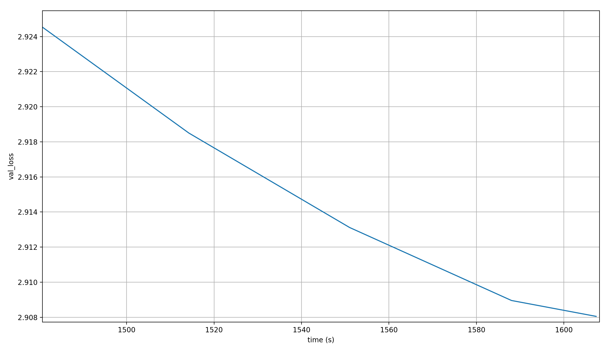

# modded-nanogpt medium World Record: Reusing intermediate activations in the output latents

I have a new world record for the modded-nanogpt speedrunning medium track.

It involves the re-use of activations from earlier layers at the output latent via a learned weighted sum.

This article will describe that record, as well as multiple other experiments.

## The record

TODO: enter numbers for updated record with 5550 steps and more runs

I simply added the output of layer 11 (the 12'th layer) to the output of the final layer (layer 15, or the 16'th layer), in a weighted sum. The weights are scalars and are learned. This just means that right before applying the language head, I do this:

```python
skip_lambdas = self.scalars[-2:]
x = norm(x) * skip_lambdas[0] + norm(skip_connections[11]) * skip_lambdas[1]
```

Where the `skip_connections` contain the output latents of each layer, at the corresponding position.

These are the resulting final validation losses over 10 runs:

```python
[2.918849, 2.917008, 2.919394, 2.91776, 2.919522, 2.919678, 2.918775, 2.918111, 2.919395, 2.917938]
```

And here are simple stats about the final validation loss over these 10 runs:

- Mean: 2.9186
- Std: 0.0008985
- P-value: 0.0005035724941803675

The p-value is very low, so after only 10 runs we can be sure that the target loss is reached.

Now here are the corresponding run times:

```python
[1378.689, 1378.504, 1378.622, 1379.238, 1379.0, 1379.444, 1378.426, 1379.337, 1378.254, 1379.127]
```

And here are some simple stats about the times:

- Mean: 1378.8641 seconds ~= 22.98 minutes
- Std: 0.4177 seconds

The previous record's time is 1405.698 seconds, so this is a reduction of almost 27 seconds.

### Lambdas

We don't just perform a sum between the outputs of layers 11 and 15, but a weighted sum; and those scalar weights are learned. So what values do they take?

TODO: add average over many runs; add plots of lambdas over the course of training

Let's first look at a single run and its final lambdas. It ran for 5550 steps; the final loss is 2.919; and the total time 1384 seconds (23 minutes). Here are the lambdas:

- Layer 15 (x-lambda): 0.828
- Layer 11 (skip-lambda): -0.292

This all but confirms a hypothesis by [Larry Dial](https://github.com/ClassicLarry) which he shared in a [comment](https://github.com/KellerJordan/modded-nanogpt/pull/138#issuecomment-3362739273) in the first PR I made about this record (which I closed to re-open a new one, because the first one was sloppy). His hypothesis is this (in my own words):

Every layer that is not the output layer has the job of providing context to the next layer so that it can do its job better. But each layer output is also present in the final output latents, due to the residual stream. Thus, it directly impacts the final prediction, and the layers all perform the dual jobs of providing context and making a prediction, which might not always be the same.

The final lambdas in these experiments are evidence for that hypothesis: the output of layer 11 is actively removed from the residual stream after layer 15, which should allow layer 11 to only focus on providing context to layer 12.

### Norms

Before my record, `x` was RMS normed right before applying the language head:

```python
...  # apply the layers
x = norm(x)
...  # apply the language head
```

But in my adapted version, I multiply `x` by a scalar value before decoding it:

```python
...  # apply the layers
x = norm(x) * l_x + norm(x_skip) * l_skip
...  # apply the language head
```

where `l_x` and `l_skip` are the abbreviated lambdas.

Would norming again after the sum help? Theoretically, the language head should be able to just learn to incorporate the constant factor from the lambdas and be fine, but sometimes learning dynamics are weird and don't work out like that. So I tried the following:

```python
...  # apply the layers
x = norm(norm(x) * l_x + norm(x_skip) * l_skip)
...  # apply the language head
```

But it made no difference at all, so it's fine to leave out this last norm. If anything, it made performance worse; but only very, very slightly, which means nothing when done for a single run, so I wouldn't take that too seriously.

## Adding more than one layer output

TODO: everything!

TODO: iff final two or three layer lambdas are positive and the rest are negative&mdash;a.k.a. the final few layers are actively doing prediction, while the previous ones only provide context&mdash;could we simply run them in parallel and then do a learned weighted sum over their outputs?

TODO: Are the magnitudes of lambdas from early layers lower than those from late layers? Because their impact on the output is reduced, so less of the impact has to be removed.

## The path to the record

In the time I spent experimenting with the changes explained above and below, another record was achived in [PR#137](https://github.com/KellerJordan/modded-nanogpt/pull/137). For the final attempt that you saw above, I of course included these changes, but I had previously attempted the record without them.

[PR#137](https://github.com/KellerJordan/modded-nanogpt/pull/137) combines [PR#128](https://github.com/KellerJordan/modded-nanogpt/pull/128) and [PR#129](https://github.com/KellerJordan/modded-nanogpt/pull/129). Both of these are about the Muon optimizer, which I don't really understand. However, I saw an interesting phenomenon, which I had noticed in my previous attempts: the record attempts that did not include [PR#137](https://github.com/KellerJordan/modded-nanogpt/pull/137) allowed me to reduce the step count significantly more than the record attempt with it did.

The last record on which I had based mine was my own [PR#125](https://github.com/KellerJordan/modded-nanogpt/pull/125), which took 5690 steps. Compared to that, I was able to set the step count to 5630, a reduction of 60 steps (double the 30 step reduction possible with the optimizer updates). This was tested over only 6 runs, so I might ultimately have had to add 10 more steps for a reduction of *only* 50 steps to get a sufficient p-value, but the difference is still stark.

This is unfortunately expected: In my experience, you can never reduce step count as much as you think. In fact, in my initial experiment with layer 11, it looked like I was going to be able to reduce step count from 5690 to 5567, a reduction of 123 steps:


But in the end, I could only reduce the step count by ~60 steps.

And when [PR#137](https://github.com/KellerJordan/modded-nanogpt/pull/137) reduced the step-count further, I was only able to reduce it by 30 steps, even though the initial comparison was more promising a reduction of ~90 steps, from 5590 to ~5500 steps (that the baseline doesn't reach a loss of 2.92 is just random chance):


And I've seen the same issue with [PR#119](https://github.com/KellerJordan/modded-nanogpt/pull/119), which reduced the step count from 5960 to 5820, and [PR#124](https://github.com/KellerJordan/modded-nanogpt/pull/124), which reduced them from 5820 to 5690.

This points to some fundamental issue with simply reducing step count.

### Analyzing the step-reduction issue

Here's an old plot I made of the learning rate and sequence length over the course of training, relative to their respective maximum values:


This is from when training still took 5960 steps. What you can see is that both the learning rate and the sequence length change toward the end of training. Now imagine that you see a loss curve over 5960 steps, and you notice that the target loss of 2.92 is hit after only 5890 steps. Then that 2.92 loss value occurs when the learning rate is slightly higher and the sequence length slightly shorter.

My guess was that this impacts the amount of loss reduction per step.

So which of the two is it?

- The learning rate changes only very slightly with small changes in step counts. However, the slope of its reduction over training gets more aggressive, which could have an additional impact
- The sequence length changes pretty strongly in the last few training steps, so this should make a big difference. My guess was that this is the main culprit of the issue

If the issue is actually the sequence length, then that's strange; the validation loss is computed at the full sequence length, so why does ending training in a lower sequence length reduce the final validation loss?

And indeed, in my one experiment where I schduled the sequence length as if there were still 5960 steps, the final loss was 2.922, so slightly worse than keeping the original schedule.

I tried something similar with the learning rate and it too didn't work either, so I am now stumped as to what causes this strange behavior.

### Why I chose layer 11

I chose to add layer 11 to the output latents because I performed a simple ablation where I tried each layer output once (except for the last one, because why would I add the last layer output to the last layer output?), and it showed the following curve:


All but layer 1 (the second layer) reduce the final validation loss, but layer 11 (the 12th layer) reduces it the most, so I chose it.

## Other experiments

I originally started these experiments trying to overcome the softmax bottleneck.

> The softmax bottleneck is an effect of the model dimension usually being much, much smaller than the vocabulary size (in our case, 1024 vs. >50,000). The language head, which is a single linear layer, must transform the small output latent into the gigantic vocabulary vector in a single step. If the intrinsic rank of the output vector is higher than that of the latent vector, this is impossible in a single linear-plus-softmax step.

A possible mitigation is to increase the output latent dimension more gradually to the vocabulary size, by chaining multiple linear layers. However, that's expensive, and multiple linear layers without a residual connection hurt gradient flow.

### First attempt at mitigating the softmax bottleneck

I thought I might just concatenate the output of a previous layer to the final output latent and instantly double the dimension from which we project into the vocabulary. I tried this for every single layer's output (including the last layer's), plus the input embedding and an extra embedding, and noted the final validation loss for each of the runs:


There are clearly several layers which reduce the validation loss after 5690 steps significantly.

However, an obvious objection to these results being meaningful is that the language head doubled in size (we project from a vector twice the size as before into the same vocabulary size). Two facts from this plot speak against parameter count being the only reason for the improved performance:

1. Simply adding the input embeddings, or even an extra embedding layer just for the job, *increases* validation loss, even though they do contain some information about the input (and adding them in a weighted sum to the residual stream at every layer does reduce the validation loss!) &rarr; pure parameter count cannot be the only reason for the improved performance
2. Concatenating the output of layer 15 to the output latent&mdash;which *is* the output of layer 15&mdash; reduces the final validation loss a bit (I think it's kind of similar to the [Mixture of Softmaxes](https://arxiv.org/abs/1809.09296), except less efficient); but earlier layers make a much larger difference. Again, the actual layer reuse matters, either through increased information content at the output, or a reduced effective depth that the gradient has to travel at the layer we concatenate

Of course, a third piece of evidence that the layer reuse is an important component of the reduced validation losses comes from the final record: adding a previous layer's activations to the output latents adds exactly two parameters (the weights of the weighted sum between the vectors), which is nothing. Therefore, something else must be responsible for the improved performance.

Let's compare this early attempt (using concatenation) to the final record attempt (using a weighted sum):


A few observations:

- The minimum loss is achieved at different layers: 11 vs 12. This is likely just due to noise in the training process
- Concatenation of the middle layer outputs *increases* final validation loss, while adding them decreases it; that's strange and I don't have an explanation for it
- Concatenation does outperform the weighted sum significantly at some layers in terms of final validation loss

Considering that last fact, why is not this my official record? Well, let's look at the losses *over time*:



The loss reaches 2.92 only after ~1506 seconds, which is far later than the ~1379 seconds for the actual record, so the extra parameters just make this so damn slow that it isn't worth it in this setting.

However, in a setting where the language head makes up far fewer of the parameters, it might be worthwhile to try this again. However, such a setting is, as far as I know, a setting where the model is very large, so that I cannot try it.

### Second attempt at mitigating the softmax bottleneck

In the past, I had tried simply adding the input embeddings x00 to the output latent in a weighted sum. However, despite the fact that doing the same at the residuals before the last layer decreases loss, this increased the final validation loss, and fairly significantly at that.

This made me think that the output of the final transformer layer shouldn't be touched; or at least that keeping the final transformer layer between any modification to the residual stream and the final output helps a lot.

With that in mind, I tried concatenating layer 12'th outputs to the residual *before* the final MLP (though after attention). To make up for the vastly increased parameter count that results from this change, I reduced the expansion factor from 4 to 1, which meant that the parameter count was constant.

However, this caused me some problems. Back then I thought that memory was somehow the issue, so I used a linear layer to project the latents from layer 12 down to size 128. This way, the concatenated layers are only slightly larger than the non-concatenated ones. However, the final loss was 2.922, so not below the limit; and it still took more time per step. Therefore, I dismissed this line of work.
