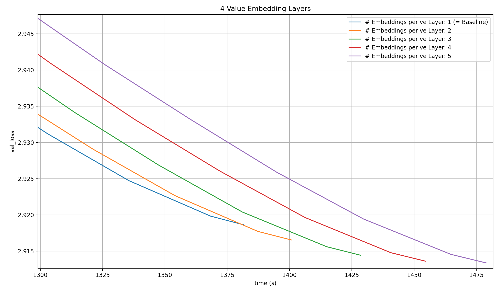
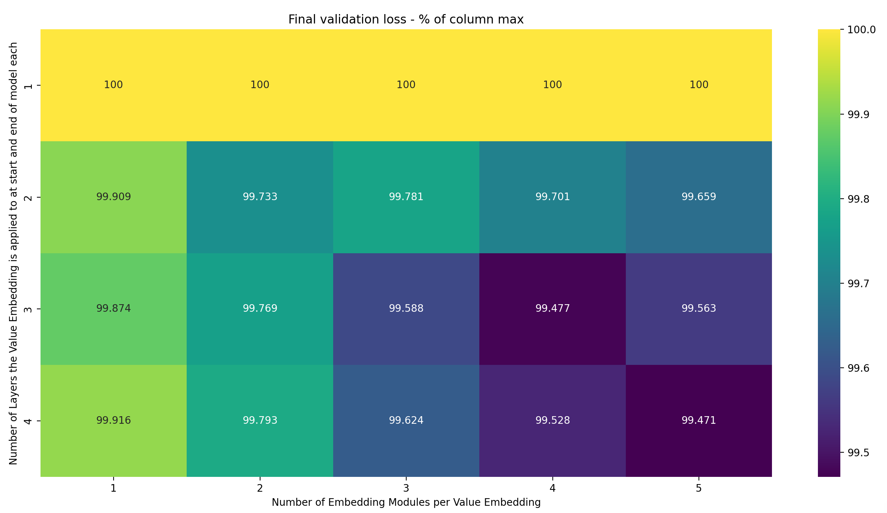
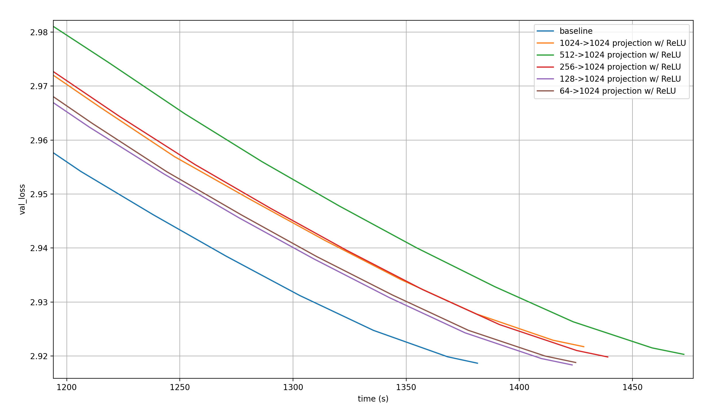

# Trying out other peoples' ideas

In response to [my post](https://x.com/omouamoua/status/1976695893912174792) announcing [my second modded-nanogpt medium world record](https://github.com/KellerJordan/modded-nanogpt/pull/124), several people made suggestions for variations of or alternatives to the technique introduced in [[the article](https://snimu.github.io/2025/10/10/modded-nanogpt-x0.html)].

I managed to test two of these: multiple embeddings per value embedding as suggested by [Braden Koszarsky](https://x.com/KoszarskyB), and variations in the per-layer embedding via linear transformations by [Danijar Hafner](https://x.com/danijarh). In this article, I will first offer a quick refresher on the relevant details of the baseline, and then go through the results for both of the suggested techniques.

> Note: There were more suggested ideas, but I'm about to start a new job and unfortunately didn't have the time for everything.

## The baseline

The baseline uses two techniques that will be relevant for this article.

It performs a weighted sum of multiple embeddings at the input of every transformer layer (which starts with Attention):

```python
# Create the embeddings
x = x00 = norm(self.embed1(input_sequence))
x01 = norm(self.embed2(input_sequence))

# Sum the embeddings at every layer and apply the layer
# Ignores skip connections, etc.
for i, layer in enumerate(self.layers):
    # The lambdas are learned scalar values
    x = lambdas[i][0] * x + lambdas[i][1] * x00 + lambdas[i][2] * x01
    x = layer(x)  # includes residual
```

Adding more embeddings (up to `x04`) consistently reduced the validation loss at each training step, but adding more than one extra embedding made the wallclock time to a loss of 2.92&mdash;which is the modded-nanogpt medium track target&mdash;worse. The reason this works is most likely that the lambdas, which are learned scalars, differ from layer to layer. Since we produce embeddings not via a single Embedding Module, but by the interpolation between two Embedding Modules, and the lambdas determine where along that intersection we lie, the model can provide a different Embedding for each layer for the cost of two Embedding Modules (and can do so in a more fine-grained manner if we increase the number of Embedding Modules that we use).

The baseline also includes so-called value embeddings, which are extra embedding layers that are mixed into the Attention values, like this (simplified psuedo-code):

```python
def attention_with_value_embeddings(
        input_ids: torch.Tensor,  # B, T
        x: torch.Tensor,  # B, T, D
        value_emb: nn.Embedding,
        lambdas: torch.Tensor,  # 2
        W_q: nn.Parameter,  # D, D
        W_k: nn.Parameter,  # D, D
        W_v: nn.Parameter,  # D, D
) -> torch.Tensor:
    q = rope(F.linear(x, W_q))
    k = rope(F.linear(x, W_k))
    v = F.linear(x, W_v)

    ### Here come the value embeddings
    v_embs = value_emb(input_ids)  # B, T, D
    v = lambdas[0] * v + lambdas[1] * v_embs  # <- add value embeddings to values
    ### ------------------------------

    ...  # apply attention
```

Each Value Embedding is applied to two layers: one is applied to layers 0 and 11, then 1 and 12, 2 and 13, 3 and 14, and 4 and 15. While the Value Embedding is re-used between two distant layers, the lambdas at those layers differ. Those lambdas are learned scalars, so the model can change how strongly the Value Embedding is applied to different layers.

All runs in this article incorporate an architectural trick from [a subsequent modded-nanogpt record](https://snimu.github.io/2025/10/19/modded-nanogpt-backout.html) I made, but the exact technique doesn't matter here. What's important is that since it is clearly composable with the multi-embedding technique, the results in this article should be meaningful; this comment is just for transparency.

## Multiple Embeddings per Value Embedding

[Braden Koszarsky](https://x.com/KoszarskyB) suggested to use multiple embeddings per value embedding.

I tried out two interpretations of this suggestion.

### Multiple Value Embedding Modules, multiple Embedding Modules per Value Embedding

First, I varied two things:

1. The number of `nn.Embedding` modules (I'll call those "Embedding Modules") per Value Embedding
2. The number of Value Embeddings

Here's how a Value Embedding with three Embedding Modules is created:

```python
ve: list[nn.Embedding] = ...

# Produce the values as usual from data:
q, k, v = F.linear(x, W_qkv).chunk(3, dim=-2)  # simplified

# Bias the values with multiple learned embeddings,
# in a weighted sum.
# The scalar lambdas l1-l4 are also learned during training.
value_embedding = l1 * ve[0] + l2 * ve[1] + l3 * ve[2]
v = l4 * v + value_embedding

# Apply Attention, etc.
...
```

I preserved the structure of the baseline, where each Value Embedding (now made up of multiple Embedding Modules) is applied to two layers: if there is one Value Embedding, it's applied to layers 0 and 15, if there are two then the first is applied to layers 0 and 14 and the second to layers 1 and 15, and so on.

While the Embedding Modules stay the same between the two applications of the Value Embedding, the learned lambdas differ, and we thus allow the model to learn different effective Embeddings between the two layers that each Value Embedding is applied to.

For now, let's ignore the wallclock time, and just see if the additional Embedding Modules improve performance per training step at all. If they don't&mdash;if, unlike in the article this is based on, adding more Embedding Modules *doesn't* consistently improve per-step performance&mdash;then this is pointless anyway. So here is a heatmap of the final validation loss for training runs using everything from one to four Value Embeddings, each using anything from one to five Embedding Modules:


There are two observations to be made here:

1. Increasing the number of Value Embeddings consistently lowers loss
2. Increasing the number of Embedding Modules per Value Embedding tends to decrease the loss, but not fully consistently

To better see these two trends, I have created two variations of the same heatmap. The first normalizes along the rows: for each row, show the loss as a percentage of the maximum loss in that row. This nicely shows how the number of Embedding Modules per Value Embedding impacts the final validation loss, for each number of Value Embeddings:


The more Value Embeddings we use, the more Embedding Modules per Value Embedding can be utilized by the model to further lower loss. This is very surprising to me: each is still only applied to two layers. My intuition for why adding Embedding Modules helps is that it gives the model an individual embedding at each layer, but for the Value Embeddings, the number of shared layers is fixed to two. Sure, adding more Embedding Modules to each Value Embedding seemingly allows the model to learn a more precise Value Embedding for each of the layers. But why would it matter that there are more Value Embeddings with *independent* Embedding Modules? They can already easily learn distinct Embeddings, so what's the reason why more Embedding Modules help?

I suspect that the answer is straightforward: as we apply Embeddings to more layers, it becomes more and more helpful to precisely control the difference between the different Embeddings. Increasing the number of Embedding Modules per Value Embedding will give the optimizer that precision.

Let's look at the same normalization, but over the columns:


The trend here is very strong: the more Value Embeddings we have, the lower the loss. This tends to happen more clearly when the number of Embedding Modules per Value Embedding is higher, showing again that each extra Embedding Module per Value Embedding gives more oomph if there are more Value Embeddings, but that trend isn't completely consistent.

Of course, this is modded-nanogpt, so we have to look at the wallclock times. I will do this separately for every number of Value Embeddings, to make the plots a bit more readable. I will keep the run with 4 Value Embeddings and 1 Embeding Module per Value Embedding in each of the plots, because it is the baseline.


With one Value Embedding, none of the runs even come close to the baseline.


With two Value Embeddings, the same is true.


Three Value Embeddings with a single Embedding Module each is better than four Value Embeddings with one Embedding Module each over most of the run, but doesn't reach the target loss in the given number of steps. I did make this comparison [in this article](https://snimu.github.io/2025/10/07/modded-nanogpt-value-embeddings.html), where I showed that this isn't a record.



With four Value Embeddings, the 8xH100 clearly start reaching their limit, and while the per-step loss gets lower, the wallclock time to a loss of 2.92 get worse and worse. In fact, the reason I didn't try five Value Embeddings is that the node ran out of memory.

In summary, these techniques do not lead to a new record.

### Multiple Embedding Modules per Value Embedding, one Value Embedding applied to multiple layers

I went back and asked myself why the record that triggered these experiments worked.

In it, I add the outputs of two Embedding Modules to the residual stream at the input of each Attention layer in a learned weighted sum. Doing this allows the model to simulate an individual Embedding for each transformer layer (Attention + MLP) in the model for the cost of just two actual Embedding Modules. And even if we increase the number of Embedding Modules, it can still be way below the total number of layers in the model.

To simulate this effect, I tested the following interpretation of Braden's question: I only have a single Value Embedding, and vary (1) how many Embedding Modules it uses and (2) how many layers it's applied to. Lets plot the same heatmaps as before, starting with the raw losses (For dumb reasons, I wrote down the number of layers that the Value Embedding is applied to in the beginning of the model; but it's always applied to the same number of layers at the end of the model again. This is made explicit in the axis label, but I wanted to stress it again so you don't overlook it). Here are the results:


Two things jump out immediately:

- More Embedding Modules seem to help about as much as applying the Value Embedding to more layers does
- Only two settings achieve a loss lower than the target of 2.92 in the given number of steps: 3-4 and 4-5 (where the first number is the number of layer the Value Embedding is applied to in both the front and the back of the model each, and the second is the number of Embedding Modules)

Let's look at the same heatmap, but with per-row normalization:


- Increasing the number of Embedding Modules again makes a bigger difference if the Value Embedding is applied to more layers; I suspect that this is, again, the case due to increased utility of precision in the Embedding at each layer
- However, increasing the number of Embedding Modules *always* helps, just not as much. I suspect that that's because the same Value Embedding is applied to more layers

Now for the column-normalized version:



The number of layers that the Value Embedding is applied to doesn't impact the final loss nearly as strongly as it did in the previous experiments. That's likely because we only have 1xE embedding modules, instead of VxE ones; in other words, the number of parameters in the model doesn't change with the number of layers we apply the Value Embedding to (well, it does, but only by VxE for the scalars in the weighted sum at each layer, which is nothing).

Still, applying the Value Embedding to more layers does improve performance. That's evidence for the hypothesis that the reason why more Embedding Modules help is that they, together with the learned scalars for the weighted sum, give the model an individual Embedding per layer, and that more Embedding Modules give the model more freedom to make these layers distinct.

Does one or both of the two runs that go below the target loss improve the wallclock time?


No, they do not.

## Per-layer Embedding by linear transformation

[Danijar Hafner](https://x.com/danijarh) suggested two things to try:

1. Having a single Embedding Module like it was before the record that spawned these suggestions, but varying it for every layer by applying a linear transformation to it. This linear transformation is different for each layer, to enable a different effective Embedding per layer. The linear layer has far fewer parameters than an Embedding Module, so this is more parameter efficient. However, it is more expensive to apply a Linear Layer than an Embedding Module, because the latter is just a lookup table. This is noted as "1024->1024 projection" in the plots
2. Having as many Embedding Modules as model layers, but having them be much smaller than the model dimension, and projecting them into the model dimension via a single, shared linear transformation. I vary the dimension of the Embedding Modules among the following values: [64, 128, 256, 512]. The corresponding result will be called "[[dim]]->1024 projection", where [[dim]] is the Embedding dimension

Here are the validation losses for these, plotted against the baseline over the training step:


The first thing I notice is that these results are a bit noisy (which is expected for a single run per setting). Why would the 64->1024 projection be better per step than the 128->1024 one?

The second thing I notice is that the first of the two suggestions by Danijar&mdash;1024->1024, a.k.a. a single Embedding Module projected by individual linear transformations&mdash;is very close to the worst run of all, so this is almost certainly not a contender.

The third thing I notice is that per step, the model learns more the larger the Embedding Modules. This is expected, as an increasing Embedding dimension increases the number of parameters in both the Embedding Modules and the Linear Layer. Actually, the trend is very weak, to the point that it surprises me quite a bit. This can probably be attributed to noise again.

Lastly, none of these come close to the baseline.

But maybe they are much faster, leading to a shorter wallclock time?


The above plot shows that no, this isn't the case.

What is interesting about it is that smaller embeddings reduce the runtime so much that they reach the same loss faster than the larger embeddings. However, almost none of them even cross the 2.92 loss target, so it hardly matters.

One possible explanation for the underperformance of these techniques is that a linear transformation of a bunch of vectors, or a bunch of linear transformations of a single vector, just doesn't allow for much expressive power. So I tried to also use ReLU after the linear transformation. In the 1024->1024 case, this allows the different linear transformations to set different parts of the single Embedding Module to zero, while in the other projections, the different Embedding Modules are now capable of eliciting only parts of the Linear Layer weights (which are what summed up to produce the output).

Here are the results:


Some observations:

- This is much better than without the ReLU, as expected
- The 1024->1024 projection is by far the worst
- For the others, the trend seems to be that smaller embeddings are better not just in wallclock time, but even in per-step performance. However, this trend reverses when the embeddings get too small: 128->1024 is best, and 64->1024 is only the second best
- The 128->1024 projection is actually better per-step than the baseline!

That last point is interesting, because the 128->1024 projection should be fairly efficient. Let's look at the loss over time:



Unfortunately, the large number of Embedding Modules together with the linear transformation are just too slow. This shouldn't be surprising: The 64->1024 projection has as many Embedding parameters as simply having a second full input embedding (64*16=1024, and we keep one of the two input embeddings from the record). And the linear transformation adds more parameters, and an expensive matrix operation.

Since the per-step performance already starts to deterioate as we go from the 128->1024 to the 64->1024 projection, lowering the Embedding size further is unlikely to improve wallclock time.

## Conclusion

The experiments made at the suggestion of Braden Koszarsky and Danijar Hafner provide intersting results, and add to my understanding of the benfits of using multiple Embedding Modules in an LLM. However, they unfortunately don't lead to a new modded-nanogpt record.
