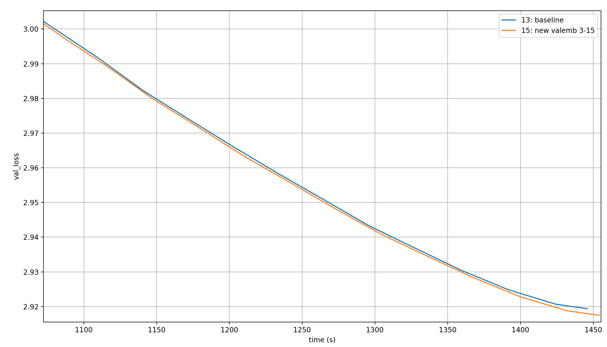
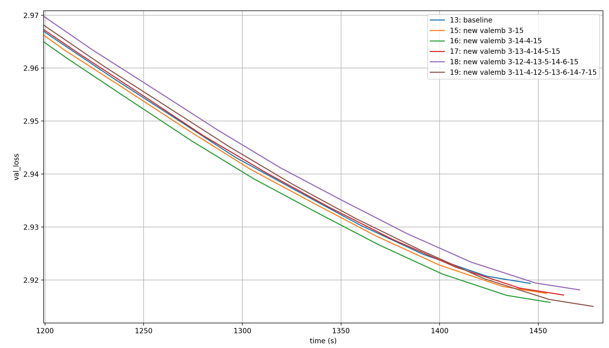
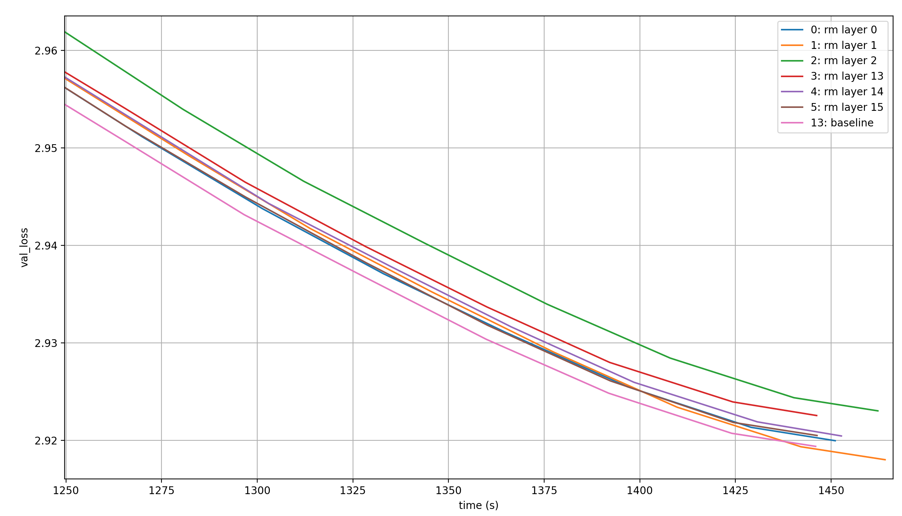
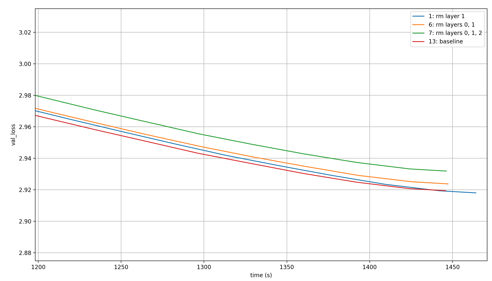
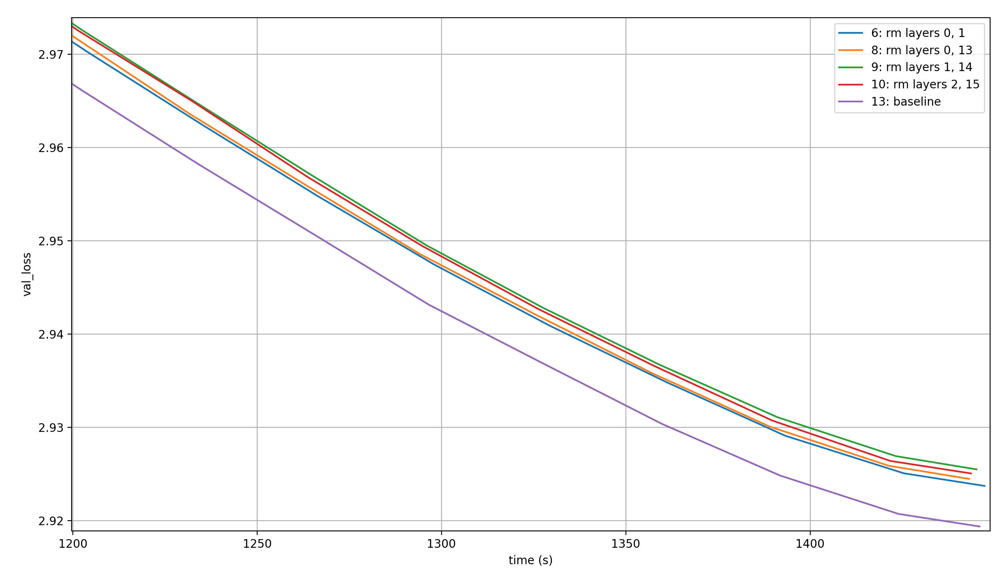
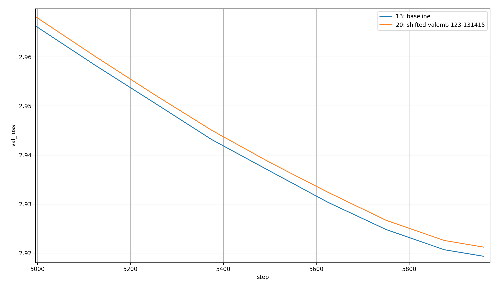
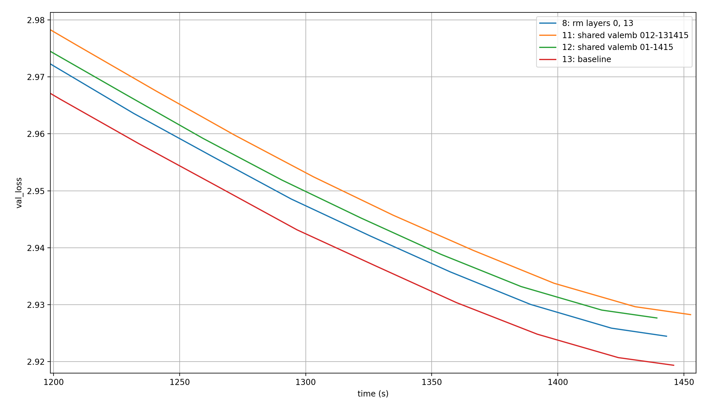

# modded-nanogpt: Embeddings Extravaganza 2 (value embeddings)

TODO

## Adding value embeddings

Let's add another value embedding, so that now layers 0&12, 1&13, 2&14, and 3&15 each share one value-embedding. Here are the results plotted over time (cut to the later parts of training so that we can differentiate between the baseline and the new setting):

Adding another value embedding *obviously* immediately sets a new modded-nanogpt speedrunning record!

So what happens if we add more value embeddings? Let's add some, for a total of three (baseline), four (see above), five, six, seven, and eight value embeddings, each shared like in the baseline (so applying the n value embeddings to the first n layers, and to the last n layers again in the same order):

So there is a setting that is even better than having one additional value embedding: having two additional ones.

In fact, here is the order in which the runs cross the 2.92 loss-barrier which is the target of modded-nanogpt medium:

1. 2 additional value embeddings (1410 sec ~= 23.5 min)
2. 1 additional value embeddings (1422 sec ~= 23.7 min)
3. 5 additional value embeddings (1425 sec ~= 23.75 min)
4. 3 additional value embeddings (1428 sec ~= 23.8 min)
5. 0 additional value embeddings (1436 sec ~= 23.9 min) (baseline)
6. 4 additional value embeddings (1444 sec ~= 24.0 min)

However, that happens only in the last ~50s. In the time before that, which tells us more about what setting is consistently the best, this is the order from best to worst:

1. 2 additional value embeddings
2. 1 additional value embeddings
3. 0 additional value embeddings (baseline)
4. 3 additional value embeddings
5. 5 additional value embeddings
6. 4 additional value embeddings

There is unfortunately a lot of variation in these runs, but two additional value embeddings almost certainly outperform the baseline. It might not always be 26 seconds as in these runs, but I expect that it's a consistent edge.

## Removing value embeddings

If adding value embeddings helps performance per time-step, then removing them should hurt them. Nevertheless, my investigations on different learned scalars in modded-nanogpt (LINK) led me to suspect that it should be possible to remove value-embeddings, especially in the early layers where their effects are strongly suppressed, which would of course speed up the runtime because it would avoid some computation (though only a small amount).

So, for the sake of completeness, here are the results of those experiments as well, starting with the removal of single value embeddings:

None of them is as good as the baseline. However, the ordering of results is interesting. Keepingin mind that random noise is a big factor here, it seems the order of removing value embeddings from worst to best is 2-13-14-15-0-1. Well that's confusing.

Removing layer 2 is the worst by far? But the other two early layers are of almost no importance? That's strange, and it makes me wonder what would happen if we shifted the value embeddings to slightly later layers; so instead of layer `[0, 1, 2, 13, 14, 15]` we'd have layers `[1, 2, 3, 13, 14, 15]` or `[2, 3, 4, 13, 14, 15]`.

Before that, let's look at what happens if we remove multiple layers at once though. First, removing layers 0 and 1, and layers 0, 1, and 2. To be clear, no value embedding is removed for this, because they are shared with the value embeddings at layers 13, 14, and 15, and those remain. For comparison, I'll throw in the baseline and the best performing run from before (so only layer 1 removed):

The two conclusions I can draw are that (1) the early value embeddings are definitely valuable and (2) the more of them are removed, the worse the result.

How about removing full value embeddings? So removing the shared value embedding from layers 0 and 13, or 1 and 14, or 2 and 15; this time compared to removing layers 0 and 1 (because that's also not adding value embeddings at two layers, but it keeps all the parameters):

Removing a full value embedding seems to be worse than not sharing its weights, though it's difficult to properly compare because it's applied to different layers which, as we have seen, has a big effect. I haven't run any experiments looking at, for example, removing the value embeddings from layers 0 and 14, or 1 and 13, etc., but those would be better comparisons. There is no real trend here where we could say "removing later layers is consistently worse" or something similar.

## Shifting the value embeddings

As discussed above, it might be interesting to shift the value embeddings from the early layers to slightly later layers. Let's see this on one example, where we use the value embeddings on layers 1, 2, and 3 instead of 0, 1, and 2. Since I expect any time-differences to be due to random chance, I will just plot them over the steps:

The shifted value embeddings seem to lead to worse results than the non-shifted ones.

## Sharing value embeddings differently

I did wonder if the structure of sharing value embeddings across many layers (so layer 0 and 13 etc.) is optimal, or if we can share them differently. So I tried limiting myself to two value embeddings, which were shared in the following ways: (1) layers 0&1 and layers 14&15 share a value embedding each, and (2) layer 0-2 and layers 13-15 share a value embedding each. This removes the parameters of a whole value embedding, so I'll keep the run where I removed the value embeddings from layers 0 and 13 (and thus removed a full embedding layer):

When we remove a full embedding layer, it is better to keep the interleaved structure where the value embeddings are shared between early and late layers, not between adjacent layers. Additionally, it is worse to share the same value embedding between three layers than it is to share it between two layers, even though the toal number of parameters stays constant.
