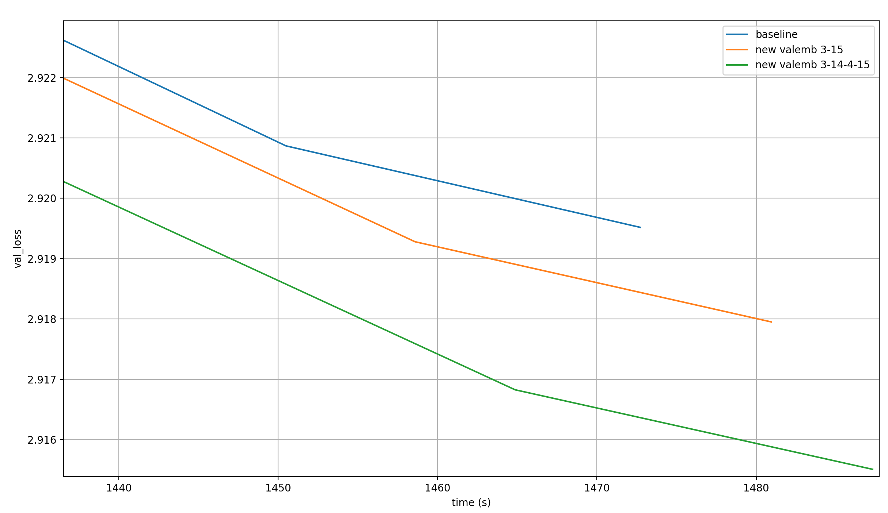

# modded-nanogpt: Embeddings Extravaganza 1 (value embeddings)

Adding more value-embeddings to [modded-nanogpt](https://github.com/KellerJordan/modded-nanogpt) led me to an (as of yet unofficial) modded-nanogpt medium record.

In this article, I present these results, and a lot more ablations of experiments that didn't work out. Here's a table of contents:

- [Adding value embeddings](#adding-value-embeddings)
  - [Compile flags and rules](#compile-flags-and-rules)
- [Removing value embeddings](#removing-value-embeddings)
- [Shifting value embeddings](#shifting-value-embeddings)
- [Sharing value embeddings differently](#sharing-value-embeddings-differently)

You can find the reproducible code [at this link](https://github.com/snimu/modded-nanogpt-experiments/tree/main/experiments/00003-value-embeddings).

## Adding value embeddings

Let's add another value embedding, so that now layers 0&12, 1&13, 2&14, and 3&15 each share one value-embedding. Here are the results plotted over time (cut to the later parts of training so that we can differentiate between the baseline and the new setting):

Adding another value embedding *obviously* immediately sets a new modded-nanogpt speedrunning record!

So what happens if we add more value embeddings? In the following plot, we see the validation losses over training of runs with a total of three (baseline), four (see above), five, six, seven, and eight value embeddings, each shared like in the baseline (so applying the n value embeddings to the first n layers, and to the last n layers again in the same order). That means that the one with the most value embeddings applies one value embedding to each layer in the model (except layer 7 which is attention-free).

So there is a setting that is even better than having one additional value embedding: having two additional ones.

In fact, here is the order in which the runs cross the 2.92 loss-barrier, which is the target of modded-nanogpt medium:

1. 2 additional value embeddings (1410 sec ~= 23.5 min)
2. 1 additional value embeddings (1422 sec ~= 23.7 min)
3. 5 additional value embeddings (1425 sec ~= 23.75 min)
4. 3 additional value embeddings (1428 sec ~= 23.8 min)
5. 0 additional value embeddings (1436 sec ~= 23.9 min) (baseline)
6. 4 additional value embeddings (1444 sec ~= 24.0 min)

However, these times will of course vary over different training runs, and occur only in the last ~50s. In the time before that, which tells us more about what setting is consistently the best, this is the order from best to worst:

1. 2 additional value embeddings
2. 1 additional value embeddings
3. 0 additional value embeddings (baseline)
4. 3 additional value embeddings
5. 5 additional value embeddings
6. 4 additional value embeddings

There is unfortunately a lot of variation in these runs, but two additional value embeddings almost certainly outperform the baseline. It might not always be 26 seconds as in these runs, but I expect that it's a consistent edge.

Let's see if adding more and more value embeddings at least improves the amount that is learned per batch, by plotting the loss over the training steps:

This seems almost monotonous, except for adding four additional value embeddings, which is the worst. Here is the order in which they cross the threshold:

1. 5 additional value embeddings
2. 3 additional value embeddings
3. 2 additional value embeddings
4. 1 additional value embeddings
5. 0 additional value embeddings (baseline)
6. 4 additional value embeddings

I would interpret this as "more value embeddings lead to more learning per step", but the training run when I added 4 additional value embeddings was an outlier. I assume it would fit in nicely with the others in the trend if run multiple times.

This outlier also makes me re-interpret the timed differences: I now assume that the 4 additional value embeddings slot in nicely in this timed order (from best to worst): 2-1-0-3-4-5. So for one and two additional value embeddings, the additional loss reduction per step dominates over the additional per-step time, while above two additional value embeddings, the effect reverses.

I'm also curious if this order is determined by the limitations of 8xH100, and if 8xB200 would mean that the record would be broken again and again as we add more value embeddings (though of course, we could probably also add more non-embedding parameters in that case, which could be a better tradeoff).

### Compile flags and rules

The runs above were performed with some changes to code even for the baseline:

- I removed the `torch._dynamo.config.compiled_autograd = True` flag because it caused some flexattention error that I didn't want to deal with
- I also removed the `_patched_trace_structured` function and the corresponding imports etc., because it caused another error that I didn't want to deal with

At this point, the baseline performs in 23.7min, instead of the official 24.5min. That might be due to the newer PyTorch version, `torch==2.9.0.dev20250824+cu126` (I ran the `pip install --pre torch --index-url https://download.pytorch.org/whl/nightly/cu126 --upgrade` as in the instructions), or some other reason. It is consistent across runs on both 8xH100 by Prime Compute and by Hyperstack, so I don't believe that it's a hardware difference.

However, the log of the most recent record includes a comment next to the `torch._inductor.config.coordinate_descent_tuning = True` flag: `# we have banned this flag for new records because it causes compilation to take 30min` which I only saw very late.

Compilation didn't take 30 minutes for me even with the flag on:

- I measured it once, and compilation + warmup steps together took 04m05s with the flag on, and 00m54s with the flag off
- In my dozens of runs I never noticed it taking even close to half an hour

So I don't really get the comment. Maybe it takes that long with the `compiled_autograd` flag on, but the baseline is still faster than the official record even without that. However, I still tested out the baseline and the two best settings (one and two additional value embeddings) without `coordinate_descent_tuning`. Here are the losses averaged over 5 runs each:

And clearly, adding one or two more value embeddings leads to a strong record, crossing the 2.92 validation loss threshold much earlier:

- Baseline:1465s &rarr; 24.42m
- One additional value embedding: 1463s &rarr; 24.38m
- Two additional value embeddings: 1439s &rarr; 23.98m

In fact, the speed difference is higher than with the flag on! All experiments below were run with `coordinate_descent_tuning = True` though, because I performed them before reading that comment.

> A note on the averaging: I very simply averaged the loss for each training step, and independently averaged the time taken at each training step, and then plotted the loss over the training time. That's not 100% mathematically correct because I'm averaging losses that happended after different amounts of time, but the averaging of the times should mostly make up for that, so the results are still valid (especially considering the large margin with which the record is set).

## Removing value embeddings

If adding value embeddings helps performance per time-step, then removing them should hurt them. Nevertheless, my [investigations on different learned scalars in modded-nanogpt](https://snimu.github.io/2025/08/11/modded-nanogpt-lambdas.html) led me to suspect that it should be possible to remove value-embeddings, especially in the early layers where their effects are strongly suppressed, which would of course speed up the runtime because it would avoid some computation (though only a small amount).

So, for the sake of completeness, here are the results of those experiments as well, starting with the removal of single value embeddings:

None of them is as good as the baseline. However, the ordering of results is interesting. Keepingin mind that random noise is a big factor here, it seems the order of removing value embeddings from worst to best is 2-13-14-15-0-1. Well that's confusing.

Removing layer 2 is the worst by far? But the other two early layers are of almost no importance? That's strange, and it makes me wonder what would happen if we shifted the value embeddings to slightly later layers; so instead of layer `[0, 1, 2, 13, 14, 15]` we'd have layers `[1, 2, 3, 13, 14, 15]` or `[2, 3, 4, 13, 14, 15]`.

Before that, let's look at what happens if we remove multiple layers at once though. First, removing layers 0 and 1, and layers 0, 1, and 2. To be clear, no value embedding is removed for this, because they are shared with the value embeddings at layers 13, 14, and 15, and those remain. For comparison, I'll throw in the baseline and the best performing run from before (so only layer 1 removed):

The two conclusions I can draw are that (1) the early value embeddings are definitely valuable and (2) the more of them are removed, the worse the result.

How about removing full value embeddings? So removing the shared value embedding from layers 0 and 13, or 1 and 14, or 2 and 15; this time compared to removing layers 0 and 1 (because that's also not adding value embeddings at two layers, but it keeps all the parameters):

Removing a full value embedding seems to be worse than not sharing its weights, though it's difficult to properly compare because it's applied to different layers which, as we have seen, has a big effect. I haven't run any experiments looking at, for example, removing the value embeddings from layers 0 and 14, or 1 and 13, etc., but those would be better comparisons. There is no real trend here where we could say "removing later layers is consistently worse" or something similar.

## Shifting value embeddings

As discussed above, it might be interesting to shift the value embeddings from the early layers to slightly later layers. Let's see this on two examples, where we use the value embeddings on layers 1, 2, and 3 or 2, 3, and 4 instead of 0, 1, and 2. Since I expect any time-differences to be due to random chance, I will just plot them over the steps:

The shifted value embeddings seem to lead to worse results than the non-shifted ones, and moreso the more they are shifted.

## Sharing value embeddings differently

I did wonder if the structure of sharing value embeddings across many layers (so layer 0 and 13 etc.) is optimal, or if we can share them differently. So I tried limiting myself to two value embeddings, which were shared in the following ways: (1) layers 0&1 and layers 14&15 share a value embedding each, and (2) layer 0-2 and layers 13-15 share a value embedding each. This removes the parameters of a whole value embedding, so I'll keep the run where I removed the value embeddings from layers 0 and 13 (and thus removed a full embedding layer):

When we remove a full embedding layer, it is better to keep the interleaved structure where the value embeddings are shared between early and late layers, not between adjacent layers. Additionally, it is worse to share the same value embedding between three layers than it is to share it between two layers, even though the toal number of parameters stays constant.
