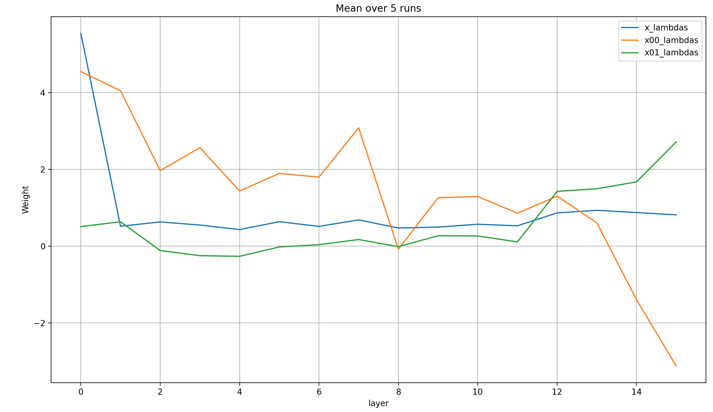

# modded-nanogpt: Embeddings Extravaganza 2 (x00-x04)

modded-nanogpt (LINK) adds the token-embedding x0 to the residual stream in a weighted sum before every layer. What happens if we create additional embeddings layers, and add more and more of them to the weighted sum?

## The setup

... TODO (explain baseline and what's added and how, plus initilization; will call each run by the maximum new embedding, so x01 for one added embedding, etc.; mention my prior work on looking at the lambdas)

## Validation losses

Let's first look at the validation losses per step:

As you can see, you can see nothing. We need to zoom in further to the end of training:

The obvious pattern that emerges is that with each additional embedding layer, the model learns more in each step. However, modded-nanogpt is all about performance per time, so let's plot that as well. This time, we'll simply look at the zoomed in last few steps:

What immediately jumps out is that beyond two additional embeddings, the performance per time-step degrades quickly. And even before that, the baseline is clearly the best throughout the majority of training. However, toward the very end, two runs with added embeddings seem to actually be better: x01 and x02. The differences are tiny though, and I chalk them up to random chance.

## Lambdas

To me, the most interesting part about these results is that adding more embedding layers just keep improving model performance per step. In some sense, that's expected, because embedding layers are just cheap additional parameters. On the other hand, I do find it somewhat surprising: these embeddings look at each token individually, so on their own they can at best achieve 1-gram accuracy, which is bad. They must help the model learn to make better use of the main layers somehow; let's look at the lambdas in order to find out how.

### x01

My expectation was that x00 will be high in the beginning and low in the end; and that x01 will be low in the beginning and high in the end. I expected this to be a continuous change. The reason is that I expected x00 to contain training statistics about the input embeddings, a clean representation of what the tokens mean, while x01 contains 1-gram statistics about the most likely next token-distribution given a single token. Then, x00 would become less useful over the layers and x01 more useful (though I didn't expect this separation of concerns to be nearly this clean or one-dimensional).

Here's how the lambdas for x, x00, and x01 acutally look at the end of training for the different layers, averaged over 5 runs (because they are a bit noisy):

There are so many things to say!

- As always, layer 8 is a bit of an exception to everything I'm going to say below, but that's just because there is no attention at layer 7, which influences all lambdas in layer 8 significantly
- At the input, x == x00, and both are very high, suppressing x01
- Afterward, the weights of x falls to a constant low value over the layer, and it barely changes until the very end
- The weight of x00 is noisy, but seems to fall pretty consistently from layer to layer
- The weight of x01 is a very low positive value throughout the layers
- That's until the very end&mdash;layers 12-15&mdash;where x00 suddenly drops like a stone into negative territory, and x01 rises quickly

What could explain this behavior? Here's my speculation. Let me be clear: it's nothing *but* speculation, and even if it's true it won't be 100% crisply be true because that's almost never the case in Deep Learning. Nevertheless, here I go:

Assume that x00 is a pure representation of the input tokens; and that x01 is a 1-gram embedding of the prior probability distribution over the most likely next token, for each token in the vocabulary. Then, the following pattern emerges:

- In the last few layers (12-15):
  - x01 explodes in weight, providing a prior for the next-token prediction
  - x is used to adjust this next-token prediction in a more data-dependent manner; apparently, not much is needed for this task
  - x00 is substracted strongly from the residual stream, which undoes how strongly it was added to it in the earlier layers, leaving a clean next-token prior from x01 and adjustment from x
- In the earlier layers (1-11):
  - x00 dominates the forward pass, followed in weight by x, while x01 is very low
  - This allows the model to very slowly develop the adjustment direction x over the layers, given mostly the view of the input tokens x00, and, to a lower degree, the previous attempt at creating the adjustment (and, to an even lower degree, the next-token prior)
- In layer 0:
  - x == x00, and both dominate strongly
  - This suggests that the model just wants to initialize the adjustment vector very strongly; and that in turn supports the idea that this adjustment vector will simply be carefully refined over the subsequent layers

One potential upset to this theory is that x00 and x01 are RMS-normed, but x isn't (except before layer 0 and after layer 15). Of course, x is always normed at the input to the Attention and MLP layers, but not at their outputs, and thus never at the residual, where the weighted sum between x, x00, and x01 always occurs. This means that it's possible that the norm of x could be rising monotonically, or vary wildly.

I don't believe that that's the case though; if it were, SGD would likely vary both the norm of x *and* the x-lambda in the same direction, at least somewhat. I would therefore assume that the norm of x is fairly stable throughout. In fact, I can *imagine* that x00 (and x01) stabilize the norm of x. The hypothesis is: x00 and x01 are normed, while x floats freely, so it's easier to control the relative weights of all three by varying the lambdas of x00 and x01, while keeping the both the lambda and the norm of x fairly constant, than to control both the lambda and norm of x. I'm very unsure about this though.
