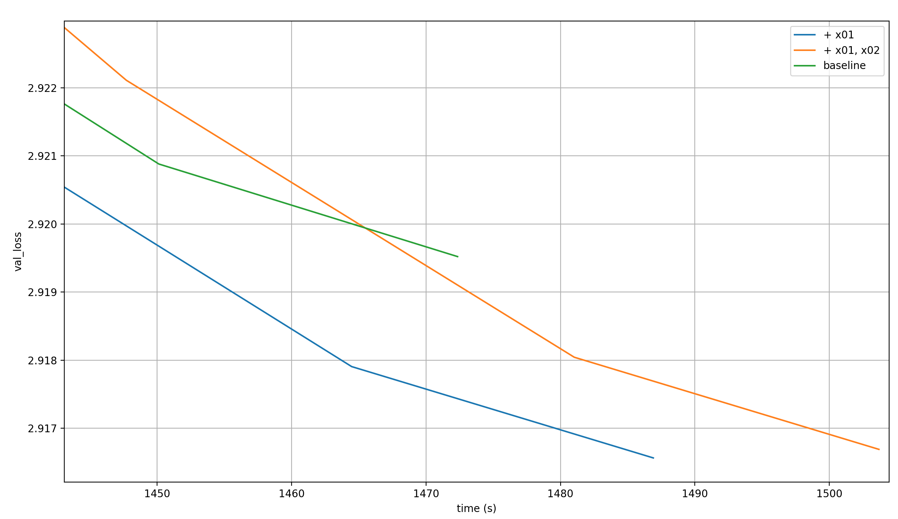
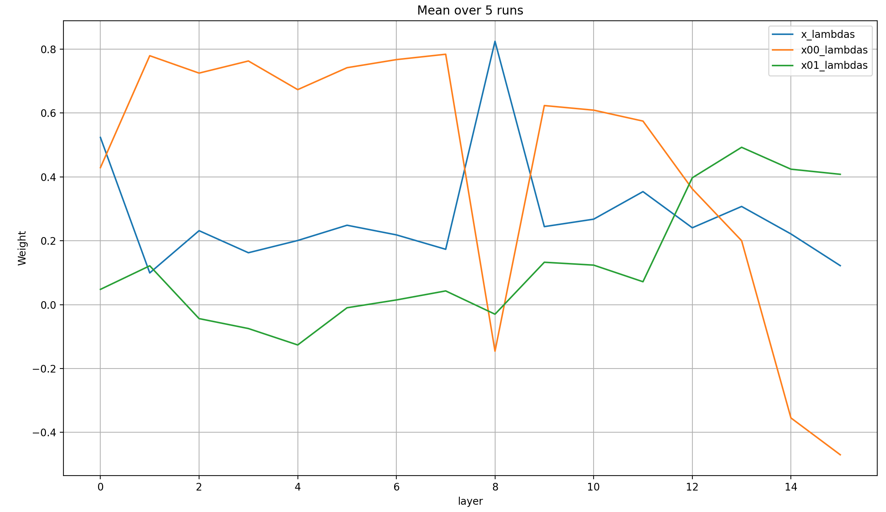

# modded-nanogpt: Embeddings Extravaganza 2 (x00-x04)

modded-nanogpt (LINK) adds the token-embedding x0 to the residual stream in a weighted sum before every layer. What happens if we create additional embeddings layers, and add more and more of them to the weighted sum?

## The setup

... TODO (explain baseline and what's added and how, plus initilization; will call each run by the maximum new embedding, so x01 for one added embedding, etc.; mention my prior work on looking at the lambdas)

## Validation losses

Let's first look at the validation losses per step:


As you can see, you can see nothing. We need to zoom in further to the end of training:


The obvious pattern that emerges is that with each additional embedding layer, the model learns more in each step. However, modded-nanogpt is all about performance per time, so let's plot that as well. This time, we'll simply look at the zoomed in last few steps:


What immediately jumps out is that beyond two additional embeddings, the performance per time-step degrades quickly. And even before that, the baseline is clearly the best throughout the majority of training. However, toward the very end, two runs with added embeddings seem to actually be better: x01 and x02. The differences are tiny though, and I chalk them up to random chance.

There is a complication to this, though: torch compile flags. In all of the above runs (including the baseline), I removed the `torch._dynamo.config.compiled_autograd = True` flag, because it cause an error in flexattention that I didn't want to deal with; and I removed the `_patched_trace_structured` function because it cause some other error that I didn't want to deal with. I have, however, kept the `torch._inductor.config.coordinate_descent_tuning = True` flag. In [the latest record log](https://github.com/KellerJordan/modded-nanogpt/blob/master/records/042225_GPT2Medium_Record8/075_640429f2-e726-4e83-aa27-684626239ffc.txt), there is a comment behind it that says `# we have banned this flag for new records because it causes compilation to take 30min` (though this comment isn't present in `train_gpt_medium.py`, and I measure around 4 minutes of compile and warmup time). So I ran the baseline and the first two experiments again without the flag, 5 times each. For each step, I averaged the time over the 5 runs, and the loss; both independently. That's not quite correct, but it gives a pretty good feel for what's going on. Here are the resulting loss curves:



In this case, adding a single additional embedding causes a very clear record.

Below, I will try to determine how the model uses the additional embedding to improve its per-step (and, depending on the flag, per-time-step) performance.

## Lambdas

To me, the most interesting part about these results is that adding more embedding layers just keep improving model performance per step. In some sense, that's expected, because embedding layers are cheap additional parameters. On the other hand, I do find it somewhat surprising: these embeddings look at each token individually, so on their own they can at best achieve 1-gram accuracy, which is bad. They must help the model learn to make better use of the main layers somehow; let's look at the lambdas in order to find out how.

### x01

My expectation was that x00 will be high in the beginning and low in the end; and that x01 will be low in the beginning and high in the end. I expected this to be a continuous change. The reason is that I expected x00 to contain training statistics about the input embeddings, a clean representation of what the tokens mean, while x01 contains 1-gram statistics about the most likely next token-distribution given a single token. Then, x00 would become less useful over the layers and x01 more useful (though I didn't expect this separation of concerns to be nearly this clean or one-dimensional).

Here's how the lambdas for x, x00, and x01 acutally look at the end of training for the different layers, averaged over 5 runs (because they are a bit noisy):


There are so many things to say!

- As always, layer 8 is a bit of an exception to everything I'm going to say below, but that's just because there is no attention at layer 7, which influences all lambdas in layer 8 significantly
- At the input, x == x00, and both are very high, suppressing x01
- Afterward, the weights of x falls to a constant low value over the layer, and it barely changes until the very end
- The weight of x00 is noisy, but seems to fall pretty consistently from layer to layer
- The weight of x01 is a very low positive value throughout the layers
- That's until the very end&mdash;layers 12-15&mdash;where x00 suddenly drops like a stone into negative territory, and x01 rises quickly

To explain this behavior, I applied the language head to different components of the model and looked at the resulting predictions.

<details>
<summary>Expand this to see my incorrect predictions about the mechanism; I'm leaving them in because it's valuable to me</summary>
What could explain this behavior? Here's my speculation. Let me be clear: it's nothing *but* speculation, and even if it's true it won't be 100% crisply be true because that's almost never the case in Deep Learning. Nevertheless, here I go:

Assume that x00 is a pure representation of the input tokens; and that x01 is a 1-gram embedding of the prior probability distribution over the most likely next token, for each token in the vocabulary. Then, the following pattern emerges:

- In the last few layers (12-15):
  - x01 explodes in weight, providing a prior for the next-token prediction
  - x is used to adjust this next-token prediction in a more data-dependent manner; apparently, not much is needed for this task
  - x00 is substracted strongly from the residual stream, which undoes how strongly it was added to it in the earlier layers, leaving a clean next-token prior from x01 and adjustment from x
- In the earlier layers (1-11):
  - x00 dominates the forward pass, followed in weight by x, while x01 is very low
  - This allows the model to very slowly develop the adjustment direction x over the layers, given mostly the view of the input tokens x00, and, to a lower degree, the previous attempt at creating the adjustment (and, to an even lower degree, the next-token prior)
- In layer 0:
  - x == x00, and both dominate strongly
  - This suggests that the model just wants to initialize the adjustment vector very strongly; and that in turn supports the idea that this adjustment vector will simply be carefully refined over the subsequent layers

One potential upset to this theory is that x00 and x01 are RMS-normed, but x isn't (except before layer 0 and after layer 15). Of course, x is always normed at the input to the Attention and MLP layers, but not at their outputs, and thus never at the residual, where the weighted sum between x, x00, and x01 always occurs. This means that it's possible that the norm of x could be rising monotonically, or vary wildly.

</details>

#### Predictions

Firstly, and most importantly, I took 128 input tokens, ran a forward pass over them, and saved the top-10 predictions for x (at the input of the every layer, before it'a mixed with x00, x01, or the value embeddings; and at the position it's usually decoded from, after all the blocks), x00, x01, and the value-embeddings ve0, ve1, and ve2. You can find the full ten predictions under [predictions.md](https://github.com/snimu/modded-nanogpt-experiments/blob/main/experiments/00004-x0/predictions.md), together with the predicted probability for each token, and the code that produced the results [at this file](https://github.com/snimu/modded-nanogpt-experiments/blob/main/experiments/00004-x0/runs/4-2025-08-22-x00-x01-with-word-logging.py). Below, I simply show the most likely next token at each position, for each of the different components.

The dictionary shows one sub-dictionary for each component (x, x00, etc.). Each of these subdictionaries maps from the token position to another sub-sub-dictionary, which in turn maps from the true input tokens at each position to the most likely next token as decoded from each component by the language head.

The full input sentence is `mail account: email@example.com\n- Emails will include links. Nothing fancy. We??re keeping it simple.\n- We?`. The questionmarks are where my terminal didn't properly render the output bytes which I noticed too late. I belive it's just the "'" sign.

<details>
<summary>All next-token predictions</summary>

```python
{
    'x-0': {
        0: {'mail': ' address'},
        1: {' account': 'ants'},
        2: {':': ' http'},
        3: {' email': ' address'},
        4: {'@': '#$'},
        5: {'example': ' of'},
        6: {'.': '\n'},
        7: {'com': '/'},
        8: {'\n': 'The'},
        9: {'-': 'based'},
        10: {' Emails': 'ensitive'},
        11: {' will': ' be'},
        12: {' include': ' a'},
        13: {' text': 'ured'},
        14: {' and': 'rogen'},
        15: {' links': ' to'},
        16: {'.': '\n'},
        17: {' Nothing': ' else'},
        18: {' fancy': ' fancy'},
        19: {'.': '\n'},
        20: {' We': "'re"},
        21: {'�': '�'},
        22: {'�': 's'},
        23: {'re': ' going'},
        24: {' keeping': ' them'},
        25: {' it': 'alian'},
        26: {' simple': 'tons'},
        27: {'.': '\n'},
        28: {'\n': 'The'},
        29: {'-': 'based'},
        30: {' We': "'re"},
        31: {'�': '�'},
        32: {'�': 's'},
        33: {'ll': ' be'},
        34: {' highlight': ' the'},
        35: {' stories': ' about'},
        36: {',': ' but'},
        37: {' blogs': '/'},
        38: {' and': 'rogen'},
        39: {' other': 'worldly'},
        40: {' things': ' happen'},
        41: {' that': ' they'},
        42: {' remind': ' us'},
        43: {' us': 'hers'},
        44: {' that': ' they'},
        45: {' we': "'ll"},
        46: {'�': '�'},
        47: {'�': 's'},
        48: {'re': ' going'},
        49: {' made': ' sure'},
        50: {' of': ' the'},
        51: {' st': 'ilts'},
        52: {'ard': 'rop'},
        53: {'ust': 'ered'},
        54: {' and': 'rogen'},
        55: {' updates': ' on'},
        56: {' on': ' the'},
        57: {' our': ' own'},
        58: {' work': 'station'},
        59: {'.': '\n'},
        60: {'\n': 'The'},
        61: {'-': 'based'},
        62: {' At': ' least'},
        63: {' the': ' same'},
        64: {' most': ' important'},
        65: {',': ' but'},
        66: {' we': "'ll"},
        67: {' may': ' be'},
        68: {' send': ' out'},
        69: {' out': 'fitted'},
        70: {' one': ' hundred'},
        71: {' email': ' address'},
        72: {' per': ' day'},
        73: {' week': 'long'},
        74: {'.': '\n'},
        75: {' But': 'chers'},
        76: {',': ' but'},
        77: {' don': "'t"},
        78: {'�': '�'},
        79: {'�': 's'},
        80: {'t': ' necessarily'},
        81: {' count': 'enance'},
        82: {' on': ' the'},
        83: {' it': 'alian'},
        84: {'.': '\n'},
        85: {' If': ' you'},
        86: {' we': "'ll"},
        87: {' have': ' been'},
        88: {' something': ' else'},
        89: {' to': ' be'},
        90: {' share': 'holding'},
        91: {',': ' but'},
        92: {' we': "'ll"},
        93: {'�': '�'},
        94: {'�': 's'},
        95: {'ll': ' be'},
        96: {' share': 'holding'},
        97: {' it': 'alian'},
        98: {'.': '\n'},
        99: {' If': ' you'},
        100: {' not': ' necessarily'},
        101: {',': ' but'},
        102: {' we': "'ll"},
        103: {' wont': ' be'},
        104: {'.': '\n'},
        105: {'\n': 'The'},
        106: {'-': 'based'},
        107: {' We': "'re"},
        108: {' will': ' be'},
        109: {' not': ' necessarily'},
        110: {' share': 'holding'},
        111: {' your': ' own'},
        112: {' email': ' address'},
        113: {' with': ' the'},
        114: {' anyone': ' else'},
        115: {' else': ' than'},
        116: {'.': '\n'},
        117: {' Period': 'icals'},
        118: {'.': '\n'},
        119: {'\n': 'The'},
        120: {'-': 'based'},
        121: {' If': ' you'},
        122: {' at': ' least'},
        123: {' any': ' kind'},
        124: {' time': 'frames'},
        125: {' you': "'re"},
        126: {' want': ' to'},
        127: {' to': ' be'}
    },
    'x-1': {
        0: {'mail': ' sites'},
        1: {' account': ' Plays'},
        2: {':': ' http'},
        3: {' email': ' hub'},
        4: {'@': '�'},
        5: {'example': ' Usage'},
        6: {'.': '\n'},
        7: {'com': '<|endoftext|>'},
        8: {'\n': ' �'},
        9: {'-': ' The'},
        10: {' Emails': ' to'},
        11: {' will': ' not'},
        12: {' include': ' a'},
        13: {' text': ' online'},
        14: {' and': ' a'},
        15: {' links': ' to'},
        16: {'.': '\n'},
        17: {' Nothing': ' else'},
        18: {' fancy': ' meets'},
        19: {'.': '\n'},
        20: {' We': "'ll"},
        21: {'�': '�'},
        22: {'�': 've'},
        23: {'re': ' not'},
        24: {' keeping': ' a'},
        25: {' it': ' cool'},
        26: {' simple': ' enough'},
        27: {'.': '\n'},
        28: {'\n': ' �'},
        29: {'-': ' The'},
        30: {' We': "'ll"},
        31: {'�': '�'},
        32: {'�': 've'},
        33: {'ll': ' be'},
        34: {' highlight': ' the'},
        35: {' stories': ' of'},
        36: {',': ' however'},
        37: {' blogs': ' on'},
        38: {' and': ' other'},
        39: {' other': ' social'},
        40: {' things': ' related'},
        41: {' that': ' won'},
        42: {' remind': ' us'},
        43: {' us': ' know'},
        44: {' that': ' we'},
        45: {' we': ' can'},
        46: {'�': '�'},
        47: {'�': 's'},
        48: {'re': ' not'},
        49: {' made': ' up'},
        50: {' of': ' the'},
        51: {' st': ' Instagram'},
        52: {'ard': ' clean'},
        53: {'ust': ' and'},
        54: {' and': ' therefore'},
        55: {' updates': ' on'},
        56: {' on': ' the'},
        57: {' our': ' own'},
        58: {' work': ' ethic'},
        59: {'.': '\n'},
        60: {'\n': ' �'},
        61: {'-': ' The'},
        62: {' At': ' the'},
        63: {' the': ' same'},
        64: {' most': ' popular'},
        65: {',': ' let'},
        66: {' we': ' can'},
        67: {' may': ' be'},
        68: {' send': ' a'},
        69: {' out': ' a'},
        70: {' one': ' day'},
        71: {' email': ' �'},
        72: {' per': ' day'},
        73: {' week': '.'},
        74: {'.': '\n'},
        75: {' But': ' let'},
        76: {',': ' however'},
        77: {' don': '�'},
        78: {'�': '�'},
        79: {'�': 's'},
        80: {'t': ' necessarily'},
        81: {' count': ' up'},
        82: {' on': ' a'},
        83: {' it': ' all'},
        84: {'.': '\n'},
        85: {' If': ' you'},
        86: {' we': ' have'},
        87: {' have': ' been'},
        88: {' something': ' else'},
        89: {' to': ' get'},
        90: {' share': ' your'},
        91: {',': ' however'},
        92: {' we': ' can'},
        93: {'�': '�'},
        94: {'�': 's'},
        95: {'ll': ' be'},
        96: {' share': ' your'},
        97: {' it': ' really'},
        98: {'.': '\n'},
        99: {' If': ' you'},
        100: {' not': ' enough'},
        101: {',': ' however'},
        102: {' we': ' can'},
        103: {' wont': ' open'},
        104: {'.': '\n'},
        105: {'\n': ' �'},
        106: {'-': ' The'},
        107: {' We': ' have'},
        108: {' will': ' be'},
        109: {' not': ' want'},
        110: {' share': ' our'},
        111: {' your': ' own'},
        112: {' email': ' address'},
        113: {' with': ' the'},
        114: {' anyone': ' else'},
        115: {' else': ' who'},
        116: {'.': '\n'},
        117: {' Period': ' Recap'},
        118: {'.': '\n'},
        119: {'\n': ' �'},
        120: {'-': ' The'},
        121: {' If': ' you'},
        122: {' at': ' the'},
        123: {' any': ' type'},
        124: {' time': ' you'},
        125: {' you': ' can'},
        126: {' want': ' a'},
        127: {' to': ' play'}
    },
    'x-2': {
        0: {'mail': ' addresses'},
        1: {' account': ' websites'},
        2: {':': '|'},
        3: {' email': ' address'},
        4: {'@': 'example'},
        5: {'example': ')|'},
        6: {'.': '|'},
        7: {'com': '<|endoftext|>'},
        8: {'\n': '|'},
        9: {'-': ' Posted'},
        10: {' Emails': ' from'},
        11: {' will': ' be'},
        12: {' include': ' a'},
        13: {' text': ' on'},
        14: {' and': ' other'},
        15: {' links': ' to'},
        16: {'.': '\n'},
        17: {' Nothing': ' else'},
        18: {' fancy': ','},
        19: {'.': '\n'},
        20: {' We': "'ll"},
        21: {'�': '�'},
        22: {'�': 've'},
        23: {'re': ' not'},
        24: {' keeping': ' out'},
        25: {' it': 'alian'},
        26: {' simple': ' enough'},
        27: {'.': '\n'},
        28: {'\n': 'The'},
        29: {'-': ' Buy'},
        30: {' We': "'re"},
        31: {'�': '�'},
        32: {'�': 've'},
        33: {'ll': ' be'},
        34: {' highlight': ' the'},
        35: {' stories': ' of'},
        36: {',': ' but'},
        37: {' blogs': ' on'},
        38: {' and': ' even'},
        39: {' other': ' related'},
        40: {' things': ' related'},
        41: {' that': ' are'},
        42: {' remind': ' me'},
        43: {' us': '�'},
        44: {' that': ' we'},
        45: {' we': '�'},
        46: {'�': '�'},
        47: {'�': 've'},
        48: {'re': ' not'},
        49: {' made': ' by'},
        50: {' of': ' course'},
        51: {' st': ' Instagram'},
        52: {'ard': 'ess'},
        53: {'ust': ' and'},
        54: {' and': ' therefore'},
        55: {' updates': ' from'},
        56: {' on': ' the'},
        57: {' our': ' own'},
        58: {' work': ' to'},
        59: {'.': '\n'},
        60: {'\n': 'The'},
        61: {'-': ' Read'},
        62: {' At': ' least'},
        63: {' the': ' same'},
        64: {' most': ' recent'},
        65: {',': ' however'},
        66: {' we': "'ll"},
        67: {' may': ' be'},
        68: {' send': ' out'},
        69: {' out': ' some'},
        70: {' one': ' of'},
        71: {' email': ' to'},
        72: {' per': ' day'},
        73: {' week': ' or'},
        74: {'.': '\n'},
        75: {' But': ' it'},
        76: {',': ' even'},
        77: {' don': '�'},
        78: {'�': '�'},
        79: {'�': 's'},
        80: {'t': ' necessarily'},
        81: {' count': ' yourself'},
        82: {' on': ' the'},
        83: {' it': 'self'},
        84: {'.': '\n'},
        85: {' If': ' you'},
        86: {' we': "'re"},
        87: {' have': ' a'},
        88: {' something': ' to'},
        89: {' to': ' say'},
        90: {' share': ' with'},
        91: {',': ' but'},
        92: {' we': "'ll"},
        93: {'�': '�'},
        94: {'�': 've'},
        95: {'ll': ' be'},
        96: {' share': ' your'},
        97: {' it': 'self'},
        98: {'.': '\n'},
        99: {' If': ' you'},
        100: {' not': ' enough'},
        101: {',': ' however'},
        102: {' we': "'ll"},
        103: {' wont': ' be'},
        104: {'.': '\n'},
        105: {'\n': 'The'},
        106: {'-': ' Read'},
        107: {' We': "'re"},
        108: {' will': ' be'},
        109: {' not': ' be'},
        110: {' share': ' with'},
        111: {' your': ' own'},
        112: {' email': ' address'},
        113: {' with': ' regard'},
        114: {' anyone': ' else'},
        115: {' else': ' who'},
        116: {'.': '\n'},
        117: {' Period': 's'},
        118: {'.': '\n'},
        119: {'\n': 'If'},
        120: {'-': ' Buy'},
        121: {' If': ' you'},
        122: {' at': ' least'},
        123: {' any': ' point'},
        124: {' time': ' during'},
        125: {' you': ' can'},
        126: {' want': ' to'},
        127: {' to': ' spend'}
    },
    'x-3': {
        0: {'mail': ' first'},
        1: {' account': ' first'},
        2: {':': '|'},
        3: {' email': '@'},
        4: {'@': 'example'},
        5: {'example': 'ever'},
        6: {'.': '|'},
        7: {'com': '\n'},
        8: {'\n': '|'},
        9: {'-': ' 1'},
        10: {' Emails': ' from'},
        11: {' will': ' be'},
        12: {' include': ' a'},
        13: {' text': ' on'},
        14: {' and': ' other'},
        15: {' links': ' to'},
        16: {'.': '\n'},
        17: {' Nothing': ' else'},
        18: {' fancy': ','},
        19: {'.': '\n'},
        20: {' We': "'ll"},
        21: {'�': '�'},
        22: {'�': 're'},
        23: {'re': ' not'},
        24: {' keeping': ' away'},
        25: {' it': ' safe'},
        26: {' simple': '.'},
        27: {'.': '\n'},
        28: {'\n': '-'},
        29: {'-': ' A'},
        30: {' We': "'re"},
        31: {'�': '�'},
        32: {'�': 're'},
        33: {'ll': ' be'},
        34: {' highlight': ' the'},
        35: {' stories': ' of'},
        36: {',': ' including'},
        37: {' blogs': ','},
        38: {' and': ' even'},
        39: {' other': ' related'},
        40: {' things': ' related'},
        41: {' that': ' are'},
        42: {' remind': ' me'},
        43: {' us': ' of'},
        44: {' that': ' they'},
        45: {' we': '�'},
        46: {'�': '�'},
        47: {'�': 're'},
        48: {'re': ' not'},
        49: {' made': ' by'},
        50: {' of': ' �'},
        51: {' st': 'ables'},
        52: {'ard': 'lights'},
        53: {'ust': ' and'},
        54: {' and': ' therefore'},
        55: {' updates': ' from'},
        56: {' on': ' the'},
        57: {' our': ' own'},
        58: {' work': 'bench'},
        59: {'.': '\n'},
        60: {'\n': '-'},
        61: {'-': ' A'},
        62: {' At': ' least'},
        63: {' the': ' end'},
        64: {' most': ' time'},
        65: {',': ' it'},
        66: {' we': ' can'},
        67: {' may': ' be'},
        68: {' send': ' out'},
        69: {' out': ' to'},
        70: {' one': ' of'},
        71: {' email': ' to'},
        72: {' per': ' day'},
        73: {' week': ' or'},
        74: {'.': '\n'},
        75: {' But': ' it'},
        76: {',': ' there'},
        77: {' don': '�'},
        78: {'�': '�'},
        79: {'�': 't'},
        80: {'t': ' necessarily'},
        81: {' count': ' any'},
        82: {' on': ' any'},
        83: {' it': 'self'},
        84: {'.': '\n'},
        85: {' If': ' you'},
        86: {' we': '�'},
        87: {' have': ' a'},
        88: {' something': ' else'},
        89: {' to': ' remember'},
        90: {' share': ' with'},
        91: {',': ' then'},
        92: {' we': ' can'},
        93: {'�': '�'},
        94: {'�': 're'},
        95: {'ll': ' be'},
        96: {' share': ' with'},
        97: {' it': ' with'},
        98: {'.': '\n'},
        99: {' If': ' you'},
        100: {' not': ' necessarily'},
        101: {',': ' then'},
        102: {' we': '�'},
        103: {' wont': ' be'},
        104: {'.': '\n'},
        105: {'\n': '-'},
        106: {'-': ' A'},
        107: {' We': '�'},
        108: {' will': ' be'},
        109: {' not': ' be'},
        110: {' share': ' with'},
        111: {' your': ' own'},
        112: {' email': ' address'},
        113: {' with': ' any'},
        114: {' anyone': ' else'},
        115: {' else': ' who'},
        116: {'.': '\n'},
        117: {' Period': 'icity'},
        118: {'.': '\n'},
        119: {'\n': '-'},
        120: {'-': ' A'},
        121: {' If': ' you'},
        122: {' at': ' least'},
        123: {' any': ' time'},
        124: {' time': ' during'},
        125: {' you': ' can'},
        126: {' want': ' to'},
        127: {' to': ' be'}
    },
    'x-4': {
        0: {'mail': ')?'},
        1: {' account': ' resume'},
        2: {':': 'The'},
        3: {' email': '@'},
        4: {'@': ' div'},
        5: {'example': ' dot'},
        6: {'.': 'The'},
        7: {'com': ')'},
        8: {'\n': 'The'},
        9: {'-': 'PH'},
        10: {' Emails': ' from'},
        11: {' will': ' be'},
        12: {' include': ' a'},
        13: {' text': ' of'},
        14: {' and': ' other'},
        15: {' links': ' to'},
        16: {'.': '\n'},
        17: {' Nothing': ' else'},
        18: {' fancy': ' but'},
        19: {'.': '\n'},
        20: {' We': "'ll"},
        21: {'�': '�'},
        22: {'�': 've'},
        23: {'re': ' not'},
        24: {' keeping': ' away'},
        25: {' it': ' cool'},
        26: {' simple': ','},
        27: {'.': '\n'},
        28: {'\n': '-'},
        29: {'-': ' The'},
        30: {' We': "'ll"},
        31: {'�': '�'},
        32: {'�': 've'},
        33: {'ll': ' be'},
        34: {' highlight': ' the'},
        35: {' stories': ' of'},
        36: {',': ' including'},
        37: {' blogs': ','},
        38: {' and': ' other'},
        39: {' other': ' related'},
        40: {' things': ' related'},
        41: {' that': ' happen'},
        42: {' remind': ' me'},
        43: {' us': ' of'},
        44: {' that': ' they'},
        45: {' we': ' can'},
        46: {'�': '�'},
        47: {'�': 've'},
        48: {'re': ' able'},
        49: {' made': ' by'},
        50: {' of': ' different'},
        51: {' st': 'rows'},
        52: {'ard': 'ological'},
        53: {'ust': ' and'},
        54: {' and': ' therefore'},
        55: {' updates': ' of'},
        56: {' on': ' the'},
        57: {' our': ' own'},
        58: {' work': ' for'},
        59: {'.': '\n'},
        60: {'\n': '-'},
        61: {'-': ' A'},
        62: {' At': ' least'},
        63: {' the': ' same'},
        64: {' most': ' possible'},
        65: {',': ' we'},
        66: {' we': "'ll"},
        67: {' may': ' be'},
        68: {' send': ' out'},
        69: {' out': ' some'},
        70: {' one': ' of'},
        71: {' email': ' to'},
        72: {' per': ' week'},
        73: {' week': ' or'},
        74: {'.': '\n'},
        75: {' But': ' it'},
        76: {',': ' unfortunately'},
        77: {' don': "'t"},
        78: {'�': '�'},
        79: {'�': 't'},
        80: {'t': ' necessarily'},
        81: {' count': ' out'},
        82: {' on': ' them'},
        83: {' it': 'self'},
        84: {'.': '\n'},
        85: {' If': ' you'},
        86: {' we': "'re"},
        87: {' have': ' a'},
        88: {' something': ' like'},
        89: {' to': ' teach'},
        90: {' share': ' with'},
        91: {',': ' then'},
        92: {' we': "'ll"},
        93: {'�': '�'},
        94: {'�': 've'},
        95: {'ll': ' be'},
        96: {' share': ' with'},
        97: {' it': 'self'},
        98: {'.': '\n'},
        99: {' If': ' you'},
        100: {' not': ' necessarily'},
        101: {',': ' then'},
        102: {' we': "'ll"},
        103: {' wont': ' be'},
        104: {'.': '\n'},
        105: {'\n': '-'},
        106: {'-': ' In'},
        107: {' We': ' need'},
        108: {' will': ' be'},
        109: {' not': ' necessarily'},
        110: {' share': ' any'},
        111: {' your': ' thoughts'},
        112: {' email': ' address'},
        113: {' with': ' either'},
        114: {' anyone': ' else'},
        115: {' else': ' who'},
        116: {'.': '\n'},
        117: {' Period': 'ly'},
        118: {'.': ' let'},
        119: {'\n': '-'},
        120: {'-': ' In'},
        121: {' If': ' you'},
        122: {' at': ' least'},
        123: {' any': ' time'},
        124: {' time': ' during'},
        125: {' you': ' can'},
        126: {' want': ' to'},
        127: {' to': ' take'}
    },
    'x-5': {
        0: {'mail': 'Microsoft'},
        1: {' account': 'Microsoft'},
        2: {':': 'Microsoft'},
        3: {' email': '@'},
        4: {'@': ' subscriber'},
        5: {'example': '.;'},
        6: {'.': 'The'},
        7: {'com': '/#'},
        8: {'\n': 'The'},
        9: {'-': 'Date'},
        10: {' Emails': ' from'},
        11: {' will': ' be'},
        12: {' include': ' a'},
        13: {' text': ' on'},
        14: {' and': ' other'},
        15: {' links': ' to'},
        16: {'.': '\n'},
        17: {' Nothing': ' else'},
        18: {' fancy': ' but'},
        19: {'.': '\n'},
        20: {' We': "'ll"},
        21: {'�': '�'},
        22: {'�': 've'},
        23: {'re': ' not'},
        24: {' keeping': ' track'},
        25: {' it': ' cool'},
        26: {' simple': ' for'},
        27: {'.': '\n'},
        28: {'\n': '-'},
        29: {'-': ' �'},
        30: {' We': '�'},
        31: {'�': '�'},
        32: {'�': 've'},
        33: {'ll': ' be'},
        34: {' highlight': ' the'},
        35: {' stories': ' of'},
        36: {',': ' but'},
        37: {' blogs': ','},
        38: {' and': ' other'},
        39: {' other': ' forms'},
        40: {' things': ' related'},
        41: {' that': ' you'},
        42: {' remind': ' them'},
        43: {' us': ' of'},
        44: {' that': ' they'},
        45: {' we': ' can'},
        46: {'�': '�'},
        47: {'�': 've'},
        48: {'re': ' not'},
        49: {' made': ' by'},
        50: {' of': '…'},
        51: {' st': ' pixel'},
        52: {'ard': 'els'},
        53: {'ust': ' and'},
        54: {' and': ' therefore'},
        55: {' updates': ' of'},
        56: {' on': ' the'},
        57: {' our': ' own'},
        58: {' work': ' on'},
        59: {'.': '\n'},
        60: {'\n': '-'},
        61: {'-': ' The'},
        62: {' At': ' least'},
        63: {' the': ' same'},
        64: {' most': ' possible'},
        65: {',': ' they'},
        66: {' we': "'ll"},
        67: {' may': ' be'},
        68: {' send': ' out'},
        69: {' out': ' a'},
        70: {' one': ' of'},
        71: {' email': ' or'},
        72: {' per': ' week'},
        73: {' week': ' or'},
        74: {'.': '\n'},
        75: {' But': ' if'},
        76: {',': ' unfortunately'},
        77: {' don': "'t"},
        78: {'�': '�'},
        79: {'�': 's'},
        80: {'t': ' necessarily'},
        81: {' count': ' any'},
        82: {' on': ' any'},
        83: {' it': "'s"},
        84: {'.': '\n'},
        85: {' If': ' you'},
        86: {' we': '�'},
        87: {' have': ' a'},
        88: {' something': ' like'},
        89: {' to': ' say'},
        90: {' share': ' about'},
        91: {',': ' it'},
        92: {' we': ' can'},
        93: {'�': '�'},
        94: {'�': 've'},
        95: {'ll': ' be'},
        96: {' share': ' a'},
        97: {' it': ' with'},
        98: {'.': '\n'},
        99: {' If': ' you'},
        100: {' not': ' necessarily'},
        101: {',': ' they'},
        102: {' we': "'ll"},
        103: {' wont': ' be'},
        104: {'.': '\n'},
        105: {'\n': '-'},
        106: {'-': ' If'},
        107: {' We': '�'},
        108: {' will': ' be'},
        109: {' not': ' be'},
        110: {' share': ' any'},
        111: {' your': ' own'},
        112: {' email': ' on'},
        113: {' with': ' either'},
        114: {' anyone': ' else'},
        115: {' else': ' who'},
        116: {'.': '\n'},
        117: {' Period': 'ly'},
        118: {'.': '\n'},
        119: {'\n': '-'},
        120: {'-': ' If'},
        121: {' If': ' you'},
        122: {' at': ' least'},
        123: {' any': ' doubt'},
        124: {' time': ' you'},
        125: {' you': ' have'},
        126: {' want': ' to'},
        127: {' to': ' go'}
    },
    'x-6': {
        0: {'mail': 'Microsoft'},
        1: {' account': '>'},
        2: {':': 'Date'},
        3: {' email': '>'},
        4: {'@': ' pc'},
        5: {'example': ' dot'},
        6: {'.': 'I'},
        7: {'com': '.'},
        8: {'\n': 'The'},
        9: {'-': ' Date'},
        10: {' Emails': ' from'},
        11: {' will': ' be'},
        12: {' include': ' free'},
        13: {' text': ' of'},
        14: {' and': 'rogen'},
        15: {' links': ' to'},
        16: {'.': '\n'},
        17: {' Nothing': ' else'},
        18: {' fancy': ' fancy'},
        19: {'.': '\n'},
        20: {' We': "'ll"},
        21: {'�': '�'},
        22: {'�': 'll'},
        23: {'re': ' not'},
        24: {' keeping': ' them'},
        25: {' it': ' strictly'},
        26: {' simple': ' for'},
        27: {'.': '\n'},
        28: {'\n': '-'},
        29: {'-': ' There'},
        30: {' We': "'ll"},
        31: {'�': '�'},
        32: {'�': 've'},
        33: {'ll': ' be'},
        34: {' highlight': ' the'},
        35: {' stories': ' of'},
        36: {',': ' but'},
        37: {' blogs': ','},
        38: {' and': ' other'},
        39: {' other': ' forms'},
        40: {' things': ' related'},
        41: {' that': ' you'},
        42: {' remind': ' them'},
        43: {' us': ' of'},
        44: {' that': ' there'},
        45: {' we': ' can'},
        46: {'�': '�'},
        47: {'�': 've'},
        48: {'re': ' not'},
        49: {' made': ' by'},
        50: {' of': ' different'},
        51: {' st': ' pixel'},
        52: {'ard': 'els'},
        53: {'ust': ' and'},
        54: {' and': ' therefore'},
        55: {' updates': ' of'},
        56: {' on': ' social'},
        57: {' our': ' own'},
        58: {' work': ' on'},
        59: {'.': '\n'},
        60: {'\n': '-'},
        61: {'-': ' There'},
        62: {' At': ' times'},
        63: {' the': ' time'},
        64: {' most': ' possible'},
        65: {',': ' it'},
        66: {' we': "'ll"},
        67: {' may': ' be'},
        68: {' send': ' a'},
        69: {' out': ' a'},
        70: {' one': ' of'},
        71: {' email': ' on'},
        72: {' per': ' month'},
        73: {' week': '.'},
        74: {'.': '\n'},
        75: {' But': ' we'},
        76: {',': ' they'},
        77: {' don': "'t"},
        78: {'�': '�'},
        79: {'�': 's'},
        80: {'t': ' necessarily'},
        81: {' count': ' any'},
        82: {' on': ' any'},
        83: {' it': ' happening'},
        84: {'.': '\n'},
        85: {' If': ' you'},
        86: {' we': ' don'},
        87: {' have': ' a'},
        88: {' something': ' like'},
        89: {' to': ' say'},
        90: {' share': ' about'},
        91: {',': ' it'},
        92: {' we': ' will'},
        93: {'�': '�'},
        94: {'�': 'll'},
        95: {'ll': ' be'},
        96: {' share': ' a'},
        97: {' it': ' to'},
        98: {'.': '\n'},
        99: {' If': ' you'},
        100: {' not': ' outright'},
        101: {',': ' you'},
        102: {' we': ' will'},
        103: {' wont': ' be'},
        104: {'.': '\n'},
        105: {'\n': '-'},
        106: {'-': ' Each'},
        107: {' We': "'ll"},
        108: {' will': ' be'},
        109: {' not': ' be'},
        110: {' share': ' your'},
        111: {' your': 's'},
        112: {' email': ' from'},
        113: {' with': ' your'},
        114: {' anyone': ' else'},
        115: {' else': ' who'},
        116: {'.': '\n'},
        117: {' Period': 'entimes'},
        118: {'.': '\n'},
        119: {'\n': '-'},
        120: {'-': ' You'},
        121: {' If': ' you'},
        122: {' at': ' least'},
        123: {' any': ' doubt'},
        124: {' time': ' you'},
        125: {' you': ' have'},
        126: {' want': ' to'},
        127: {' to': ' see'}
    },
    'x-7': {
        0: {'mail': '|'},
        1: {' account': '|'},
        2: {':': 'Date'},
        3: {' email': '@'},
        4: {'@': 'nt'},
        5: {'example': '.'},
        6: {'.': 'com'},
        7: {'com': '\n'},
        8: {'\n': 'The'},
        9: {'-': ' Date'},
        10: {' Emails': ':'},
        11: {' will': ' be'},
        12: {' include': ':'},
        13: {' text': ' text'},
        14: {' and': ' text'},
        15: {' links': ' to'},
        16: {'.': '\n'},
        17: {' Nothing': ' else'},
        18: {' fancy': ' nor'},
        19: {'.': '\n'},
        20: {' We': "'ll"},
        21: {'�': '�'},
        22: {'�': "'ll"},
        23: {'re': ' not'},
        24: {' keeping': ' them'},
        25: {' it': ' really'},
        26: {' simple': ' for'},
        27: {'.': '\n'},
        28: {'\n': '-'},
        29: {'-': ' Each'},
        30: {' We': "'ll"},
        31: {'�': '�'},
        32: {'�': 's'},
        33: {'ll': ' be'},
        34: {' highlight': ' the'},
        35: {' stories': ' and'},
        36: {',': ' including'},
        37: {' blogs': ','},
        38: {' and': ' even'},
        39: {' other': ' related'},
        40: {' things': ' related'},
        41: {' that': ' you'},
        42: {' remind': ' me'},
        43: {' us': ' how'},
        44: {' that': ' you'},
        45: {' we': '�'},
        46: {'�': '�'},
        47: {'�': 's'},
        48: {'re': ' not'},
        49: {' made': ' by'},
        50: {' of': ' different'},
        51: {' st': 'o'},
        52: {'ard': 'o'},
        53: {'ust': ' and'},
        54: {' and': ' therefore'},
        55: {' updates': ' of'},
        56: {' on': ' how'},
        57: {' our': ' own'},
        58: {' work': ' here'},
        59: {'.': '\n'},
        60: {'\n': '-'},
        61: {'-': ' They'},
        62: {' At': ' times'},
        63: {' the': ' end'},
        64: {' most': ' end'},
        65: {',': ' though'},
        66: {' we': ' will'},
        67: {' may': ' be'},
        68: {' send': ' them'},
        69: {' out': ' a'},
        70: {' one': ' monthly'},
        71: {' email': ' each'},
        72: {' per': ' month'},
        73: {' week': ' or'},
        74: {'.': '\n'},
        75: {' But': ' they'},
        76: {',': ' if'},
        77: {' don': "'t"},
        78: {'�': '�'},
        79: {'�': 's'},
        80: {'t': ' necessarily'},
        81: {' count': ' any'},
        82: {' on': ' any'},
        83: {' it': ' happening'},
        84: {'.': '\n'},
        85: {' If': ' you'},
        86: {' we': ' don'},
        87: {' have': ' a'},
        88: {' something': ' you'},
        89: {' to': ' say'},
        90: {' share': ' about'},
        91: {',': ' they'},
        92: {' we': "'ll"},
        93: {'�': '�'},
        94: {'�': "'ll"},
        95: {'ll': ' be'},
        96: {' share': ' them'},
        97: {' it': ' with'},
        98: {'.': '\n'},
        99: {' If': ' you'},
        100: {' not': ' outright'},
        101: {',': ' they'},
        102: {' we': "'ll"},
        103: {' wont': ' be'},
        104: {'.': '\n'},
        105: {'\n': '-'},
        106: {'-': ' There'},
        107: {' We': "'ll"},
        108: {' will': ' be'},
        109: {' not': ' be'},
        110: {' share': ' any'},
        111: {' your': ' email'},
        112: {' email': ' to'},
        113: {' with': ' any'},
        114: {' anyone': ' except'},
        115: {' else': ' who'},
        116: {'.': '\n'},
        117: {' Period': 'entimes'},
        118: {'.': '\n'},
        119: {'\n': '-'},
        120: {'-': ' If'},
        121: {' If': ' you'},
        122: {' at': ' least'},
        123: {' any': ' doubt'},
        124: {' time': ' you'},
        125: {' you': ' can'},
        126: {' want': ' to'},
        127: {' to': ' go'}
    },
    'x-8': {
        0: {'mail': ':'},
        1: {' account': '.'},
        2: {':': 'email'},
        3: {' email': '@'},
        4: {'@': 'rav'},
        5: {'example': '.'},
        6: {'.': 'com'},
        7: {'com': '.'},
        8: {'\n': 'The'},
        9: {'-': ' Posted'},
        10: {' Emails': ':'},
        11: {' will': ' be'},
        12: {' include': ' a'},
        13: {' text': ' of'},
        14: {' and': '/'},
        15: {' links': ' to'},
        16: {'.': '\n'},
        17: {' Nothing': ' else'},
        18: {' fancy': ' and'},
        19: {'.': '\n'},
        20: {' We': "'ll"},
        21: {'�': '�'},
        22: {'�': "'ll"},
        23: {'re': ' not'},
        24: {' keeping': ' them'},
        25: {' it': ' cool'},
        26: {' simple': ' and'},
        27: {'.': '\n'},
        28: {'\n': '-'},
        29: {'-': ' There'},
        30: {' We': "'ll"},
        31: {'�': '�'},
        32: {'�': 's'},
        33: {'ll': ' be'},
        34: {' highlight': ' the'},
        35: {' stories': ' of'},
        36: {',': ' including'},
        37: {' blogs': ','},
        38: {' and': ' other'},
        39: {' other': ' things'},
        40: {' things': ' related'},
        41: {' that': ' you'},
        42: {' remind': ' me'},
        43: {' us': ' of'},
        44: {' that': ' you'},
        45: {' we': ' can'},
        46: {'�': '�'},
        47: {'�': 're'},
        48: {'re': ' not'},
        49: {' made': ' up'},
        50: {' of': ' different'},
        51: {' st': 'rom'},
        52: {'ard': ' ****'},
        53: {'ust': ' and'},
        54: {' and': ' therefore'},
        55: {' updates': ' of'},
        56: {' on': ' the'},
        57: {' our': ' own'},
        58: {' work': ' here'},
        59: {'.': '\n'},
        60: {'\n': '-'},
        61: {'-': ' All'},
        62: {' At': ' times'},
        63: {' the': ' end'},
        64: {' most': ' end'},
        65: {',': ' it'},
        66: {' we': "'ll"},
        67: {' may': ' be'},
        68: {' send': ' them'},
        69: {' out': ' a'},
        70: {' one': ' of'},
        71: {' email': ' to'},
        72: {' per': ' month'},
        73: {' week': '.'},
        74: {'.': '\n'},
        75: {' But': ' it'},
        76: {',': ' it'},
        77: {' don': "'t"},
        78: {'�': '�'},
        79: {'�': 's'},
        80: {'t': ' forget'},
        81: {' count': ' any'},
        82: {' on': ' any'},
        83: {' it': ' happening'},
        84: {'.': '\n'},
        85: {' If': ' you'},
        86: {' we': '�'},
        87: {' have': ' a'},
        88: {' something': ' about'},
        89: {' to': ' teach'},
        90: {' share': ' about'},
        91: {',': ' they'},
        92: {' we': "'ll"},
        93: {'�': '�'},
        94: {'�': "'ll"},
        95: {'ll': ' be'},
        96: {' share': ' them'},
        97: {' it': ' on'},
        98: {'.': '\n'},
        99: {' If': ' you'},
        100: {' not': ','},
        101: {',': ' they'},
        102: {' we': "'ll"},
        103: {' wont': ' be'},
        104: {'.': '\n'},
        105: {'\n': 'The'},
        106: {'-': ' There'},
        107: {' We': "'ll"},
        108: {' will': ' be'},
        109: {' not': ' be'},
        110: {' share': ' any'},
        111: {' your': ' own'},
        112: {' email': ' from'},
        113: {' with': ' any'},
        114: {' anyone': ' except'},
        115: {' else': '.'},
        116: {'.': '\n'},
        117: {' Period': '!'},
        118: {'.': '\n'},
        119: {'\n': 'The'},
        120: {'-': ' There'},
        121: {' If': ' you'},
        122: {' at': ' least'},
        123: {' any': ' doubt'},
        124: {' time': ' you'},
        125: {' you': ' can'},
        126: {' want': ' to'},
        127: {' to': ' access'}
    },
    'x-9': {
        0: {'mail': 'Today'},
        1: {' account': ' of'},
        2: {':': 'Name'},
        3: {' email': '@'},
        4: {'@': 'posted'},
        5: {'example': '.'},
        6: {'.': 'com'},
        7: {'com': '.'},
        8: {'\n': 'The'},
        9: {'-': ' Posted'},
        10: {' Emails': ' email'},
        11: {' will': ' be'},
        12: {' include': ' a'},
        13: {' text': ' and'},
        14: {' and': ' text'},
        15: {' links': ' to'},
        16: {'.': '\n'},
        17: {' Nothing': ' else'},
        18: {' fancy': ','},
        19: {'.': '\n'},
        20: {' We': "'ll"},
        21: {'�': '�'},
        22: {'�': "'ll"},
        23: {'re': ' always'},
        24: {' keeping': ' them'},
        25: {' it': ' cool'},
        26: {' simple': ' for'},
        27: {'.': '\n'},
        28: {'\n': '-'},
        29: {'-': ' All'},
        30: {' We': "'ll"},
        31: {'�': '�'},
        32: {'�': "'ll"},
        33: {'ll': ' be'},
        34: {' highlight': ' the'},
        35: {' stories': ' and'},
        36: {',': ' including'},
        37: {' blogs': ','},
        38: {' and': ' even'},
        39: {' other': ' related'},
        40: {' things': ' related'},
        41: {' that': ' you'},
        42: {' remind': ' you'},
        43: {' us': ' how'},
        44: {' that': ' you'},
        45: {' we': ' can'},
        46: {'�': '�'},
        47: {'�': ' gotta'},
        48: {'re': ' healthy'},
        49: {' made': ' up'},
        50: {' of': ' human'},
        51: {' st': ' Debian'},
        52: {'ard': ' Comcast'},
        53: {'ust': ' and'},
        54: {' and': ' therefore'},
        55: {' updates': ' of'},
        56: {' on': ' the'},
        57: {' our': ' own'},
        58: {' work': ' and'},
        59: {'.': '\n'},
        60: {'\n': 'If'},
        61: {'-': ' All'},
        62: {' At': ' times'},
        63: {' the': ' end'},
        64: {' most': ' end'},
        65: {',': ' you'},
        66: {' we': "'ll"},
        67: {' may': ' be'},
        68: {' send': ' a'},
        69: {' out': ' a'},
        70: {' one': ' monthly'},
        71: {' email': ' each'},
        72: {' per': ' month'},
        73: {' week': ' or'},
        74: {'.': '\n'},
        75: {' But': ' it'},
        76: {',': ' please'},
        77: {' don': "'t"},
        78: {'�': '�'},
        79: {'�': 's'},
        80: {'t': ' forget'},
        81: {' count': ' any'},
        82: {' on': ' any'},
        83: {' it': ' happening'},
        84: {'.': '\n'},
        85: {' If': ' you'},
        86: {' we': ' don'},
        87: {' have': ' a'},
        88: {' something': ' you'},
        89: {' to': ' say'},
        90: {' share': ','},
        91: {',': ' it'},
        92: {' we': "'ll"},
        93: {'�': '�'},
        94: {'�': "'ll"},
        95: {'ll': ' be'},
        96: {' share': ' it'},
        97: {' it': '!'},
        98: {'.': '\n'},
        99: {' If': ' you'},
        100: {' not': ','},
        101: {',': ' it'},
        102: {' we': "'ll"},
        103: {' wont': ' even'},
        104: {'.': '\n'},
        105: {'\n': 'If'},
        106: {'-': ' If'},
        107: {' We': "'ll"},
        108: {' will': ' always'},
        109: {' not': ' be'},
        110: {' share': ' any'},
        111: {' your': ' email'},
        112: {' email': ' with'},
        113: {' with': ' any'},
        114: {' anyone': ' except'},
        115: {' else': '.'},
        116: {'.': '\n'},
        117: {' Period': '!'},
        118: {'.': '\n'},
        119: {'\n': 'If'},
        120: {'-': ' If'},
        121: {' If': ' you'},
        122: {' at': ' all'},
        123: {' any': ' point'},
        124: {' time': ' you'},
        125: {' you': ' want'},
        126: {' want': ' to'},
        127: {' to': ' view'}
    },
    'x-10': {
        0: {'mail': '.-'},
        1: {' account': '.'},
        2: {':': 'Software'},
        3: {' email': '@'},
        4: {'@': 'example'},
        5: {'example': ' dot'},
        6: {'.': '|'},
        7: {'com': '.'},
        8: {'\n': 'The'},
        9: {'-': ' Date'},
        10: {' Emails': ' must'},
        11: {' will': ' be'},
        12: {' include': ' a'},
        13: {' text': ' and'},
        14: {' and': ' text'},
        15: {' links': ' to'},
        16: {'.': '\n'},
        17: {' Nothing': ' else'},
        18: {' fancy': ','},
        19: {'.': '\n'},
        20: {' We': "'ll"},
        21: {'�': '�'},
        22: {'�': "'ll"},
        23: {'re': ' not'},
        24: {' keeping': ' them'},
        25: {' it': ' strictly'},
        26: {' simple': '.'},
        27: {'.': '\n'},
        28: {'\n': 'The'},
        29: {'-': 'The'},
        30: {' We': "'ll"},
        31: {'�': '�'},
        32: {'�': "'ll"},
        33: {'ll': ' be'},
        34: {' highlight': ' the'},
        35: {' stories': ' of'},
        36: {',': ' including'},
        37: {' blogs': ','},
        38: {' and': ' other'},
        39: {' other': ' stuff'},
        40: {' things': ' that'},
        41: {' that': ' you'},
        42: {' remind': ' me'},
        43: {' us': ' how'},
        44: {' that': ' they'},
        45: {' we': ' can'},
        46: {'�': '�'},
        47: {'�': 've'},
        48: {'re': ' not'},
        49: {' made': ' by'},
        50: {' of': ' different'},
        51: {' st': 'ilts'},
        52: {'ard': ' ****'},
        53: {'ust': '.'},
        54: {' and': ' therefore'},
        55: {' updates': ' of'},
        56: {' on': ' the'},
        57: {' our': ' own'},
        58: {' work': ' and'},
        59: {'.': '\n'},
        60: {'\n': 'The'},
        61: {'-': ' All'},
        62: {' At': ' least'},
        63: {' the': ' end'},
        64: {' most': ' end'},
        65: {',': ' it'},
        66: {' we': "'ll"},
        67: {' may': ' also'},
        68: {' send': ' a'},
        69: {' out': ' a'},
        70: {' one': ' hundred'},
        71: {' email': ' per'},
        72: {' per': ' month'},
        73: {' week': '.'},
        74: {'.': '\n'},
        75: {' But': ' if'},
        76: {',': ' if'},
        77: {' don': "'t"},
        78: {'�': '�'},
        79: {'�': "'t"},
        80: {'t': ' forget'},
        81: {' count': ' on'},
        82: {' on': ' any'},
        83: {' it': ' being'},
        84: {'.': '\n'},
        85: {' If': ' you'},
        86: {' we': ' find'},
        87: {' have': ' a'},
        88: {' something': ' or'},
        89: {' to': ' say'},
        90: {' share': ','},
        91: {',': ' it'},
        92: {' we': "'ll"},
        93: {'�': '�'},
        94: {'�': "'ll"},
        95: {'ll': ' it'},
        96: {' share': ' it'},
        97: {' it': '.'},
        98: {'.': '\n'},
        99: {' If': ' you'},
        100: {' not': ','},
        101: {',': ' it'},
        102: {' we': "'ll"},
        103: {' wont': ' be'},
        104: {'.': '\n'},
        105: {'\n': 'The'},
        106: {'-': ' If'},
        107: {' We': "'ll"},
        108: {' will': ' also'},
        109: {' not': ' be'},
        110: {' share': ' any'},
        111: {' your': ' email'},
        112: {' email': ' directly'},
        113: {' with': ' anyone'},
        114: {' anyone': ' except'},
        115: {' else': '.'},
        116: {'.': ' It'},
        117: {' Period': '!'},
        118: {'.': '\n'},
        119: {'\n': 'If'},
        120: {'-': ' If'},
        121: {' If': ' you'},
        122: {' at': ' least'},
        123: {' any': ' point'},
        124: {' time': ' you'},
        125: {' you': ' want'},
        126: {' want': ' to'},
        127: {' to': ' see'}
    },
    'x-11': {
        0: {'mail': 'ribune'},
        1: {' account': ','},
        2: {':': 'mail'},
        3: {' email': '@'},
        4: {'@': 'example'},
        5: {'example': '.'},
        6: {'.': '|'},
        7: {'com': '.'},
        8: {'\n': '|'},
        9: {'-': ' Date'},
        10: {' Emails': ':'},
        11: {' will': ' be'},
        12: {' include': ' a'},
        13: {' text': ' and'},
        14: {' and': ' text'},
        15: {' links': ' to'},
        16: {'.': '\n'},
        17: {' Nothing': ' else'},
        18: {' fancy': ','},
        19: {'.': '\n'},
        20: {' We': "'ll"},
        21: {'�': '�'},
        22: {'�': 'll'},
        23: {'re': ' not'},
        24: {' keeping': ' them'},
        25: {' it': ' simple'},
        26: {' simple': '.'},
        27: {'.': '\n'},
        28: {'\n': 'The'},
        29: {'-': ' You'},
        30: {' We': "'ll"},
        31: {'�': '�'},
        32: {'�': 've'},
        33: {'ll': ' be'},
        34: {' highlight': ' the'},
        35: {' stories': ' that'},
        36: {',': ' including'},
        37: {' blogs': ','},
        38: {' and': ' other'},
        39: {' other': ' information'},
        40: {' things': ' that'},
        41: {' that': ' are'},
        42: {' remind': ' me'},
        43: {' us': ' of'},
        44: {' that': ' we'},
        45: {' we': ' can'},
        46: {'�': '�'},
        47: {'�': 've'},
        48: {'re': ' not'},
        49: {' made': ' by'},
        50: {' of': ' different'},
        51: {' st': ' ****'},
        52: {'ard': ' Bungie'},
        53: {'ust': '.'},
        54: {' and': ' therefore'},
        55: {' updates': ' of'},
        56: {' on': ' the'},
        57: {' our': ' own'},
        58: {' work': '.'},
        59: {'.': '\n'},
        60: {'\n': 'The'},
        61: {'-': ' You'},
        62: {' At': ' least'},
        63: {' the': ' end'},
        64: {' most': ' extreme'},
        65: {',': ' we'},
        66: {' we': ' will'},
        67: {' may': ' also'},
        68: {' send': ' a'},
        69: {' out': ' a'},
        70: {' one': ' weekly'},
        71: {' email': ' per'},
        72: {' per': ' month'},
        73: {' week': '.'},
        74: {'.': ' If'},
        75: {' But': ' we'},
        76: {',': ' if'},
        77: {' don': "'t"},
        78: {'�': '�'},
        79: {'�': 't'},
        80: {'t': ' worry'},
        81: {' count': ' us'},
        82: {' on': ' us'},
        83: {' it': ' being'},
        84: {'.': '\n'},
        85: {' If': ' you'},
        86: {' we': ' don'},
        87: {' have': ' a'},
        88: {' something': ' that'},
        89: {' to': ' offer'},
        90: {' share': ','},
        91: {',': ' it'},
        92: {' we': ' will'},
        93: {'�': '�'},
        94: {'�': 'll'},
        95: {'ll': ' be'},
        96: {' share': ' it'},
        97: {' it': '.'},
        98: {'.': '\n'},
        99: {' If': ' you'},
        100: {' not': ','},
        101: {',': ' you'},
        102: {' we': ' will'},
        103: {' wont': '.'},
        104: {'.': '\n'},
        105: {'\n': 'The'},
        106: {'-': ' If'},
        107: {' We': ' will'},
        108: {' will': ' also'},
        109: {' not': ' be'},
        110: {' share': ' any'},
        111: {' your': ' personal'},
        112: {' email': ' with'},
        113: {' with': ' anyone'},
        114: {' anyone': ' except'},
        115: {' else': '.'},
        116: {'.': ' If'},
        117: {' Period': '.'},
        118: {'.': '\n'},
        119: {'\n': 'The'},
        120: {'-': ' If'},
        121: {' If': ' you'},
        122: {' at': ' least'},
        123: {' any': ' time'},
        124: {' time': ' you'},
        125: {' you': ' want'},
        126: {' want': ' to'},
        127: {' to': ' contact'}
    },
    'x-12': {
        0: {'mail': '.'},
        1: {' account': '.'},
        2: {':': 'mail'},
        3: {' email': '@'},
        4: {'@': 'name'},
        5: {'example': '.'},
        6: {'.': '|'},
        7: {'com': '.'},
        8: {'\n': '|'},
        9: {'-': ' A'},
        10: {' Emails': ':'},
        11: {' will': ' be'},
        12: {' include': ' information'},
        13: {' text': ' and'},
        14: {' and': ' text'},
        15: {' links': ' to'},
        16: {'.': '\n'},
        17: {' Nothing': ' else'},
        18: {' fancy': '.'},
        19: {'.': '\n'},
        20: {' We': "'ll"},
        21: {'�': '�'},
        22: {'�': 'll'},
        23: {'re': ' not'},
        24: {' keeping': ' them'},
        25: {' it': ' simple'},
        26: {' simple': '.'},
        27: {'.': '\n'},
        28: {'\n': '-'},
        29: {'-': ' You'},
        30: {' We': "'ll"},
        31: {'�': '�'},
        32: {'�': 've'},
        33: {'ll': ' be'},
        34: {' highlight': ' the'},
        35: {' stories': ' that'},
        36: {',': ' not'},
        37: {' blogs': ','},
        38: {' and': ' social'},
        39: {' other': ' information'},
        40: {' things': ' that'},
        41: {' that': ' are'},
        42: {' remind': ' us'},
        43: {' us': ' of'},
        44: {' that': ' we'},
        45: {' we': ' can'},
        46: {'�': '�'},
        47: {'�': 've'},
        48: {'re': ' not'},
        49: {' made': ' by'},
        50: {' of': ' social'},
        51: {' st': '�'},
        52: {'ard': '�'},
        53: {'ust': '.'},
        54: {' and': ' not'},
        55: {' updates': ' on'},
        56: {' on': ' how'},
        57: {' our': ' progress'},
        58: {' work': '.'},
        59: {'.': '\n'},
        60: {'\n': '-'},
        61: {'-': ' You'},
        62: {' At': ' least'},
        63: {' the': ' end'},
        64: {' most': ' extreme'},
        65: {',': ' we'},
        66: {' we': ' will'},
        67: {' may': ' be'},
        68: {' send': ' a'},
        69: {' out': ' a'},
        70: {' one': ' weekly'},
        71: {' email': ' per'},
        72: {' per': ' month'},
        73: {' week': '.'},
        74: {'.': '\n'},
        75: {' But': ' we'},
        76: {',': ' we'},
        77: {' don': "'t"},
        78: {'�': '�'},
        79: {'�': 't'},
        80: {'t': ' worry'},
        81: {' count': ' on'},
        82: {' on': ' us'},
        83: {' it': '.'},
        84: {'.': '\n'},
        85: {' If': ' you'},
        86: {' we': ' don'},
        87: {' have': ' a'},
        88: {' something': ' to'},
        89: {' to': ' say'},
        90: {' share': ','},
        91: {',': ' it'},
        92: {' we': ' will'},
        93: {'�': '�'},
        94: {'�': "'ll"},
        95: {'ll': ' get'},
        96: {' share': ' it'},
        97: {' it': '.'},
        98: {'.': '\n'},
        99: {' If': ' you'},
        100: {' not': ','},
        101: {',': ' we'},
        102: {' we': ' will'},
        103: {' wont': '.'},
        104: {'.': '\n'},
        105: {'\n': 'We'},
        106: {'-': ' If'},
        107: {' We': ' will'},
        108: {' will': ' be'},
        109: {' not': ' send'},
        110: {' share': ' any'},
        111: {' your': ' personal'},
        112: {' email': ' with'},
        113: {' with': ' anyone'},
        114: {' anyone': '.'},
        115: {' else': '.'},
        116: {'.': '\n'},
        117: {' Period': '.'},
        118: {'.': '\n'},
        119: {'\n': '-'},
        120: {'-': ' If'},
        121: {' If': ' you'},
        122: {' at': ' any'},
        123: {' any': ' time'},
        124: {' time': ' you'},
        125: {' you': ' want'},
        126: {' want': ' to'},
        127: {' to': ' contact'}
    },
    'x-13': {
        0: {'mail': '.'},
        1: {' account': '.'},
        2: {':': '\n'},
        3: {' email': '@'},
        4: {'@': 'example'},
        5: {'example': '.'},
        6: {'.': 'gov'},
        7: {'com': '.'},
        8: {'\n': 'The'},
        9: {'-': ' What'},
        10: {' Emails': ':'},
        11: {' will': ' be'},
        12: {' include': ' a'},
        13: {' text': ' and'},
        14: {' and': ' text'},
        15: {' links': ' to'},
        16: {'.': '\n'},
        17: {' Nothing': ' else'},
        18: {' fancy': '.'},
        19: {'.': '\n'},
        20: {' We': "'ll"},
        21: {'�': '�'},
        22: {'�': 've'},
        23: {'re': ' just'},
        24: {' keeping': ' them'},
        25: {' it': ' simple'},
        26: {' simple': '.'},
        27: {'.': '\n'},
        28: {'\n': '-'},
        29: {'-': ' If'},
        30: {' We': "'ll"},
        31: {'�': '�'},
        32: {'�': 've'},
        33: {'ll': ' be'},
        34: {' highlight': ' your'},
        35: {' stories': ' that'},
        36: {',': ' not'},
        37: {' blogs': ','},
        38: {' and': ' blogs'},
        39: {' other': ' content'},
        40: {' things': ' that'},
        41: {' that': ' are'},
        42: {' remind': ' us'},
        43: {' us': ' of'},
        44: {' that': ' we'},
        45: {' we': ' should'},
        46: {'�': '�'},
        47: {'�': 've'},
        48: {'re': ' living'},
        49: {' made': ' for'},
        50: {' of': ' human'},
        51: {' st': ' ****'},
        52: {'ard': '�'},
        53: {'ust': '.'},
        54: {' and': ' not'},
        55: {' updates': ' on'},
        56: {' on': ' our'},
        57: {' our': ' progress'},
        58: {' work': '.'},
        59: {'.': '\n'},
        60: {'\n': 'We'},
        61: {'-': ' We'},
        62: {' At': ' least'},
        63: {' the': ' end'},
        64: {' most': ' basic'},
        65: {',': ' we'},
        66: {' we': ' will'},
        67: {' may': ' be'},
        68: {' send': ' a'},
        69: {' out': ' a'},
        70: {' one': ' weekly'},
        71: {' email': ' per'},
        72: {' per': ' week'},
        73: {' week': '.'},
        74: {'.': '\n'},
        75: {' But': ' we'},
        76: {',': ' if'},
        77: {' don': "'t"},
        78: {'�': '�'},
        79: {'�': 't'},
        80: {'t': ' worry'},
        81: {' count': ' us'},
        82: {' on': ' it'},
        83: {' it': '.'},
        84: {'.': '\n'},
        85: {' If': ' you'},
        86: {' we': ' do'},
        87: {' have': ' a'},
        88: {' something': ' to'},
        89: {' to': ' write'},
        90: {' share': ','},
        91: {',': ' we'},
        92: {' we': ' will'},
        93: {'�': '�'},
        94: {'�': 'll'},
        95: {'ll': ' go'},
        96: {' share': ' it'},
        97: {' it': '.'},
        98: {'.': '\n'},
        99: {' If': ' you'},
        100: {' not': ','},
        101: {',': ' we'},
        102: {' we': ' will'},
        103: {' wont': '.'},
        104: {'.': '\n'},
        105: {'\n': 'We'},
        106: {'-': ' If'},
        107: {' We': ' will'},
        108: {' will': ' be'},
        109: {' not': ' send'},
        110: {' share': ' any'},
        111: {' your': ' email'},
        112: {' email': ' address'},
        113: {' with': ' anyone'},
        114: {' anyone': '.'},
        115: {' else': '.'},
        116: {'.': '\n'},
        117: {' Period': '.'},
        118: {'.': '\n'},
        119: {'\n': 'If'},
        120: {'-': ' If'},
        121: {' If': ' you'},
        122: {' at': ' any'},
        123: {' any': ' time'},
        124: {' time': ' you'},
        125: {' you': ' want'},
        126: {' want': ' to'},
        127: {' to': ' email'}
    },
    'x-14': {
        0: {'mail': '.'},
        1: {' account': '.'},
        2: {':': '\n'},
        3: {' email': '@'},
        4: {'@': 'example'},
        5: {'example': '.'},
        6: {'.': 'com'},
        7: {'com': '\n'},
        8: {'\n': 'The'},
        9: {'-': ' What'},
        10: {' Emails': ' are'},
        11: {' will': ' be'},
        12: {' include': ' a'},
        13: {' text': ' and'},
        14: {' and': ' email'},
        15: {' links': ' to'},
        16: {'.': '\n'},
        17: {' Nothing': ' else'},
        18: {' fancy': '.'},
        19: {'.': '\n'},
        20: {' We': "'ll"},
        21: {'�': '�'},
        22: {'�': 've'},
        23: {'re': ' not'},
        24: {' keeping': ' it'},
        25: {' it': ' simple'},
        26: {' simple': '.'},
        27: {'.': '\n'},
        28: {'\n': '-'},
        29: {'-': ' We'},
        30: {' We': '�'},
        31: {'�': '�'},
        32: {'�': 've'},
        33: {'ll': ' be'},
        34: {' highlight': ' your'},
        35: {' stories': ' that'},
        36: {',': ' not'},
        37: {' blogs': ','},
        38: {' and': ' news'},
        39: {' other': ' content'},
        40: {' things': ' that'},
        41: {' that': ' we'},
        42: {' remind': ' us'},
        43: {' us': ' of'},
        44: {' that': ' we'},
        45: {' we': ' are'},
        46: {'�': '�'},
        47: {'�': 've'},
        48: {'re': ' not'},
        49: {' made': ' for'},
        50: {' of': ' human'},
        51: {' st': 'ard'},
        52: {'ard': 'om'},
        53: {'ust': '.'},
        54: {' and': ' that'},
        55: {' updates': ' on'},
        56: {' on': ' our'},
        57: {' our': ' favorite'},
        58: {' work': '.'},
        59: {'.': '\n'},
        60: {'\n': '-'},
        61: {'-': ' We'},
        62: {' At': ' least'},
        63: {' the': ' end'},
        64: {' most': ' basic'},
        65: {',': ' we'},
        66: {' we': '�'},
        67: {' may': ' be'},
        68: {' send': ' a'},
        69: {' out': ' a'},
        70: {' one': ' or'},
        71: {' email': ' per'},
        72: {' per': ' week'},
        73: {' week': '.'},
        74: {'.': '\n'},
        75: {' But': ' we'},
        76: {',': ' we'},
        77: {' don': '�'},
        78: {'�': '�'},
        79: {'�': 't'},
        80: {'t': ' worry'},
        81: {' count': ' us'},
        82: {' on': ' it'},
        83: {' it': '.'},
        84: {'.': ' We'},
        85: {' If': ' you'},
        86: {' we': ' get'},
        87: {' have': ' a'},
        88: {' something': ' you'},
        89: {' to': ' offer'},
        90: {' share': ','},
        91: {',': ' we'},
        92: {' we': ' will'},
        93: {'�': '�'},
        94: {'�': 'll'},
        95: {'ll': ' be'},
        96: {' share': ' it'},
        97: {' it': '.'},
        98: {'.': '\n'},
        99: {' If': ' we'},
        100: {' not': ','},
        101: {',': ' we'},
        102: {' we': '�'},
        103: {' wont': '.'},
        104: {'.': '\n'},
        105: {'\n': '-'},
        106: {'-': ' We'},
        107: {' We': ' will'},
        108: {' will': ' send'},
        109: {' not': ' send'},
        110: {' share': ' any'},
        111: {' your': ' email'},
        112: {' email': ' address'},
        113: {' with': ' anyone'},
        114: {' anyone': ' else'},
        115: {' else': '.'},
        116: {'.': '\n'},
        117: {' Period': '.'},
        118: {'.': '\n'},
        119: {'\n': '-'},
        120: {'-': ' We'},
        121: {' If': ' you'},
        122: {' at': ' any'},
        123: {' any': ' time'},
        124: {' time': ' you'},
        125: {' you': ' want'},
        126: {' want': ' to'},
        127: {' to': ' email'}
    },
    'x-15': {
        0: {'mail': '.'},
        1: {' account': ' of'},
        2: {':': '\n'},
        3: {' email': '@'},
        4: {'@': 'example'},
        5: {'example': '.'},
        6: {'.': 'com'},
        7: {'com': '\n'},
        8: {'\n': 'The'},
        9: {'-': ' Email'},
        10: {' Emails': ' sent'},
        11: {' will': ' be'},
        12: {' include': ' a'},
        13: {' text': ' and'},
        14: {' and': ' graphics'},
        15: {' links': ' to'},
        16: {'.': '\n'},
        17: {' Nothing': ' will'},
        18: {' fancy': '.'},
        19: {'.': '\n'},
        20: {' We': "'ll"},
        21: {'�': '�'},
        22: {'�': 'll'},
        23: {'re': ' not'},
        24: {' keeping': ' it'},
        25: {' it': ' simple'},
        26: {' simple': '.'},
        27: {'.': '\n'},
        28: {'\n': '-'},
        29: {'-': ' We'},
        30: {' We': '�'},
        31: {'�': '�'},
        32: {'�': 're'},
        33: {'ll': ' send'},
        34: {' highlight': ' your'},
        35: {' stories': ' that'},
        36: {',': ' not'},
        37: {' blogs': ','},
        38: {' and': ' news'},
        39: {' other': ' news'},
        40: {' things': ' that'},
        41: {' that': ' interest'},
        42: {' remind': ' us'},
        43: {' us': ' of'},
        44: {' that': ' we'},
        45: {' we': '�'},
        46: {'�': '�'},
        47: {'�': 're'},
        48: {'re': ' not'},
        49: {' made': ' of'},
        50: {' of': ' love'},
        51: {' st': 'ard'},
        52: {'ard': 'om'},
        53: {'ust': '.'},
        54: {' and': ' that'},
        55: {' updates': ' on'},
        56: {' on': ' our'},
        57: {' our': ' favorite'},
        58: {' work': '.'},
        59: {'.': '\n'},
        60: {'\n': '-'},
        61: {'-': ' We'},
        62: {' At': ' the'},
        63: {' the': ' end'},
        64: {' most': ' basic'},
        65: {',': ' we'},
        66: {' we': '�'},
        67: {' may': ' even'},
        68: {' send': ' a'},
        69: {' out': ' a'},
        70: {' one': ' email'},
        71: {' email': ' per'},
        72: {' per': ' week'},
        73: {' week': '.'},
        74: {'.': '\n'},
        75: {' But': ' we'},
        76: {',': ' we'},
        77: {' don': '�'},
        78: {'�': '�'},
        79: {'�': 't'},
        80: {'t': ' worry'},
        81: {' count': ' on'},
        82: {' on': ' it'},
        83: {' it': '.'},
        84: {'.': ' We'},
        85: {' If': ' you'},
        86: {' we': ' don'},
        87: {' have': ' to'},
        88: {' something': ' to'},
        89: {' to': ' say'},
        90: {' share': ','},
        91: {',': ' we'},
        92: {' we': ' will'},
        93: {'�': '�'},
        94: {'�': 'll'},
        95: {'ll': ' share'},
        96: {' share': ' it'},
        97: {' it': '.'},
        98: {'.': '\n'},
        99: {' If': ' we'},
        100: {' not': ','},
        101: {',': ' we'},
        102: {' we': '�'},
        103: {' wont': '.'},
        104: {'.': '\n'},
        105: {'\n': '-'},
        106: {'-': ' We'},
        107: {' We': '�'},
        108: {' will': ' send'},
        109: {' not': ' send'},
        110: {' share': ' personal'},
        111: {' your': ' email'},
        112: {' email': ' address'},
        113: {' with': ' anyone'},
        114: {' anyone': ' else'},
        115: {' else': '.'},
        116: {'.': '\n'},
        117: {' Period': '.'},
        118: {'.': '\n'},
        119: {'\n': '-'},
        120: {'-': ' We'},
        121: {' If': ' you'},
        122: {' at': ' any'},
        123: {' any': ' time'},
        124: {' time': ' you'},
        125: {' you': ' want'},
        126: {' want': ' to'},
        127: {' to': ' unsub'}
    },
    'x-out': {
        0: {'mail': 'mail'},
        1: {' account': '.'},
        2: {':': '\n'},
        3: {' email': '@'},
        4: {'@': 'example'},
        5: {'example': '.'},
        6: {'.': 'com'},
        7: {'com': '\n'},
        8: {'\n': '-'},
        9: {'-': ' The'},
        10: {' Emails': ' to'},
        11: {' will': ' be'},
        12: {' include': ' a'},
        13: {' text': ','},
        14: {' and': ' images'},
        15: {' links': ' to'},
        16: {'.': '\n'},
        17: {' Nothing': ' will'},
        18: {' fancy': '.'},
        19: {'.': '\n'},
        20: {' We': ' will'},
        21: {'�': '�'},
        22: {'�': 'll'},
        23: {'re': ' not'},
        24: {' keeping': ' it'},
        25: {' it': ' simple'},
        26: {' simple': '.'},
        27: {'.': '\n'},
        28: {'\n': '-'},
        29: {'-': ' We'},
        30: {' We': '�'},
        31: {'�': '�'},
        32: {'�': 'll'},
        33: {'ll': ' be'},
        34: {' highlight': ' your'},
        35: {' stories': ' that'},
        36: {',': ' not'},
        37: {' blogs': ','},
        38: {' and': ' other'},
        39: {' other': ' content'},
        40: {' things': ' that'},
        41: {' that': ' interest'},
        42: {' remind': ' us'},
        43: {' us': ' of'},
        44: {' that': ' we'},
        45: {' we': '�'},
        46: {'�': '�'},
        47: {'�': 're'},
        48: {'re': ' not'},
        49: {' made': ' of'},
        50: {' of': ' people'},
        51: {' st': 'ard'},
        52: {'ard': 'ust'},
        53: {'ust': '.'},
        54: {' and': ' that'},
        55: {' updates': ' on'},
        56: {' on': ' the'},
        57: {' our': ' favorite'},
        58: {' work': '.'},
        59: {'.': '\n'},
        60: {'\n': '-'},
        61: {'-': ' We'},
        62: {' At': ' the'},
        63: {' the': ' end'},
        64: {' most': ' basic'},
        65: {',': ' we'},
        66: {' we': '�'},
        67: {' may': ' include'},
        68: {' send': ' a'},
        69: {' out': ' a'},
        70: {' one': ' or'},
        71: {' email': ' a'},
        72: {' per': ' day'},
        73: {' week': '.'},
        74: {'.': '\n'},
        75: {' But': ' we'},
        76: {',': ' we'},
        77: {' don': '�'},
        78: {'�': '�'},
        79: {'�': 't'},
        80: {'t': ' worry'},
        81: {' count': ' on'},
        82: {' on': ' it'},
        83: {' it': '.'},
        84: {'.': '\n'},
        85: {' If': ' you'},
        86: {' we': ' get'},
        87: {' have': ' to'},
        88: {' something': ' to'},
        89: {' to': ' say'},
        90: {' share': ','},
        91: {',': ' we'},
        92: {' we': '�'},
        93: {'�': '�'},
        94: {'�': 'll'},
        95: {'ll': ' share'},
        96: {' share': ' it'},
        97: {' it': '.'},
        98: {'.': '\n'},
        99: {' If': ' we'},
        100: {' not': ','},
        101: {',': ' we'},
        102: {' we': '�'},
        103: {' wont': '.'},
        104: {'.': '\n'},
        105: {'\n': '-'},
        106: {'-': ' We'},
        107: {' We': '�'},
        108: {' will': ' not'},
        109: {' not': ' spam'},
        110: {' share': ' your'},
        111: {' your': ' email'},
        112: {' email': ' address'},
        113: {' with': ' anyone'},
        114: {' anyone': ' else'},
        115: {' else': '.'},
        116: {'.': '\n'},
        117: {' Period': '.'},
        118: {'.': '\n'},
        119: {'\n': '-'},
        120: {'-': ' We'},
        121: {' If': ' you'},
        122: {' at': ' any'},
        123: {' any': ' time'},
        124: {' time': ' you'},
        125: {' you': ' have'},
        126: {' want': ' to'},
        127: {' to': ' unsub'}
    },
    'x00': {
        0: {'mail': ' address'},
        1: {' account': 'ants'},
        2: {':': ' http'},
        3: {' email': ' address'},
        4: {'@': '#$'},
        5: {'example': ' of'},
        6: {'.': '\n'},
        7: {'com': '/'},
        8: {'\n': 'The'},
        9: {'-': 'based'},
        10: {' Emails': 'ensitive'},
        11: {' will': ' be'},
        12: {' include': ' a'},
        13: {' text': 'ured'},
        14: {' and': 'rogen'},
        15: {' links': ' to'},
        16: {'.': '\n'},
        17: {' Nothing': ' else'},
        18: {' fancy': ' fancy'},
        19: {'.': '\n'},
        20: {' We': "'re"},
        21: {'�': '�'},
        22: {'�': 's'},
        23: {'re': ' going'},
        24: {' keeping': ' them'},
        25: {' it': 'alian'},
        26: {' simple': 'tons'},
        27: {'.': '\n'},
        28: {'\n': 'The'},
        29: {'-': 'based'},
        30: {' We': "'re"},
        31: {'�': '�'},
        32: {'�': 's'},
        33: {'ll': ' be'},
        34: {' highlight': ' the'},
        35: {' stories': ' about'},
        36: {',': ' but'},
        37: {' blogs': '/'},
        38: {' and': 'rogen'},
        39: {' other': 'worldly'},
        40: {' things': ' happen'},
        41: {' that': ' they'},
        42: {' remind': ' us'},
        43: {' us': 'hers'},
        44: {' that': ' they'},
        45: {' we': "'ll"},
        46: {'�': '�'},
        47: {'�': 's'},
        48: {'re': ' going'},
        49: {' made': ' sure'},
        50: {' of': ' the'},
        51: {' st': 'ilts'},
        52: {'ard': 'rop'},
        53: {'ust': 'ered'},
        54: {' and': 'rogen'},
        55: {' updates': ' on'},
        56: {' on': ' the'},
        57: {' our': ' own'},
        58: {' work': 'station'},
        59: {'.': '\n'},
        60: {'\n': 'The'},
        61: {'-': 'based'},
        62: {' At': ' least'},
        63: {' the': ' same'},
        64: {' most': ' important'},
        65: {',': ' but'},
        66: {' we': "'ll"},
        67: {' may': ' be'},
        68: {' send': ' out'},
        69: {' out': 'fitted'},
        70: {' one': ' hundred'},
        71: {' email': ' address'},
        72: {' per': ' day'},
        73: {' week': 'long'},
        74: {'.': '\n'},
        75: {' But': 'chers'},
        76: {',': ' but'},
        77: {' don': "'t"},
        78: {'�': '�'},
        79: {'�': 's'},
        80: {'t': ' necessarily'},
        81: {' count': 'enance'},
        82: {' on': ' the'},
        83: {' it': 'alian'},
        84: {'.': '\n'},
        85: {' If': ' you'},
        86: {' we': "'ll"},
        87: {' have': ' been'},
        88: {' something': ' else'},
        89: {' to': ' be'},
        90: {' share': 'holding'},
        91: {',': ' but'},
        92: {' we': "'ll"},
        93: {'�': '�'},
        94: {'�': 's'},
        95: {'ll': ' be'},
        96: {' share': 'holding'},
        97: {' it': 'alian'},
        98: {'.': '\n'},
        99: {' If': ' you'},
        100: {' not': ' necessarily'},
        101: {',': ' but'},
        102: {' we': "'ll"},
        103: {' wont': ' be'},
        104: {'.': '\n'},
        105: {'\n': 'The'},
        106: {'-': 'based'},
        107: {' We': "'re"},
        108: {' will': ' be'},
        109: {' not': ' necessarily'},
        110: {' share': 'holding'},
        111: {' your': ' own'},
        112: {' email': ' address'},
        113: {' with': ' the'},
        114: {' anyone': ' else'},
        115: {' else': ' than'},
        116: {'.': '\n'},
        117: {' Period': 'icals'},
        118: {'.': '\n'},
        119: {'\n': 'The'},
        120: {'-': 'based'},
        121: {' If': ' you'},
        122: {' at': ' least'},
        123: {' any': ' kind'},
        124: {' time': 'frames'},
        125: {' you': "'re"},
        126: {' want': ' to'},
        127: {' to': ' be'}
    },
    'x01': {
        0: {'mail': 'gery'},
        1: {' account': ' account'},
        2: {':': ':'},
        3: {' email': 'sts'},
        4: {'@': '@'},
        5: {'example': 'urses'},
        6: {'.': '.'},
        7: {'com': 'weet'},
        8: {'\n': '\n'},
        9: {'-': '-'},
        10: {' Emails': '=-=-=-=-=-=-=-=-'},
        11: {' will': ' will'},
        12: {' include': 'chron'},
        13: {' text': 'ary'},
        14: {' and': ' and'},
        15: {' links': '\xa0\xa0\xa0'},
        16: {'.': '.'},
        17: {' Nothing': 'e'},
        18: {' fancy': 'ification'},
        19: {'.': '.'},
        20: {' We': 'ses'},
        21: {'�': '�'},
        22: {'�': '�'},
        23: {'re': 's'},
        24: {' keeping': 'inst'},
        25: {' it': ' it'},
        26: {' simple': 'ing'},
        27: {'.': '.'},
        28: {'\n': '\n'},
        29: {'-': '-'},
        30: {' We': 'ses'},
        31: {'�': '�'},
        32: {'�': '�'},
        33: {'ll': 'er'},
        34: {' highlight': ' };'},
        35: {' stories': ' };'},
        36: {',': ','},
        37: {' blogs': 'FontSize'},
        38: {' and': ' and'},
        39: {' other': ' other'},
        40: {' things': 'hips'},
        41: {' that': 'that'},
        42: {' remind': 'ains'},
        43: {' us': ' largeDownload'},
        44: {' that': 'that'},
        45: {' we': 'was'},
        46: {'�': '�'},
        47: {'�': '�'},
        48: {'re': 's'},
        49: {' made': 'ctors'},
        50: {' of': ' of'},
        51: {' st': ' bang'},
        52: {'ard': 'ardi'},
        53: {'ust': 'ogle'},
        54: {' and': ' and'},
        55: {' updates': '});'},
        56: {' on': ' on'},
        57: {' our': ' our'},
        58: {' work': ' work'},
        59: {'.': '.'},
        60: {'\n': '\n'},
        61: {'-': '-'},
        62: {' At': 'regation'},
        63: {' the': ' the'},
        64: {' most': ' most'},
        65: {',': ','},
        66: {' we': 'was'},
        67: {' may': ' may'},
        68: {' send': 'nai'},
        69: {' out': ' out'},
        70: {' one': ' one'},
        71: {' email': 'sts'},
        72: {' per': 's'},
        73: {' week': 'ivably'},
        74: {'.': '.'},
        75: {' But': 'igr'},
        76: {',': ','},
        77: {' don': 'ops'},
        78: {'�': '�'},
        79: {'�': '�'},
        80: {'t': 'y'},
        81: {' count': 'aden'},
        82: {' on': ' on'},
        83: {' it': ' it'},
        84: {'.': '.'},
        85: {' If': ' };'},
        86: {' we': 'was'},
        87: {' have': ' have'},
        88: {' something': 'ousing'},
        89: {' to': ' to'},
        90: {' share': 'uclear'},
        91: {',': ','},
        92: {' we': 'was'},
        93: {'�': '�'},
        94: {'�': '�'},
        95: {'ll': 'er'},
        96: {' share': 'uclear'},
        97: {' it': ' it'},
        98: {'.': '.'},
        99: {' If': ' };'},
        100: {' not': ' not'},
        101: {',': ','},
        102: {' we': 'was'},
        103: {' wont': 'peror'},
        104: {'.': '.'},
        105: {'\n': '\n'},
        106: {'-': '-'},
        107: {' We': 'ses'},
        108: {' will': ' will'},
        109: {' not': ' not'},
        110: {' share': 'uclear'},
        111: {' your': ' your'},
        112: {' email': 'sts'},
        113: {' with': ' with'},
        114: {' anyone': 'arms'},
        115: {' else': ' else'},
        116: {'.': '.'},
        117: {' Period': 'keeping'},
        118: {'.': '.'},
        119: {'\n': '\n'},
        120: {'-': '-'},
        121: {' If': ' };'},
        122: {' at': ' at'},
        123: {' any': ' any'},
        124: {' time': ' time'},
        125: {' you': ' you'},
        126: {' want': '70710'},
        127: {' to': ' to'}
    },
    've0': {
        0: {'mail': 'board'},
        1: {' account': 's'},
        2: {':': 'IRO'},
        3: {' email': 'Grid'},
        4: {'@': ' pleasure'},
        5: {'example': 'Url'},
        6: {'.': 'aries'},
        7: {'com': ' someday'},
        8: {'\n': 'shire'},
        9: {'-': 'ences'},
        10: {' Emails': ' need'},
        11: {' will': ' Tube'},
        12: {' include': 'ild'},
        13: {' text': 'ictive'},
        14: {' and': 'flation'},
        15: {' links': 'pit'},
        16: {'.': 'aries'},
        17: {' Nothing': 'icks'},
        18: {' fancy': 'sted'},
        19: {'.': 'aries'},
        20: {' We': 'forth'},
        21: {'�': ' ones'},
        22: {'�': 'ils'},
        23: {'re': 'ummies'},
        24: {' keeping': 'imeter'},
        25: {' it': 'ington'},
        26: {' simple': 'ing'},
        27: {'.': 'aries'},
        28: {'\n': 'shire'},
        29: {'-': 'ences'},
        30: {' We': 'forth'},
        31: {'�': ' ones'},
        32: {'�': 'ils'},
        33: {'ll': ' answer'},
        34: {' highlight': 'ulent'},
        35: {' stories': 'rend'},
        36: {',': 'fecture'},
        37: {' blogs': 'owing'},
        38: {' and': 'flation'},
        39: {' other': '\n'},
        40: {' things': 'fil'},
        41: {' that': 'and'},
        42: {' remind': ' Anonymous'},
        43: {' us': 'icals'},
        44: {' that': 'and'},
        45: {' we': 'forth'},
        46: {'�': ' ones'},
        47: {'�': 'ils'},
        48: {'re': 'ummies'},
        49: {' made': 'ged'},
        50: {' of': 'aters'},
        51: {' st': 'DS'},
        52: {'ard': 'hips'},
        53: {'ust': 'iffe'},
        54: {' and': 'flation'},
        55: {' updates': 'wark'},
        56: {' on': '&'},
        57: {' our': 'ths'},
        58: {' work': 'Bed'},
        59: {'.': 'aries'},
        60: {'\n': 'shire'},
        61: {'-': 'ences'},
        62: {' At': ' Grateful'},
        63: {' the': '�'},
        64: {' most': 'esar'},
        65: {',': 'fecture'},
        66: {' we': 'forth'},
        67: {' may': 'abilities'},
        68: {' send': ' himself'},
        69: {' out': 'ery'},
        70: {' one': 'ets'},
        71: {' email': 'Grid'},
        72: {' per': ' bought'},
        73: {' week': 'yo'},
        74: {'.': 'aries'},
        75: {' But': 'forth'},
        76: {',': 'fecture'},
        77: {' don': 'ively'},
        78: {'�': ' ones'},
        79: {'�': 'ils'},
        80: {'t': ' they'},
        81: {' count': 'sis'},
        82: {' on': '&'},
        83: {' it': 'ington'},
        84: {'.': 'aries'},
        85: {' If': 'nostic'},
        86: {' we': 'forth'},
        87: {' have': ' degrees'},
        88: {' something': '").'},
        89: {' to': 'uity'},
        90: {' share': 'jamin'},
        91: {',': 'fecture'},
        92: {' we': 'forth'},
        93: {'�': ' ones'},
        94: {'�': 'ils'},
        95: {'ll': ' answer'},
        96: {' share': 'jamin'},
        97: {' it': 'ington'},
        98: {'.': 'aries'},
        99: {' If': 'nostic'},
        100: {' not': ' themselves'},
        101: {',': 'fecture'},
        102: {' we': 'forth'},
        103: {' wont': 'cient'},
        104: {'.': 'aries'},
        105: {'\n': 'shire'},
        106: {'-': 'ences'},
        107: {' We': 'forth'},
        108: {' will': ' Tube'},
        109: {' not': ' themselves'},
        110: {' share': 'jamin'},
        111: {' your': 'cation'},
        112: {' email': 'Grid'},
        113: {' with': 'nels'},
        114: {' anyone': 'needed'},
        115: {' else': 'ory'},
        116: {'.': 'aries'},
        117: {' Period': ' pitching'},
        118: {'.': 'aries'},
        119: {'\n': 'shire'},
        120: {'-': 'ences'},
        121: {' If': 'nostic'},
        122: {' at': 'ummies'},
        123: {' any': 'urity'},
        124: {' time': ' corner'},
        125: {' you': 'ments'},
        126: {' want': ' awaited'},
        127: {' to': 'uity'}
    },
    've1': {
        0: {'mail': 'CN'},
        1: {' account': 'peat'},
        2: {':': ' desks'},
        3: {' email': 'ˈ'},
        4: {'@': 'ua'},
        5: {'example': 'ony'},
        6: {'.': 'atton'},
        7: {'com': 'vy'},
        8: {'\n': 'emia'},
        9: {'-': 'ˈ'},
        10: {' Emails': 'ş'},
        11: {' will': 'hips'},
        12: {' include': 'tar'},
        13: {' text': 'case'},
        14: {' and': 'aces'},
        15: {' links': 'uman'},
        16: {'.': 'atton'},
        17: {' Nothing': ' congratulations'},
        18: {' fancy': ' him'},
        19: {'.': 'atton'},
        20: {' We': ' winds'},
        21: {'�': 'liest'},
        22: {'�': 'ˈ'},
        23: {'re': 'acity'},
        24: {' keeping': 'bish'},
        25: {' it': 'ping'},
        26: {' simple': 'onz'},
        27: {'.': 'atton'},
        28: {'\n': 'emia'},
        29: {'-': 'ˈ'},
        30: {' We': ' winds'},
        31: {'�': 'liest'},
        32: {'�': 'ˈ'},
        33: {'ll': 'speaking'},
        34: {' highlight': ' recycle'},
        35: {' stories': 'kh'},
        36: {',': 'nce'},
        37: {' blogs': 'bit'},
        38: {' and': 'aces'},
        39: {' other': 'ially'},
        40: {' things': 'aven'},
        41: {' that': 'mediately'},
        42: {' remind': 'have'},
        43: {' us': 'vell'},
        44: {' that': 'mediately'},
        45: {' we': 'ples'},
        46: {'�': 'liest'},
        47: {'�': 'ˈ'},
        48: {'re': 'acity'},
        49: {' made': ' perspective'},
        50: {' of': 'lette'},
        51: {' st': ' she'},
        52: {'ard': 'ography'},
        53: {'ust': ' accuracy'},
        54: {' and': 'aces'},
        55: {' updates': ' she'},
        56: {' on': 'mes'},
        57: {' our': 'ylon'},
        58: {' work': 'dor'},
        59: {'.': 'atton'},
        60: {'\n': 'emia'},
        61: {'-': 'ˈ'},
        62: {' At': '),"'},
        63: {' the': 'RO'},
        64: {' most': ' Bundesliga'},
        65: {',': 'nce'},
        66: {' we': 'ples'},
        67: {' may': 'elly'},
        68: {' send': 'ime'},
        69: {' out': 'hawks'},
        70: {' one': ' miss'},
        71: {' email': 'ˈ'},
        72: {' per': 'lihood'},
        73: {' week': 'ested'},
        74: {'.': 'atton'},
        75: {' But': 'ults'},
        76: {',': 'nce'},
        77: {' don': 'izer'},
        78: {'�': 'liest'},
        79: {'�': 'ˈ'},
        80: {'t': 'bish'},
        81: {' count': 'urd'},
        82: {' on': 'mes'},
        83: {' it': 'ping'},
        84: {'.': 'atton'},
        85: {' If': 'ator'},
        86: {' we': 'ples'},
        87: {' have': 'pun'},
        88: {' something': 'league'},
        89: {' to': ' reader'},
        90: {' share': ' stretch'},
        91: {',': 'nce'},
        92: {' we': 'ples'},
        93: {'�': 'liest'},
        94: {'�': 'ˈ'},
        95: {'ll': 'speaking'},
        96: {' share': ' stretch'},
        97: {' it': 'ping'},
        98: {'.': 'atton'},
        99: {' If': 'ator'},
        100: {' not': ' ups'},
        101: {',': 'nce'},
        102: {' we': 'ples'},
        103: {' wont': 'uous'},
        104: {'.': 'atton'},
        105: {'\n': 'emia'},
        106: {'-': 'ˈ'},
        107: {' We': ' winds'},
        108: {' will': 'hips'},
        109: {' not': ' ups'},
        110: {' share': ' stretch'},
        111: {' your': ' bay'},
        112: {' email': 'ˈ'},
        113: {' with': 'uates'},
        114: {' anyone': 'beer'},
        115: {' else': '\n'},
        116: {'.': 'atton'},
        117: {' Period': 'tun'},
        118: {'.': 'atton'},
        119: {'\n': 'emia'},
        120: {'-': 'ˈ'},
        121: {' If': 'ator'},
        122: {' at': '),"'},
        123: {' any': ' who'},
        124: {' time': 'via'},
        125: {' you': ' Height'},
        126: {' want': 'MED'},
        127: {' to': ' reader'}
    },
    've2': {
        0: {'mail': 'gers'},
        1: {' account': 'scene'},
        2: {':': ' herself'},
        3: {' email': 'assic'},
        4: {'@': "'s"},
        5: {'example': 'ops'},
        6: {'.': 'ESS'},
        7: {'com': 'rians'},
        8: {'\n': 'ball'},
        9: {'-': 'iary'},
        10: {' Emails': ' quo'},
        11: {' will': '?"'},
        12: {' include': ' Abuse'},
        13: {' text': ' sag'},
        14: {' and': 'ista'},
        15: {' links': 'urious'},
        16: {'.': 'ESS'},
        17: {' Nothing': 'ame'},
        18: {' fancy': 'got'},
        19: {'.': 'ESS'},
        20: {' We': ' occasions'},
        21: {'�': ' camps'},
        22: {'�': 'iliate'},
        23: {'re': 'clude'},
        24: {' keeping': 'ides'},
        25: {' it': 'bridge'},
        26: {' simple': 'ificial'},
        27: {'.': 'ESS'},
        28: {'\n': 'ball'},
        29: {'-': 'iary'},
        30: {' We': ' occasions'},
        31: {'�': ' camps'},
        32: {'�': 'iliate'},
        33: {'ll': 'ikan'},
        34: {' highlight': ' roaring'},
        35: {' stories': ' sacks'},
        36: {',': "'."},
        37: {' blogs': '�'},
        38: {' and': 'ista'},
        39: {' other': 'prises'},
        40: {' things': 'anna'},
        41: {' that': 'achy'},
        42: {' remind': 'hips'},
        43: {' us': 'iscal'},
        44: {' that': 'achy'},
        45: {' we': 'ersion'},
        46: {'�': ' camps'},
        47: {'�': 'iliate'},
        48: {'re': 'clude'},
        49: {' made': 'OL'},
        50: {' of': ' LL'},
        51: {' st': 'CG'},
        52: {'ard': ' authorities'},
        53: {'ust': 'icing'},
        54: {' and': 'ista'},
        55: {' updates': 'ynthesis'},
        56: {' on': 'dry'},
        57: {' our': ' scrimmage'},
        58: {' work': 'ories'},
        59: {'.': 'ESS'},
        60: {'\n': 'ball'},
        61: {'-': 'iary'},
        62: {' At': ' governors'},
        63: {' the': 'Marie'},
        64: {' most': ' Gest'},
        65: {',': "'."},
        66: {' we': 'ersion'},
        67: {' may': 'cription'},
        68: {' send': 'teen'},
        69: {' out': 'ooming'},
        70: {' one': 'ateur'},
        71: {' email': 'assic'},
        72: {' per': 'ATED'},
        73: {' week': 'but'},
        74: {'.': 'ESS'},
        75: {' But': 'mit'},
        76: {',': "'."},
        77: {' don': "')."},
        78: {'�': ' camps'},
        79: {'�': 'iliate'},
        80: {'t': 'III'},
        81: {' count': 'ove'},
        82: {' on': 'dry'},
        83: {' it': 'bridge'},
        84: {'.': 'ESS'},
        85: {' If': ' latest'},
        86: {' we': 'ersion'},
        87: {' have': ' Compass'},
        88: {' something': ' registrations'},
        89: {' to': 'ersed'},
        90: {' share': 'alis'},
        91: {',': "'."},
        92: {' we': 'ersion'},
        93: {'�': ' camps'},
        94: {'�': 'iliate'},
        95: {'ll': 'ikan'},
        96: {' share': 'alis'},
        97: {' it': 'bridge'},
        98: {'.': 'ESS'},
        99: {' If': ' latest'},
        100: {' not': 'cycle'},
        101: {',': "'."},
        102: {' we': 'ersion'},
        103: {' wont': '00'},
        104: {'.': 'ESS'},
        105: {'\n': 'ball'},
        106: {'-': 'iary'},
        107: {' We': ' occasions'},
        108: {' will': '?"'},
        109: {' not': 'cycle'},
        110: {' share': 'alis'},
        111: {' your': 'xon'},
        112: {' email': 'assic'},
        113: {' with': 'ones'},
        114: {' anyone': 'fare'},
        115: {' else': 'ation'},
        116: {'.': 'ESS'},
        117: {' Period': ' isolation'},
        118: {'.': 'ESS'},
        119: {'\n': 'ball'},
        120: {'-': 'iary'},
        121: {' If': ' latest'},
        122: {' at': 'izations'},
        123: {' any': 'haw'},
        124: {' time': 'oses'},
        125: {' you': 'dragon'},
        126: {' want': 'head'},
        127: {' to': 'ersed'}
    },
    've0_o0': {
        0: {'mail': ' sites'},
        1: {' account': ' deposit'},
        2: {':': ' our'},
        3: {' email': ' HR'},
        4: {'@': ' helm'},
        5: {'example': ' volunteers'},
        6: {'.': ' are'},
        7: {'com': 'ounces'},
        8: {'\n': ' �'},
        9: {'-': ' budget'},
        10: {' Emails': 'Google'},
        11: {' will': ' be'},
        12: {' include': ' homes'},
        13: {' text': ' read'},
        14: {' and': ' rest'},
        15: {' links': ' blogging'},
        16: {'.': ' are'},
        17: {' Nothing': 'ulent'},
        18: {' fancy': '?)'},
        19: {'.': ' are'},
        20: {' We': ' ourselves'},
        21: {'�': ' �'},
        22: {'�': ' pitch'},
        23: {'re': ' easier'},
        24: {' keeping': 'bows'},
        25: {' it': ' Anyway'},
        26: {' simple': 'Simply'},
        27: {'.': ' are'},
        28: {'\n': ' �'},
        29: {'-': ' budget'},
        30: {' We': ' ourselves'},
        31: {'�': ' �'},
        32: {'�': ' pitch'},
        33: {'ll': ' Rhodes'},
        34: {' highlight': ' highlight'},
        35: {' stories': ' PTSD'},
        36: {',': ' even'},
        37: {' blogs': ' blogs'},
        38: {' and': ' rest'},
        39: {' other': ' bills'},
        40: {' things': ' stuff'},
        41: {' that': ' how'},
        42: {' remind': ' reminder'},
        43: {' us': ' ourselves'},
        44: {' that': ' how'},
        45: {' we': ' ourselves'},
        46: {'�': ' �'},
        47: {'�': ' pitch'},
        48: {'re': ' easier'},
        49: {' made': ')]'},
        50: {' of': ' mass'},
        51: {' st': ' breathing'},
        52: {'ard': ' quo'},
        53: {'ust': '\n'},
        54: {' and': ' rest'},
        55: {' updates': ' (@'},
        56: {' on': ' TV'},
        57: {' our': ' �'},
        58: {' work': 'job'},
        59: {'.': ' are'},
        60: {'\n': ' �'},
        61: {'-': ' budget'},
        62: {' At': ' they'},
        63: {' the': ' community'},
        64: {' most': ' Urban'},
        65: {',': ' even'},
        66: {' we': ' ourselves'},
        67: {' may': ' Cop'},
        68: {' send': ' Christmas'},
        69: {' out': 'tainment'},
        70: {' one': 'der'},
        71: {' email': ' HR'},
        72: {' per': ' for'},
        73: {' week': 'Twitter'},
        74: {'.': ' are'},
        75: {' But': ' him'},
        76: {',': ' even'},
        77: {' don': ' math'},
        78: {'�': ' �'},
        79: {'�': ' pitch'},
        80: {'t': ' nor'},
        81: {' count': 'emic'},
        82: {' on': ' TV'},
        83: {' it': ' Anyway'},
        84: {'.': ' are'},
        85: {' If': 'asonable'},
        86: {' we': ' ourselves'},
        87: {' have': ' look'},
        88: {' something': ' theirs'},
        89: {' to': ' open'},
        90: {' share': ' tribe'},
        91: {',': ' even'},
        92: {' we': ' ourselves'},
        93: {'�': ' �'},
        94: {'�': ' pitch'},
        95: {'ll': ' Rhodes'},
        96: {' share': ' tribe'},
        97: {' it': ' Anyway'},
        98: {'.': ' are'},
        99: {' If': 'asonable'},
        100: {' not': ' nor'},
        101: {',': ' even'},
        102: {' we': ' ourselves'},
        103: {' wont': ' anymore'},
        104: {'.': ' are'},
        105: {'\n': ' �'},
        106: {'-': ' budget'},
        107: {' We': ' ourselves'},
        108: {' will': ' be'},
        109: {' not': ' nor'},
        110: {' share': ' tribe'},
        111: {' your': ' your'},
        112: {' email': ' HR'},
        113: {' with': ' style'},
        114: {' anyone': ' mine'},
        115: {' else': ' liner'},
        116: {'.': ' are'},
        117: {' Period': 'orough'},
        118: {'.': ' are'},
        119: {'\n': ' �'},
        120: {'-': ' budget'},
        121: {' If': 'asonable'},
        122: {' at': ' fish'},
        123: {' any': ' whatsoever'},
        124: {' time': ' hobbies'},
        125: {' you': ' your'},
        126: {' want': ' done'},
        127: {' to': ' open'}
    },
    've1_o1': {
        0: {'mail': '].'},
        1: {' account': 'agy'},
        2: {':': ' Hendricks'},
        3: {' email': ' email'},
        4: {'@': 'w'},
        5: {'example': ' best'},
        6: {'.': 'entimes'},
        7: {'com': ' CNBC'},
        8: {'\n': 'opolis'},
        9: {'-': 'avored'},
        10: {' Emails': 'string'},
        11: {' will': ' be'},
        12: {' include': ' VAT'},
        13: {' text': 'lette'},
        14: {' and': ' alike'},
        15: {' links': ' dots'},
        16: {'.': 'entimes'},
        17: {' Nothing': 'pires'},
        18: {' fancy': '£'},
        19: {'.': 'entimes'},
        20: {' We': ' ourselves'},
        21: {'�': ' alike'},
        22: {'�': 'itative'},
        23: {'re': '\',"'},
        24: {' keeping': 'isite'},
        25: {' it': 'selves'},
        26: {' simple': 'ness'},
        27: {'.': 'entimes'},
        28: {'\n': 'opolis'},
        29: {'-': 'avored'},
        30: {' We': ' ourselves'},
        31: {'�': ' alike'},
        32: {'�': 'itative'},
        33: {'ll': 'dom'},
        34: {' highlight': 'mented'},
        35: {' stories': ' holidays'},
        36: {',': ' Pag'},
        37: {' blogs': 'reviewed'},
        38: {' and': ' alike'},
        39: {' other': ' Bulldogs'},
        40: {' things': ' simpler'},
        41: {' that': 'OULD'},
        42: {' remind': ' phone'},
        43: {' us': ' ourselves'},
        44: {' that': 'OULD'},
        45: {' we': ' ourselves'},
        46: {'�': ' alike'},
        47: {'�': 'itative'},
        48: {'re': '\',"'},
        49: {' made': 'roads'},
        50: {' of': 'bole'},
        51: {' st': 'chers'},
        52: {'ard': 'sie'},
        53: {'ust': 'built'},
        54: {' and': ' alike'},
        55: {' updates': ' updates'},
        56: {' on': ' basis'},
        57: {' our': ' selves'},
        58: {' work': '/,'},
        59: {'.': 'entimes'},
        60: {'\n': 'opolis'},
        61: {'-': 'avored'},
        62: {' At': 'aum'},
        63: {' the': ' portion'},
        64: {' most': 'icipated'},
        65: {',': ' Pag'},
        66: {' we': ' ourselves'},
        67: {' may': ' warranted'},
        68: {' send': 'message'},
        69: {' out': 'area'},
        70: {' one': 'undred'},
        71: {' email': ' email'},
        72: {' per': ' altercation'},
        73: {' week': ' gluten'},
        74: {'.': 'entimes'},
        75: {' But': 'thing'},
        76: {',': ' Pag'},
        77: {' don': 'hash'},
        78: {'�': ' alike'},
        79: {'�': 'itative'},
        80: {'t': ' anymore'},
        81: {' count': 'selves'},
        82: {' on': ' basis'},
        83: {' it': 'selves'},
        84: {'.': 'entimes'},
        85: {' If': 'Then'},
        86: {' we': ' ourselves'},
        87: {' have': 'sic'},
        88: {' something': 'yer'},
        89: {' to': 'morrow'},
        90: {' share': ' DJs'},
        91: {',': ' Pag'},
        92: {' we': ' ourselves'},
        93: {'�': ' alike'},
        94: {'�': 'itative'},
        95: {'ll': 'dom'},
        96: {' share': ' DJs'},
        97: {' it': 'selves'},
        98: {'.': 'entimes'},
        99: {' If': 'Then'},
        100: {' not': ' anymore'},
        101: {',': ' Pag'},
        102: {' we': ' ourselves'},
        103: {' wont': 'replace'},
        104: {'.': 'entimes'},
        105: {'\n': 'opolis'},
        106: {'-': 'avored'},
        107: {' We': ' ourselves'},
        108: {' will': ' be'},
        109: {' not': ' anymore'},
        110: {' share': ' DJs'},
        111: {' your': 'zai'},
        112: {' email': ' email'},
        113: {' with': 'stood'},
        114: {' anyone': ' hates'},
        115: {' else': 'BOOK'},
        116: {'.': 'entimes'},
        117: {' Period': ' guild'},
        118: {'.': 'entimes'},
        119: {'\n': 'opolis'},
        120: {'-': 'avored'},
        121: {' If': 'Then'},
        122: {' at': ' Pens'},
        123: {' any': ' whatsoever'},
        124: {' time': 'ardy'},
        125: {' you': ' yourself'},
        126: {' want': ' result'},
        127: {' to': 'morrow'}
    },
    've2_o2': {
        0: {'mail': ' email'},
        1: {' account': ' account'},
        2: {':': ' Eye'},
        3: {' email': ' email'},
        4: {'@': '@'},
        5: {'example': ' example'},
        6: {'.': ' quick'},
        7: {'com': 'acting'},
        8: {'\n': ' quo'},
        9: {'-': '-'},
        10: {' Emails': ' Emails'},
        11: {' will': ' be'},
        12: {' include': ' inclusion'},
        13: {' text': 'text'},
        14: {' and': ' alike'},
        15: {' links': 'links'},
        16: {'.': ' quick'},
        17: {' Nothing': ' whatsoever'},
        18: {' fancy': ' fancy'},
        19: {'.': ' quick'},
        20: {' We': ' ourselves'},
        21: {'�': ' SEM'},
        22: {'�': ' herself'},
        23: {'re': 's'},
        24: {' keeping': ' afloat'},
        25: {' it': ' possible'},
        26: {' simple': ' simple'},
        27: {'.': ' quick'},
        28: {'\n': ' quo'},
        29: {'-': '-'},
        30: {' We': ' ourselves'},
        31: {'�': ' SEM'},
        32: {'�': ' herself'},
        33: {'ll': 'll'},
        34: {' highlight': ' ever'},
        35: {' stories': ' stories'},
        36: {',': ' etc'},
        37: {' blogs': ' blogs'},
        38: {' and': ' alike'},
        39: {' other': ' than'},
        40: {' things': ' things'},
        41: {' that': ' would'},
        42: {' remind': ' remind'},
        43: {' us': 'itars'},
        44: {' that': ' would'},
        45: {' we': ' ourselves'},
        46: {'�': ' SEM'},
        47: {'�': ' herself'},
        48: {'re': 's'},
        49: {' made': ' ashamed'},
        50: {' of': ' fame'},
        51: {' st': 'icky'},
        52: {'ard': 'listed'},
        53: {'ust': 'upt'},
        54: {' and': ' alike'},
        55: {' updates': ' updates'},
        56: {' on': ' behalf'},
        57: {' our': 'anos'},
        58: {' work': ' miracles'},
        59: {'.': ' quick'},
        60: {'\n': ' quo'},
        61: {'-': '-'},
        62: {' At': ' headquarters'},
        63: {' the': 'liest'},
        64: {' most': 'ever'},
        65: {',': ' etc'},
        66: {' we': ' ourselves'},
        67: {' may': 'hap'},
        68: {' send': ' emails'},
        69: {' out': 'AGES'},
        70: {' one': ' she'},
        71: {' email': ' email'},
        72: {' per': ' per'},
        73: {' week': ' week'},
        74: {'.': ' quick'},
        75: {' But': 'ters'},
        76: {',': ' etc'},
        77: {' don': ' don'},
        78: {'�': ' SEM'},
        79: {'�': ' herself'},
        80: {'t': ' nor'},
        81: {' count': ' count'},
        82: {' on': ' behalf'},
        83: {' it': ' possible'},
        84: {'.': ' quick'},
        85: {' If': 'ever'},
        86: {' we': ' ourselves'},
        87: {' have': 'been'},
        88: {' something': ' that'},
        89: {' to': '.'},
        90: {' share': ' share'},
        91: {',': ' etc'},
        92: {' we': ' ourselves'},
        93: {'�': ' SEM'},
        94: {'�': ' herself'},
        95: {'ll': 'll'},
        96: {' share': ' share'},
        97: {' it': ' possible'},
        98: {'.': ' quick'},
        99: {' If': 'ever'},
        100: {' not': ' nor'},
        101: {',': ' etc'},
        102: {' we': ' ourselves'},
        103: {' wont': ' anymore'},
        104: {'.': ' quick'},
        105: {'\n': ' quo'},
        106: {'-': '-'},
        107: {' We': ' ourselves'},
        108: {' will': ' be'},
        109: {' not': ' nor'},
        110: {' share': ' share'},
        111: {' your': 'aer'},
        112: {' email': ' email'},
        113: {' with': 'ovic'},
        114: {' anyone': ' anyone'},
        115: {' else': 'than'},
        116: {'.': ' quick'},
        117: {' Period': ' Period'},
        118: {'.': ' quick'},
        119: {'\n': ' quo'},
        120: {'-': '-'},
        121: {' If': 'ever'},
        122: {' at': 'las'},
        123: {' any': ' whatsoever'},
        124: {' time': 'frames'},
        125: {' you': ' yourself'},
        126: {' want': ' want'},
        127: {' to': '.'}
    },
    've0_o13': {
        0: {'mail': ' newsletters'},
        1: {' account': 'abilities'},
        2: {':': ' hide'},
        3: {' email': ' sender'},
        4: {'@': ' Thank'},
        5: {'example': ' documentary'},
        6: {'.': '.'},
        7: {'com': 'mitted'},
        8: {'\n': '\n'},
        9: {'-': '-'},
        10: {' Emails': ' Podesta'},
        11: {' will': ' be'},
        12: {' include': 'missions'},
        13: {' text': 'ured'},
        14: {' and': ' alike'},
        15: {' links': ' blog'},
        16: {'.': '.'},
        17: {' Nothing': ' anymore'},
        18: {' fancy': 'pants'},
        19: {'.': '.'},
        20: {' We': ' ourselves'},
        21: {'�': ' �'},
        22: {'�': "'re"},
        23: {'re': ' Khan'},
        24: {' keeping': ' alive'},
        25: {' it': 'unes'},
        26: {' simple': ' syrup'},
        27: {'.': '.'},
        28: {'\n': '\n'},
        29: {'-': '-'},
        30: {' We': ' ourselves'},
        31: {'�': ' �'},
        32: {'�': "'re"},
        33: {'ll': 'eno'},
        34: {' highlight': ' reel'},
        35: {' stories': ' poems'},
        36: {',': ' and'},
        37: {' blogs': ' readers'},
        38: {' and': ' alike'},
        39: {' other': ' too'},
        40: {' things': ' people'},
        41: {' that': ' that'},
        42: {' remind': ' readers'},
        43: {' us': ' ourselves'},
        44: {' that': ' that'},
        45: {' we': ' ourselves'},
        46: {'�': ' �'},
        47: {'�': "'re"},
        48: {'re': ' Khan'},
        49: {' made': 'strap'},
        50: {' of': ' fame'},
        51: {' st': 'affe'},
        52: {'ard': 'NER'},
        53: {'ust': ' contract'},
        54: {' and': ' alike'},
        55: {' updates': 'rated'},
        56: {' on': ' basis'},
        57: {' our': ' we'},
        58: {' work': ' wages'},
        59: {'.': '.'},
        60: {'\n': '\n'},
        61: {'-': '-'},
        62: {' At': 'mos'},
        63: {' the': ' they'},
        64: {' most': 'acid'},
        65: {',': ' and'},
        66: {' we': ' ourselves'},
        67: {' may': 'onna'},
        68: {' send': 'mail'},
        69: {' out': 'fitted'},
        70: {' one': ' another'},
        71: {' email': ' sender'},
        72: {' per': 'col'},
        73: {' week': 'shift'},
        74: {'.': '.'},
        75: {' But': 'tons'},
        76: {',': ' and'},
        77: {' don': 'ut'},
        78: {'�': ' �'},
        79: {'�': "'re"},
        80: {'t': ' anymore'},
        81: {' count': 'enance'},
        82: {' on': ' basis'},
        83: {' it': 'unes'},
        84: {'.': '.'},
        85: {' If': ' If'},
        86: {' we': ' ourselves'},
        87: {' have': ' been'},
        88: {' something': ' something'},
        89: {' to': ' extent'},
        90: {' share': 'ments'},
        91: {',': ' and'},
        92: {' we': ' ourselves'},
        93: {'�': ' �'},
        94: {'�': "'re"},
        95: {'ll': 'eno'},
        96: {' share': 'ments'},
        97: {' it': 'unes'},
        98: {'.': '.'},
        99: {' If': ' If'},
        100: {' not': ' nor'},
        101: {',': ' and'},
        102: {' we': ' ourselves'},
        103: {' wont': 'ed'},
        104: {'.': '.'},
        105: {'\n': '\n'},
        106: {'-': '-'},
        107: {' We': ' ourselves'},
        108: {' will': ' be'},
        109: {' not': ' nor'},
        110: {' share': 'ments'},
        111: {' your': ' your'},
        112: {' email': ' sender'},
        113: {' with': 'standing'},
        114: {' anyone': ' Atl'},
        115: {' else': 'vier'},
        116: {'.': '.'},
        117: {' Period': ' HIV'},
        118: {'.': '.'},
        119: {'\n': '\n'},
        120: {'-': '-'},
        121: {' If': ' If'},
        122: {' at': 'las'},
        123: {' any': ' whatsoever'},
        124: {' time': 'pieces'},
        125: {' you': ' yourself'},
        126: {' want': ' badly'},
        127: {' to': ' extent'}
    },
    've1_o14': {
        0: {'mail': ' sender'},
        1: {' account': ' credited'},
        2: {':': ';'},
        3: {' email': '@'},
        4: {'@': ' @'},
        5: {'example': ' herself'},
        6: {'.': '.'},
        7: {'com': 'endas'},
        8: {'\n': '"'},
        9: {'-': '-'},
        10: {' Emails': ' Alert'},
        11: {' will': ' will'},
        12: {' include': ' exclude'},
        13: {' text': 'speech'},
        14: {' and': ' and'},
        15: {' links': 'leness'},
        16: {'.': '.'},
        17: {' Nothing': ' nothing'},
        18: {' fancy': 'man'},
        19: {'.': '.'},
        20: {' We': ' We'},
        21: {'�': '�'},
        22: {'�': ' �'},
        23: {'re': ' dont'},
        24: {' keeping': ' promise'},
        25: {' it': ' it'},
        26: {' simple': 'tons'},
        27: {'.': '.'},
        28: {'\n': '"'},
        29: {'-': '-'},
        30: {' We': ' We'},
        31: {'�': '�'},
        32: {'�': ' �'},
        33: {'ll': ' promise'},
        34: {' highlight': 'overty'},
        35: {' stories': ' told'},
        36: {',': ','},
        37: {' blogs': ' jokes'},
        38: {' and': ' and'},
        39: {' other': ' other'},
        40: {' things': ' happening'},
        41: {' that': ' that'},
        42: {' remind': ' forget'},
        43: {' us': ' ourselves'},
        44: {' that': ' that'},
        45: {' we': ' we'},
        46: {'�': '�'},
        47: {'�': ' �'},
        48: {'re': ' dont'},
        49: {' made': 'roads'},
        50: {' of': ' of'},
        51: {' st': ' st'},
        52: {'ard': ' Span'},
        53: {'ust': ' flames'},
        54: {' and': ' and'},
        55: {' updates': ' Facebook'},
        56: {' on': 'iji'},
        57: {' our': ' our'},
        58: {' work': ' ethic'},
        59: {'.': '.'},
        60: {'\n': '"'},
        61: {'-': '-'},
        62: {' At': ' At'},
        63: {' the': ' majority'},
        64: {' most': ' least'},
        65: {',': ','},
        66: {' we': ' we'},
        67: {' may': 'may'},
        68: {' send': 'ISE'},
        69: {' out': 'acement'},
        70: {' one': ' one'},
        71: {' email': '@'},
        72: {' per': ' per'},
        73: {' week': ' week'},
        74: {'.': '.'},
        75: {' But': ' But'},
        76: {',': ','},
        77: {' don': ' do'},
        78: {'�': '�'},
        79: {'�': ' �'},
        80: {'t': '://'},
        81: {' count': 'CBC'},
        82: {' on': 'iji'},
        83: {' it': ' it'},
        84: {'.': '.'},
        85: {' If': ' If'},
        86: {' we': ' we'},
        87: {' have': ' they'},
        88: {' something': 'something'},
        89: {' to': ' to'},
        90: {' share': ' percentages'},
        91: {',': ','},
        92: {' we': ' we'},
        93: {'�': '�'},
        94: {'�': ' �'},
        95: {'ll': ' promise'},
        96: {' share': ' percentages'},
        97: {' it': ' it'},
        98: {'.': '.'},
        99: {' If': ' If'},
        100: {' not': ' nor'},
        101: {',': ','},
        102: {' we': ' we'},
        103: {' wont': ' wont'},
        104: {'.': '.'},
        105: {'\n': '"'},
        106: {'-': '-'},
        107: {' We': ' We'},
        108: {' will': ' will'},
        109: {' not': ' nor'},
        110: {' share': ' percentages'},
        111: {' your': ' your'},
        112: {' email': '@'},
        113: {' with': ' with'},
        114: {' anyone': ' they'},
        115: {' else': 'ependence'},
        116: {'.': '.'},
        117: {' Period': 'icals'},
        118: {'.': '.'},
        119: {'\n': '"'},
        120: {'-': '-'},
        121: {' If': ' If'},
        122: {' at': ' at'},
        123: {' any': 'any'},
        124: {' time': ' time'},
        125: {' you': ' you'},
        126: {' want': ' need'},
        127: {' to': ' to'}
    },
    've2_o15': {
        0: {'mail': 'mail'},
        1: {' account': ' account'},
        2: {':': ':'},
        3: {' email': ' email'},
        4: {'@': '@'},
        5: {'example': 'example'},
        6: {'.': 'lled'},
        7: {'com': 'com'},
        8: {'\n': '\n'},
        9: {'-': '-'},
        10: {' Emails': ' Emails'},
        11: {' will': ' will'},
        12: {' include': ' include'},
        13: {' text': ' text'},
        14: {' and': ' and'},
        15: {' links': ' links'},
        16: {'.': 'lled'},
        17: {' Nothing': ' Nothing'},
        18: {' fancy': ' fancy'},
        19: {'.': 'lled'},
        20: {' We': ' We'},
        21: {'�': '�'},
        22: {'�': '�'},
        23: {'re': 're'},
        24: {' keeping': ' keeping'},
        25: {' it': ' it'},
        26: {' simple': ' simple'},
        27: {'.': 'lled'},
        28: {'\n': '\n'},
        29: {'-': '-'},
        30: {' We': ' We'},
        31: {'�': '�'},
        32: {'�': '�'},
        33: {'ll': 'll'},
        34: {' highlight': ' highlight'},
        35: {' stories': ' stories'},
        36: {',': ','},
        37: {' blogs': ' blogs'},
        38: {' and': ' and'},
        39: {' other': ' other'},
        40: {' things': ' things'},
        41: {' that': ' that'},
        42: {' remind': ' remind'},
        43: {' us': ' us'},
        44: {' that': ' that'},
        45: {' we': ' we'},
        46: {'�': '�'},
        47: {'�': '�'},
        48: {'re': 're'},
        49: {' made': ' made'},
        50: {' of': ' of'},
        51: {' st': ' st'},
        52: {'ard': 'ard'},
        53: {'ust': 'ust'},
        54: {' and': ' and'},
        55: {' updates': ' updates'},
        56: {' on': ' on'},
        57: {' our': ' our'},
        58: {' work': ' work'},
        59: {'.': 'lled'},
        60: {'\n': '\n'},
        61: {'-': '-'},
        62: {' At': ' At'},
        63: {' the': ' the'},
        64: {' most': ' most'},
        65: {',': ','},
        66: {' we': ' we'},
        67: {' may': ' may'},
        68: {' send': ' send'},
        69: {' out': ' out'},
        70: {' one': ' one'},
        71: {' email': ' email'},
        72: {' per': ' per'},
        73: {' week': ' week'},
        74: {'.': 'lled'},
        75: {' But': ' But'},
        76: {',': ','},
        77: {' don': ' don'},
        78: {'�': '�'},
        79: {'�': '�'},
        80: {'t': 't'},
        81: {' count': ' count'},
        82: {' on': ' on'},
        83: {' it': ' it'},
        84: {'.': 'lled'},
        85: {' If': ' If'},
        86: {' we': ' we'},
        87: {' have': ' have'},
        88: {' something': ' something'},
        89: {' to': ' to'},
        90: {' share': ' share'},
        91: {',': ','},
        92: {' we': ' we'},
        93: {'�': '�'},
        94: {'�': '�'},
        95: {'ll': 'll'},
        96: {' share': ' share'},
        97: {' it': ' it'},
        98: {'.': 'lled'},
        99: {' If': ' If'},
        100: {' not': ' not'},
        101: {',': ','},
        102: {' we': ' we'},
        103: {' wont': ' wont'},
        104: {'.': 'lled'},
        105: {'\n': '\n'},
        106: {'-': '-'},
        107: {' We': ' We'},
        108: {' will': ' will'},
        109: {' not': ' not'},
        110: {' share': ' share'},
        111: {' your': ' your'},
        112: {' email': ' email'},
        113: {' with': ' with'},
        114: {' anyone': ' anyone'},
        115: {' else': ' else'},
        116: {'.': 'lled'},
        117: {' Period': ' Period'},
        118: {'.': 'lled'},
        119: {'\n': '\n'},
        120: {'-': '-'},
        121: {' If': ' If'},
        122: {' at': ' at'},
        123: {' any': ' any'},
        124: {' time': ' time'},
        125: {' you': ' you'},
        126: {' want': ' want'},
        127: {' to': ' to'}
    }
}
```

</details>

If you don't want to expand these results, you can instead look at this table:

| vector   | t0          | t1        | t2        | t3      | t4         | t5          | t6      | t7            | t8     | t9     | t10              | t11   |
|----------|-------------|-----------|-----------|---------|------------|-------------|---------|---------------|--------|--------|------------------|-------|
| input    | mail        | account   | :         | email   | @          | example     | .       | com           | \n     | -      | Emails           | will  |
| x-0      | address     | ants      | http      | address | #$         | of          | \n      | /             | The    | based  | ensitive         | be    |
| x-1      | sites       | Plays     | http      | hub     | �          | Usage       | \n      | <|endoftext|> | �      | The    | to               | not   |
| x-2      | addresses   | websites  | |         | address | example    | )|          | |       | <|endoftext|> | |      | Posted | from             | be    |
| x-3      | first       | first     | |         | @       | example    | ever        | |       | \n            | |      | 1      | from             | be    |
| x-4      | )?          | resume    | The       | @       | div        | dot         | The     | )             | The    | PH     | from             | be    |
| x-5      | Microsoft   | Microsoft | Microsoft | @       | subscriber | .;          | The     | /#            | The    | Date   | from             | be    |
| x-6      | Microsoft   | >         | Date      | >       | pc         | dot         | I       | .             | The    | Date   | from             | be    |
| x-7      | |           | |         | Date      | @       | nt         | .           | com     | \n            | The    | Date   | :                | be    |
| x-8      | :           | .         | email     | @       | rav        | .           | com     | .             | The    | Posted | :                | be    |
| x-9      | Today       | of        | Name      | @       | posted     | .           | com     | .             | The    | Posted | email            | be    |
| x-10     | .-          | .         | Software  | @       | example    | dot         | |       | .             | The    | Date   | must             | be    |
| x-11     | ribune      | ,         | mail      | @       | example    | .           | |       | .             | |      | Date   | :                | be    |
| x-12     | .           | .         | mail      | @       | name       | .           | |       | .             | |      | A      | :                | be    |
| x-13     | .           | .         | \n        | @       | example    | .           | gov     | .             | The    | What   | :                | be    |
| x-14     | .           | .         | \n        | @       | example    | .           | com     | \n            | The    | What   | are              | be    |
| x-15     | .           | of        | \n        | @       | example    | .           | com     | \n            | The    | Email  | sent             | be    |
| x-out    | mail        | .         | \n        | @       | example    | .           | com     | \n            | -      | The    | to               | be    |
| x00      | address     | ants      | http      | address | #$         | of          | \n      | /             | The    | based  | ensitive         | be    |
| x01      | gery        | account   | :         | sts     | @          | urses       | .       | weet          | \n     | -      | =-=-=-=-=-=-=-=- | will  |
| ve0      | board       | s         | IRO       | Grid    | pleasure   | Url         | aries   | someday       | shire  | ences  | need             | Tube  |
| ve1      | CN          | peat      | desks     | ˈ       | ua         | ony         | atton   | vy            | emia   | ˈ      | ş                | hips  |
| ve2      | gers        | scene     | herself   | assic   | 's         | ops         | ESS     | rians         | ball   | iary   | quo              | ?"    |
| ve0_o0   | sites       | deposit   | our       | HR      | helm       | volunteers  | are     | ounces        | �      | budget | Google           | be    |
| ve1_o1   | ].          | agy       | Hendricks | email   | w          | best        | entimes | CNBC          | opolis | avored | string           | be    |
| ve2_o2   | email       | account   | Eye       | email   | @          | example     | quick   | acting        | quo    | -      | Emails           | be    |
| ve0_o13  | newsletters | abilities | hide      | sender  | Thank      | documentary | .       | mitted        | \n     | -      | Podesta          | be    |
| ve1_o14  | sender      | credited  | ;         | @       | @          | herself     | .       | endas         | "      | -      | Alert            | will  |
| ve2_o15  | mail        | account   | :         | email   | @          | example     | lled    | com           | \n     | -      | Emails           | will  |

The first interesting result I'm seeing is for x00: while it's just the input embeddings, the language head interprets them as next-token predictions! "mail" &rarr; "address", "account" &rarr; "atns", etc. are all clear 1-gram next-token predictions.

x01 sometimes contains a copy of the input, sometimes a seemingly random token. However, the top-10 predictions often include similarly-sounding or -written words, or variants. For example, the next prediction for " account" is `[' account', ' accounts', ' Account', 'account', 'nan', 'ban', 'rint', 'p']`. That's somewhat random, but some variant of "account" appears very often, and the other tokens make some sense for accounts as well: 'p' and 'rint' make 'print', 'nan' is a common value that accountants have to deal with, and an account can be banned as in 'ban'. It looks like x01 consists of a bunch of tokens that are just different writings of the input token, plus a bunch of loose associations.

So my first intermediate conclusion is that the language head treats the input embeddings of current tokens as embeddings of the next token for each, and x01 makes up for that by providing (very approximate) information about the input embeddings. I believe that this switch is caused by the value embeddings: the same value embeddings are applied to layers 0 and 13, and 1 and 14, and 2 and 15. So the same embeddings must perform some task early and late in the model, which means that it's likely valuable for the model to interpret them differently at different points of the model. This has the nice side-effect that it minimizes the amount of change to x required over the length of the model, because leaving it un-changed makes it simply the 1-gram next-token predictions.

The next observation is that x also makes next-token predictions. So if both x and x00 are next-token predictions, why is x00 removed from the residual at the last few layers? One possible adaptation to my hypothesis is this (guaranteed to be overly simplified again, and pretty likely to still be wrong):

- x00 provides a 1-gram next-token prediction distribution at every layer of the model
- In early layers, this helps the model pick a direction for x, by biasing it
- In the last few layers, this prediction is substracted from x, to reduce the 1-gram bias which is of course sub-optimal, leaving only the refined x
- x01 gives an approximate view of the input, and the contrast between it and the next-token predictions by x00 gives the model additional information about how exactly it needs to refine the vector to make the best possible predictions

As for the value embeddings, they are (1) very different, and (2) make no sense. The latter isn't surprising; after all, they are applied inside the attention mechanism, not to the residual directly, so they are two transformations away from where the language head is usually applied. I just thought it would have been really interesting if they did make sense.

#### Norms

Typically, the norm of the activations rises from layer to layer if we don't use post-norm, which we don't. Since the embeddings x00 and x01 *don't* change in norm, this changes the total weight of each component significantly.

So I measured the norms of x over the different layers to make up for this phenomenon.

Unfortunately, I used `torch.linalg.norm` to measure the norm, while I used RMS-norm on to normalize the embeddings during the forward pass; so this doesn't fit perfectly. As I didn't think of this, I didn't measure the norms of x00 and x01; but x00 is x at the first layer, so the first norm of x is also the norm of x00, and I simply assumed the same for x01. So I divided all norms of x over the layers by the norm at the input of the first layer. Then, I multiplied the x lambda with the activation's norm at every layer. Finally, I normalized again by dividing each lambda at each layer by the sum over the absolute values of all lambdas at that layer. This way, we see a percentage weight of each component over the layers, taking the norm of the values into account (in an imperfect manner, unfortunately).

Here is that plot:



I can see two noteworthy phenomena.

The first is that the effects discussed above are very strongly visible even in the normalized plot, which is good to know.

The second is that in layer 8, the weight of x rises sharply, and that of x00 drops off a cliff. I assume that that's due to layer 7 not having an attention block, only an MLP, and since an MLP just approximates a dynamic embeddings layer for mixed tokens, it will be able to replace x00 at this point, but with more contextualized and thus more valuable information (because there were attention layers before it). I would guess that this makes x00 a distraction compared to what the MLP already adds to the residual stream, necessitating it to be set to approximately zero.

TODO:

- Measure the x00 and x01 norms
- Norms are different because they are over all samples in the batch, while in fw they are per-sample
- x is also immediately interpreted as next-token prediction -> all the model has to determine is a refinement of those predictions
- cos-sim: only at eye positions? so at same position in sequence (why the hell would we calculate cossim at any other position?)
