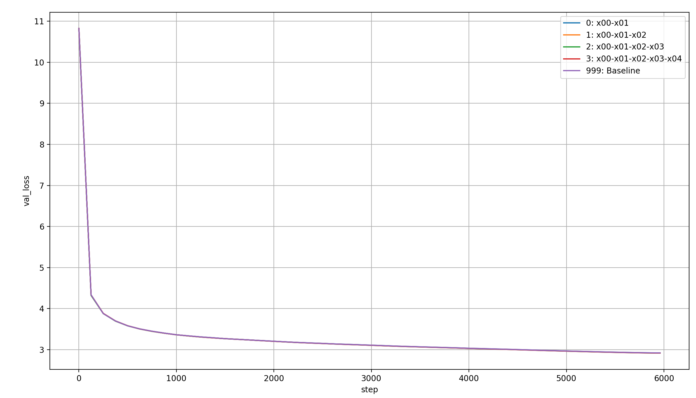
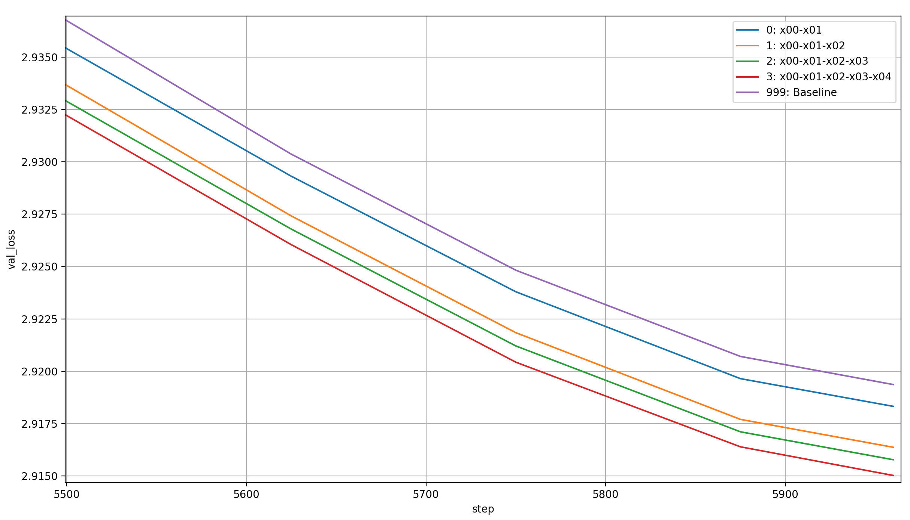
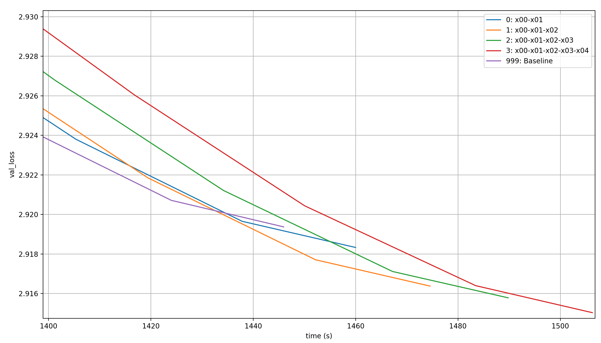

# modded-nanogpt: Embeddings Extravaganza 1 (x00-x04)

modded-nanogpt (LINK) adds the token-embedding x0 to the residual stream in a weighted sum before every layer. What happens if we create additional embeddings layers, and add more and more of them to the weighted sum?

## The setup

... TODO (explain baseline and what's added and how, plus initilization; will call each run by the maximum new embedding, so x01 for one added embedding, etc.; mention my prior work on looking at the lambdas)

## Validation losses

Let's first look at the validation losses per step:

As you can see, you can see nothing. We need to zoom in further to the end of training:

The obvious pattern that emerges is that with each additional embedding layer, the model learns more in each step. However, modded-nanogpt is all about performance per time, so let's plot that as well. This time, we'll simply look at the zoomed in last few steps:

What immediately jumps out is that beyond two additional embeddings, the performance per time-step degrades quickly. And even before that, the baseline is clearly the best throughout the majority of training. However, toward the very end, two runs with added embeddings seem to actually be better: x01 and x02. The differences are tiny though, and I chalk them up to random chance.

## Lambdas

To me, the most interesting part about these results is that adding more embedding layers just keep improving model performance per step. In some sense, that's expected, because embedding layers are just cheap additional parameters. On the other hand, I do find it somewhat surprising: these embeddings look at each token individually, so on their own they can at best achieve 1-gram accuracy, which is bad. They must help the model learn to make better use of the main layers somehow; let's look at the lambdas in order to find out how.

### x01

My expectation was that x00 will be high in the beginning and low in the end; and that x01 will be low in the beginning and high in the end. I expected this to be a continuous change. The reason is that I expected x00 to contain training statistics about the input embeddings, a clean representation of what the tokens mean, while x01 contains 1-gram statistics about the most likely next token-distribution given a single token. Then, x00 would become less useful over the layers and x01 more useful (though I didn't expect this separation of concerns to be nearly this clean or one-dimensional).

Here's how the lambdas for x, x00, and x01 acutally look at the end of training for the different layers:

TODO
