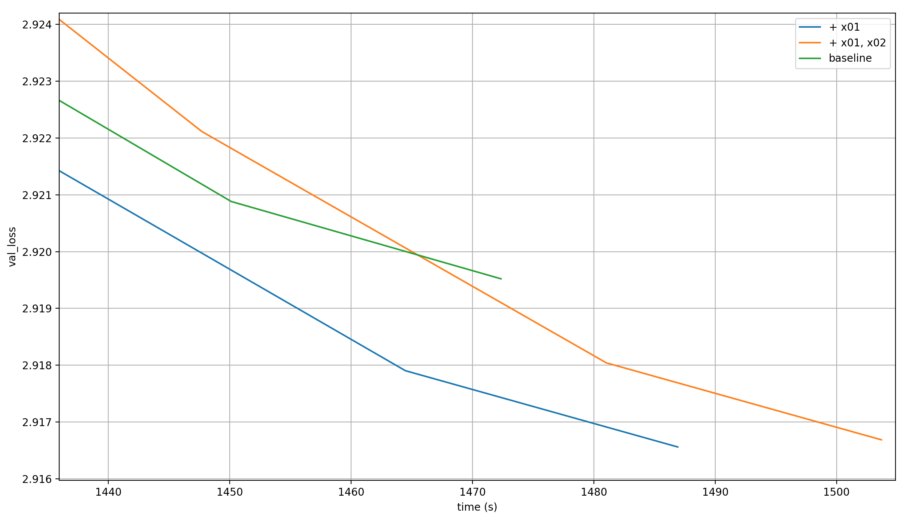
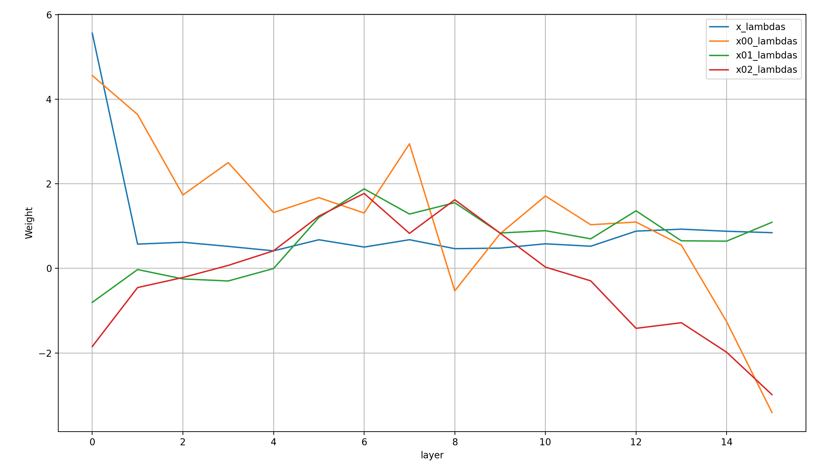
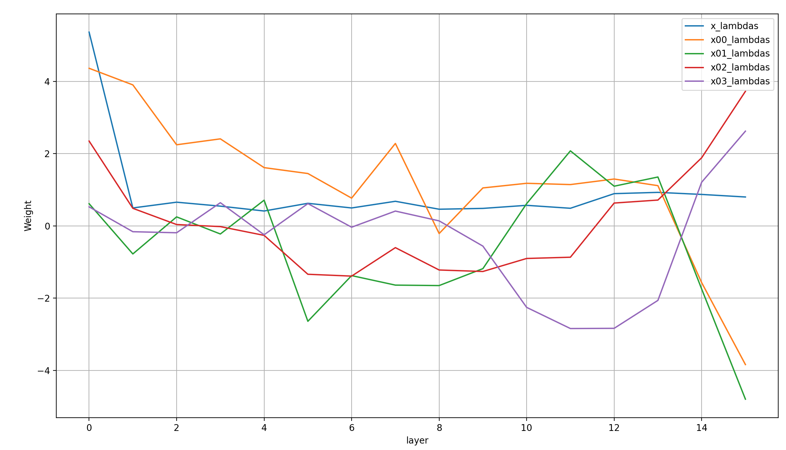
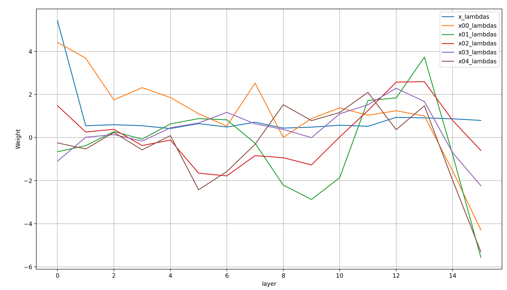
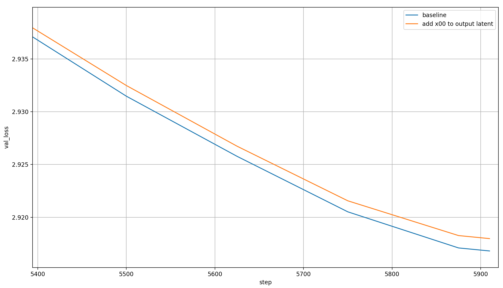

# modded-nanogpt world record: Decoupling embedding size from model dimension

I have achieved a (not yet official) [modded-nanogpt](https://github.com/KellerJordan/modded-nanogpt) medium track [world record](https://github.com/KellerJordan/modded-nanogpt/pull/124).

The technique is simple: embed the token sequence using multiple independent embedding layers. Then, perform a weighted sum over these embeddings and the residual stream at the input to every transformer layer. The weights are learned, and differ from layer to layer.

I believe that this effectively allows for a decoupling between embedding and model dimension, and I have hope that it's a pretty scalable technique. This article will consist of the following sections:

- [The status quo - modded-nanogpt medium before the record](#the-status-quo---modded-nanogpt-medium-before-the-record)
- [The record](#the-record)
- [Adding more embeddings: ablation](#adding-more-embeddings-ablation)
- [An attempt at interpretability work](#an-attempt-at-interpretability-work)
  - [Learned lambdas for one additional embedding](#learned-lambdas-for-one-additional-embedding)
  - [Learned lambdas with multiple added embeddings](#learned-lambdas-with-multiple-added-embeddings)
  - [Logit lens](#logit-lens)
  - [So why does adding more embeddings work?](#so-why-does-adding-more-embeddings-work)
- [Bonus experiment: Adding x00 to the output latent](#bonus-experiment-adding-x00-to-the-output-latent)
- [On scaling](#on-scaling)
- [Summary](#summary)
- [Appendix](#appendix)

> I want to thank [PrimeIntellect](https://app.primeintellect.ai/), and specifically [Johannes Hagemann](https://x.com/johannes_hage), for generous GPU credits that supported these experiments.

## The status quo - modded-nanogpt medium before the record

The modded-nanogpt architecture is convoluted and peculiar. It's also awesome, but still, I will leave out most of the complexity for this article.

The one aspect of it that matters here is that the input embedding x0 is added to the residual stream in a weighted sum at every layer. The weights of that weighted sum are learned, and they are different from layer to layer. In code it looks somewhat like this:

```python
x = x0 = norm(self.embed(input_sequence))  # RMS-normed input embeddings

for layer in self.layers:
    # The lambdas are learned scalar values
    x = lambdas[i][0] * x + lambdas[i][1] * x0
    x = layer(x)  # includes residual
```

I've talked about this before in my [article about modded-nanogpt lambdas](https://snimu.github.io/2025/08/11/modded-nanogpt-lambdas.html); in short, adding x0 at evey layer shortens the gradient path to the input embeddings significantly. It also provides way more gradient information to them, because in the backward pass, each layer acts as data augmentation for the gradient of the previous layer. Additionally, adding x0 to every layer input reduces the job of the LLM to simple embedding math, as explained in the article.

## The record

For my record attempts, I used as a baseline [my previous record](https://snimu.github.io/2025/10/07/modded-nanogpt-value-embeddings.html). It increased the number of value embeddings from three to five, which allowed me to reduce the number of training steps. However, all experiments discussed in this article but the actual record attempt were run concurrently with the experiments that led to my previous record, so they will only use three value embeddings and more training steps.

The ablations in this article concern adding more embeddings, and adding them in the following way to the residual stream before applying the transformer layer, for every layer:

```python
# Create the embeddings
x = x00 = norm(self.embed1(input_sequence))
x01 = norm(self.embed2(input_sequence))
...  # up to x04

# Sum the embeddings at every layer and apply the layer
# Ignores skip connections, etc.
for i, layer in enumerate(self.layers):
    # The lambdas are learned scalar values
    x = lambdas[i][0] * x + lambdas[i][1] * x00 + lambdas[i][2] * x01 + ...  # up to x04
    x = layer(x)  # includes residual
```

For my first experiment, I compared adding one additional embedding ("+ x01") and two ("+ x01, x02") to the baseline (again, the baseline is my previous record with five total value embeddings applied to ten layers). Here are the results:



Clearly, adding a single new input-embedding will lead to a new record. So I ran a few tests to see on how much I could reduce the number of steps, and settled on 5690.

Here are the resulting final validation losses over 19 runs:

```python
[2.919502, 2.91976, 2.920582, 2.919331, 2.919008, 2.919827, 2.918785, 2.918519, 2.919297, 2.920061, 2.918938, 2.919342, 2.918186, 2.920546, 2.91954, 2.919093, 2.918951, 2.919599, 2.919956]
```

And these are the basic stats:

- T-test p-value: 0.000359461
- Mean: 2.9194117 ± 0.00063
- Median: 2.919342
- Min: 2.918186
- Max: 2.920582

The final loss is below 2.92 with >99% likelihood.

Here are the corresponding run-times in seconds:

```python
[1414.299, 1412.033, 1411.668, 1421.735, 1411.998, 1411.094, 1412.637, 1410.047, 1410.509, 1412.048, 1411.574, 1415.299, 1411.649, 1412.94, 1412.508, 1410.912, 1415.296, 1410.778, 1407.511]
```

Leading to the following stats:

- Mean: 1412.449 ± 2.8062
- Median: 1411.998
- Min: 1407.511
- Max: 1421.735

The mean time is ~1412.5 seconds (23.54 minutes). This is a reduction of 36.5 seconds compared to the previous record's 1449 seconds.

## Adding more embeddings: ablation

Before that record attempt, I performed an ablation on adding more and more embeddings. Note that the loss curves shown below are for a single run each, so chance plays a part.

Let's first look at the validation losses per step, zoomed in so we can see something:


The obvious pattern that emerges is that with each additional embedding layer, the model learns more in each step. However, modded-nanogpt is all about performance per time, so let's plot that as well. This time, we'll simply look at the zoomed-in last few steps:


It looks like the performance per time-step degrades quickly beyond two additional embeddings. And even before that, the baseline is clearly the best throughout the majority of training. However, toward the very end, two runs with added embeddings seemed to actually be better: x01 and x02. The differences are tiny though, and I chalked them up to random chance; still, this is what led me to perform the further experiments that led to my record.

Below, I will try to determine how the model uses the additional embedding to improve its per-step (and, depending on the flag, per-time-step) performance.

## An attempt at interpretability work

To me, the most interesting part about these results is that adding more embedding layers just keeps improving model performance per step. In some sense, that's expected, because embedding layers are cheap additional parameters. On the other hand, I do find it somewhat surprising: these embeddings look at each token individually, so on their own they can at best achieve 1-gram accuracy, which is bad. They must help the model learn to make better use of the transformer layers somehow; let's look at how they do this.

I will mostly limit myself to adding only a single embedding (x01), started from the old baseline with only three value embeddings. I will use multiple tools to tease out the function of the different compontents of the model, starting with looking at the learned lambdas, a.k.a. the scalar weights of the weighted sum of inputs.

### Learned lambdas for one additional embedding

Here's how the lambdas for x, x00, and x01 look at the end of training for the different layers, averaged over 5 runs (because they are a bit noisy):


There are so many things to say!

- As always, layer 8 is a bit of an exception to everything I'm going to say below, but that's just because there is no attention at layer 7, which influences all lambdas in layer 8 significantly
- At the input, x == x00, and both are very high, suppressing x01
- Afterward, the weights of x falls to a constant low value over the layer, and it barely changes until the very end
- The weight of x00 is noisy, but seems to fall pretty consistently from layer to layer
- The weight of x01 is a very low positive value throughout the layers
- That's until the very end&mdash;layers 12-15&mdash;where x00 suddenly drops like a stone into negative territory, and x01 rises quickly

Typically, the norm of the activations rises from layer to layer if we don't use post-norm, which we don't. Since the embeddings x00 and x01 *don't* change in norm, this changes the total weight of each component significantly.

So I measured the norms of x over the different layers to make up for this phenomenon.

Here is that plot:


I can see two noteworthy phenomena.

The first is that the effects discussed above are very strongly visible even in the normalized plot, which is good to know.

The second is that in layer 8, the weight of x rises sharply, and that of x00 drops off a cliff. I assume that that's due to layer 7 not having an attention block, only an MLP. Since an MLP just approximates an embeddings layer that takes combinations of tokens, it will be able to replace x00 at this point. But since an MLP has far more capacity than an embedding layer (and more context due to the previous layers), it will be able to do so much better. I would guess that this makes x00 a distraction compared to what the MLP already adds to the residual stream, necessitating it to be set to approximately zero.

### Learned lambdas with multiple added embeddings

Let's look at the lambdas over the layers at the end of training, for different numbers of added embeddings at the input (all with three total value embeddings still). I forgot to save the activation norms unfortunately, so the scale of x isn't accurate (it's effectively rising over the layers). All the embeddings have the same norm though (because they were actively normed), so their relative lambdas are very meaningful.

Here are the lambdas for two additional embeddings:



This is unfortunately pretty noisy. I can see two trends though that we've seen before and will see again:

1. x starts high, then falls sharply and stays constant. Again, this is just the lambda, ignoring the norm of the activations, so x is actually rising over the layers; but it is at least the trend for the lambda
2. x00 falls off sharply at the end
3. The other lambdas differ clearly in some layers. In this case, x01 and x02 track closely in the first 10 layers, but then diverge quickly

Now, here are the lambdas for three additional embeddings:



The same trends as before apply. Especially interesting is the fact that the relative weights of the lambdas for x01, x02, and x03 seem to shift in five distinct phases, with the shifts occuring after a fairly consistent number of layers each:

1. In the first layer (layer 0), they are all fairly high (though x and x00 have much higher lambdas, so they are low in relative terms)
2. Then, they are close to zero for four layers while x00 slowly falls, up to and including layer 4
3. Starting at layer 5, x01 and x02 become negative, while x03 stays close to zero and x00 continues to fall for four more layers
4. Starting at layer 9, the values of x01 and x02 slowly go positive, while the value of x03 slowly goes negative and x00 stays constant for four more layers
5. Starting at layer 13 (and a little bit at layer 12), the values of x00 and x01 fall off sharply, while those of x02 and x03 rise sharply for the last three layers

This is a cool dynamic, and my guess is that this is what enables the additional embeddings layers to improve performance. More on that later.

Now here are the lambdas with four additional embeddings:



Similarly to the previous plot, the lambdas seem to change modes every few layers. However, it is chaotic enough that I'm not confident in naming specific mode boundaries; it's more of a visual feeling to me than something concrete.

### Logit lens

To explain these phenomena, I used [the logit lens](https://www.lesswrong.com/posts/AcKRB8wDpdaN6v6ru/interpreting-gpt-the-logit-lens); concretely, I applied the language head to different vectors in the model: x at every layer, x00 and x01, and the value embeddings.

I took 128 random input tokens from an unseen part of the train set (so the test set?), ran a forward pass over them, and saved the top-10 predictions for the following vectors:

- The residual x at the input of every layer, before it'a mixed with x00, x01, or the value embeddings; and at the position it's usually decoded from, after all the blocks
- The embeddings x00 and x01
- The value-embeddings ve0, ve1, and ve2
- The value-embeddings after they have been projected back into the space of the residual stream via `W_o`

You can find the full ten predictions under [predictions.md](https://github.com/snimu/modded-nanogpt-experiments/blob/main/experiments/00004-x0/predictions.md), together with the predicted probability for each token, and the code that produced the results [at this file](https://github.com/snimu/modded-nanogpt-experiments/blob/main/experiments/00004-x0/runs/4-2025-08-22-x00-x01-with-word-logging.py). In the [Appendix](#appendix), I simply show the most likely next token at each position, for each of the different components; and below, an even more compact table.

There are some symbols which my terminal didn't properly render, but I noticed too late. I believe it's just the "'" sign.

> I replaced newlines with '\n' and space with '_'.

This is what the different symbols mean:

- `t{i}` is the token at position i
- `vector` refers to the vector that is being decoded (plus the 'input' which are simply the raw input tokens)
- `x-{j}` refers to x before the weighted sum with x00 and x01 at layer j
- `x-out` is the output latent that is commonly decoded by the language head
- `ve0`, `ve1`, and `ve2` are the value embeddings of the tokens decoded by the language head
- `ve{i}_o{j}` is `ve{i}` projected into the residual space via the output projection of the attention weight at layer `{j}`, then decoded by the language head

| vector   | t0           | t1        | t2         | t3       | t4          | t5           | t6      | t7            | t8     | t9      | t10              | t11   |
|----------|--------------|-----------|------------|----------|-------------|--------------|---------|---------------|--------|---------|------------------|-------|
| **input**    | mail         | _account  | :          | _email   | @           | example      | .       | com           | \n     | -       | _Emails          | _will |
| **x-0**      | _address     | ants      | _http      | _address | #$          | _of          | \n      | /             | The    | based   | ensitive         | _be   |
| **x-1**      | _sites       | _Plays    | _http      | _hub     | �           | _Usage       | \n      | <|endoftext|> | _�     | _The    | _to              | _not  |
| **x-2**      | _addresses   | _websites | |          | _address | example     | )|           | |       | <|endoftext|> | |      | _Posted | _from            | _be   |
| **x-3**      | _first       | _first    | |          | @        | example     | ever         | |       | \n            | |      | _1      | _from            | _be   |
| **x-4**      | )?           | _resume   | The        | @        | _div        | _dot         | The     | )             | The    | PH      | _from            | _be   |
| **x-5**      | Microsoft    | Microsoft | Microsoft  | @        | _subscriber | .;           | The     | /#            | The    | Date    | _from            | _be   |
| **x-6**      | Microsoft    | >         | Date       | >        | _pc         | _dot         | I       | .             | The    | _Date   | _from            | _be   |
| **x-7**      | |            | |         | Date       | @        | nt          | .            | com     | \n            | The    | _Date   | :                | _be   |
| **x-8**      | :            | .         | email      | @        | rav         | .            | com     | .             | The    | _Posted | :                | _be   |
| **x-9**      | Today        | _of       | Name       | @        | posted      | .            | com     | .             | The    | _Posted | _email           | _be   |
| **x-10**     | .-           | .         | Software   | @        | example     | _dot         | |       | .             | The    | _Date   | _must            | _be   |
| **x-11**     | ribune       | ,         | mail       | @        | example     | .            | |       | .             | |      | _Date   | :                | _be   |
| **x-12**     | .            | .         | mail       | @        | name        | .            | |       | .             | |      | _A      | :                | _be   |
| **x-13**     | .            | .         | \n         | @        | example     | .            | gov     | .             | The    | _What   | :                | _be   |
| **x-14**     | .            | .         | \n         | @        | example     | .            | com     | \n            | The    | _What   | _are             | _be   |
| **x-15**     | .            | _of       | \n         | @        | example     | .            | com     | \n            | The    | _Email  | _sent            | _be   |
| **x-out**    | mail         | .         | \n         | @        | example     | .            | com     | \n            | -      | _The    | _to              | _be   |
| **x00**      | _address     | ants      | _http      | _address | #$          | _of          | \n      | /             | The    | based   | ensitive         | _be   |
| **x01**      | gery         | _account  | :          | sts      | @           | urses        | .       | weet          | \n     | -       | =-=-=-=-=-=-=-=- | _will |
| **ve0**      | board        | s         | IRO        | Grid     | _pleasure   | Url          | aries   | _someday      | shire  | ences   | _need            | _Tube |
| **ve1**      | CN           | peat      | _desks     | ˈ        | ua          | ony          | atton   | vy            | emia   | ˈ       | ş                | hips  |
| **ve2**      | gers         | scene     | _herself   | assic    | 's          | ops          | ESS     | rians         | ball   | iary    | _quo             | ?"    |
| **ve0_o0**   | _sites       | _deposit  | _our       | _HR      | _helm       | _volunteers  | _are    | ounces        | _�     | _budget | Google           | _be   |
| **ve1_o1**   | ].           | agy       | _Hendricks | _email   | w           | _best        | entimes | _CNBC         | opolis | avored  | string           | _be   |
| **ve2_o2**   | _email       | _account  | _Eye       | _email   | @           | _example     | _quick  | acting        | _quo   | -       | _Emails          | _be   |
| **ve0_o13**  | _newsletters | abilities | _hide      | _sender  | _Thank      | _documentary | .       | mitted        | \n     | -       | _Podesta         | _be   |
| **ve1_o14**  | _sender      | _credited | ;          | @        | _@          | _herself     | .       | endas         | "      | -       | _Alert           | _will |
| **ve2_o15**  | mail         | _account  | :          | _email   | @           | example      | lled    | com           | \n     | -       | _Emails          | _will |

**x00**, the input embeddings, are interpreted by the language head as next-token-predictions: "mail" &rarr; "address", "account" &rarr; "atns", etc. are all clear 1-gram next-token predictions. This has been noted by the original logit lens article already, so it's nice to see it confirmed here.

**x01** sometimes contains a copy of the input, sometimes a seemingly random token. However, the top-10 predictions often include similarly-sounding or -written words, or variants. For example, the next prediction for " account" is `[' account', ' accounts', ' Account', 'account', 'nan', 'ban', 'rint', 'p']`. Some variant of "account" appears very often, and the other tokens make some sense for the token 'account' as well: 'p' and 'rint' make 'print', 'nan' is a common value that accountants have to deal with, and an account can be banned as in 'ban'. It looks like x01 consists of a bunch of tokens that are just different writings of the input token, plus a bunch of loose associations.

So my **intermediate conclusion** is that the language head treats the input embeddings of current tokens as embeddings of the next token for each, and x01 makes up for that by providing information about and associations with the input embeddings. This has the nice side-effect that it minimizes the amount of change to x required over the length of the model, because leaving it un-changed makes it simply the 1-gram next-token predictions, which are already decent.

The next observation is that **x** also makes next-token predictions (obviously). One model of what's happening inside the model is:

- x00 provides a 1-gram next-token prediction distribution at every layer of the model
- In early layers, this helps the model pick a direction for x, by biasing it
- In the last few layers, this prediction is substracted from x, to reduce the 1-gram bias which is of course sub-optimal, leaving only the refined x
- x01 gives an approximate view of the input, and the contrast between it and the next-token predictions by x00 gives the model additional information about how exactly it needs to refine the vector to make the best possible predictions

As for the **value embeddings**, they are (1) very different, and (2) make no sense. The latter isn't surprising; after all, they are applied inside the attention mechanism, not to the residual directly, so they are two transformations away from where the language head is usually applied.

However, when they are projected back into the residual stream with the output projections of the attention layers they are used in, the predictions suddenly make more sense again. It's also notable that the same value embedding clearly has different functions in each of the two layers it's used in, as projected back into the residual stream.

Let's first look at ve0 at both layers 0 and 13:

| vector   | t0           | t1        | t2    | t3      | t4     | t5           | t6   | t7     | t8   | t9      | t10      | t11   |
|----------|--------------|-----------|-------|---------|--------|--------------|------|--------|------|---------|----------|-------|
| **input**    | mail         | _account  | :     | _email  | @      | example      | .    | com    | \n   | -       | _Emails  | _will |
| **ve0_o0**   | _sites       | _deposit  | _our  | _HR     | _helm  | _volunteers  | _are | ounces | _�   | _budget | Google   | _be   |
| **ve0_o13**  | _newsletters | abilities | _hide | _sender | _Thank | _documentary | .    | mitted | \n   | -       | _Podesta | _be   |

Some observations:

- ve0_o0 seems to mostly play word association; not predictions, not exact copying of the inputs
- ve0_o13 is similar, but a clearer mixture of somewhat sensible completions ("_account" + "abilities" = "_accountabilities"), associations ("mail" &rarr; "newsletters") and copying ("." &rarr; "."). There's also some apparent nonsense in there ("_Emails" &rarr; "_Podesta"), and "_will" is always followed by the prediction "_be"

Unfortunately, I cannot see any super obvious patterns beyond those vague ones, so let's move on to ve1:

| vector   | t0      | t1        | t2         | t3     | t4   | t5       | t6      | t7    | t8     | t9     | t10     | t11   |
|----------|---------|-----------|------------|--------|------|----------|---------|-------|--------|--------|---------|-------|
| **input**    | mail    | _account  | :          | _email | @    | example  | .       | com   | \n     | -      | _Emails | _will |
| **ve1_o1**   | ].      | agy       | _Hendricks | _email | w    | _best    | entimes | _CNBC | opolis | avored | string  | _be   |
| **ve1_o14**  | _sender | _credited | ;          | @      | _@   | _herself | .       | endas | "      | -      | _Alert  | _will |

- For ve1_o1, the predictions are mostly nonsense. "_account" &rarr; "agy"? ":" &rarr; "_Hendricks"? "@" &rarr; "w"? The only predictions that make sense to me are copying "_email", the prediction "_will" &rarr; "_be", and *maybe* "com" &rarr; "_CNBC"
- ve1_o14 on the other hand is clearly an association machine, which makes it a partial predictor. "mail" &rarr; "_sender", "_account" &rarr; "_credited", etc. All of these make sense.

This leaves us with ve2:

| vector   | t0     | t1       | t2   | t3     | t4   | t5       | t6     | t7     | t8   | t9   | t10     | t11   |
|----------|--------|----------|------|--------|------|----------|--------|--------|------|------|---------|-------|
| **input**    | mail   | _account | :    | _email | @    | example  | .      | com    | \n   | -    | _Emails | _will |
| **ve2_o2**   | _email | _account | _Eye | _email | @    | _example | _quick | acting | _quo | -    | _Emails | _be   |
| **ve2_o15**  | mail   | _account | :    | _email | @    | example  | lled   | com    | \n   | -    | _Emails | _will |

- ve2_o2 is a mixture of association, copying, and prediction
- ve2_o15 is a pure copying of the input information (with one screwup for "." &rarr; "lled")

The last point is very important: it means that the model at its final layer has three embeddings available, which represent three things:

- x00 represents the 1-gram next-token predictions
- x01 represents associations with the input tokens, and tokens that are similar to the input tokens
- ve2 represents the input tokens themselves

In general, it seems to me like a lot of the point of these embeddings is to group tokens in different ways; partially to make up for the lack of byte-level information ("_account" &rarr; "_account" / "_accounts" / ...), partially to suggest semantic closeness ("_account" &rarr; "_deposit"), partially to give a view of the input data, and partially to suggest common completions.

The different lambdas then allow the model to mix and match these embeddings, and the transformer layers allow it to dynamically apply corrections. That's speculation though, as I don't have any strong evidence for it besides the language head outputs for the different vectors (and I didn't look at all of them, only the subset that I've presented above).

### So why does adding more embeddings work?

Again, the simplest explanation is that embeddings are cheap additional parameters.

However, if I simply added the two embeddings together with equal weight at each layer (or only at the input), they would have no more expressive power than a single embedding layer.

The explanation for why it works is that the weights of the weighted sum is different for each layer, so each layer gets a different combination of the embeddings. [Larry Dial](https://github.com/ClassicLarry) said it best in [this comment on my PR](https://github.com/KellerJordan/modded-nanogpt/pull/124#issuecomment-3282878227):

> Basically you have gotten rid of the concept of a token embedding vector. Instead of representing a token as a fixed point in d_model dimensional space, you have added a degree of freedom where a token embedding is represented by interpolating between two points defined by embed1 and embed2, and the interpolation point varies by layer.

At least in the models I've trained, this leads to an interesting separation of concerns between the embeddings, as discussed above. The part that stuck out most to me was the fact that x00 was decoded into next-token predictions. This means that the embedding and lm-head together are already an okay next-token predictor. It also means that the transformer layers only have to apply minimal edits to x00 in order to make the predictions much stronger. Deep Neural Networks love gradual edits (they are one of the nice things about residual connections), so this is great!

And again, it should have been obvious to me, because [the logit lens](https://www.lesswrong.com/posts/AcKRB8wDpdaN6v6ru/interpreting-gpt-the-logit-lens) explicitly showed this a long time ago. Still, it's neat to see that the model makes use of this property very strongly.

## On scaling

Since I have no experience in scaling LLMs to large sizes (and I haven't done the experiments), this section is full on speculation.

Anyway, I can imagine that this technique of adding more embedding layers will scale fairly well, for two reasons:

- As the model gets wider, adding the extra embeddings costs less and less relative to the matrix products, because the cost of scalar addition scales linearly with the model dimension, while the cost of matrix multiplication rises quadratically. And since the embeddings themselves are just lookup tables, producing them will always be comparatively cheap
- As the model gets deeper, I expect that the number of embedding layers that can be added productively to increase. That's because as the number of layers increases, so does the number of different combinations of these embeddings that can be used inside the model

Effectively, this method of increasing the number of input embeddings and doing a learned weighted sum between them and the residual at every layer input *decouples the possible embedding size from the model dimension*.

There are things like parallelizability which I don't know too much about which might make the method infeasible, or simply diminishing returns with scale; but it looks at least worth a try to me.

## Bonus experiment: Adding x00 to the output latent

I also tried adding x00 to the normed x at the output latent in a learned weighted sum. Normally, we only add these embeddings to the *inputs* of transformer layers, but here I've added one of them to the *output*  of the last layer. I had planned on doing similar ablations as [above](#adding-more-embeddings-ablation), but this setting destroyed the model performance so much that I just didn't bother; see below (losses averaged over 2 runs each):



Clearly, adding x00 to x reduces performance over the steps. Since it also adds overhead from the addition, it's definitely worse than the baseline.

My initial explanation for this is that the last MLP is essential for making sense of the actual combinatin of embeddings, and that is missing in this approach. In other words, don't touch the output with static embeddings.

## Summary

I have achieved a modded-nanogpt medium world record, and performed some basic interpretability work using the logit lens. I suspect that the method is fairly general and scales well.

## Appendix

<details>
<summary>Formatted next-token predictions from the logit lens</summary>

The dictionary shows one sub-dictionary for each component (x, x00, etc.). Each of these subdictionaries maps from the token position to another sub-sub-dictionary, which in turn maps from the true input tokens at each position to the most likely next token as decoded from each component by the language head.

```python
{
    'x-0': {
        0: {'mail': ' address'},
        1: {' account': 'ants'},
        2: {':': ' http'},
        3: {' email': ' address'},
        4: {'@': '#$'},
        5: {'example': ' of'},
        6: {'.': '\n'},
        7: {'com': '/'},
        8: {'\n': 'The'},
        9: {'-': 'based'},
        10: {' Emails': 'ensitive'},
        11: {' will': ' be'},
        12: {' include': ' a'},
        13: {' text': 'ured'},
        14: {' and': 'rogen'},
        15: {' links': ' to'},
        16: {'.': '\n'},
        17: {' Nothing': ' else'},
        18: {' fancy': ' fancy'},
        19: {'.': '\n'},
        20: {' We': "'re"},
        21: {'�': '�'},
        22: {'�': 's'},
        23: {'re': ' going'},
        24: {' keeping': ' them'},
        25: {' it': 'alian'},
        26: {' simple': 'tons'},
        27: {'.': '\n'},
        28: {'\n': 'The'},
        29: {'-': 'based'},
        30: {' We': "'re"},
        31: {'�': '�'},
        32: {'�': 's'},
        33: {'ll': ' be'},
        34: {' highlight': ' the'},
        35: {' stories': ' about'},
        36: {',': ' but'},
        37: {' blogs': '/'},
        38: {' and': 'rogen'},
        39: {' other': 'worldly'},
        40: {' things': ' happen'},
        41: {' that': ' they'},
        42: {' remind': ' us'},
        43: {' us': 'hers'},
        44: {' that': ' they'},
        45: {' we': "'ll"},
        46: {'�': '�'},
        47: {'�': 's'},
        48: {'re': ' going'},
        49: {' made': ' sure'},
        50: {' of': ' the'},
        51: {' st': 'ilts'},
        52: {'ard': 'rop'},
        53: {'ust': 'ered'},
        54: {' and': 'rogen'},
        55: {' updates': ' on'},
        56: {' on': ' the'},
        57: {' our': ' own'},
        58: {' work': 'station'},
        59: {'.': '\n'},
        60: {'\n': 'The'},
        61: {'-': 'based'},
        62: {' At': ' least'},
        63: {' the': ' same'},
        64: {' most': ' important'},
        65: {',': ' but'},
        66: {' we': "'ll"},
        67: {' may': ' be'},
        68: {' send': ' out'},
        69: {' out': 'fitted'},
        70: {' one': ' hundred'},
        71: {' email': ' address'},
        72: {' per': ' day'},
        73: {' week': 'long'},
        74: {'.': '\n'},
        75: {' But': 'chers'},
        76: {',': ' but'},
        77: {' don': "'t"},
        78: {'�': '�'},
        79: {'�': 's'},
        80: {'t': ' necessarily'},
        81: {' count': 'enance'},
        82: {' on': ' the'},
        83: {' it': 'alian'},
        84: {'.': '\n'},
        85: {' If': ' you'},
        86: {' we': "'ll"},
        87: {' have': ' been'},
        88: {' something': ' else'},
        89: {' to': ' be'},
        90: {' share': 'holding'},
        91: {',': ' but'},
        92: {' we': "'ll"},
        93: {'�': '�'},
        94: {'�': 's'},
        95: {'ll': ' be'},
        96: {' share': 'holding'},
        97: {' it': 'alian'},
        98: {'.': '\n'},
        99: {' If': ' you'},
        100: {' not': ' necessarily'},
        101: {',': ' but'},
        102: {' we': "'ll"},
        103: {' wont': ' be'},
        104: {'.': '\n'},
        105: {'\n': 'The'},
        106: {'-': 'based'},
        107: {' We': "'re"},
        108: {' will': ' be'},
        109: {' not': ' necessarily'},
        110: {' share': 'holding'},
        111: {' your': ' own'},
        112: {' email': ' address'},
        113: {' with': ' the'},
        114: {' anyone': ' else'},
        115: {' else': ' than'},
        116: {'.': '\n'},
        117: {' Period': 'icals'},
        118: {'.': '\n'},
        119: {'\n': 'The'},
        120: {'-': 'based'},
        121: {' If': ' you'},
        122: {' at': ' least'},
        123: {' any': ' kind'},
        124: {' time': 'frames'},
        125: {' you': "'re"},
        126: {' want': ' to'},
        127: {' to': ' be'}
    },
    'x-1': {
        0: {'mail': ' sites'},
        1: {' account': ' Plays'},
        2: {':': ' http'},
        3: {' email': ' hub'},
        4: {'@': '�'},
        5: {'example': ' Usage'},
        6: {'.': '\n'},
        7: {'com': '<|endoftext|>'},
        8: {'\n': ' �'},
        9: {'-': ' The'},
        10: {' Emails': ' to'},
        11: {' will': ' not'},
        12: {' include': ' a'},
        13: {' text': ' online'},
        14: {' and': ' a'},
        15: {' links': ' to'},
        16: {'.': '\n'},
        17: {' Nothing': ' else'},
        18: {' fancy': ' meets'},
        19: {'.': '\n'},
        20: {' We': "'ll"},
        21: {'�': '�'},
        22: {'�': 've'},
        23: {'re': ' not'},
        24: {' keeping': ' a'},
        25: {' it': ' cool'},
        26: {' simple': ' enough'},
        27: {'.': '\n'},
        28: {'\n': ' �'},
        29: {'-': ' The'},
        30: {' We': "'ll"},
        31: {'�': '�'},
        32: {'�': 've'},
        33: {'ll': ' be'},
        34: {' highlight': ' the'},
        35: {' stories': ' of'},
        36: {',': ' however'},
        37: {' blogs': ' on'},
        38: {' and': ' other'},
        39: {' other': ' social'},
        40: {' things': ' related'},
        41: {' that': ' won'},
        42: {' remind': ' us'},
        43: {' us': ' know'},
        44: {' that': ' we'},
        45: {' we': ' can'},
        46: {'�': '�'},
        47: {'�': 's'},
        48: {'re': ' not'},
        49: {' made': ' up'},
        50: {' of': ' the'},
        51: {' st': ' Instagram'},
        52: {'ard': ' clean'},
        53: {'ust': ' and'},
        54: {' and': ' therefore'},
        55: {' updates': ' on'},
        56: {' on': ' the'},
        57: {' our': ' own'},
        58: {' work': ' ethic'},
        59: {'.': '\n'},
        60: {'\n': ' �'},
        61: {'-': ' The'},
        62: {' At': ' the'},
        63: {' the': ' same'},
        64: {' most': ' popular'},
        65: {',': ' let'},
        66: {' we': ' can'},
        67: {' may': ' be'},
        68: {' send': ' a'},
        69: {' out': ' a'},
        70: {' one': ' day'},
        71: {' email': ' �'},
        72: {' per': ' day'},
        73: {' week': '.'},
        74: {'.': '\n'},
        75: {' But': ' let'},
        76: {',': ' however'},
        77: {' don': '�'},
        78: {'�': '�'},
        79: {'�': 's'},
        80: {'t': ' necessarily'},
        81: {' count': ' up'},
        82: {' on': ' a'},
        83: {' it': ' all'},
        84: {'.': '\n'},
        85: {' If': ' you'},
        86: {' we': ' have'},
        87: {' have': ' been'},
        88: {' something': ' else'},
        89: {' to': ' get'},
        90: {' share': ' your'},
        91: {',': ' however'},
        92: {' we': ' can'},
        93: {'�': '�'},
        94: {'�': 's'},
        95: {'ll': ' be'},
        96: {' share': ' your'},
        97: {' it': ' really'},
        98: {'.': '\n'},
        99: {' If': ' you'},
        100: {' not': ' enough'},
        101: {',': ' however'},
        102: {' we': ' can'},
        103: {' wont': ' open'},
        104: {'.': '\n'},
        105: {'\n': ' �'},
        106: {'-': ' The'},
        107: {' We': ' have'},
        108: {' will': ' be'},
        109: {' not': ' want'},
        110: {' share': ' our'},
        111: {' your': ' own'},
        112: {' email': ' address'},
        113: {' with': ' the'},
        114: {' anyone': ' else'},
        115: {' else': ' who'},
        116: {'.': '\n'},
        117: {' Period': ' Recap'},
        118: {'.': '\n'},
        119: {'\n': ' �'},
        120: {'-': ' The'},
        121: {' If': ' you'},
        122: {' at': ' the'},
        123: {' any': ' type'},
        124: {' time': ' you'},
        125: {' you': ' can'},
        126: {' want': ' a'},
        127: {' to': ' play'}
    },
    'x-2': {
        0: {'mail': ' addresses'},
        1: {' account': ' websites'},
        2: {':': '|'},
        3: {' email': ' address'},
        4: {'@': 'example'},
        5: {'example': ')|'},
        6: {'.': '|'},
        7: {'com': '<|endoftext|>'},
        8: {'\n': '|'},
        9: {'-': ' Posted'},
        10: {' Emails': ' from'},
        11: {' will': ' be'},
        12: {' include': ' a'},
        13: {' text': ' on'},
        14: {' and': ' other'},
        15: {' links': ' to'},
        16: {'.': '\n'},
        17: {' Nothing': ' else'},
        18: {' fancy': ','},
        19: {'.': '\n'},
        20: {' We': "'ll"},
        21: {'�': '�'},
        22: {'�': 've'},
        23: {'re': ' not'},
        24: {' keeping': ' out'},
        25: {' it': 'alian'},
        26: {' simple': ' enough'},
        27: {'.': '\n'},
        28: {'\n': 'The'},
        29: {'-': ' Buy'},
        30: {' We': "'re"},
        31: {'�': '�'},
        32: {'�': 've'},
        33: {'ll': ' be'},
        34: {' highlight': ' the'},
        35: {' stories': ' of'},
        36: {',': ' but'},
        37: {' blogs': ' on'},
        38: {' and': ' even'},
        39: {' other': ' related'},
        40: {' things': ' related'},
        41: {' that': ' are'},
        42: {' remind': ' me'},
        43: {' us': '�'},
        44: {' that': ' we'},
        45: {' we': '�'},
        46: {'�': '�'},
        47: {'�': 've'},
        48: {'re': ' not'},
        49: {' made': ' by'},
        50: {' of': ' course'},
        51: {' st': ' Instagram'},
        52: {'ard': 'ess'},
        53: {'ust': ' and'},
        54: {' and': ' therefore'},
        55: {' updates': ' from'},
        56: {' on': ' the'},
        57: {' our': ' own'},
        58: {' work': ' to'},
        59: {'.': '\n'},
        60: {'\n': 'The'},
        61: {'-': ' Read'},
        62: {' At': ' least'},
        63: {' the': ' same'},
        64: {' most': ' recent'},
        65: {',': ' however'},
        66: {' we': "'ll"},
        67: {' may': ' be'},
        68: {' send': ' out'},
        69: {' out': ' some'},
        70: {' one': ' of'},
        71: {' email': ' to'},
        72: {' per': ' day'},
        73: {' week': ' or'},
        74: {'.': '\n'},
        75: {' But': ' it'},
        76: {',': ' even'},
        77: {' don': '�'},
        78: {'�': '�'},
        79: {'�': 's'},
        80: {'t': ' necessarily'},
        81: {' count': ' yourself'},
        82: {' on': ' the'},
        83: {' it': 'self'},
        84: {'.': '\n'},
        85: {' If': ' you'},
        86: {' we': "'re"},
        87: {' have': ' a'},
        88: {' something': ' to'},
        89: {' to': ' say'},
        90: {' share': ' with'},
        91: {',': ' but'},
        92: {' we': "'ll"},
        93: {'�': '�'},
        94: {'�': 've'},
        95: {'ll': ' be'},
        96: {' share': ' your'},
        97: {' it': 'self'},
        98: {'.': '\n'},
        99: {' If': ' you'},
        100: {' not': ' enough'},
        101: {',': ' however'},
        102: {' we': "'ll"},
        103: {' wont': ' be'},
        104: {'.': '\n'},
        105: {'\n': 'The'},
        106: {'-': ' Read'},
        107: {' We': "'re"},
        108: {' will': ' be'},
        109: {' not': ' be'},
        110: {' share': ' with'},
        111: {' your': ' own'},
        112: {' email': ' address'},
        113: {' with': ' regard'},
        114: {' anyone': ' else'},
        115: {' else': ' who'},
        116: {'.': '\n'},
        117: {' Period': 's'},
        118: {'.': '\n'},
        119: {'\n': 'If'},
        120: {'-': ' Buy'},
        121: {' If': ' you'},
        122: {' at': ' least'},
        123: {' any': ' point'},
        124: {' time': ' during'},
        125: {' you': ' can'},
        126: {' want': ' to'},
        127: {' to': ' spend'}
    },
    'x-3': {
        0: {'mail': ' first'},
        1: {' account': ' first'},
        2: {':': '|'},
        3: {' email': '@'},
        4: {'@': 'example'},
        5: {'example': 'ever'},
        6: {'.': '|'},
        7: {'com': '\n'},
        8: {'\n': '|'},
        9: {'-': ' 1'},
        10: {' Emails': ' from'},
        11: {' will': ' be'},
        12: {' include': ' a'},
        13: {' text': ' on'},
        14: {' and': ' other'},
        15: {' links': ' to'},
        16: {'.': '\n'},
        17: {' Nothing': ' else'},
        18: {' fancy': ','},
        19: {'.': '\n'},
        20: {' We': "'ll"},
        21: {'�': '�'},
        22: {'�': 're'},
        23: {'re': ' not'},
        24: {' keeping': ' away'},
        25: {' it': ' safe'},
        26: {' simple': '.'},
        27: {'.': '\n'},
        28: {'\n': '-'},
        29: {'-': ' A'},
        30: {' We': "'re"},
        31: {'�': '�'},
        32: {'�': 're'},
        33: {'ll': ' be'},
        34: {' highlight': ' the'},
        35: {' stories': ' of'},
        36: {',': ' including'},
        37: {' blogs': ','},
        38: {' and': ' even'},
        39: {' other': ' related'},
        40: {' things': ' related'},
        41: {' that': ' are'},
        42: {' remind': ' me'},
        43: {' us': ' of'},
        44: {' that': ' they'},
        45: {' we': '�'},
        46: {'�': '�'},
        47: {'�': 're'},
        48: {'re': ' not'},
        49: {' made': ' by'},
        50: {' of': ' �'},
        51: {' st': 'ables'},
        52: {'ard': 'lights'},
        53: {'ust': ' and'},
        54: {' and': ' therefore'},
        55: {' updates': ' from'},
        56: {' on': ' the'},
        57: {' our': ' own'},
        58: {' work': 'bench'},
        59: {'.': '\n'},
        60: {'\n': '-'},
        61: {'-': ' A'},
        62: {' At': ' least'},
        63: {' the': ' end'},
        64: {' most': ' time'},
        65: {',': ' it'},
        66: {' we': ' can'},
        67: {' may': ' be'},
        68: {' send': ' out'},
        69: {' out': ' to'},
        70: {' one': ' of'},
        71: {' email': ' to'},
        72: {' per': ' day'},
        73: {' week': ' or'},
        74: {'.': '\n'},
        75: {' But': ' it'},
        76: {',': ' there'},
        77: {' don': '�'},
        78: {'�': '�'},
        79: {'�': 't'},
        80: {'t': ' necessarily'},
        81: {' count': ' any'},
        82: {' on': ' any'},
        83: {' it': 'self'},
        84: {'.': '\n'},
        85: {' If': ' you'},
        86: {' we': '�'},
        87: {' have': ' a'},
        88: {' something': ' else'},
        89: {' to': ' remember'},
        90: {' share': ' with'},
        91: {',': ' then'},
        92: {' we': ' can'},
        93: {'�': '�'},
        94: {'�': 're'},
        95: {'ll': ' be'},
        96: {' share': ' with'},
        97: {' it': ' with'},
        98: {'.': '\n'},
        99: {' If': ' you'},
        100: {' not': ' necessarily'},
        101: {',': ' then'},
        102: {' we': '�'},
        103: {' wont': ' be'},
        104: {'.': '\n'},
        105: {'\n': '-'},
        106: {'-': ' A'},
        107: {' We': '�'},
        108: {' will': ' be'},
        109: {' not': ' be'},
        110: {' share': ' with'},
        111: {' your': ' own'},
        112: {' email': ' address'},
        113: {' with': ' any'},
        114: {' anyone': ' else'},
        115: {' else': ' who'},
        116: {'.': '\n'},
        117: {' Period': 'icity'},
        118: {'.': '\n'},
        119: {'\n': '-'},
        120: {'-': ' A'},
        121: {' If': ' you'},
        122: {' at': ' least'},
        123: {' any': ' time'},
        124: {' time': ' during'},
        125: {' you': ' can'},
        126: {' want': ' to'},
        127: {' to': ' be'}
    },
    'x-4': {
        0: {'mail': ')?'},
        1: {' account': ' resume'},
        2: {':': 'The'},
        3: {' email': '@'},
        4: {'@': ' div'},
        5: {'example': ' dot'},
        6: {'.': 'The'},
        7: {'com': ')'},
        8: {'\n': 'The'},
        9: {'-': 'PH'},
        10: {' Emails': ' from'},
        11: {' will': ' be'},
        12: {' include': ' a'},
        13: {' text': ' of'},
        14: {' and': ' other'},
        15: {' links': ' to'},
        16: {'.': '\n'},
        17: {' Nothing': ' else'},
        18: {' fancy': ' but'},
        19: {'.': '\n'},
        20: {' We': "'ll"},
        21: {'�': '�'},
        22: {'�': 've'},
        23: {'re': ' not'},
        24: {' keeping': ' away'},
        25: {' it': ' cool'},
        26: {' simple': ','},
        27: {'.': '\n'},
        28: {'\n': '-'},
        29: {'-': ' The'},
        30: {' We': "'ll"},
        31: {'�': '�'},
        32: {'�': 've'},
        33: {'ll': ' be'},
        34: {' highlight': ' the'},
        35: {' stories': ' of'},
        36: {',': ' including'},
        37: {' blogs': ','},
        38: {' and': ' other'},
        39: {' other': ' related'},
        40: {' things': ' related'},
        41: {' that': ' happen'},
        42: {' remind': ' me'},
        43: {' us': ' of'},
        44: {' that': ' they'},
        45: {' we': ' can'},
        46: {'�': '�'},
        47: {'�': 've'},
        48: {'re': ' able'},
        49: {' made': ' by'},
        50: {' of': ' different'},
        51: {' st': 'rows'},
        52: {'ard': 'ological'},
        53: {'ust': ' and'},
        54: {' and': ' therefore'},
        55: {' updates': ' of'},
        56: {' on': ' the'},
        57: {' our': ' own'},
        58: {' work': ' for'},
        59: {'.': '\n'},
        60: {'\n': '-'},
        61: {'-': ' A'},
        62: {' At': ' least'},
        63: {' the': ' same'},
        64: {' most': ' possible'},
        65: {',': ' we'},
        66: {' we': "'ll"},
        67: {' may': ' be'},
        68: {' send': ' out'},
        69: {' out': ' some'},
        70: {' one': ' of'},
        71: {' email': ' to'},
        72: {' per': ' week'},
        73: {' week': ' or'},
        74: {'.': '\n'},
        75: {' But': ' it'},
        76: {',': ' unfortunately'},
        77: {' don': "'t"},
        78: {'�': '�'},
        79: {'�': 't'},
        80: {'t': ' necessarily'},
        81: {' count': ' out'},
        82: {' on': ' them'},
        83: {' it': 'self'},
        84: {'.': '\n'},
        85: {' If': ' you'},
        86: {' we': "'re"},
        87: {' have': ' a'},
        88: {' something': ' like'},
        89: {' to': ' teach'},
        90: {' share': ' with'},
        91: {',': ' then'},
        92: {' we': "'ll"},
        93: {'�': '�'},
        94: {'�': 've'},
        95: {'ll': ' be'},
        96: {' share': ' with'},
        97: {' it': 'self'},
        98: {'.': '\n'},
        99: {' If': ' you'},
        100: {' not': ' necessarily'},
        101: {',': ' then'},
        102: {' we': "'ll"},
        103: {' wont': ' be'},
        104: {'.': '\n'},
        105: {'\n': '-'},
        106: {'-': ' In'},
        107: {' We': ' need'},
        108: {' will': ' be'},
        109: {' not': ' necessarily'},
        110: {' share': ' any'},
        111: {' your': ' thoughts'},
        112: {' email': ' address'},
        113: {' with': ' either'},
        114: {' anyone': ' else'},
        115: {' else': ' who'},
        116: {'.': '\n'},
        117: {' Period': 'ly'},
        118: {'.': ' let'},
        119: {'\n': '-'},
        120: {'-': ' In'},
        121: {' If': ' you'},
        122: {' at': ' least'},
        123: {' any': ' time'},
        124: {' time': ' during'},
        125: {' you': ' can'},
        126: {' want': ' to'},
        127: {' to': ' take'}
    },
    'x-5': {
        0: {'mail': 'Microsoft'},
        1: {' account': 'Microsoft'},
        2: {':': 'Microsoft'},
        3: {' email': '@'},
        4: {'@': ' subscriber'},
        5: {'example': '.;'},
        6: {'.': 'The'},
        7: {'com': '/#'},
        8: {'\n': 'The'},
        9: {'-': 'Date'},
        10: {' Emails': ' from'},
        11: {' will': ' be'},
        12: {' include': ' a'},
        13: {' text': ' on'},
        14: {' and': ' other'},
        15: {' links': ' to'},
        16: {'.': '\n'},
        17: {' Nothing': ' else'},
        18: {' fancy': ' but'},
        19: {'.': '\n'},
        20: {' We': "'ll"},
        21: {'�': '�'},
        22: {'�': 've'},
        23: {'re': ' not'},
        24: {' keeping': ' track'},
        25: {' it': ' cool'},
        26: {' simple': ' for'},
        27: {'.': '\n'},
        28: {'\n': '-'},
        29: {'-': ' �'},
        30: {' We': '�'},
        31: {'�': '�'},
        32: {'�': 've'},
        33: {'ll': ' be'},
        34: {' highlight': ' the'},
        35: {' stories': ' of'},
        36: {',': ' but'},
        37: {' blogs': ','},
        38: {' and': ' other'},
        39: {' other': ' forms'},
        40: {' things': ' related'},
        41: {' that': ' you'},
        42: {' remind': ' them'},
        43: {' us': ' of'},
        44: {' that': ' they'},
        45: {' we': ' can'},
        46: {'�': '�'},
        47: {'�': 've'},
        48: {'re': ' not'},
        49: {' made': ' by'},
        50: {' of': '…'},
        51: {' st': ' pixel'},
        52: {'ard': 'els'},
        53: {'ust': ' and'},
        54: {' and': ' therefore'},
        55: {' updates': ' of'},
        56: {' on': ' the'},
        57: {' our': ' own'},
        58: {' work': ' on'},
        59: {'.': '\n'},
        60: {'\n': '-'},
        61: {'-': ' The'},
        62: {' At': ' least'},
        63: {' the': ' same'},
        64: {' most': ' possible'},
        65: {',': ' they'},
        66: {' we': "'ll"},
        67: {' may': ' be'},
        68: {' send': ' out'},
        69: {' out': ' a'},
        70: {' one': ' of'},
        71: {' email': ' or'},
        72: {' per': ' week'},
        73: {' week': ' or'},
        74: {'.': '\n'},
        75: {' But': ' if'},
        76: {',': ' unfortunately'},
        77: {' don': "'t"},
        78: {'�': '�'},
        79: {'�': 's'},
        80: {'t': ' necessarily'},
        81: {' count': ' any'},
        82: {' on': ' any'},
        83: {' it': "'s"},
        84: {'.': '\n'},
        85: {' If': ' you'},
        86: {' we': '�'},
        87: {' have': ' a'},
        88: {' something': ' like'},
        89: {' to': ' say'},
        90: {' share': ' about'},
        91: {',': ' it'},
        92: {' we': ' can'},
        93: {'�': '�'},
        94: {'�': 've'},
        95: {'ll': ' be'},
        96: {' share': ' a'},
        97: {' it': ' with'},
        98: {'.': '\n'},
        99: {' If': ' you'},
        100: {' not': ' necessarily'},
        101: {',': ' they'},
        102: {' we': "'ll"},
        103: {' wont': ' be'},
        104: {'.': '\n'},
        105: {'\n': '-'},
        106: {'-': ' If'},
        107: {' We': '�'},
        108: {' will': ' be'},
        109: {' not': ' be'},
        110: {' share': ' any'},
        111: {' your': ' own'},
        112: {' email': ' on'},
        113: {' with': ' either'},
        114: {' anyone': ' else'},
        115: {' else': ' who'},
        116: {'.': '\n'},
        117: {' Period': 'ly'},
        118: {'.': '\n'},
        119: {'\n': '-'},
        120: {'-': ' If'},
        121: {' If': ' you'},
        122: {' at': ' least'},
        123: {' any': ' doubt'},
        124: {' time': ' you'},
        125: {' you': ' have'},
        126: {' want': ' to'},
        127: {' to': ' go'}
    },
    'x-6': {
        0: {'mail': 'Microsoft'},
        1: {' account': '>'},
        2: {':': 'Date'},
        3: {' email': '>'},
        4: {'@': ' pc'},
        5: {'example': ' dot'},
        6: {'.': 'I'},
        7: {'com': '.'},
        8: {'\n': 'The'},
        9: {'-': ' Date'},
        10: {' Emails': ' from'},
        11: {' will': ' be'},
        12: {' include': ' free'},
        13: {' text': ' of'},
        14: {' and': 'rogen'},
        15: {' links': ' to'},
        16: {'.': '\n'},
        17: {' Nothing': ' else'},
        18: {' fancy': ' fancy'},
        19: {'.': '\n'},
        20: {' We': "'ll"},
        21: {'�': '�'},
        22: {'�': 'll'},
        23: {'re': ' not'},
        24: {' keeping': ' them'},
        25: {' it': ' strictly'},
        26: {' simple': ' for'},
        27: {'.': '\n'},
        28: {'\n': '-'},
        29: {'-': ' There'},
        30: {' We': "'ll"},
        31: {'�': '�'},
        32: {'�': 've'},
        33: {'ll': ' be'},
        34: {' highlight': ' the'},
        35: {' stories': ' of'},
        36: {',': ' but'},
        37: {' blogs': ','},
        38: {' and': ' other'},
        39: {' other': ' forms'},
        40: {' things': ' related'},
        41: {' that': ' you'},
        42: {' remind': ' them'},
        43: {' us': ' of'},
        44: {' that': ' there'},
        45: {' we': ' can'},
        46: {'�': '�'},
        47: {'�': 've'},
        48: {'re': ' not'},
        49: {' made': ' by'},
        50: {' of': ' different'},
        51: {' st': ' pixel'},
        52: {'ard': 'els'},
        53: {'ust': ' and'},
        54: {' and': ' therefore'},
        55: {' updates': ' of'},
        56: {' on': ' social'},
        57: {' our': ' own'},
        58: {' work': ' on'},
        59: {'.': '\n'},
        60: {'\n': '-'},
        61: {'-': ' There'},
        62: {' At': ' times'},
        63: {' the': ' time'},
        64: {' most': ' possible'},
        65: {',': ' it'},
        66: {' we': "'ll"},
        67: {' may': ' be'},
        68: {' send': ' a'},
        69: {' out': ' a'},
        70: {' one': ' of'},
        71: {' email': ' on'},
        72: {' per': ' month'},
        73: {' week': '.'},
        74: {'.': '\n'},
        75: {' But': ' we'},
        76: {',': ' they'},
        77: {' don': "'t"},
        78: {'�': '�'},
        79: {'�': 's'},
        80: {'t': ' necessarily'},
        81: {' count': ' any'},
        82: {' on': ' any'},
        83: {' it': ' happening'},
        84: {'.': '\n'},
        85: {' If': ' you'},
        86: {' we': ' don'},
        87: {' have': ' a'},
        88: {' something': ' like'},
        89: {' to': ' say'},
        90: {' share': ' about'},
        91: {',': ' it'},
        92: {' we': ' will'},
        93: {'�': '�'},
        94: {'�': 'll'},
        95: {'ll': ' be'},
        96: {' share': ' a'},
        97: {' it': ' to'},
        98: {'.': '\n'},
        99: {' If': ' you'},
        100: {' not': ' outright'},
        101: {',': ' you'},
        102: {' we': ' will'},
        103: {' wont': ' be'},
        104: {'.': '\n'},
        105: {'\n': '-'},
        106: {'-': ' Each'},
        107: {' We': "'ll"},
        108: {' will': ' be'},
        109: {' not': ' be'},
        110: {' share': ' your'},
        111: {' your': 's'},
        112: {' email': ' from'},
        113: {' with': ' your'},
        114: {' anyone': ' else'},
        115: {' else': ' who'},
        116: {'.': '\n'},
        117: {' Period': 'entimes'},
        118: {'.': '\n'},
        119: {'\n': '-'},
        120: {'-': ' You'},
        121: {' If': ' you'},
        122: {' at': ' least'},
        123: {' any': ' doubt'},
        124: {' time': ' you'},
        125: {' you': ' have'},
        126: {' want': ' to'},
        127: {' to': ' see'}
    },
    'x-7': {
        0: {'mail': '|'},
        1: {' account': '|'},
        2: {':': 'Date'},
        3: {' email': '@'},
        4: {'@': 'nt'},
        5: {'example': '.'},
        6: {'.': 'com'},
        7: {'com': '\n'},
        8: {'\n': 'The'},
        9: {'-': ' Date'},
        10: {' Emails': ':'},
        11: {' will': ' be'},
        12: {' include': ':'},
        13: {' text': ' text'},
        14: {' and': ' text'},
        15: {' links': ' to'},
        16: {'.': '\n'},
        17: {' Nothing': ' else'},
        18: {' fancy': ' nor'},
        19: {'.': '\n'},
        20: {' We': "'ll"},
        21: {'�': '�'},
        22: {'�': "'ll"},
        23: {'re': ' not'},
        24: {' keeping': ' them'},
        25: {' it': ' really'},
        26: {' simple': ' for'},
        27: {'.': '\n'},
        28: {'\n': '-'},
        29: {'-': ' Each'},
        30: {' We': "'ll"},
        31: {'�': '�'},
        32: {'�': 's'},
        33: {'ll': ' be'},
        34: {' highlight': ' the'},
        35: {' stories': ' and'},
        36: {',': ' including'},
        37: {' blogs': ','},
        38: {' and': ' even'},
        39: {' other': ' related'},
        40: {' things': ' related'},
        41: {' that': ' you'},
        42: {' remind': ' me'},
        43: {' us': ' how'},
        44: {' that': ' you'},
        45: {' we': '�'},
        46: {'�': '�'},
        47: {'�': 's'},
        48: {'re': ' not'},
        49: {' made': ' by'},
        50: {' of': ' different'},
        51: {' st': 'o'},
        52: {'ard': 'o'},
        53: {'ust': ' and'},
        54: {' and': ' therefore'},
        55: {' updates': ' of'},
        56: {' on': ' how'},
        57: {' our': ' own'},
        58: {' work': ' here'},
        59: {'.': '\n'},
        60: {'\n': '-'},
        61: {'-': ' They'},
        62: {' At': ' times'},
        63: {' the': ' end'},
        64: {' most': ' end'},
        65: {',': ' though'},
        66: {' we': ' will'},
        67: {' may': ' be'},
        68: {' send': ' them'},
        69: {' out': ' a'},
        70: {' one': ' monthly'},
        71: {' email': ' each'},
        72: {' per': ' month'},
        73: {' week': ' or'},
        74: {'.': '\n'},
        75: {' But': ' they'},
        76: {',': ' if'},
        77: {' don': "'t"},
        78: {'�': '�'},
        79: {'�': 's'},
        80: {'t': ' necessarily'},
        81: {' count': ' any'},
        82: {' on': ' any'},
        83: {' it': ' happening'},
        84: {'.': '\n'},
        85: {' If': ' you'},
        86: {' we': ' don'},
        87: {' have': ' a'},
        88: {' something': ' you'},
        89: {' to': ' say'},
        90: {' share': ' about'},
        91: {',': ' they'},
        92: {' we': "'ll"},
        93: {'�': '�'},
        94: {'�': "'ll"},
        95: {'ll': ' be'},
        96: {' share': ' them'},
        97: {' it': ' with'},
        98: {'.': '\n'},
        99: {' If': ' you'},
        100: {' not': ' outright'},
        101: {',': ' they'},
        102: {' we': "'ll"},
        103: {' wont': ' be'},
        104: {'.': '\n'},
        105: {'\n': '-'},
        106: {'-': ' There'},
        107: {' We': "'ll"},
        108: {' will': ' be'},
        109: {' not': ' be'},
        110: {' share': ' any'},
        111: {' your': ' email'},
        112: {' email': ' to'},
        113: {' with': ' any'},
        114: {' anyone': ' except'},
        115: {' else': ' who'},
        116: {'.': '\n'},
        117: {' Period': 'entimes'},
        118: {'.': '\n'},
        119: {'\n': '-'},
        120: {'-': ' If'},
        121: {' If': ' you'},
        122: {' at': ' least'},
        123: {' any': ' doubt'},
        124: {' time': ' you'},
        125: {' you': ' can'},
        126: {' want': ' to'},
        127: {' to': ' go'}
    },
    'x-8': {
        0: {'mail': ':'},
        1: {' account': '.'},
        2: {':': 'email'},
        3: {' email': '@'},
        4: {'@': 'rav'},
        5: {'example': '.'},
        6: {'.': 'com'},
        7: {'com': '.'},
        8: {'\n': 'The'},
        9: {'-': ' Posted'},
        10: {' Emails': ':'},
        11: {' will': ' be'},
        12: {' include': ' a'},
        13: {' text': ' of'},
        14: {' and': '/'},
        15: {' links': ' to'},
        16: {'.': '\n'},
        17: {' Nothing': ' else'},
        18: {' fancy': ' and'},
        19: {'.': '\n'},
        20: {' We': "'ll"},
        21: {'�': '�'},
        22: {'�': "'ll"},
        23: {'re': ' not'},
        24: {' keeping': ' them'},
        25: {' it': ' cool'},
        26: {' simple': ' and'},
        27: {'.': '\n'},
        28: {'\n': '-'},
        29: {'-': ' There'},
        30: {' We': "'ll"},
        31: {'�': '�'},
        32: {'�': 's'},
        33: {'ll': ' be'},
        34: {' highlight': ' the'},
        35: {' stories': ' of'},
        36: {',': ' including'},
        37: {' blogs': ','},
        38: {' and': ' other'},
        39: {' other': ' things'},
        40: {' things': ' related'},
        41: {' that': ' you'},
        42: {' remind': ' me'},
        43: {' us': ' of'},
        44: {' that': ' you'},
        45: {' we': ' can'},
        46: {'�': '�'},
        47: {'�': 're'},
        48: {'re': ' not'},
        49: {' made': ' up'},
        50: {' of': ' different'},
        51: {' st': 'rom'},
        52: {'ard': ' ****'},
        53: {'ust': ' and'},
        54: {' and': ' therefore'},
        55: {' updates': ' of'},
        56: {' on': ' the'},
        57: {' our': ' own'},
        58: {' work': ' here'},
        59: {'.': '\n'},
        60: {'\n': '-'},
        61: {'-': ' All'},
        62: {' At': ' times'},
        63: {' the': ' end'},
        64: {' most': ' end'},
        65: {',': ' it'},
        66: {' we': "'ll"},
        67: {' may': ' be'},
        68: {' send': ' them'},
        69: {' out': ' a'},
        70: {' one': ' of'},
        71: {' email': ' to'},
        72: {' per': ' month'},
        73: {' week': '.'},
        74: {'.': '\n'},
        75: {' But': ' it'},
        76: {',': ' it'},
        77: {' don': "'t"},
        78: {'�': '�'},
        79: {'�': 's'},
        80: {'t': ' forget'},
        81: {' count': ' any'},
        82: {' on': ' any'},
        83: {' it': ' happening'},
        84: {'.': '\n'},
        85: {' If': ' you'},
        86: {' we': '�'},
        87: {' have': ' a'},
        88: {' something': ' about'},
        89: {' to': ' teach'},
        90: {' share': ' about'},
        91: {',': ' they'},
        92: {' we': "'ll"},
        93: {'�': '�'},
        94: {'�': "'ll"},
        95: {'ll': ' be'},
        96: {' share': ' them'},
        97: {' it': ' on'},
        98: {'.': '\n'},
        99: {' If': ' you'},
        100: {' not': ','},
        101: {',': ' they'},
        102: {' we': "'ll"},
        103: {' wont': ' be'},
        104: {'.': '\n'},
        105: {'\n': 'The'},
        106: {'-': ' There'},
        107: {' We': "'ll"},
        108: {' will': ' be'},
        109: {' not': ' be'},
        110: {' share': ' any'},
        111: {' your': ' own'},
        112: {' email': ' from'},
        113: {' with': ' any'},
        114: {' anyone': ' except'},
        115: {' else': '.'},
        116: {'.': '\n'},
        117: {' Period': '!'},
        118: {'.': '\n'},
        119: {'\n': 'The'},
        120: {'-': ' There'},
        121: {' If': ' you'},
        122: {' at': ' least'},
        123: {' any': ' doubt'},
        124: {' time': ' you'},
        125: {' you': ' can'},
        126: {' want': ' to'},
        127: {' to': ' access'}
    },
    'x-9': {
        0: {'mail': 'Today'},
        1: {' account': ' of'},
        2: {':': 'Name'},
        3: {' email': '@'},
        4: {'@': 'posted'},
        5: {'example': '.'},
        6: {'.': 'com'},
        7: {'com': '.'},
        8: {'\n': 'The'},
        9: {'-': ' Posted'},
        10: {' Emails': ' email'},
        11: {' will': ' be'},
        12: {' include': ' a'},
        13: {' text': ' and'},
        14: {' and': ' text'},
        15: {' links': ' to'},
        16: {'.': '\n'},
        17: {' Nothing': ' else'},
        18: {' fancy': ','},
        19: {'.': '\n'},
        20: {' We': "'ll"},
        21: {'�': '�'},
        22: {'�': "'ll"},
        23: {'re': ' always'},
        24: {' keeping': ' them'},
        25: {' it': ' cool'},
        26: {' simple': ' for'},
        27: {'.': '\n'},
        28: {'\n': '-'},
        29: {'-': ' All'},
        30: {' We': "'ll"},
        31: {'�': '�'},
        32: {'�': "'ll"},
        33: {'ll': ' be'},
        34: {' highlight': ' the'},
        35: {' stories': ' and'},
        36: {',': ' including'},
        37: {' blogs': ','},
        38: {' and': ' even'},
        39: {' other': ' related'},
        40: {' things': ' related'},
        41: {' that': ' you'},
        42: {' remind': ' you'},
        43: {' us': ' how'},
        44: {' that': ' you'},
        45: {' we': ' can'},
        46: {'�': '�'},
        47: {'�': ' gotta'},
        48: {'re': ' healthy'},
        49: {' made': ' up'},
        50: {' of': ' human'},
        51: {' st': ' Debian'},
        52: {'ard': ' Comcast'},
        53: {'ust': ' and'},
        54: {' and': ' therefore'},
        55: {' updates': ' of'},
        56: {' on': ' the'},
        57: {' our': ' own'},
        58: {' work': ' and'},
        59: {'.': '\n'},
        60: {'\n': 'If'},
        61: {'-': ' All'},
        62: {' At': ' times'},
        63: {' the': ' end'},
        64: {' most': ' end'},
        65: {',': ' you'},
        66: {' we': "'ll"},
        67: {' may': ' be'},
        68: {' send': ' a'},
        69: {' out': ' a'},
        70: {' one': ' monthly'},
        71: {' email': ' each'},
        72: {' per': ' month'},
        73: {' week': ' or'},
        74: {'.': '\n'},
        75: {' But': ' it'},
        76: {',': ' please'},
        77: {' don': "'t"},
        78: {'�': '�'},
        79: {'�': 's'},
        80: {'t': ' forget'},
        81: {' count': ' any'},
        82: {' on': ' any'},
        83: {' it': ' happening'},
        84: {'.': '\n'},
        85: {' If': ' you'},
        86: {' we': ' don'},
        87: {' have': ' a'},
        88: {' something': ' you'},
        89: {' to': ' say'},
        90: {' share': ','},
        91: {',': ' it'},
        92: {' we': "'ll"},
        93: {'�': '�'},
        94: {'�': "'ll"},
        95: {'ll': ' be'},
        96: {' share': ' it'},
        97: {' it': '!'},
        98: {'.': '\n'},
        99: {' If': ' you'},
        100: {' not': ','},
        101: {',': ' it'},
        102: {' we': "'ll"},
        103: {' wont': ' even'},
        104: {'.': '\n'},
        105: {'\n': 'If'},
        106: {'-': ' If'},
        107: {' We': "'ll"},
        108: {' will': ' always'},
        109: {' not': ' be'},
        110: {' share': ' any'},
        111: {' your': ' email'},
        112: {' email': ' with'},
        113: {' with': ' any'},
        114: {' anyone': ' except'},
        115: {' else': '.'},
        116: {'.': '\n'},
        117: {' Period': '!'},
        118: {'.': '\n'},
        119: {'\n': 'If'},
        120: {'-': ' If'},
        121: {' If': ' you'},
        122: {' at': ' all'},
        123: {' any': ' point'},
        124: {' time': ' you'},
        125: {' you': ' want'},
        126: {' want': ' to'},
        127: {' to': ' view'}
    },
    'x-10': {
        0: {'mail': '.-'},
        1: {' account': '.'},
        2: {':': 'Software'},
        3: {' email': '@'},
        4: {'@': 'example'},
        5: {'example': ' dot'},
        6: {'.': '|'},
        7: {'com': '.'},
        8: {'\n': 'The'},
        9: {'-': ' Date'},
        10: {' Emails': ' must'},
        11: {' will': ' be'},
        12: {' include': ' a'},
        13: {' text': ' and'},
        14: {' and': ' text'},
        15: {' links': ' to'},
        16: {'.': '\n'},
        17: {' Nothing': ' else'},
        18: {' fancy': ','},
        19: {'.': '\n'},
        20: {' We': "'ll"},
        21: {'�': '�'},
        22: {'�': "'ll"},
        23: {'re': ' not'},
        24: {' keeping': ' them'},
        25: {' it': ' strictly'},
        26: {' simple': '.'},
        27: {'.': '\n'},
        28: {'\n': 'The'},
        29: {'-': 'The'},
        30: {' We': "'ll"},
        31: {'�': '�'},
        32: {'�': "'ll"},
        33: {'ll': ' be'},
        34: {' highlight': ' the'},
        35: {' stories': ' of'},
        36: {',': ' including'},
        37: {' blogs': ','},
        38: {' and': ' other'},
        39: {' other': ' stuff'},
        40: {' things': ' that'},
        41: {' that': ' you'},
        42: {' remind': ' me'},
        43: {' us': ' how'},
        44: {' that': ' they'},
        45: {' we': ' can'},
        46: {'�': '�'},
        47: {'�': 've'},
        48: {'re': ' not'},
        49: {' made': ' by'},
        50: {' of': ' different'},
        51: {' st': 'ilts'},
        52: {'ard': ' ****'},
        53: {'ust': '.'},
        54: {' and': ' therefore'},
        55: {' updates': ' of'},
        56: {' on': ' the'},
        57: {' our': ' own'},
        58: {' work': ' and'},
        59: {'.': '\n'},
        60: {'\n': 'The'},
        61: {'-': ' All'},
        62: {' At': ' least'},
        63: {' the': ' end'},
        64: {' most': ' end'},
        65: {',': ' it'},
        66: {' we': "'ll"},
        67: {' may': ' also'},
        68: {' send': ' a'},
        69: {' out': ' a'},
        70: {' one': ' hundred'},
        71: {' email': ' per'},
        72: {' per': ' month'},
        73: {' week': '.'},
        74: {'.': '\n'},
        75: {' But': ' if'},
        76: {',': ' if'},
        77: {' don': "'t"},
        78: {'�': '�'},
        79: {'�': "'t"},
        80: {'t': ' forget'},
        81: {' count': ' on'},
        82: {' on': ' any'},
        83: {' it': ' being'},
        84: {'.': '\n'},
        85: {' If': ' you'},
        86: {' we': ' find'},
        87: {' have': ' a'},
        88: {' something': ' or'},
        89: {' to': ' say'},
        90: {' share': ','},
        91: {',': ' it'},
        92: {' we': "'ll"},
        93: {'�': '�'},
        94: {'�': "'ll"},
        95: {'ll': ' it'},
        96: {' share': ' it'},
        97: {' it': '.'},
        98: {'.': '\n'},
        99: {' If': ' you'},
        100: {' not': ','},
        101: {',': ' it'},
        102: {' we': "'ll"},
        103: {' wont': ' be'},
        104: {'.': '\n'},
        105: {'\n': 'The'},
        106: {'-': ' If'},
        107: {' We': "'ll"},
        108: {' will': ' also'},
        109: {' not': ' be'},
        110: {' share': ' any'},
        111: {' your': ' email'},
        112: {' email': ' directly'},
        113: {' with': ' anyone'},
        114: {' anyone': ' except'},
        115: {' else': '.'},
        116: {'.': ' It'},
        117: {' Period': '!'},
        118: {'.': '\n'},
        119: {'\n': 'If'},
        120: {'-': ' If'},
        121: {' If': ' you'},
        122: {' at': ' least'},
        123: {' any': ' point'},
        124: {' time': ' you'},
        125: {' you': ' want'},
        126: {' want': ' to'},
        127: {' to': ' see'}
    },
    'x-11': {
        0: {'mail': 'ribune'},
        1: {' account': ','},
        2: {':': 'mail'},
        3: {' email': '@'},
        4: {'@': 'example'},
        5: {'example': '.'},
        6: {'.': '|'},
        7: {'com': '.'},
        8: {'\n': '|'},
        9: {'-': ' Date'},
        10: {' Emails': ':'},
        11: {' will': ' be'},
        12: {' include': ' a'},
        13: {' text': ' and'},
        14: {' and': ' text'},
        15: {' links': ' to'},
        16: {'.': '\n'},
        17: {' Nothing': ' else'},
        18: {' fancy': ','},
        19: {'.': '\n'},
        20: {' We': "'ll"},
        21: {'�': '�'},
        22: {'�': 'll'},
        23: {'re': ' not'},
        24: {' keeping': ' them'},
        25: {' it': ' simple'},
        26: {' simple': '.'},
        27: {'.': '\n'},
        28: {'\n': 'The'},
        29: {'-': ' You'},
        30: {' We': "'ll"},
        31: {'�': '�'},
        32: {'�': 've'},
        33: {'ll': ' be'},
        34: {' highlight': ' the'},
        35: {' stories': ' that'},
        36: {',': ' including'},
        37: {' blogs': ','},
        38: {' and': ' other'},
        39: {' other': ' information'},
        40: {' things': ' that'},
        41: {' that': ' are'},
        42: {' remind': ' me'},
        43: {' us': ' of'},
        44: {' that': ' we'},
        45: {' we': ' can'},
        46: {'�': '�'},
        47: {'�': 've'},
        48: {'re': ' not'},
        49: {' made': ' by'},
        50: {' of': ' different'},
        51: {' st': ' ****'},
        52: {'ard': ' Bungie'},
        53: {'ust': '.'},
        54: {' and': ' therefore'},
        55: {' updates': ' of'},
        56: {' on': ' the'},
        57: {' our': ' own'},
        58: {' work': '.'},
        59: {'.': '\n'},
        60: {'\n': 'The'},
        61: {'-': ' You'},
        62: {' At': ' least'},
        63: {' the': ' end'},
        64: {' most': ' extreme'},
        65: {',': ' we'},
        66: {' we': ' will'},
        67: {' may': ' also'},
        68: {' send': ' a'},
        69: {' out': ' a'},
        70: {' one': ' weekly'},
        71: {' email': ' per'},
        72: {' per': ' month'},
        73: {' week': '.'},
        74: {'.': ' If'},
        75: {' But': ' we'},
        76: {',': ' if'},
        77: {' don': "'t"},
        78: {'�': '�'},
        79: {'�': 't'},
        80: {'t': ' worry'},
        81: {' count': ' us'},
        82: {' on': ' us'},
        83: {' it': ' being'},
        84: {'.': '\n'},
        85: {' If': ' you'},
        86: {' we': ' don'},
        87: {' have': ' a'},
        88: {' something': ' that'},
        89: {' to': ' offer'},
        90: {' share': ','},
        91: {',': ' it'},
        92: {' we': ' will'},
        93: {'�': '�'},
        94: {'�': 'll'},
        95: {'ll': ' be'},
        96: {' share': ' it'},
        97: {' it': '.'},
        98: {'.': '\n'},
        99: {' If': ' you'},
        100: {' not': ','},
        101: {',': ' you'},
        102: {' we': ' will'},
        103: {' wont': '.'},
        104: {'.': '\n'},
        105: {'\n': 'The'},
        106: {'-': ' If'},
        107: {' We': ' will'},
        108: {' will': ' also'},
        109: {' not': ' be'},
        110: {' share': ' any'},
        111: {' your': ' personal'},
        112: {' email': ' with'},
        113: {' with': ' anyone'},
        114: {' anyone': ' except'},
        115: {' else': '.'},
        116: {'.': ' If'},
        117: {' Period': '.'},
        118: {'.': '\n'},
        119: {'\n': 'The'},
        120: {'-': ' If'},
        121: {' If': ' you'},
        122: {' at': ' least'},
        123: {' any': ' time'},
        124: {' time': ' you'},
        125: {' you': ' want'},
        126: {' want': ' to'},
        127: {' to': ' contact'}
    },
    'x-12': {
        0: {'mail': '.'},
        1: {' account': '.'},
        2: {':': 'mail'},
        3: {' email': '@'},
        4: {'@': 'name'},
        5: {'example': '.'},
        6: {'.': '|'},
        7: {'com': '.'},
        8: {'\n': '|'},
        9: {'-': ' A'},
        10: {' Emails': ':'},
        11: {' will': ' be'},
        12: {' include': ' information'},
        13: {' text': ' and'},
        14: {' and': ' text'},
        15: {' links': ' to'},
        16: {'.': '\n'},
        17: {' Nothing': ' else'},
        18: {' fancy': '.'},
        19: {'.': '\n'},
        20: {' We': "'ll"},
        21: {'�': '�'},
        22: {'�': 'll'},
        23: {'re': ' not'},
        24: {' keeping': ' them'},
        25: {' it': ' simple'},
        26: {' simple': '.'},
        27: {'.': '\n'},
        28: {'\n': '-'},
        29: {'-': ' You'},
        30: {' We': "'ll"},
        31: {'�': '�'},
        32: {'�': 've'},
        33: {'ll': ' be'},
        34: {' highlight': ' the'},
        35: {' stories': ' that'},
        36: {',': ' not'},
        37: {' blogs': ','},
        38: {' and': ' social'},
        39: {' other': ' information'},
        40: {' things': ' that'},
        41: {' that': ' are'},
        42: {' remind': ' us'},
        43: {' us': ' of'},
        44: {' that': ' we'},
        45: {' we': ' can'},
        46: {'�': '�'},
        47: {'�': 've'},
        48: {'re': ' not'},
        49: {' made': ' by'},
        50: {' of': ' social'},
        51: {' st': '�'},
        52: {'ard': '�'},
        53: {'ust': '.'},
        54: {' and': ' not'},
        55: {' updates': ' on'},
        56: {' on': ' how'},
        57: {' our': ' progress'},
        58: {' work': '.'},
        59: {'.': '\n'},
        60: {'\n': '-'},
        61: {'-': ' You'},
        62: {' At': ' least'},
        63: {' the': ' end'},
        64: {' most': ' extreme'},
        65: {',': ' we'},
        66: {' we': ' will'},
        67: {' may': ' be'},
        68: {' send': ' a'},
        69: {' out': ' a'},
        70: {' one': ' weekly'},
        71: {' email': ' per'},
        72: {' per': ' month'},
        73: {' week': '.'},
        74: {'.': '\n'},
        75: {' But': ' we'},
        76: {',': ' we'},
        77: {' don': "'t"},
        78: {'�': '�'},
        79: {'�': 't'},
        80: {'t': ' worry'},
        81: {' count': ' on'},
        82: {' on': ' us'},
        83: {' it': '.'},
        84: {'.': '\n'},
        85: {' If': ' you'},
        86: {' we': ' don'},
        87: {' have': ' a'},
        88: {' something': ' to'},
        89: {' to': ' say'},
        90: {' share': ','},
        91: {',': ' it'},
        92: {' we': ' will'},
        93: {'�': '�'},
        94: {'�': "'ll"},
        95: {'ll': ' get'},
        96: {' share': ' it'},
        97: {' it': '.'},
        98: {'.': '\n'},
        99: {' If': ' you'},
        100: {' not': ','},
        101: {',': ' we'},
        102: {' we': ' will'},
        103: {' wont': '.'},
        104: {'.': '\n'},
        105: {'\n': 'We'},
        106: {'-': ' If'},
        107: {' We': ' will'},
        108: {' will': ' be'},
        109: {' not': ' send'},
        110: {' share': ' any'},
        111: {' your': ' personal'},
        112: {' email': ' with'},
        113: {' with': ' anyone'},
        114: {' anyone': '.'},
        115: {' else': '.'},
        116: {'.': '\n'},
        117: {' Period': '.'},
        118: {'.': '\n'},
        119: {'\n': '-'},
        120: {'-': ' If'},
        121: {' If': ' you'},
        122: {' at': ' any'},
        123: {' any': ' time'},
        124: {' time': ' you'},
        125: {' you': ' want'},
        126: {' want': ' to'},
        127: {' to': ' contact'}
    },
    'x-13': {
        0: {'mail': '.'},
        1: {' account': '.'},
        2: {':': '\n'},
        3: {' email': '@'},
        4: {'@': 'example'},
        5: {'example': '.'},
        6: {'.': 'gov'},
        7: {'com': '.'},
        8: {'\n': 'The'},
        9: {'-': ' What'},
        10: {' Emails': ':'},
        11: {' will': ' be'},
        12: {' include': ' a'},
        13: {' text': ' and'},
        14: {' and': ' text'},
        15: {' links': ' to'},
        16: {'.': '\n'},
        17: {' Nothing': ' else'},
        18: {' fancy': '.'},
        19: {'.': '\n'},
        20: {' We': "'ll"},
        21: {'�': '�'},
        22: {'�': 've'},
        23: {'re': ' just'},
        24: {' keeping': ' them'},
        25: {' it': ' simple'},
        26: {' simple': '.'},
        27: {'.': '\n'},
        28: {'\n': '-'},
        29: {'-': ' If'},
        30: {' We': "'ll"},
        31: {'�': '�'},
        32: {'�': 've'},
        33: {'ll': ' be'},
        34: {' highlight': ' your'},
        35: {' stories': ' that'},
        36: {',': ' not'},
        37: {' blogs': ','},
        38: {' and': ' blogs'},
        39: {' other': ' content'},
        40: {' things': ' that'},
        41: {' that': ' are'},
        42: {' remind': ' us'},
        43: {' us': ' of'},
        44: {' that': ' we'},
        45: {' we': ' should'},
        46: {'�': '�'},
        47: {'�': 've'},
        48: {'re': ' living'},
        49: {' made': ' for'},
        50: {' of': ' human'},
        51: {' st': ' ****'},
        52: {'ard': '�'},
        53: {'ust': '.'},
        54: {' and': ' not'},
        55: {' updates': ' on'},
        56: {' on': ' our'},
        57: {' our': ' progress'},
        58: {' work': '.'},
        59: {'.': '\n'},
        60: {'\n': 'We'},
        61: {'-': ' We'},
        62: {' At': ' least'},
        63: {' the': ' end'},
        64: {' most': ' basic'},
        65: {',': ' we'},
        66: {' we': ' will'},
        67: {' may': ' be'},
        68: {' send': ' a'},
        69: {' out': ' a'},
        70: {' one': ' weekly'},
        71: {' email': ' per'},
        72: {' per': ' week'},
        73: {' week': '.'},
        74: {'.': '\n'},
        75: {' But': ' we'},
        76: {',': ' if'},
        77: {' don': "'t"},
        78: {'�': '�'},
        79: {'�': 't'},
        80: {'t': ' worry'},
        81: {' count': ' us'},
        82: {' on': ' it'},
        83: {' it': '.'},
        84: {'.': '\n'},
        85: {' If': ' you'},
        86: {' we': ' do'},
        87: {' have': ' a'},
        88: {' something': ' to'},
        89: {' to': ' write'},
        90: {' share': ','},
        91: {',': ' we'},
        92: {' we': ' will'},
        93: {'�': '�'},
        94: {'�': 'll'},
        95: {'ll': ' go'},
        96: {' share': ' it'},
        97: {' it': '.'},
        98: {'.': '\n'},
        99: {' If': ' you'},
        100: {' not': ','},
        101: {',': ' we'},
        102: {' we': ' will'},
        103: {' wont': '.'},
        104: {'.': '\n'},
        105: {'\n': 'We'},
        106: {'-': ' If'},
        107: {' We': ' will'},
        108: {' will': ' be'},
        109: {' not': ' send'},
        110: {' share': ' any'},
        111: {' your': ' email'},
        112: {' email': ' address'},
        113: {' with': ' anyone'},
        114: {' anyone': '.'},
        115: {' else': '.'},
        116: {'.': '\n'},
        117: {' Period': '.'},
        118: {'.': '\n'},
        119: {'\n': 'If'},
        120: {'-': ' If'},
        121: {' If': ' you'},
        122: {' at': ' any'},
        123: {' any': ' time'},
        124: {' time': ' you'},
        125: {' you': ' want'},
        126: {' want': ' to'},
        127: {' to': ' email'}
    },
    'x-14': {
        0: {'mail': '.'},
        1: {' account': '.'},
        2: {':': '\n'},
        3: {' email': '@'},
        4: {'@': 'example'},
        5: {'example': '.'},
        6: {'.': 'com'},
        7: {'com': '\n'},
        8: {'\n': 'The'},
        9: {'-': ' What'},
        10: {' Emails': ' are'},
        11: {' will': ' be'},
        12: {' include': ' a'},
        13: {' text': ' and'},
        14: {' and': ' email'},
        15: {' links': ' to'},
        16: {'.': '\n'},
        17: {' Nothing': ' else'},
        18: {' fancy': '.'},
        19: {'.': '\n'},
        20: {' We': "'ll"},
        21: {'�': '�'},
        22: {'�': 've'},
        23: {'re': ' not'},
        24: {' keeping': ' it'},
        25: {' it': ' simple'},
        26: {' simple': '.'},
        27: {'.': '\n'},
        28: {'\n': '-'},
        29: {'-': ' We'},
        30: {' We': '�'},
        31: {'�': '�'},
        32: {'�': 've'},
        33: {'ll': ' be'},
        34: {' highlight': ' your'},
        35: {' stories': ' that'},
        36: {',': ' not'},
        37: {' blogs': ','},
        38: {' and': ' news'},
        39: {' other': ' content'},
        40: {' things': ' that'},
        41: {' that': ' we'},
        42: {' remind': ' us'},
        43: {' us': ' of'},
        44: {' that': ' we'},
        45: {' we': ' are'},
        46: {'�': '�'},
        47: {'�': 've'},
        48: {'re': ' not'},
        49: {' made': ' for'},
        50: {' of': ' human'},
        51: {' st': 'ard'},
        52: {'ard': 'om'},
        53: {'ust': '.'},
        54: {' and': ' that'},
        55: {' updates': ' on'},
        56: {' on': ' our'},
        57: {' our': ' favorite'},
        58: {' work': '.'},
        59: {'.': '\n'},
        60: {'\n': '-'},
        61: {'-': ' We'},
        62: {' At': ' least'},
        63: {' the': ' end'},
        64: {' most': ' basic'},
        65: {',': ' we'},
        66: {' we': '�'},
        67: {' may': ' be'},
        68: {' send': ' a'},
        69: {' out': ' a'},
        70: {' one': ' or'},
        71: {' email': ' per'},
        72: {' per': ' week'},
        73: {' week': '.'},
        74: {'.': '\n'},
        75: {' But': ' we'},
        76: {',': ' we'},
        77: {' don': '�'},
        78: {'�': '�'},
        79: {'�': 't'},
        80: {'t': ' worry'},
        81: {' count': ' us'},
        82: {' on': ' it'},
        83: {' it': '.'},
        84: {'.': ' We'},
        85: {' If': ' you'},
        86: {' we': ' get'},
        87: {' have': ' a'},
        88: {' something': ' you'},
        89: {' to': ' offer'},
        90: {' share': ','},
        91: {',': ' we'},
        92: {' we': ' will'},
        93: {'�': '�'},
        94: {'�': 'll'},
        95: {'ll': ' be'},
        96: {' share': ' it'},
        97: {' it': '.'},
        98: {'.': '\n'},
        99: {' If': ' we'},
        100: {' not': ','},
        101: {',': ' we'},
        102: {' we': '�'},
        103: {' wont': '.'},
        104: {'.': '\n'},
        105: {'\n': '-'},
        106: {'-': ' We'},
        107: {' We': ' will'},
        108: {' will': ' send'},
        109: {' not': ' send'},
        110: {' share': ' any'},
        111: {' your': ' email'},
        112: {' email': ' address'},
        113: {' with': ' anyone'},
        114: {' anyone': ' else'},
        115: {' else': '.'},
        116: {'.': '\n'},
        117: {' Period': '.'},
        118: {'.': '\n'},
        119: {'\n': '-'},
        120: {'-': ' We'},
        121: {' If': ' you'},
        122: {' at': ' any'},
        123: {' any': ' time'},
        124: {' time': ' you'},
        125: {' you': ' want'},
        126: {' want': ' to'},
        127: {' to': ' email'}
    },
    'x-15': {
        0: {'mail': '.'},
        1: {' account': ' of'},
        2: {':': '\n'},
        3: {' email': '@'},
        4: {'@': 'example'},
        5: {'example': '.'},
        6: {'.': 'com'},
        7: {'com': '\n'},
        8: {'\n': 'The'},
        9: {'-': ' Email'},
        10: {' Emails': ' sent'},
        11: {' will': ' be'},
        12: {' include': ' a'},
        13: {' text': ' and'},
        14: {' and': ' graphics'},
        15: {' links': ' to'},
        16: {'.': '\n'},
        17: {' Nothing': ' will'},
        18: {' fancy': '.'},
        19: {'.': '\n'},
        20: {' We': "'ll"},
        21: {'�': '�'},
        22: {'�': 'll'},
        23: {'re': ' not'},
        24: {' keeping': ' it'},
        25: {' it': ' simple'},
        26: {' simple': '.'},
        27: {'.': '\n'},
        28: {'\n': '-'},
        29: {'-': ' We'},
        30: {' We': '�'},
        31: {'�': '�'},
        32: {'�': 're'},
        33: {'ll': ' send'},
        34: {' highlight': ' your'},
        35: {' stories': ' that'},
        36: {',': ' not'},
        37: {' blogs': ','},
        38: {' and': ' news'},
        39: {' other': ' news'},
        40: {' things': ' that'},
        41: {' that': ' interest'},
        42: {' remind': ' us'},
        43: {' us': ' of'},
        44: {' that': ' we'},
        45: {' we': '�'},
        46: {'�': '�'},
        47: {'�': 're'},
        48: {'re': ' not'},
        49: {' made': ' of'},
        50: {' of': ' love'},
        51: {' st': 'ard'},
        52: {'ard': 'om'},
        53: {'ust': '.'},
        54: {' and': ' that'},
        55: {' updates': ' on'},
        56: {' on': ' our'},
        57: {' our': ' favorite'},
        58: {' work': '.'},
        59: {'.': '\n'},
        60: {'\n': '-'},
        61: {'-': ' We'},
        62: {' At': ' the'},
        63: {' the': ' end'},
        64: {' most': ' basic'},
        65: {',': ' we'},
        66: {' we': '�'},
        67: {' may': ' even'},
        68: {' send': ' a'},
        69: {' out': ' a'},
        70: {' one': ' email'},
        71: {' email': ' per'},
        72: {' per': ' week'},
        73: {' week': '.'},
        74: {'.': '\n'},
        75: {' But': ' we'},
        76: {',': ' we'},
        77: {' don': '�'},
        78: {'�': '�'},
        79: {'�': 't'},
        80: {'t': ' worry'},
        81: {' count': ' on'},
        82: {' on': ' it'},
        83: {' it': '.'},
        84: {'.': ' We'},
        85: {' If': ' you'},
        86: {' we': ' don'},
        87: {' have': ' to'},
        88: {' something': ' to'},
        89: {' to': ' say'},
        90: {' share': ','},
        91: {',': ' we'},
        92: {' we': ' will'},
        93: {'�': '�'},
        94: {'�': 'll'},
        95: {'ll': ' share'},
        96: {' share': ' it'},
        97: {' it': '.'},
        98: {'.': '\n'},
        99: {' If': ' we'},
        100: {' not': ','},
        101: {',': ' we'},
        102: {' we': '�'},
        103: {' wont': '.'},
        104: {'.': '\n'},
        105: {'\n': '-'},
        106: {'-': ' We'},
        107: {' We': '�'},
        108: {' will': ' send'},
        109: {' not': ' send'},
        110: {' share': ' personal'},
        111: {' your': ' email'},
        112: {' email': ' address'},
        113: {' with': ' anyone'},
        114: {' anyone': ' else'},
        115: {' else': '.'},
        116: {'.': '\n'},
        117: {' Period': '.'},
        118: {'.': '\n'},
        119: {'\n': '-'},
        120: {'-': ' We'},
        121: {' If': ' you'},
        122: {' at': ' any'},
        123: {' any': ' time'},
        124: {' time': ' you'},
        125: {' you': ' want'},
        126: {' want': ' to'},
        127: {' to': ' unsub'}
    },
    'x-out': {
        0: {'mail': 'mail'},
        1: {' account': '.'},
        2: {':': '\n'},
        3: {' email': '@'},
        4: {'@': 'example'},
        5: {'example': '.'},
        6: {'.': 'com'},
        7: {'com': '\n'},
        8: {'\n': '-'},
        9: {'-': ' The'},
        10: {' Emails': ' to'},
        11: {' will': ' be'},
        12: {' include': ' a'},
        13: {' text': ','},
        14: {' and': ' images'},
        15: {' links': ' to'},
        16: {'.': '\n'},
        17: {' Nothing': ' will'},
        18: {' fancy': '.'},
        19: {'.': '\n'},
        20: {' We': ' will'},
        21: {'�': '�'},
        22: {'�': 'll'},
        23: {'re': ' not'},
        24: {' keeping': ' it'},
        25: {' it': ' simple'},
        26: {' simple': '.'},
        27: {'.': '\n'},
        28: {'\n': '-'},
        29: {'-': ' We'},
        30: {' We': '�'},
        31: {'�': '�'},
        32: {'�': 'll'},
        33: {'ll': ' be'},
        34: {' highlight': ' your'},
        35: {' stories': ' that'},
        36: {',': ' not'},
        37: {' blogs': ','},
        38: {' and': ' other'},
        39: {' other': ' content'},
        40: {' things': ' that'},
        41: {' that': ' interest'},
        42: {' remind': ' us'},
        43: {' us': ' of'},
        44: {' that': ' we'},
        45: {' we': '�'},
        46: {'�': '�'},
        47: {'�': 're'},
        48: {'re': ' not'},
        49: {' made': ' of'},
        50: {' of': ' people'},
        51: {' st': 'ard'},
        52: {'ard': 'ust'},
        53: {'ust': '.'},
        54: {' and': ' that'},
        55: {' updates': ' on'},
        56: {' on': ' the'},
        57: {' our': ' favorite'},
        58: {' work': '.'},
        59: {'.': '\n'},
        60: {'\n': '-'},
        61: {'-': ' We'},
        62: {' At': ' the'},
        63: {' the': ' end'},
        64: {' most': ' basic'},
        65: {',': ' we'},
        66: {' we': '�'},
        67: {' may': ' include'},
        68: {' send': ' a'},
        69: {' out': ' a'},
        70: {' one': ' or'},
        71: {' email': ' a'},
        72: {' per': ' day'},
        73: {' week': '.'},
        74: {'.': '\n'},
        75: {' But': ' we'},
        76: {',': ' we'},
        77: {' don': '�'},
        78: {'�': '�'},
        79: {'�': 't'},
        80: {'t': ' worry'},
        81: {' count': ' on'},
        82: {' on': ' it'},
        83: {' it': '.'},
        84: {'.': '\n'},
        85: {' If': ' you'},
        86: {' we': ' get'},
        87: {' have': ' to'},
        88: {' something': ' to'},
        89: {' to': ' say'},
        90: {' share': ','},
        91: {',': ' we'},
        92: {' we': '�'},
        93: {'�': '�'},
        94: {'�': 'll'},
        95: {'ll': ' share'},
        96: {' share': ' it'},
        97: {' it': '.'},
        98: {'.': '\n'},
        99: {' If': ' we'},
        100: {' not': ','},
        101: {',': ' we'},
        102: {' we': '�'},
        103: {' wont': '.'},
        104: {'.': '\n'},
        105: {'\n': '-'},
        106: {'-': ' We'},
        107: {' We': '�'},
        108: {' will': ' not'},
        109: {' not': ' spam'},
        110: {' share': ' your'},
        111: {' your': ' email'},
        112: {' email': ' address'},
        113: {' with': ' anyone'},
        114: {' anyone': ' else'},
        115: {' else': '.'},
        116: {'.': '\n'},
        117: {' Period': '.'},
        118: {'.': '\n'},
        119: {'\n': '-'},
        120: {'-': ' We'},
        121: {' If': ' you'},
        122: {' at': ' any'},
        123: {' any': ' time'},
        124: {' time': ' you'},
        125: {' you': ' have'},
        126: {' want': ' to'},
        127: {' to': ' unsub'}
    },
    'x00': {
        0: {'mail': ' address'},
        1: {' account': 'ants'},
        2: {':': ' http'},
        3: {' email': ' address'},
        4: {'@': '#$'},
        5: {'example': ' of'},
        6: {'.': '\n'},
        7: {'com': '/'},
        8: {'\n': 'The'},
        9: {'-': 'based'},
        10: {' Emails': 'ensitive'},
        11: {' will': ' be'},
        12: {' include': ' a'},
        13: {' text': 'ured'},
        14: {' and': 'rogen'},
        15: {' links': ' to'},
        16: {'.': '\n'},
        17: {' Nothing': ' else'},
        18: {' fancy': ' fancy'},
        19: {'.': '\n'},
        20: {' We': "'re"},
        21: {'�': '�'},
        22: {'�': 's'},
        23: {'re': ' going'},
        24: {' keeping': ' them'},
        25: {' it': 'alian'},
        26: {' simple': 'tons'},
        27: {'.': '\n'},
        28: {'\n': 'The'},
        29: {'-': 'based'},
        30: {' We': "'re"},
        31: {'�': '�'},
        32: {'�': 's'},
        33: {'ll': ' be'},
        34: {' highlight': ' the'},
        35: {' stories': ' about'},
        36: {',': ' but'},
        37: {' blogs': '/'},
        38: {' and': 'rogen'},
        39: {' other': 'worldly'},
        40: {' things': ' happen'},
        41: {' that': ' they'},
        42: {' remind': ' us'},
        43: {' us': 'hers'},
        44: {' that': ' they'},
        45: {' we': "'ll"},
        46: {'�': '�'},
        47: {'�': 's'},
        48: {'re': ' going'},
        49: {' made': ' sure'},
        50: {' of': ' the'},
        51: {' st': 'ilts'},
        52: {'ard': 'rop'},
        53: {'ust': 'ered'},
        54: {' and': 'rogen'},
        55: {' updates': ' on'},
        56: {' on': ' the'},
        57: {' our': ' own'},
        58: {' work': 'station'},
        59: {'.': '\n'},
        60: {'\n': 'The'},
        61: {'-': 'based'},
        62: {' At': ' least'},
        63: {' the': ' same'},
        64: {' most': ' important'},
        65: {',': ' but'},
        66: {' we': "'ll"},
        67: {' may': ' be'},
        68: {' send': ' out'},
        69: {' out': 'fitted'},
        70: {' one': ' hundred'},
        71: {' email': ' address'},
        72: {' per': ' day'},
        73: {' week': 'long'},
        74: {'.': '\n'},
        75: {' But': 'chers'},
        76: {',': ' but'},
        77: {' don': "'t"},
        78: {'�': '�'},
        79: {'�': 's'},
        80: {'t': ' necessarily'},
        81: {' count': 'enance'},
        82: {' on': ' the'},
        83: {' it': 'alian'},
        84: {'.': '\n'},
        85: {' If': ' you'},
        86: {' we': "'ll"},
        87: {' have': ' been'},
        88: {' something': ' else'},
        89: {' to': ' be'},
        90: {' share': 'holding'},
        91: {',': ' but'},
        92: {' we': "'ll"},
        93: {'�': '�'},
        94: {'�': 's'},
        95: {'ll': ' be'},
        96: {' share': 'holding'},
        97: {' it': 'alian'},
        98: {'.': '\n'},
        99: {' If': ' you'},
        100: {' not': ' necessarily'},
        101: {',': ' but'},
        102: {' we': "'ll"},
        103: {' wont': ' be'},
        104: {'.': '\n'},
        105: {'\n': 'The'},
        106: {'-': 'based'},
        107: {' We': "'re"},
        108: {' will': ' be'},
        109: {' not': ' necessarily'},
        110: {' share': 'holding'},
        111: {' your': ' own'},
        112: {' email': ' address'},
        113: {' with': ' the'},
        114: {' anyone': ' else'},
        115: {' else': ' than'},
        116: {'.': '\n'},
        117: {' Period': 'icals'},
        118: {'.': '\n'},
        119: {'\n': 'The'},
        120: {'-': 'based'},
        121: {' If': ' you'},
        122: {' at': ' least'},
        123: {' any': ' kind'},
        124: {' time': 'frames'},
        125: {' you': "'re"},
        126: {' want': ' to'},
        127: {' to': ' be'}
    },
    'x01': {
        0: {'mail': 'gery'},
        1: {' account': ' account'},
        2: {':': ':'},
        3: {' email': 'sts'},
        4: {'@': '@'},
        5: {'example': 'urses'},
        6: {'.': '.'},
        7: {'com': 'weet'},
        8: {'\n': '\n'},
        9: {'-': '-'},
        10: {' Emails': '=-=-=-=-=-=-=-=-'},
        11: {' will': ' will'},
        12: {' include': 'chron'},
        13: {' text': 'ary'},
        14: {' and': ' and'},
        15: {' links': '\xa0\xa0\xa0'},
        16: {'.': '.'},
        17: {' Nothing': 'e'},
        18: {' fancy': 'ification'},
        19: {'.': '.'},
        20: {' We': 'ses'},
        21: {'�': '�'},
        22: {'�': '�'},
        23: {'re': 's'},
        24: {' keeping': 'inst'},
        25: {' it': ' it'},
        26: {' simple': 'ing'},
        27: {'.': '.'},
        28: {'\n': '\n'},
        29: {'-': '-'},
        30: {' We': 'ses'},
        31: {'�': '�'},
        32: {'�': '�'},
        33: {'ll': 'er'},
        34: {' highlight': ' };'},
        35: {' stories': ' };'},
        36: {',': ','},
        37: {' blogs': 'FontSize'},
        38: {' and': ' and'},
        39: {' other': ' other'},
        40: {' things': 'hips'},
        41: {' that': 'that'},
        42: {' remind': 'ains'},
        43: {' us': ' largeDownload'},
        44: {' that': 'that'},
        45: {' we': 'was'},
        46: {'�': '�'},
        47: {'�': '�'},
        48: {'re': 's'},
        49: {' made': 'ctors'},
        50: {' of': ' of'},
        51: {' st': ' bang'},
        52: {'ard': 'ardi'},
        53: {'ust': 'ogle'},
        54: {' and': ' and'},
        55: {' updates': '});'},
        56: {' on': ' on'},
        57: {' our': ' our'},
        58: {' work': ' work'},
        59: {'.': '.'},
        60: {'\n': '\n'},
        61: {'-': '-'},
        62: {' At': 'regation'},
        63: {' the': ' the'},
        64: {' most': ' most'},
        65: {',': ','},
        66: {' we': 'was'},
        67: {' may': ' may'},
        68: {' send': 'nai'},
        69: {' out': ' out'},
        70: {' one': ' one'},
        71: {' email': 'sts'},
        72: {' per': 's'},
        73: {' week': 'ivably'},
        74: {'.': '.'},
        75: {' But': 'igr'},
        76: {',': ','},
        77: {' don': 'ops'},
        78: {'�': '�'},
        79: {'�': '�'},
        80: {'t': 'y'},
        81: {' count': 'aden'},
        82: {' on': ' on'},
        83: {' it': ' it'},
        84: {'.': '.'},
        85: {' If': ' };'},
        86: {' we': 'was'},
        87: {' have': ' have'},
        88: {' something': 'ousing'},
        89: {' to': ' to'},
        90: {' share': 'uclear'},
        91: {',': ','},
        92: {' we': 'was'},
        93: {'�': '�'},
        94: {'�': '�'},
        95: {'ll': 'er'},
        96: {' share': 'uclear'},
        97: {' it': ' it'},
        98: {'.': '.'},
        99: {' If': ' };'},
        100: {' not': ' not'},
        101: {',': ','},
        102: {' we': 'was'},
        103: {' wont': 'peror'},
        104: {'.': '.'},
        105: {'\n': '\n'},
        106: {'-': '-'},
        107: {' We': 'ses'},
        108: {' will': ' will'},
        109: {' not': ' not'},
        110: {' share': 'uclear'},
        111: {' your': ' your'},
        112: {' email': 'sts'},
        113: {' with': ' with'},
        114: {' anyone': 'arms'},
        115: {' else': ' else'},
        116: {'.': '.'},
        117: {' Period': 'keeping'},
        118: {'.': '.'},
        119: {'\n': '\n'},
        120: {'-': '-'},
        121: {' If': ' };'},
        122: {' at': ' at'},
        123: {' any': ' any'},
        124: {' time': ' time'},
        125: {' you': ' you'},
        126: {' want': '70710'},
        127: {' to': ' to'}
    },
    've0': {
        0: {'mail': 'board'},
        1: {' account': 's'},
        2: {':': 'IRO'},
        3: {' email': 'Grid'},
        4: {'@': ' pleasure'},
        5: {'example': 'Url'},
        6: {'.': 'aries'},
        7: {'com': ' someday'},
        8: {'\n': 'shire'},
        9: {'-': 'ences'},
        10: {' Emails': ' need'},
        11: {' will': ' Tube'},
        12: {' include': 'ild'},
        13: {' text': 'ictive'},
        14: {' and': 'flation'},
        15: {' links': 'pit'},
        16: {'.': 'aries'},
        17: {' Nothing': 'icks'},
        18: {' fancy': 'sted'},
        19: {'.': 'aries'},
        20: {' We': 'forth'},
        21: {'�': ' ones'},
        22: {'�': 'ils'},
        23: {'re': 'ummies'},
        24: {' keeping': 'imeter'},
        25: {' it': 'ington'},
        26: {' simple': 'ing'},
        27: {'.': 'aries'},
        28: {'\n': 'shire'},
        29: {'-': 'ences'},
        30: {' We': 'forth'},
        31: {'�': ' ones'},
        32: {'�': 'ils'},
        33: {'ll': ' answer'},
        34: {' highlight': 'ulent'},
        35: {' stories': 'rend'},
        36: {',': 'fecture'},
        37: {' blogs': 'owing'},
        38: {' and': 'flation'},
        39: {' other': '\n'},
        40: {' things': 'fil'},
        41: {' that': 'and'},
        42: {' remind': ' Anonymous'},
        43: {' us': 'icals'},
        44: {' that': 'and'},
        45: {' we': 'forth'},
        46: {'�': ' ones'},
        47: {'�': 'ils'},
        48: {'re': 'ummies'},
        49: {' made': 'ged'},
        50: {' of': 'aters'},
        51: {' st': 'DS'},
        52: {'ard': 'hips'},
        53: {'ust': 'iffe'},
        54: {' and': 'flation'},
        55: {' updates': 'wark'},
        56: {' on': '&'},
        57: {' our': 'ths'},
        58: {' work': 'Bed'},
        59: {'.': 'aries'},
        60: {'\n': 'shire'},
        61: {'-': 'ences'},
        62: {' At': ' Grateful'},
        63: {' the': '�'},
        64: {' most': 'esar'},
        65: {',': 'fecture'},
        66: {' we': 'forth'},
        67: {' may': 'abilities'},
        68: {' send': ' himself'},
        69: {' out': 'ery'},
        70: {' one': 'ets'},
        71: {' email': 'Grid'},
        72: {' per': ' bought'},
        73: {' week': 'yo'},
        74: {'.': 'aries'},
        75: {' But': 'forth'},
        76: {',': 'fecture'},
        77: {' don': 'ively'},
        78: {'�': ' ones'},
        79: {'�': 'ils'},
        80: {'t': ' they'},
        81: {' count': 'sis'},
        82: {' on': '&'},
        83: {' it': 'ington'},
        84: {'.': 'aries'},
        85: {' If': 'nostic'},
        86: {' we': 'forth'},
        87: {' have': ' degrees'},
        88: {' something': '").'},
        89: {' to': 'uity'},
        90: {' share': 'jamin'},
        91: {',': 'fecture'},
        92: {' we': 'forth'},
        93: {'�': ' ones'},
        94: {'�': 'ils'},
        95: {'ll': ' answer'},
        96: {' share': 'jamin'},
        97: {' it': 'ington'},
        98: {'.': 'aries'},
        99: {' If': 'nostic'},
        100: {' not': ' themselves'},
        101: {',': 'fecture'},
        102: {' we': 'forth'},
        103: {' wont': 'cient'},
        104: {'.': 'aries'},
        105: {'\n': 'shire'},
        106: {'-': 'ences'},
        107: {' We': 'forth'},
        108: {' will': ' Tube'},
        109: {' not': ' themselves'},
        110: {' share': 'jamin'},
        111: {' your': 'cation'},
        112: {' email': 'Grid'},
        113: {' with': 'nels'},
        114: {' anyone': 'needed'},
        115: {' else': 'ory'},
        116: {'.': 'aries'},
        117: {' Period': ' pitching'},
        118: {'.': 'aries'},
        119: {'\n': 'shire'},
        120: {'-': 'ences'},
        121: {' If': 'nostic'},
        122: {' at': 'ummies'},
        123: {' any': 'urity'},
        124: {' time': ' corner'},
        125: {' you': 'ments'},
        126: {' want': ' awaited'},
        127: {' to': 'uity'}
    },
    've1': {
        0: {'mail': 'CN'},
        1: {' account': 'peat'},
        2: {':': ' desks'},
        3: {' email': 'ˈ'},
        4: {'@': 'ua'},
        5: {'example': 'ony'},
        6: {'.': 'atton'},
        7: {'com': 'vy'},
        8: {'\n': 'emia'},
        9: {'-': 'ˈ'},
        10: {' Emails': 'ş'},
        11: {' will': 'hips'},
        12: {' include': 'tar'},
        13: {' text': 'case'},
        14: {' and': 'aces'},
        15: {' links': 'uman'},
        16: {'.': 'atton'},
        17: {' Nothing': ' congratulations'},
        18: {' fancy': ' him'},
        19: {'.': 'atton'},
        20: {' We': ' winds'},
        21: {'�': 'liest'},
        22: {'�': 'ˈ'},
        23: {'re': 'acity'},
        24: {' keeping': 'bish'},
        25: {' it': 'ping'},
        26: {' simple': 'onz'},
        27: {'.': 'atton'},
        28: {'\n': 'emia'},
        29: {'-': 'ˈ'},
        30: {' We': ' winds'},
        31: {'�': 'liest'},
        32: {'�': 'ˈ'},
        33: {'ll': 'speaking'},
        34: {' highlight': ' recycle'},
        35: {' stories': 'kh'},
        36: {',': 'nce'},
        37: {' blogs': 'bit'},
        38: {' and': 'aces'},
        39: {' other': 'ially'},
        40: {' things': 'aven'},
        41: {' that': 'mediately'},
        42: {' remind': 'have'},
        43: {' us': 'vell'},
        44: {' that': 'mediately'},
        45: {' we': 'ples'},
        46: {'�': 'liest'},
        47: {'�': 'ˈ'},
        48: {'re': 'acity'},
        49: {' made': ' perspective'},
        50: {' of': 'lette'},
        51: {' st': ' she'},
        52: {'ard': 'ography'},
        53: {'ust': ' accuracy'},
        54: {' and': 'aces'},
        55: {' updates': ' she'},
        56: {' on': 'mes'},
        57: {' our': 'ylon'},
        58: {' work': 'dor'},
        59: {'.': 'atton'},
        60: {'\n': 'emia'},
        61: {'-': 'ˈ'},
        62: {' At': '),"'},
        63: {' the': 'RO'},
        64: {' most': ' Bundesliga'},
        65: {',': 'nce'},
        66: {' we': 'ples'},
        67: {' may': 'elly'},
        68: {' send': 'ime'},
        69: {' out': 'hawks'},
        70: {' one': ' miss'},
        71: {' email': 'ˈ'},
        72: {' per': 'lihood'},
        73: {' week': 'ested'},
        74: {'.': 'atton'},
        75: {' But': 'ults'},
        76: {',': 'nce'},
        77: {' don': 'izer'},
        78: {'�': 'liest'},
        79: {'�': 'ˈ'},
        80: {'t': 'bish'},
        81: {' count': 'urd'},
        82: {' on': 'mes'},
        83: {' it': 'ping'},
        84: {'.': 'atton'},
        85: {' If': 'ator'},
        86: {' we': 'ples'},
        87: {' have': 'pun'},
        88: {' something': 'league'},
        89: {' to': ' reader'},
        90: {' share': ' stretch'},
        91: {',': 'nce'},
        92: {' we': 'ples'},
        93: {'�': 'liest'},
        94: {'�': 'ˈ'},
        95: {'ll': 'speaking'},
        96: {' share': ' stretch'},
        97: {' it': 'ping'},
        98: {'.': 'atton'},
        99: {' If': 'ator'},
        100: {' not': ' ups'},
        101: {',': 'nce'},
        102: {' we': 'ples'},
        103: {' wont': 'uous'},
        104: {'.': 'atton'},
        105: {'\n': 'emia'},
        106: {'-': 'ˈ'},
        107: {' We': ' winds'},
        108: {' will': 'hips'},
        109: {' not': ' ups'},
        110: {' share': ' stretch'},
        111: {' your': ' bay'},
        112: {' email': 'ˈ'},
        113: {' with': 'uates'},
        114: {' anyone': 'beer'},
        115: {' else': '\n'},
        116: {'.': 'atton'},
        117: {' Period': 'tun'},
        118: {'.': 'atton'},
        119: {'\n': 'emia'},
        120: {'-': 'ˈ'},
        121: {' If': 'ator'},
        122: {' at': '),"'},
        123: {' any': ' who'},
        124: {' time': 'via'},
        125: {' you': ' Height'},
        126: {' want': 'MED'},
        127: {' to': ' reader'}
    },
    've2': {
        0: {'mail': 'gers'},
        1: {' account': 'scene'},
        2: {':': ' herself'},
        3: {' email': 'assic'},
        4: {'@': "'s"},
        5: {'example': 'ops'},
        6: {'.': 'ESS'},
        7: {'com': 'rians'},
        8: {'\n': 'ball'},
        9: {'-': 'iary'},
        10: {' Emails': ' quo'},
        11: {' will': '?"'},
        12: {' include': ' Abuse'},
        13: {' text': ' sag'},
        14: {' and': 'ista'},
        15: {' links': 'urious'},
        16: {'.': 'ESS'},
        17: {' Nothing': 'ame'},
        18: {' fancy': 'got'},
        19: {'.': 'ESS'},
        20: {' We': ' occasions'},
        21: {'�': ' camps'},
        22: {'�': 'iliate'},
        23: {'re': 'clude'},
        24: {' keeping': 'ides'},
        25: {' it': 'bridge'},
        26: {' simple': 'ificial'},
        27: {'.': 'ESS'},
        28: {'\n': 'ball'},
        29: {'-': 'iary'},
        30: {' We': ' occasions'},
        31: {'�': ' camps'},
        32: {'�': 'iliate'},
        33: {'ll': 'ikan'},
        34: {' highlight': ' roaring'},
        35: {' stories': ' sacks'},
        36: {',': "'."},
        37: {' blogs': '�'},
        38: {' and': 'ista'},
        39: {' other': 'prises'},
        40: {' things': 'anna'},
        41: {' that': 'achy'},
        42: {' remind': 'hips'},
        43: {' us': 'iscal'},
        44: {' that': 'achy'},
        45: {' we': 'ersion'},
        46: {'�': ' camps'},
        47: {'�': 'iliate'},
        48: {'re': 'clude'},
        49: {' made': 'OL'},
        50: {' of': ' LL'},
        51: {' st': 'CG'},
        52: {'ard': ' authorities'},
        53: {'ust': 'icing'},
        54: {' and': 'ista'},
        55: {' updates': 'ynthesis'},
        56: {' on': 'dry'},
        57: {' our': ' scrimmage'},
        58: {' work': 'ories'},
        59: {'.': 'ESS'},
        60: {'\n': 'ball'},
        61: {'-': 'iary'},
        62: {' At': ' governors'},
        63: {' the': 'Marie'},
        64: {' most': ' Gest'},
        65: {',': "'."},
        66: {' we': 'ersion'},
        67: {' may': 'cription'},
        68: {' send': 'teen'},
        69: {' out': 'ooming'},
        70: {' one': 'ateur'},
        71: {' email': 'assic'},
        72: {' per': 'ATED'},
        73: {' week': 'but'},
        74: {'.': 'ESS'},
        75: {' But': 'mit'},
        76: {',': "'."},
        77: {' don': "')."},
        78: {'�': ' camps'},
        79: {'�': 'iliate'},
        80: {'t': 'III'},
        81: {' count': 'ove'},
        82: {' on': 'dry'},
        83: {' it': 'bridge'},
        84: {'.': 'ESS'},
        85: {' If': ' latest'},
        86: {' we': 'ersion'},
        87: {' have': ' Compass'},
        88: {' something': ' registrations'},
        89: {' to': 'ersed'},
        90: {' share': 'alis'},
        91: {',': "'."},
        92: {' we': 'ersion'},
        93: {'�': ' camps'},
        94: {'�': 'iliate'},
        95: {'ll': 'ikan'},
        96: {' share': 'alis'},
        97: {' it': 'bridge'},
        98: {'.': 'ESS'},
        99: {' If': ' latest'},
        100: {' not': 'cycle'},
        101: {',': "'."},
        102: {' we': 'ersion'},
        103: {' wont': '00'},
        104: {'.': 'ESS'},
        105: {'\n': 'ball'},
        106: {'-': 'iary'},
        107: {' We': ' occasions'},
        108: {' will': '?"'},
        109: {' not': 'cycle'},
        110: {' share': 'alis'},
        111: {' your': 'xon'},
        112: {' email': 'assic'},
        113: {' with': 'ones'},
        114: {' anyone': 'fare'},
        115: {' else': 'ation'},
        116: {'.': 'ESS'},
        117: {' Period': ' isolation'},
        118: {'.': 'ESS'},
        119: {'\n': 'ball'},
        120: {'-': 'iary'},
        121: {' If': ' latest'},
        122: {' at': 'izations'},
        123: {' any': 'haw'},
        124: {' time': 'oses'},
        125: {' you': 'dragon'},
        126: {' want': 'head'},
        127: {' to': 'ersed'}
    },
    've0_o0': {
        0: {'mail': ' sites'},
        1: {' account': ' deposit'},
        2: {':': ' our'},
        3: {' email': ' HR'},
        4: {'@': ' helm'},
        5: {'example': ' volunteers'},
        6: {'.': ' are'},
        7: {'com': 'ounces'},
        8: {'\n': ' �'},
        9: {'-': ' budget'},
        10: {' Emails': 'Google'},
        11: {' will': ' be'},
        12: {' include': ' homes'},
        13: {' text': ' read'},
        14: {' and': ' rest'},
        15: {' links': ' blogging'},
        16: {'.': ' are'},
        17: {' Nothing': 'ulent'},
        18: {' fancy': '?)'},
        19: {'.': ' are'},
        20: {' We': ' ourselves'},
        21: {'�': ' �'},
        22: {'�': ' pitch'},
        23: {'re': ' easier'},
        24: {' keeping': 'bows'},
        25: {' it': ' Anyway'},
        26: {' simple': 'Simply'},
        27: {'.': ' are'},
        28: {'\n': ' �'},
        29: {'-': ' budget'},
        30: {' We': ' ourselves'},
        31: {'�': ' �'},
        32: {'�': ' pitch'},
        33: {'ll': ' Rhodes'},
        34: {' highlight': ' highlight'},
        35: {' stories': ' PTSD'},
        36: {',': ' even'},
        37: {' blogs': ' blogs'},
        38: {' and': ' rest'},
        39: {' other': ' bills'},
        40: {' things': ' stuff'},
        41: {' that': ' how'},
        42: {' remind': ' reminder'},
        43: {' us': ' ourselves'},
        44: {' that': ' how'},
        45: {' we': ' ourselves'},
        46: {'�': ' �'},
        47: {'�': ' pitch'},
        48: {'re': ' easier'},
        49: {' made': ')]'},
        50: {' of': ' mass'},
        51: {' st': ' breathing'},
        52: {'ard': ' quo'},
        53: {'ust': '\n'},
        54: {' and': ' rest'},
        55: {' updates': ' (@'},
        56: {' on': ' TV'},
        57: {' our': ' �'},
        58: {' work': 'job'},
        59: {'.': ' are'},
        60: {'\n': ' �'},
        61: {'-': ' budget'},
        62: {' At': ' they'},
        63: {' the': ' community'},
        64: {' most': ' Urban'},
        65: {',': ' even'},
        66: {' we': ' ourselves'},
        67: {' may': ' Cop'},
        68: {' send': ' Christmas'},
        69: {' out': 'tainment'},
        70: {' one': 'der'},
        71: {' email': ' HR'},
        72: {' per': ' for'},
        73: {' week': 'Twitter'},
        74: {'.': ' are'},
        75: {' But': ' him'},
        76: {',': ' even'},
        77: {' don': ' math'},
        78: {'�': ' �'},
        79: {'�': ' pitch'},
        80: {'t': ' nor'},
        81: {' count': 'emic'},
        82: {' on': ' TV'},
        83: {' it': ' Anyway'},
        84: {'.': ' are'},
        85: {' If': 'asonable'},
        86: {' we': ' ourselves'},
        87: {' have': ' look'},
        88: {' something': ' theirs'},
        89: {' to': ' open'},
        90: {' share': ' tribe'},
        91: {',': ' even'},
        92: {' we': ' ourselves'},
        93: {'�': ' �'},
        94: {'�': ' pitch'},
        95: {'ll': ' Rhodes'},
        96: {' share': ' tribe'},
        97: {' it': ' Anyway'},
        98: {'.': ' are'},
        99: {' If': 'asonable'},
        100: {' not': ' nor'},
        101: {',': ' even'},
        102: {' we': ' ourselves'},
        103: {' wont': ' anymore'},
        104: {'.': ' are'},
        105: {'\n': ' �'},
        106: {'-': ' budget'},
        107: {' We': ' ourselves'},
        108: {' will': ' be'},
        109: {' not': ' nor'},
        110: {' share': ' tribe'},
        111: {' your': ' your'},
        112: {' email': ' HR'},
        113: {' with': ' style'},
        114: {' anyone': ' mine'},
        115: {' else': ' liner'},
        116: {'.': ' are'},
        117: {' Period': 'orough'},
        118: {'.': ' are'},
        119: {'\n': ' �'},
        120: {'-': ' budget'},
        121: {' If': 'asonable'},
        122: {' at': ' fish'},
        123: {' any': ' whatsoever'},
        124: {' time': ' hobbies'},
        125: {' you': ' your'},
        126: {' want': ' done'},
        127: {' to': ' open'}
    },
    've1_o1': {
        0: {'mail': '].'},
        1: {' account': 'agy'},
        2: {':': ' Hendricks'},
        3: {' email': ' email'},
        4: {'@': 'w'},
        5: {'example': ' best'},
        6: {'.': 'entimes'},
        7: {'com': ' CNBC'},
        8: {'\n': 'opolis'},
        9: {'-': 'avored'},
        10: {' Emails': 'string'},
        11: {' will': ' be'},
        12: {' include': ' VAT'},
        13: {' text': 'lette'},
        14: {' and': ' alike'},
        15: {' links': ' dots'},
        16: {'.': 'entimes'},
        17: {' Nothing': 'pires'},
        18: {' fancy': '£'},
        19: {'.': 'entimes'},
        20: {' We': ' ourselves'},
        21: {'�': ' alike'},
        22: {'�': 'itative'},
        23: {'re': '\',"'},
        24: {' keeping': 'isite'},
        25: {' it': 'selves'},
        26: {' simple': 'ness'},
        27: {'.': 'entimes'},
        28: {'\n': 'opolis'},
        29: {'-': 'avored'},
        30: {' We': ' ourselves'},
        31: {'�': ' alike'},
        32: {'�': 'itative'},
        33: {'ll': 'dom'},
        34: {' highlight': 'mented'},
        35: {' stories': ' holidays'},
        36: {',': ' Pag'},
        37: {' blogs': 'reviewed'},
        38: {' and': ' alike'},
        39: {' other': ' Bulldogs'},
        40: {' things': ' simpler'},
        41: {' that': 'OULD'},
        42: {' remind': ' phone'},
        43: {' us': ' ourselves'},
        44: {' that': 'OULD'},
        45: {' we': ' ourselves'},
        46: {'�': ' alike'},
        47: {'�': 'itative'},
        48: {'re': '\',"'},
        49: {' made': 'roads'},
        50: {' of': 'bole'},
        51: {' st': 'chers'},
        52: {'ard': 'sie'},
        53: {'ust': 'built'},
        54: {' and': ' alike'},
        55: {' updates': ' updates'},
        56: {' on': ' basis'},
        57: {' our': ' selves'},
        58: {' work': '/,'},
        59: {'.': 'entimes'},
        60: {'\n': 'opolis'},
        61: {'-': 'avored'},
        62: {' At': 'aum'},
        63: {' the': ' portion'},
        64: {' most': 'icipated'},
        65: {',': ' Pag'},
        66: {' we': ' ourselves'},
        67: {' may': ' warranted'},
        68: {' send': 'message'},
        69: {' out': 'area'},
        70: {' one': 'undred'},
        71: {' email': ' email'},
        72: {' per': ' altercation'},
        73: {' week': ' gluten'},
        74: {'.': 'entimes'},
        75: {' But': 'thing'},
        76: {',': ' Pag'},
        77: {' don': 'hash'},
        78: {'�': ' alike'},
        79: {'�': 'itative'},
        80: {'t': ' anymore'},
        81: {' count': 'selves'},
        82: {' on': ' basis'},
        83: {' it': 'selves'},
        84: {'.': 'entimes'},
        85: {' If': 'Then'},
        86: {' we': ' ourselves'},
        87: {' have': 'sic'},
        88: {' something': 'yer'},
        89: {' to': 'morrow'},
        90: {' share': ' DJs'},
        91: {',': ' Pag'},
        92: {' we': ' ourselves'},
        93: {'�': ' alike'},
        94: {'�': 'itative'},
        95: {'ll': 'dom'},
        96: {' share': ' DJs'},
        97: {' it': 'selves'},
        98: {'.': 'entimes'},
        99: {' If': 'Then'},
        100: {' not': ' anymore'},
        101: {',': ' Pag'},
        102: {' we': ' ourselves'},
        103: {' wont': 'replace'},
        104: {'.': 'entimes'},
        105: {'\n': 'opolis'},
        106: {'-': 'avored'},
        107: {' We': ' ourselves'},
        108: {' will': ' be'},
        109: {' not': ' anymore'},
        110: {' share': ' DJs'},
        111: {' your': 'zai'},
        112: {' email': ' email'},
        113: {' with': 'stood'},
        114: {' anyone': ' hates'},
        115: {' else': 'BOOK'},
        116: {'.': 'entimes'},
        117: {' Period': ' guild'},
        118: {'.': 'entimes'},
        119: {'\n': 'opolis'},
        120: {'-': 'avored'},
        121: {' If': 'Then'},
        122: {' at': ' Pens'},
        123: {' any': ' whatsoever'},
        124: {' time': 'ardy'},
        125: {' you': ' yourself'},
        126: {' want': ' result'},
        127: {' to': 'morrow'}
    },
    've2_o2': {
        0: {'mail': ' email'},
        1: {' account': ' account'},
        2: {':': ' Eye'},
        3: {' email': ' email'},
        4: {'@': '@'},
        5: {'example': ' example'},
        6: {'.': ' quick'},
        7: {'com': 'acting'},
        8: {'\n': ' quo'},
        9: {'-': '-'},
        10: {' Emails': ' Emails'},
        11: {' will': ' be'},
        12: {' include': ' inclusion'},
        13: {' text': 'text'},
        14: {' and': ' alike'},
        15: {' links': 'links'},
        16: {'.': ' quick'},
        17: {' Nothing': ' whatsoever'},
        18: {' fancy': ' fancy'},
        19: {'.': ' quick'},
        20: {' We': ' ourselves'},
        21: {'�': ' SEM'},
        22: {'�': ' herself'},
        23: {'re': 's'},
        24: {' keeping': ' afloat'},
        25: {' it': ' possible'},
        26: {' simple': ' simple'},
        27: {'.': ' quick'},
        28: {'\n': ' quo'},
        29: {'-': '-'},
        30: {' We': ' ourselves'},
        31: {'�': ' SEM'},
        32: {'�': ' herself'},
        33: {'ll': 'll'},
        34: {' highlight': ' ever'},
        35: {' stories': ' stories'},
        36: {',': ' etc'},
        37: {' blogs': ' blogs'},
        38: {' and': ' alike'},
        39: {' other': ' than'},
        40: {' things': ' things'},
        41: {' that': ' would'},
        42: {' remind': ' remind'},
        43: {' us': 'itars'},
        44: {' that': ' would'},
        45: {' we': ' ourselves'},
        46: {'�': ' SEM'},
        47: {'�': ' herself'},
        48: {'re': 's'},
        49: {' made': ' ashamed'},
        50: {' of': ' fame'},
        51: {' st': 'icky'},
        52: {'ard': 'listed'},
        53: {'ust': 'upt'},
        54: {' and': ' alike'},
        55: {' updates': ' updates'},
        56: {' on': ' behalf'},
        57: {' our': 'anos'},
        58: {' work': ' miracles'},
        59: {'.': ' quick'},
        60: {'\n': ' quo'},
        61: {'-': '-'},
        62: {' At': ' headquarters'},
        63: {' the': 'liest'},
        64: {' most': 'ever'},
        65: {',': ' etc'},
        66: {' we': ' ourselves'},
        67: {' may': 'hap'},
        68: {' send': ' emails'},
        69: {' out': 'AGES'},
        70: {' one': ' she'},
        71: {' email': ' email'},
        72: {' per': ' per'},
        73: {' week': ' week'},
        74: {'.': ' quick'},
        75: {' But': 'ters'},
        76: {',': ' etc'},
        77: {' don': ' don'},
        78: {'�': ' SEM'},
        79: {'�': ' herself'},
        80: {'t': ' nor'},
        81: {' count': ' count'},
        82: {' on': ' behalf'},
        83: {' it': ' possible'},
        84: {'.': ' quick'},
        85: {' If': 'ever'},
        86: {' we': ' ourselves'},
        87: {' have': 'been'},
        88: {' something': ' that'},
        89: {' to': '.'},
        90: {' share': ' share'},
        91: {',': ' etc'},
        92: {' we': ' ourselves'},
        93: {'�': ' SEM'},
        94: {'�': ' herself'},
        95: {'ll': 'll'},
        96: {' share': ' share'},
        97: {' it': ' possible'},
        98: {'.': ' quick'},
        99: {' If': 'ever'},
        100: {' not': ' nor'},
        101: {',': ' etc'},
        102: {' we': ' ourselves'},
        103: {' wont': ' anymore'},
        104: {'.': ' quick'},
        105: {'\n': ' quo'},
        106: {'-': '-'},
        107: {' We': ' ourselves'},
        108: {' will': ' be'},
        109: {' not': ' nor'},
        110: {' share': ' share'},
        111: {' your': 'aer'},
        112: {' email': ' email'},
        113: {' with': 'ovic'},
        114: {' anyone': ' anyone'},
        115: {' else': 'than'},
        116: {'.': ' quick'},
        117: {' Period': ' Period'},
        118: {'.': ' quick'},
        119: {'\n': ' quo'},
        120: {'-': '-'},
        121: {' If': 'ever'},
        122: {' at': 'las'},
        123: {' any': ' whatsoever'},
        124: {' time': 'frames'},
        125: {' you': ' yourself'},
        126: {' want': ' want'},
        127: {' to': '.'}
    },
    've0_o13': {
        0: {'mail': ' newsletters'},
        1: {' account': 'abilities'},
        2: {':': ' hide'},
        3: {' email': ' sender'},
        4: {'@': ' Thank'},
        5: {'example': ' documentary'},
        6: {'.': '.'},
        7: {'com': 'mitted'},
        8: {'\n': '\n'},
        9: {'-': '-'},
        10: {' Emails': ' Podesta'},
        11: {' will': ' be'},
        12: {' include': 'missions'},
        13: {' text': 'ured'},
        14: {' and': ' alike'},
        15: {' links': ' blog'},
        16: {'.': '.'},
        17: {' Nothing': ' anymore'},
        18: {' fancy': 'pants'},
        19: {'.': '.'},
        20: {' We': ' ourselves'},
        21: {'�': ' �'},
        22: {'�': "'re"},
        23: {'re': ' Khan'},
        24: {' keeping': ' alive'},
        25: {' it': 'unes'},
        26: {' simple': ' syrup'},
        27: {'.': '.'},
        28: {'\n': '\n'},
        29: {'-': '-'},
        30: {' We': ' ourselves'},
        31: {'�': ' �'},
        32: {'�': "'re"},
        33: {'ll': 'eno'},
        34: {' highlight': ' reel'},
        35: {' stories': ' poems'},
        36: {',': ' and'},
        37: {' blogs': ' readers'},
        38: {' and': ' alike'},
        39: {' other': ' too'},
        40: {' things': ' people'},
        41: {' that': ' that'},
        42: {' remind': ' readers'},
        43: {' us': ' ourselves'},
        44: {' that': ' that'},
        45: {' we': ' ourselves'},
        46: {'�': ' �'},
        47: {'�': "'re"},
        48: {'re': ' Khan'},
        49: {' made': 'strap'},
        50: {' of': ' fame'},
        51: {' st': 'affe'},
        52: {'ard': 'NER'},
        53: {'ust': ' contract'},
        54: {' and': ' alike'},
        55: {' updates': 'rated'},
        56: {' on': ' basis'},
        57: {' our': ' we'},
        58: {' work': ' wages'},
        59: {'.': '.'},
        60: {'\n': '\n'},
        61: {'-': '-'},
        62: {' At': 'mos'},
        63: {' the': ' they'},
        64: {' most': 'acid'},
        65: {',': ' and'},
        66: {' we': ' ourselves'},
        67: {' may': 'onna'},
        68: {' send': 'mail'},
        69: {' out': 'fitted'},
        70: {' one': ' another'},
        71: {' email': ' sender'},
        72: {' per': 'col'},
        73: {' week': 'shift'},
        74: {'.': '.'},
        75: {' But': 'tons'},
        76: {',': ' and'},
        77: {' don': 'ut'},
        78: {'�': ' �'},
        79: {'�': "'re"},
        80: {'t': ' anymore'},
        81: {' count': 'enance'},
        82: {' on': ' basis'},
        83: {' it': 'unes'},
        84: {'.': '.'},
        85: {' If': ' If'},
        86: {' we': ' ourselves'},
        87: {' have': ' been'},
        88: {' something': ' something'},
        89: {' to': ' extent'},
        90: {' share': 'ments'},
        91: {',': ' and'},
        92: {' we': ' ourselves'},
        93: {'�': ' �'},
        94: {'�': "'re"},
        95: {'ll': 'eno'},
        96: {' share': 'ments'},
        97: {' it': 'unes'},
        98: {'.': '.'},
        99: {' If': ' If'},
        100: {' not': ' nor'},
        101: {',': ' and'},
        102: {' we': ' ourselves'},
        103: {' wont': 'ed'},
        104: {'.': '.'},
        105: {'\n': '\n'},
        106: {'-': '-'},
        107: {' We': ' ourselves'},
        108: {' will': ' be'},
        109: {' not': ' nor'},
        110: {' share': 'ments'},
        111: {' your': ' your'},
        112: {' email': ' sender'},
        113: {' with': 'standing'},
        114: {' anyone': ' Atl'},
        115: {' else': 'vier'},
        116: {'.': '.'},
        117: {' Period': ' HIV'},
        118: {'.': '.'},
        119: {'\n': '\n'},
        120: {'-': '-'},
        121: {' If': ' If'},
        122: {' at': 'las'},
        123: {' any': ' whatsoever'},
        124: {' time': 'pieces'},
        125: {' you': ' yourself'},
        126: {' want': ' badly'},
        127: {' to': ' extent'}
    },
    've1_o14': {
        0: {'mail': ' sender'},
        1: {' account': ' credited'},
        2: {':': ';'},
        3: {' email': '@'},
        4: {'@': ' @'},
        5: {'example': ' herself'},
        6: {'.': '.'},
        7: {'com': 'endas'},
        8: {'\n': '"'},
        9: {'-': '-'},
        10: {' Emails': ' Alert'},
        11: {' will': ' will'},
        12: {' include': ' exclude'},
        13: {' text': 'speech'},
        14: {' and': ' and'},
        15: {' links': 'leness'},
        16: {'.': '.'},
        17: {' Nothing': ' nothing'},
        18: {' fancy': 'man'},
        19: {'.': '.'},
        20: {' We': ' We'},
        21: {'�': '�'},
        22: {'�': ' �'},
        23: {'re': ' dont'},
        24: {' keeping': ' promise'},
        25: {' it': ' it'},
        26: {' simple': 'tons'},
        27: {'.': '.'},
        28: {'\n': '"'},
        29: {'-': '-'},
        30: {' We': ' We'},
        31: {'�': '�'},
        32: {'�': ' �'},
        33: {'ll': ' promise'},
        34: {' highlight': 'overty'},
        35: {' stories': ' told'},
        36: {',': ','},
        37: {' blogs': ' jokes'},
        38: {' and': ' and'},
        39: {' other': ' other'},
        40: {' things': ' happening'},
        41: {' that': ' that'},
        42: {' remind': ' forget'},
        43: {' us': ' ourselves'},
        44: {' that': ' that'},
        45: {' we': ' we'},
        46: {'�': '�'},
        47: {'�': ' �'},
        48: {'re': ' dont'},
        49: {' made': 'roads'},
        50: {' of': ' of'},
        51: {' st': ' st'},
        52: {'ard': ' Span'},
        53: {'ust': ' flames'},
        54: {' and': ' and'},
        55: {' updates': ' Facebook'},
        56: {' on': 'iji'},
        57: {' our': ' our'},
        58: {' work': ' ethic'},
        59: {'.': '.'},
        60: {'\n': '"'},
        61: {'-': '-'},
        62: {' At': ' At'},
        63: {' the': ' majority'},
        64: {' most': ' least'},
        65: {',': ','},
        66: {' we': ' we'},
        67: {' may': 'may'},
        68: {' send': 'ISE'},
        69: {' out': 'acement'},
        70: {' one': ' one'},
        71: {' email': '@'},
        72: {' per': ' per'},
        73: {' week': ' week'},
        74: {'.': '.'},
        75: {' But': ' But'},
        76: {',': ','},
        77: {' don': ' do'},
        78: {'�': '�'},
        79: {'�': ' �'},
        80: {'t': '://'},
        81: {' count': 'CBC'},
        82: {' on': 'iji'},
        83: {' it': ' it'},
        84: {'.': '.'},
        85: {' If': ' If'},
        86: {' we': ' we'},
        87: {' have': ' they'},
        88: {' something': 'something'},
        89: {' to': ' to'},
        90: {' share': ' percentages'},
        91: {',': ','},
        92: {' we': ' we'},
        93: {'�': '�'},
        94: {'�': ' �'},
        95: {'ll': ' promise'},
        96: {' share': ' percentages'},
        97: {' it': ' it'},
        98: {'.': '.'},
        99: {' If': ' If'},
        100: {' not': ' nor'},
        101: {',': ','},
        102: {' we': ' we'},
        103: {' wont': ' wont'},
        104: {'.': '.'},
        105: {'\n': '"'},
        106: {'-': '-'},
        107: {' We': ' We'},
        108: {' will': ' will'},
        109: {' not': ' nor'},
        110: {' share': ' percentages'},
        111: {' your': ' your'},
        112: {' email': '@'},
        113: {' with': ' with'},
        114: {' anyone': ' they'},
        115: {' else': 'ependence'},
        116: {'.': '.'},
        117: {' Period': 'icals'},
        118: {'.': '.'},
        119: {'\n': '"'},
        120: {'-': '-'},
        121: {' If': ' If'},
        122: {' at': ' at'},
        123: {' any': 'any'},
        124: {' time': ' time'},
        125: {' you': ' you'},
        126: {' want': ' need'},
        127: {' to': ' to'}
    },
    've2_o15': {
        0: {'mail': 'mail'},
        1: {' account': ' account'},
        2: {':': ':'},
        3: {' email': ' email'},
        4: {'@': '@'},
        5: {'example': 'example'},
        6: {'.': 'lled'},
        7: {'com': 'com'},
        8: {'\n': '\n'},
        9: {'-': '-'},
        10: {' Emails': ' Emails'},
        11: {' will': ' will'},
        12: {' include': ' include'},
        13: {' text': ' text'},
        14: {' and': ' and'},
        15: {' links': ' links'},
        16: {'.': 'lled'},
        17: {' Nothing': ' Nothing'},
        18: {' fancy': ' fancy'},
        19: {'.': 'lled'},
        20: {' We': ' We'},
        21: {'�': '�'},
        22: {'�': '�'},
        23: {'re': 're'},
        24: {' keeping': ' keeping'},
        25: {' it': ' it'},
        26: {' simple': ' simple'},
        27: {'.': 'lled'},
        28: {'\n': '\n'},
        29: {'-': '-'},
        30: {' We': ' We'},
        31: {'�': '�'},
        32: {'�': '�'},
        33: {'ll': 'll'},
        34: {' highlight': ' highlight'},
        35: {' stories': ' stories'},
        36: {',': ','},
        37: {' blogs': ' blogs'},
        38: {' and': ' and'},
        39: {' other': ' other'},
        40: {' things': ' things'},
        41: {' that': ' that'},
        42: {' remind': ' remind'},
        43: {' us': ' us'},
        44: {' that': ' that'},
        45: {' we': ' we'},
        46: {'�': '�'},
        47: {'�': '�'},
        48: {'re': 're'},
        49: {' made': ' made'},
        50: {' of': ' of'},
        51: {' st': ' st'},
        52: {'ard': 'ard'},
        53: {'ust': 'ust'},
        54: {' and': ' and'},
        55: {' updates': ' updates'},
        56: {' on': ' on'},
        57: {' our': ' our'},
        58: {' work': ' work'},
        59: {'.': 'lled'},
        60: {'\n': '\n'},
        61: {'-': '-'},
        62: {' At': ' At'},
        63: {' the': ' the'},
        64: {' most': ' most'},
        65: {',': ','},
        66: {' we': ' we'},
        67: {' may': ' may'},
        68: {' send': ' send'},
        69: {' out': ' out'},
        70: {' one': ' one'},
        71: {' email': ' email'},
        72: {' per': ' per'},
        73: {' week': ' week'},
        74: {'.': 'lled'},
        75: {' But': ' But'},
        76: {',': ','},
        77: {' don': ' don'},
        78: {'�': '�'},
        79: {'�': '�'},
        80: {'t': 't'},
        81: {' count': ' count'},
        82: {' on': ' on'},
        83: {' it': ' it'},
        84: {'.': 'lled'},
        85: {' If': ' If'},
        86: {' we': ' we'},
        87: {' have': ' have'},
        88: {' something': ' something'},
        89: {' to': ' to'},
        90: {' share': ' share'},
        91: {',': ','},
        92: {' we': ' we'},
        93: {'�': '�'},
        94: {'�': '�'},
        95: {'ll': 'll'},
        96: {' share': ' share'},
        97: {' it': ' it'},
        98: {'.': 'lled'},
        99: {' If': ' If'},
        100: {' not': ' not'},
        101: {',': ','},
        102: {' we': ' we'},
        103: {' wont': ' wont'},
        104: {'.': 'lled'},
        105: {'\n': '\n'},
        106: {'-': '-'},
        107: {' We': ' We'},
        108: {' will': ' will'},
        109: {' not': ' not'},
        110: {' share': ' share'},
        111: {' your': ' your'},
        112: {' email': ' email'},
        113: {' with': ' with'},
        114: {' anyone': ' anyone'},
        115: {' else': ' else'},
        116: {'.': 'lled'},
        117: {' Period': ' Period'},
        118: {'.': 'lled'},
        119: {'\n': '\n'},
        120: {'-': '-'},
        121: {' If': ' If'},
        122: {' at': ' at'},
        123: {' any': ' any'},
        124: {' time': ' time'},
        125: {' you': ' you'},
        126: {' want': ' want'},
        127: {' to': ' to'}
    }
}
```

</details>
