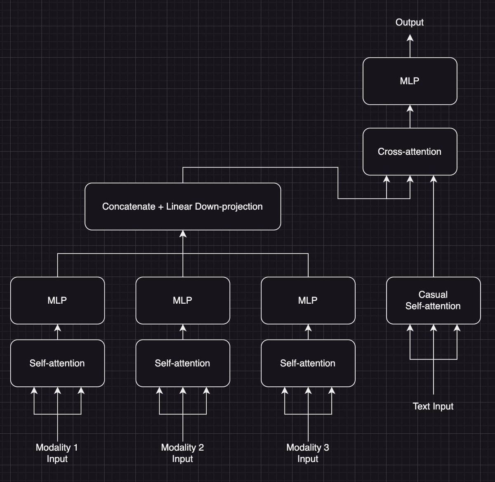

# Multi-resolution VLMs for robotics

*Status: Idea, no literature research done*

## Motivation

Here might be a way to setup a Vision Transformer (ViT) for videos in a way that makes it both better *and* more cost-effective, especially in real-world interactions&mdash;a.k.a. robotics (or self-driving, etc.).

## Idea

The idea is best described in the following image:


(Yes I've used the same image for both frames because I was lazy)

### What's goint on?

We are given a single video frame, and preprocess in the following way:

1. Zoom
    - We zoom in 2x towards the center
    - We zoom in another 2x on the cutout from the previous zoom
    - (Repeat as often as wanted)
2. Add jitter to the zoom
    - We add jitter to the exact position of the cutouts, meaning that we don't zoom perfectly into the center of the previous zoom-level, but add a small but random offset to the target of the zoom (the jitter in the above image is exaggerated for visibility)
    - This imitates the jittering of human eyes, which constantly changes which part of the scene we see is at the highest resolution
    - (We could add levels of jitter, too: jumping around slightly every frame, a slower but stronger movement over several frames, etc.; for simplicity, we'll just talk about one level of jitter)
3. Downsample
    - We downsample the full-view image by 4x, the 2x zoomed-in image by 2x, and leave the 4x zoomed image alone
    - This way, we have the same pixel-resolution for each level of zoom (for example, $256\times256$ pixels)
4. Patchify
    - We patchify each level of zoom, but with fewer tokens than in a typical ViT (e.g. $4\times4$ or $8\times8$  instead of $16\times16$ tokens)
5. Stack
    - We stack the patches from each level of zoom, and feed them into a Vision Transformer (ViT)

We repeat this for every frame in the video.

### What's the benefit?

Stacking the image with a pyramid of cutouts has the following advantages:

- We have a multi-resolution input, which is more adversarially robust than a single resolution input 
    - See [Ensemble Everything Everywhere by Stanislav Fort and Balaji Lakshminarayanan](https://arxiv.org/abs/2408.05446)
    - This is of course not the case at the edges of the images, but the closer to its center you get, the more levels of the resolution-pyramid you go down, and the most important things are usually at the center of a video (for robotics)
- The jitter does two things:
    - It adds to the multi-resolution nature of the input, in the same way that the human eye's motion jitter does
    - It increases the effective coverage of the highest-resolution cutout over the course of several frames, reducing the disadvantage of reduced resolution at the edges of the image
    - Because it is very fast, this is relevant even given the likely movement of the camera relative to the environment
- At the center, this method yields similar or even higher resolution than the normal $16\times16$ patching in:
    -  The number of pixles per arcsecond of the camera 
        - At three levels of 2x zoom: $(256\cdot2\cdot2)\times(256\cdot2\cdot2)=1024\times1024$ pixels
        - Typically, a resolution between $256\times256$ and $512\times512$ pixels is used (as far as I'm aware)
    -  The number of tokens per arcsecond of the camera vs. the typical $16\times16$
        - at three levels of 2x zoom & $4\times4$ tokens, the density is the same as a $(2\cdot2\cdot4)\times(2\cdot2\cdot4)=16\times16$ patching for the whole image
        - at three levels of 2x zoom & $8\times8$ tokens, the density is the same as a $(2\cdot2\cdot8)\times(2\cdot2\cdot8)=32\times32$ patching for the whole image
- All this at a reduced total token count vs. the typical $16\times16=256$ tokens: 
    - With an image and two levels of 2x zoom & $4\times4$ tokens we have $3 \cdot (4\times4) = 48$ tokens
    - Even with $8\times8$ tokens, we only have $3\cdot(8\times8)=192$ total tokens

In other words, we get a more human-like, adversarially robust vision system with a higher maximum resolution for a lower cost than a standard ViT.
We do so at the cost of reduced resolution at the edges of the image.
Thus, the method is likely best for applications where the most relevant objects are placed near the center of the image.

## How do we handle positional embeddings? 

The method as described above has no inductive bias for the following two things:

1. The cutouts are actually part of the full image
2. The exact position of the cutouts relative to the upper-left corner of the image

Option 1: **Treat the cutouts as normal parts of the sequence**

This would be the most straightforward approach. Just ignore the inductive biases and hope that the model learns them on its own.

Option 2: **Multiple positional embeddings**

The same embedding as in option 1, but also one embedding for each of the two inductive biases. This might be helpful, but would be way more complicated to implement.

There is a third option: using a cross-encoder.

## Using a cross-encoder

[@stochasticchasm](https://x.com/stochasticchasm) on X has suggested the following approach for combining multiple modalities into a single sequence-stream:


*Source: [this post by @stochasticchasm on X](https://x.com/stochasticchasm/status/1848937589748732036)*

The idea is (quote): "primary reason is because i think you could autoregressively decode text with maybe some sort of streaming input on the other modalities, allowing the model to react in real time to changes". In other words, combine multiple modalities into a single token stream, making their computation efficient, while allowing parallel streaming of them (and thus an inherent synchronization between them on the time-axis, foregoing the need for additional positional encodings).

This is not only an awesome idea on its own, but a slight variation should also work well with the idea of stacking the image with a pyramid of cutouts, by simply adding cross-attention like below:


This is good for two reasons: 

1. It saves tokens, because the cutouts only have to be computed at the input, not the entire model depth
2. It introduces an inductive bias that aligns the image and its cutouts temporally without the need for additional positional encodings

We now only need positional encodings to signify the relative position of the cutout to the center of the image, and the relative position of each token within a cutout / the full image. Then, we have the full-image-stream as the main input with the normal positional encodings that simply denote the relative position of each token within the image, and the frame-number of the image in the video.

> Sidenote: using this cross-attention approach, the different zoom-levels could have different numbers of tokens, if this is for some reason useful.

Now, we can obviously add all the other input-modalities of the robot to the stream, like audio, depth sensing, pressure sensing, etc. The only modality I'm not sure about is actually text; this is because I'm unsure how to synchronize the text-stream with the other modalities. All modalities are sampled at a constant frequency, except for text, which comes at random intervals. Sometimes, there won't be any text for hours, sometimes the rate of text might exceed that of the other modalities. There are probably ways to fix this with $\texttt{noop}$-tokens and a high sample-rate for the other inputs, but it seems unnecessarily complicated.

It should also be possible to efficiently combine modalidies with different sampling rates using my [mixture of tokenizers](../mixture-of-tokenizers)-idea. In fact, it could make sense to mix different image-resolutions as described above, and then combine the output with a different modality mixture-of-tokenizers-style. There is, of course, a tradeoff between increased complexity on the one hand, and increased efficiency (by combining the samples of multiple modalities and resolutions into a single stream) and the inductive bias of automatic temporal alignment on the other hand.

## Citation

If you use this idea, please cite it:

```
@misc{snimu2024multiresolutionvlms,
    title={Multi-resolution VLMs for robotics},
    author={Sebastian M\"uller},
    year={2024},
    month={nov},
    url={https://github.com/snimu/blog/blob/main/contents/multi-resolution-vlms/README.md}
}
