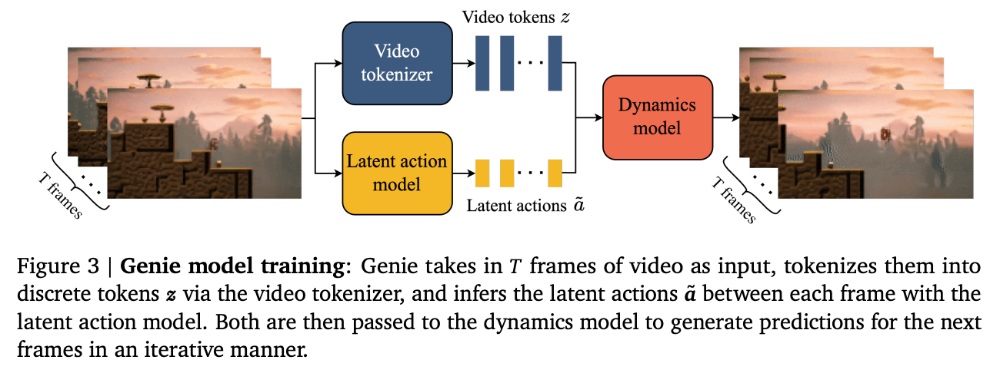

# Multi-Frame Prediction for World Models

Video models often struggle with scene consistency over long periods of time, and with natural-looking movements. However, Google's recently announced [Genie 3](https://deepmind.google/discover/blog/genie-3-a-new-frontier-for-world-models/) world model doesn't seem to suffer from this issue, despite taking in additional action inputs.

## The issue

Video models often produce very beautiful looking frames, but the movements being depicted are anywhere from creepily to ridiculously wrong. I see the issue stemming from two sources:

1. The short-sightedness that next-frame prediction inherently introduces. Subtle errors will accumulate, and models aren't taught to correct course because they don't care about the consistency between frame `n` and frame `n+32`, just between frames `n` and `n+1`.
2. The high resolution of the predicted next frame. Models are often biased toward high-frequency components of data&mdash;the local details&mdash;and those are typically not the main component of movement. A video with significant random noise can still display movement just fine, but a model predicting the next frame in high resolution would be punished harshly for wrongly predicting the noise, without being punished for missing the long-range dependencies that make up the movement. Of course, truly random noise isn't predictable, so ideally the model would learn to ignore it and focus on the low-frequency components of the frames instead, but if we instead had predictable high-frequency features that are also averaged out by downsampling but are predictable, the model will absolutely focus on that at the cost of broad shapes.

As I've said in the introduction, Google's Genie 3 (and Veo 3 as well) don't seem to suffer from these problems. However, I don't know why. The obvious answer is better data, and I suspect that having to predict the effects of action inputs also forces the model to take long-term dependencies into account, thereby introducing a useful bias, but I'd like to speculate about different solutions that might help.

[Genie 1](https://arxiv.org/abs/2402.15391) uses next-frame prediction on a sequence of video tokens, as does Genie 3 (see [this interview](https://www.youtube.com/watch?v=ekgvWeHidJs)). This will be my basic assumption going forward; I will discuss Architecture at the end.

## Solutions

I can think of two solutions that I haven't heard before (though admittedly, I'm far from an expert in the area and it's likely that I've missed a lot), and two possible extensions:

- Predict multiple frames ahead, skipping intermediate frames
- Make all predictions but the first one low resolution
- Extension 1: Auxiliary loss
- Extension 2: Multi-resolution for all frames

### Multi-frame prediction with frame-skips

I suggest predicting multiple frame ahead; and not just (for example) frames `n+1` through `n+4`, but (for example) frames `n+1`, `n+2`, `n+4`, and `n+8`. I believe that this forces the model to represent a scene internally in a way that enables it to predict pretty far ahead, capturing long-range movements.

#### Why does it force the model to capture long-range movements?

While predicting multiple frames ahead might slightly hurt the look of the next frame, it will absolutely force the model to internally represent the dynamics of the scene. And if the dynamics of the scene are represented internally, they will automatically be taken into account in the next-frame prediction. Otherwise, the model would have to actively remove them from the representation from which the next frame is predicted, and I see no reason why it would do that. Admittedly, this is mostly a gut feeling, but it does feel right.

#### Considerations about training

There are two considerations that I can see. The first is that you need to cut the number of predicted frames from the end of the sequence for the input and from its start for the targets. By reducing the number of available context and targets, predicting too far ahead is therefore an issue, and I have no idea what the ideal tradeoff is for this.

The second question is about training dynamics. Maybe the multiple predictions will produce conflicting gradients, and maybe normalization, regularization, weighting of the losses, or something else will be needed to prevent this. That's an open question for me (which might already be answered in the literature, please contact me on Twitter [@omouamoua](https://x.com/omouamoua) if you know something).

### Make the next-frame target high-resolution, the others low-resolution

Making all predictions but the first one low-resolution would fight problem number 2, because downsampling removes noise by averaging it out, and for the purpose of predicting movements, details are (mostly) noise. It's also cheaper than predicting at full resolution.

#### Why should the first target be at full resolution?

We could predict everything at low resolution and throw an upsampler on top of it, after all. However, that's not an end-to-end solution so I'm not a fan. Specifically, I believe that there is a lot of valuable signal in the high-frequency components of an image that the world-model could learn from, and externalizing the prediction of those would probably lead to a worse world model.

Additionally, an analogy I draw is that having the model predict most frames in low resolution, but the immediate next one in high resolution, is similar to [Visual Autoregressive Modeling: Scalable Image Generation via Next-Scale Prediction](https://arxiv.org/abs/2404.02905v2). No, it's not multi-resolution prediction for the same frame at the same step, but the implied task has similarities: The model could learn to internally predict all frames at low resolution internally and then, at the last layers, upsample the first predicted frame. To be clear, it doesn't matter whether it actually does learn this, the fact that it is one valid strategy shows that aspects of multi-scale prediction are present in the loss.

#### Resolution cascade

This idea can be taken further in the form of a resolution cascade: frame `n+1` is predicted at full resolution, `n+2` at half resolution, `n+4` at a quarter resolution, and so on (that's just an example, we don't actually have to reduce the resolution of frame `n+k+1` by a factor of `k`). The point is that this would lean more strongly into the idea of a multi-scale loss, and accentuate the desire for having lots of details in the immediate next frame but caring only about a rough sketch many frames downstream. This might be worth a try.

### Extension 1: Auxiliary Loss

To really make the model care about the consistency of movement between all the frames it predicts, we could introduce an auxiliary loss that compares the consistency between the low-resolution prediction `8` frames ahead at position `n` and the downsampled prediction `1` frame ahead at position `n+7`. This would force the model to not only care about the similarity of its predictions to the ground truth, but also about self-consistency, by introducing a dependency between the prediction one frame ahead and the one multiple frames ahead.

### Extension 2: Multi-Resolution for every frame

Instead of predicting the full resolution a single frame ahead, and the subsequent frames at lower resolution, predict them all at multiple resolutions like in [Visual Autoregressive Modeling: Scalable Image Generation via Next-Scale Prediction](https://arxiv.org/abs/2404.02905v2). This would defeat the disadvantages of predicting at high resolution, while keeping its advantages; while retaining the benefits of multi-frame prediction of far-out frames (like 16 frames ahead or more). That would be extremely expensive, though, so one might predict all resolutions for frame `n+1`, all but the most detailed one for frame `n+2`, all but the two most detailed ones for frame `n+4`, and so on. That's still pretty expensive, but much less so.

### Architecture

While the multi-frame prediction suggested above (and the other tricks below) works for all kinds of architectures, I'm mostly riffing on Genie here, so I should explain that architecture quickly and make some suggestions for how to actually include the actions in the multi-frame predictions (if you only have frames like in Veo, that's not an issue, but it is here). The basic idea is that we have a video tokenizer and a Latent Action Model (LAM). Their details don't matter here, what matters is that their output tokens are supplied to the dynamics model, which makes the actual next-frame prediction:

> Genie 1 Architecture from [the Genie paper](https://arxiv.org/abs/2402.15391)

To combine the video and action tokens, they simply add the two together (the action tokens are smaller, so they are treated like a bias term, see the paper).

The problem is that we cannot simply predict frame `n+8` from frames and actions `1:n`, because it depends on the actions `n+1:n+7`. Therefore, we need to provide those actions to the model for it to make a concrete multi-frame prediction instead of an average prediction over many possible action trajectories. The solution for how to do that comes from the [DeepSeek V3 Technical Report](https://arxiv.org/abs/2412.19437). Here is their multi-token prediction architecture:

...

They predict token `n+1` from tokens `1:n`. Then, they take the output hidden state of the model, and concatenate it with token `n+1` along the model dimension, project downward to the model dimension, and append it to the original input sequence `1:n`. Then, they apply another transformer layer, and predict token `n+2` from that. Repeat for subsequent tokens. I'd adapt this architecture in the following way:

...

I would predict the next frame from the combined frame and action tokens at positions `1:n`. While it's possible to supply the action-conditioned frames `1:n+k-1` when predicting frame `n+k`, and concatenating prediction `n+k-1` with the actual action-conditioned frame `n+k-1`, then projecting down and appending to the action-conditioned frames `1:n+k-2`, I actually prefer only providing the action-conditioned frames `1:n` and then appending only the actions `n+1:n+k-1`. That could be done by simply adding all the actions on top of the output hidden state, and then appending this multi-action-conditioned hidden state to the action-conditioned frames `1:n`. That would be cheaper, simpler, and I feel like it would force the model to make an actual multi-frame prediction, but conditioned on the intermediate actions, instead of relying heavily on the actual next frames as input. However, I might be wrong, in which case we could simply switch to providing full action-conditioned frames for far-out frame predictions.

One additional detail I would at least experiment with is using an earlier hidden state than the last one as the shared representation for multi-frame prediction:

...

That would allow for two things:

For one, the model could share abstract information that will help a consistent prediction of multiple frames, but can subsequently adapt the details of each frame to the corresponding action sequence, instead of having to cram everything into the same hidden state.

Additionally, we could apply more compute to the next-frame prediction than to far-out predictions, which is potentially useful for two reasons: 1) as I will get to [below](#make-the-next-frame-target-high-resolution-the-others-low-resolution), the first frame will have the highest resolution, while subsequent frames have a lower one, so the first frame simply requires more compute; and 2) frame `n+1` is what will be used during inference, so it's the most important one.

This tweak could be taken further if we use the [resolution cascade](#resolution-cascade) dicussed above. The amount of extra compute could be reduced from frame to frame, as we reduce the target's resolution at the same time. Whether this is done by varying the number of transformer blocks after the shared hidden state, varying the expansion factor of the MLP, or some other way, I don't know.

## Summary

I believe that multi-frame prediction for video/world models is highly beneficial. These predictions shouldn't just be directly adjacent frames; instead they should leave growing gaps between the multiple predictions per frame. I also believe that all but the first prediction ahead should target low resolution representations of the target frames, to focus on movement and long-term planning instead of visual fidelity (the latter of which is already covered in the first prediction ahead). Finally, an auxiliary loss and per-frame-multi-resolution may or may not provide further help.
