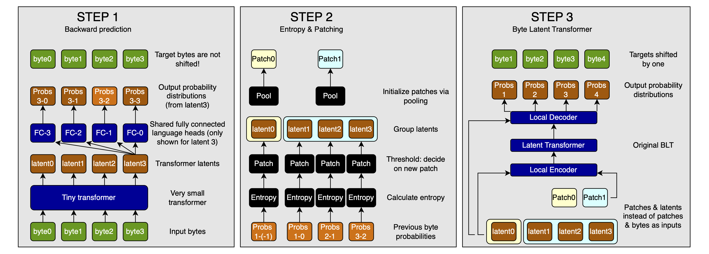

# Proposal: a pareto improvement to the Byte Latent Transformer

The [Byte Latent Transformer](https://arxiv.org/abs/2412.09871) (BLT) is a promising approach for dynamically merging bytes into patches based on the entropy of byte-level predictions by a tiny language model.

However, that tiny language model is separate from the main BLT. Its outputs are used only to compute the entropy and thus group bytes into patches, not in the actual generation of the final output, which means that the computation done by the tiny LM is mostly wasted.

In this article, I propose two improvements to the BLT. First, I show how to reuse the tiny transformer's latents by changing its prediction objective, likely creating a strict Pareto improvement with no additional overhead. Second, I explore an optional end-to-end training extension that could further improve performance.[^2]

## The problem of next-byte prediction

The tiny transformer is trained with next-byte prediction. When we want to use its outputs directly in the BLT, this is a problem: by forcing the tiny transformer to make a next-byte prediction, we are getting it to encode information about its guess about the next byte into its latents, instead of information about the current byte and its context (a.k.a. the previous bytes). This likely means that there is much less raw information available to later layers of the BLT. In other words, training on next-byte prediction collapses the output latents of the tiny transformer, making them useless for the rest of the BLT.

## Requirements for using the latents of the tiny transformer

Originally, the tiny transformer is used for one task: calculating the entropy for grouping bytes into patches. Now, we want to *additionally* make use of its latents for use by the main BLT. This means that we have to requirements:

1. We have to make sure that the output of this tiny transformer has some semantic meaning so that the entropy in turn means something.
2. The entropies are calculated on the next-byte probabilities. This means that we have to be able to meaningfully apply the language head to this tiny transformer's output. To be clear, this is cheap&mdash;the byte vocabulary is very small&mdash;but it requires the loss to encourage the tiny transformer to output something that can be reasonably decoded into the byte vocabulary.

So how do we get the tiny transformer to output semantically meaningful predictions that can be decoded into the byte vocabulary, while keeping its latents useful for the rest of the BLT?

## Predicting previous & current bytes

The trick is to not predict the next byte, but to make multi-byte predictions for $x_{-n:}$. In other words, we want to predict the previous $n-1$ bytes plus the current one.

Two concerns will arise immediately:

1. Is the task too trivial?
2. The BLT does next-byte prediction; does the entropy of previous-byte prediction correspond to the entropy of next-byte prediction?

Before addressing these concerns, let me explain why this approach fulfills our requirements for making the tiny transformer's outputs both meaningful for entropy calculation and useful for the main BLT.

This task requires the model to encode multiple byte embeddings into one, including the current byte, which makes the latents of the tiny transformer useable for the rest of the BLT. It also means that we have we have decoded predictions on which we can calculate the entropy.

> Sidenote: predicting the current byte in addition to the previous ones is important so that the tiny transformer will retain information about the current byte in its latents and we can use those in the rest of the BLT.

Now, let's address the concerns.

### Is the task too trivial?

No, it is not trivial to predict the previous bytes in addition to the current one, because it requires the model to encode multiple byte embeddings into one. However, it is probably easier in a causally masked transformer.

On the other hand, that might actually be an advantage: we can simply make the tiny transformer even smaller so that we get a similar entropy profile, saving us some compute.

### Will previous-byte entropy correspond to next-byte entropy?

For this to work with backward prediction, the difficulty of backward prediction must correspond byte-by-byte with the difficulty of forward prediction. Otherwise, the patching we choose would not make any sense for the BLT, and the whole exercise would be pointless.

If the current byte would have been hard to predict into the future, then the semantic contrast (speaking loosely) to the previous bytes must be high. If that is the case, a tiny transformer will have a harder time incorporating the information from the previous bytes into the current one's representation, and thus uncertainty about the previous byte will be higher.

This means that if we look at the immediately preceding byte, high entropy will mean the current byte is hard to predict from the preceding sequence, and thus the entropy corresponds closely between the previous and next byte prediction tasks.

### Visualizing the architecture

Here is a visualization of the proposed architecture:



**Figure 1:** The improved BLT architecture in three steps. STEP 1 shows the tiny transformer making backward predictions, with each latent predicting previous bytes. STEP 2 demonstrates how these predictions are used to calculate entropy and determine patch boundaries. STEP 3 shows how the latents and patches are used in the main BLT architecture, replacing the original byte embeddings.[^2]

> Sidenote: For calculating the entropy of any byte position $i > 0$, we use that position's latent to predict byte $i-1$. For the special case of the $0^{th}$ byte (where there is no $-1^{st}$ byte to predict), we still apply the same prediction head to get a distribution over possible previous bytes. This works because the model learns to make previous-byte predictions for all other positions, so the prediction head will produce meaningful distributions even at position $0$. We can then use these distributions to calculate entropy, just as in the original BLT.[^1]

> Sidenote: The visualization shows predicting the current byte and 3 previous bytes. The current-byte prediction is definitely needed to not lose information, and the one-previous-byte prediction is used to calculate the entropy of the current byte. Whether or not the other byte-predictions are useful is an empirical question. I've drawn them in to make the point about byte 0, while keeping the illustration meaningful.

### Intdermediate summary: using the latents[^2]

The original BLT uses a tiny transformer solely for entropy calculation to determine patch boundaries. We can improve this by:

1. Training the tiny transformer on previous-and-current byte prediction instead of next-byte prediction
2. Using its latents directly in the main BLT instead of byte embeddings
3. Using the same prediction heads to calculate entropy

This creates several advantages:

- No wasted computation - the tiny transformer's work is fully utilized
- No additional overhead - same computational pattern as original BLT
- Potentially smaller tiny transformer since the task is easier
- Clean information flow from tiny transformer to main BLT

If it works as I hope, the improvement is strictly better than the original design because:

- It maintains the exact same asynchronous processing pattern
- Requires minimal changes to the architecture
- It re-uses the tiny transformer's latents in the main BLT, increasing its effective depth

The only required change is switching the tiny transformer's training objective from next-byte to previous-and-current-byte prediction. Everything else remains functionally identical to the original BLT.

## Optional extension: end-to-end BLT

At this point, we are effectively using the tiny transformer and the rest of the BLT as one big model. However, we do not propagate the gradients of the BLT into the tiny transformer. What would be the advantages of doing so, and what would be the concerns?

> To be clear, this is optional as the title says. The above suggestion stands no matter what.

### Advantages of end-to-end BLT

I see two advantages from propagating the gradients of the BLT into the tiny transformer:

1. We get a stronger tiny transformer. I do not believe that the current-and-past-byte prediction loss is in conflict with the causal prediction loss applied at the end of the BLT, so this would straightup make the tiny transformer stronger.
2. If we propagate the gradients not only through the latents, but also through the patching, entropy calculation, and language heads (in reverse order), then the patching performance might improve, and adapt better to the actual BLT. This would make scaling the whole thing easier and, likely, more effective.

### Concerns with end-to-end BLT

There are, however, two concerns with propagating the gradients to the tiny transformer:

1. Synchronization
2. Gradient quality

#### Synchronization

In the BLT paper, and the implementation discussed above, the tiny transformer is trained independently of the rest of the BLT. It is applied asynchronously during data-loading.

If we want to propagate the gradients of the BLT into it, there would be a massive synchronization bottleneck. For large models, this would present a severe problem that would make the method impractical.

However, there is a simple solution to this:

1. Train the tiny transformer
2. Using the tiny transformer's outputs, train the rest of the BLT without propagating the gradients
3. In a short post-training step, train both end-to-end, with full gradient propagation
4. During inference, switch back to the asynchronous usage of the tiny transformer; this completely preserves the model behavior, but is obviously more efficient

In other words, end-to-end training is not realistic for the majority of training, but we can still gain its advantages through post-training.

#### Gradient quality

We are trying to propagate gradients through byte-patching, which is essentially an indexing operation. Yes, this is differentiable, but the quality of the gradients is most likely diminished greatly.

This is by far the biggest concern that I have about the end-to-end solution.

There is one reason why I think this might still work: We propagate the gradients through the language heads, entropy calculation, and patching, and then the latents, which reduced gradient quality. However, we also propagate them directly through the latents, because we use those instead of byte embeddings as the inputs for the main BLT. If the gradients through the patching are not too bad, this should prevent a degradation of the model quality.

But it is still a concern, and we might have to propagate the gradients only through the latents, in which case we lose the advantage of directly adapting the entropy patterns of the tiny transformer to the main BLT. It might still lead to a stronger alignment between the tiny transformer's latents and the main BLT, but it would be very unfortunate.

### Intermediate summary: end-to-end BLT[^2]

Beyond just reusing the tiny transformer's latents, we can optionally propagate gradients from the main BLT back through the tiny transformer. This creates two potential approaches:

1. Partial end-to-end training:
   - Propagate gradients only through the latents
   - Maintains clean gradient flow
   - Safe improvement but limited impact

2. Full end-to-end training:
   - Propagate through patching operations as well
   - Could better adapt entropy patterns to main BLT
   - Concerns about gradient quality through patching operations

To handle the synchronization challenge, we propose a three-phase training strategy:

1. Train tiny transformer independently
2. Train main BLT using tiny transformer's outputs
3. Short end-to-end fine-tuning phase

We return to asynchronous operation at inference time.

This extension is more experimental than the core improvement:

- Requires more complex training procedure
- Gradient quality through patching is uncertain
- Benefits are less certain

However, the risk is minimal since we can always fall back to the core improvement if end-to-end training doesn't help. And the potential for better alignment between the tiny transformer and main BLT makes it worth exploring.

## Conclusion[^2]

This article presents two improvements to the Byte Latent Transformer:

1. A strict Pareto improvement:
   - Train the tiny transformer on previous-byte prediction
   - Reuse its latents in the main BLT
   - No additional compute or synchronization overhead
   - Very likely to be at least as good as original BLT
2. An optional end-to-end extension:
   - Propagate gradients from main BLT to tiny transformer
   - Potentially better alignment between components
   - Requires careful training strategy to handle synchronization
   - More experimental but low-risk to try

Both improvements maintain BLT's core strengths while making better use of existing computation. The first improvement should be straightforward to implement in any BLT system, while the second offers a path for further optimization.

## Citation

```bibtex
@misc{muller2024TTSIsModelScaling,
    title={Proposal: a pareto improvement to the Byte Latent Transformer},
    author={Sebastian M\"uller},
    year={2024},
    month={dec},
    url={https://github.com/snimu/blog/blob/main/contents/pareto-improvement-to-blt/article.md},
}
```

[^1]: Heavily edited by Claude
[^2]: Written by Claude, slightly edited by me
