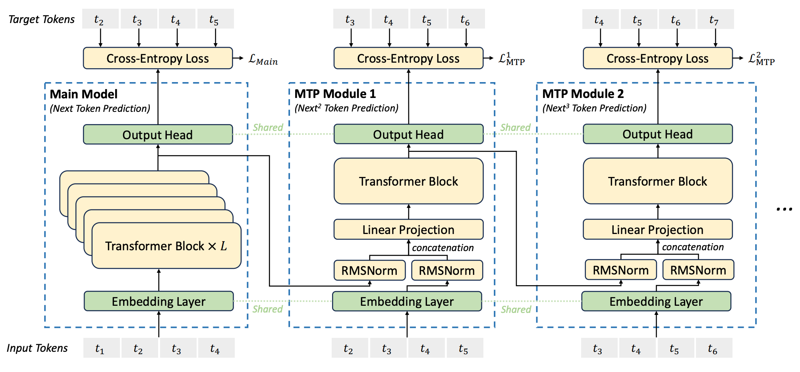

# (Proposal) Multi Token Prediction by splitting hidden states

I recently had a neat idea for Multi Token Prediction (MTP): splitting the output hidden states of our model into N chunks and predicting a different number of tokens ahead for each chunk using the same language head.

This has an obvious disadvantage: each chunk is now reduced in dimensionality, so the language head will have less to work with and produce less finely tuned predictions.

However, I also see a potentially big advantage: in the MTP prediction methods that I'm aware of, the same output hidden state is always decoded in multiple tokens, which means that it has to contain specific information about both the next token to be decoded, and at the same time enough abstract semantics for some additional mechanism to decode another token ahead. Splitting the hidden state and decoding each chunk into a different token prediction explicitly avoids this issue.

I will first go into this advantage of split MTP by pointing out the weakness of other methods. Then, I will discuss ways to soften the blow of reduced hidden state dimensionality, or maybe even circumvent it fully. Finally, I will present a way in which the method can adapted to obtain the large benefits of DeepSeek's MTP approach.

## Advantages

The advantages of this method are in response to the disadvantages of other methods.

### The Disadvantages of other methods for MTP

Over the course of the forward pass, LLMs move the representation of the data in the residual stream from pure, cleanly separated tokens at the input, to very abstract concepts in the middle layers, to concrete tokens (the next-token predictions) at the output again.

The MTP techniques that I'm most aware of actively play againt this dynamic. I'll focus on two specific techniques: Meta's [Better & Faster Large Language Models via Multi-token Prediction](https://arxiv.org/abs/2404.19737) and [DeepSeek V3](https://arxiv.org/abs/2412.19437).

My critique relies on the fact that the language head is just an inverse embedding layer, which you can convince yourself of by realising that the embedding layer and language head sometimes share the same weight in order to save parameters. Therefore, if we have an output distribution that puts all its weight onto a single token, then the output-hidden state of the transformer is a direct embedding of that token, which is simply linearly projected into a different space. This means that in order to get the best possible probability distribution, the hidden state needs to be a superposition of all the output tokens, with their respective weight.

On the other hand, the model needs to perform a lot of abstract computation in an abstract space in order to produce the correct superposition of tokens. This is unlikely to happen in such a clean superposition of specific tokens; and more likely in the superposition of both abstract and concrete concepts, of which there may be more or fewer than there are tokens in the vocabulary.

Therefore, the ideal abstract data representation likely doesn't look the same as the ideal output hidden state for predicting the token probabilities. Here are two papers that provide evidence for this difference in representations: [Layer by Layer: Uncovering Hidden Representations in Language Models](http://arxiv.org/abs/2502.02013) or [Do Llamas Work in English? On the Latent Language of Multilingual Transformers](https://arxiv.org/abs/2402.10588).

And yes, there is evidence that the differences aren't extreme: after all, we can 1) simply apply the language head to the residual stream at any layer, or 2) train a linear probe at any layer in the layer. Both produce sensible predictions. However, neither achieves the same quality as the actual language head (at next-token prediction; for other downstream tasks, the abstract representations from the middle of the model are often better).

This leads me to conclude that the objectives of producing a high-quality abstract state for making sense of the input and performing the necessary thought process for producing the output, and a producing a high-quality output hidden state for generating a next-token probability distribution, are not fully aligned; the latter just happens to produce the former in the middle of the model.

#### Better and Faster Large Language Models via Multi-token Prediction

*I'll call this the Meta Method.*

In the Meta Method, the authors use the exact same hidden state to make predictions for multiple future tokens. To distinguish between those future tokens, they employ a different language head for each token further predicted; head 1 predicts 1 token ahead, head 2 predicts 2 tokens ahead, and so on:

This means that in the Meta Method, the output hidden state of the transformer must contain the information necessary to be decoded into four different probability distributions, and the job of differentiating between them lies with the language heads.

To do so, the output hidden state must be a weighted superposition of all tokens; but four times! I strongly suspect that this requires the different language heads (which, remember, are inverse embeddings) to look out for completely different embeddings each, and for those embeddings to be clearly linearly separable. In other words, the model must now project into a four times larger vocabulary.

That's obviously very similarly to what I do: In the Meta Method, the hidden state of size `D` must be decoded into an effective vocabulary size of size `V * 4`, while in the split MTP method, a hidden state of size `D / 4` must be decoded into a vocabulary size `V`. However, there are a few disadvantages I see to the Meta Method compared to the one I'm proposing:

- The Meta Method needs one language head per token predicted ahead; Mine only needs a single language head for them all
- Of course, it is theoretically possible for the hidden state to represent the embeddings for the four language heads in such a linearly separable way that it's exactly equivalent to the split MTP method; but in the latter this is pre-determined from the start, while in the former, it has to be learned, which means that the gradient has less capacity to teach the model other, more important things (speaking very roughly)
- Mechanistically (but kinda vaguely), the language heads in the Meta Method are required to select only parts of the same hidden state, but they don't have an explicit selection mechanism like ReLU available to them. Therefore, in order to be able to distinguish the information in the hidden state, they need to use combinations of hidden-state features to suppress ones meant for the other language heads, which wastes a lot of capacity. This, in turn, makes the effective size of each hidden-state chunk even smaller, unless the model has learned the linear separation perfectly.
- The reason why I believe that learning the linear separability of the output token embeddings wastes a lot of training capacity is that it forces the language heads to compete over resources, which muddies the waters of the gradients, similarly to how [images and text compete in non-MoE language models](http://arxiv.org/abs/2504.07951). My hope is that with explicit splitting of the hidden state but sharing of a single language head, this competition for resources will be reduced

#### DeepSeek's MTP

DeepSeek's Multi-Token prediction makes a prediction ahead from the transformer hidden states. For the next token further, it then concatenates the actual next token at the current position, does a linear projection, applies a transformer block, and decodes the resulting hidden state with the same language head as the previous token. Then, that hidden state is again concatenated with the input token again, projected, and so on. See here:

This means that the DeepSeek MTP method effectively *only* does next-token prediction, but multiple times per token; and only the first next-token prediction uses the full model, while the subsequent predictions use very cheap models (norm + FC + a single transformer block), and depend on the model's own previous predictions.

This method is very strong and, let's be honest, is probably superior to what I'm proposing here. However, I still see an issue: The first predicted token is decoded directly by the language head *from the same hidden state that gets used for the further token predictions*. This forces one of two things to happen:

1. The hidden state must contain information beyond what is relevant for the next token prediction (which is bad because that abstract information should in the middle of the transformer, or the language head will have more difficulty decoding the hidden state)
2. The prediction of the second next token is based only on the prediction of the first next token and the concatenated actual next token

The second option is likely very good for training dynamics, because 1) the output hidden state doesn't represent a single output token but a distribution over tokens and 2) having to make a good second-token-ahead prediction from the actual next token and the model's own prediction of the next-token-ahead forces the model to make that next-token-ahead prediction damn good. I assume that in the extreme case where the hidden state is literally only an optimized superposition of tokens for the next token prediction, this second prediction would give another signal to make the probability distribution

I definitely want a piece of that for my method, and will write about how to get it [further down](#catching-up-to-deepseek); my problem with the method is that the main transformer backend adds so little to all the token predictions except for the first one, because of the conflict between the hidden state used for the first prediction having to be useful for the first prediction, and thus being basically just a superposition of tokens, and having to be useful for the further predictions, which could use more abstract information (because they are using a transfomer block on it anyway).

In other words, DeepSeek's MTP prediction works because it gives a very strong signal to optimize the immediate next-token prediction for downstream text. It would be nice if it also encouraged a strong abstract representation in the middle of the model more directly. To be clear, it probably does, because the hidden state probably contains a bunch of abstract information  to help the subsequent token predictions, but that has its own issues.

A second problem with this method is that it requires information about future tokens to work. During inference, you don't know the actual next token; that's what you're generating! So you have to do what [_xjdr](https://x.com/_xjdr) does (if I remember correctly, I can't actually find the tweet to cite): Forward pass through the model, sample a next token, then predict the token after that with the MTP machinery and your predicted token. Of course, you do have those tokens available to you during training, where it can therefore certainly help with the training dynamics; still, this is a slight downer.

### Advantages of MTP by Splitting

The split MTP method explicitly assigns different jobs to different parts of the output hidden state: predicting a different number of tokens ahead. This way, it avoids the issue of the hidden state having to contain both explicit information about the next token and enough abstract information to allow extracting tokens further down the line.

If the degree of separation between the tokens is insufficient, we can simply split the model earlier and run a few independent transformer blocks. This would reduce the number of parameters, which would have to be compensated of course.

> Let's say we predict `k` tokens ahead. That means that we split the hidden state into `k` pieces. A transformer's MLP has `2 * expansion_factor * model_dim.pow(2)` parameters (two layers going from `model_dim` to `expansion_factor` or vice versa). If we split the hidden state, it will be `2 * expansion_factor * (model_dim / k).pow(2)` parameters in each MLP, so a factor of `k**2` fewer parameters. We now have `k` such MLPs per layer instead of one, so in total, the number of parameters is reduced by a factor of `k`.

Another advantage of split MTP is that MTP comes inherently with the model, no extra parameters needed (at least in this simple configuration). The Meta Method requires extra language heads, and DeepSeek's method extra transformer heads. This isn't a big deal, but I'll take it.

What's also nice is that our shared language head is smaller, which saves us a lot of parameters. However, it's of course also the cause of the one big disadvantage of this method: reduced fidelity of the language head.

## Combatting the reduced hidden state size

I can think of two options for combatting the issue of reduced hidden-state size: ["Project and Split"](#project-and-split) and ["Uneven Split"](#uneven-split).

### Project and Split

Typically, the output hidden state, a.k.a. the residual stream after the last transformer block, is directly projected into token space by the language head. If we want a bigger vector to project from, we can simply put another Fully Connected (FC) layer between the two.

At first, it is unclear to me if this would help at all. On the one hand, two linear transformations in a row always have an equivalent single linear transformation (if start and end size of the vector being transformed stays the same), so we should expect no mathematical advantage. On the other hand, it makes the transformation more gradual which SGD-variants like, and adds more parameters (compared to splitting without projecting first) which also always make learning easier.

Additionally, we can simply put an activation function betwen the two FC layers, like ReLU^2. This would make the whole construct way more expressive by turning it into a proper 2-layer MLP.

Now we have the issue that these additional parameters are costly compared to a normal transformer. However, let's say we predict 4 tokens ahead, and thus split the hidden state into 4 equal chunks. Then, as long as we don't project the hidden state by less than a factor of 4, we will actually reduce the size of the language head, which is very relevant in terms of parameter count. That's because the language head is of size `output_dim * vocab_size`, and the `vocab_size` is typically huge. So every little increase in size of the output vector adds `vocab_size` many parameters. Our new FC layer, on the other hand, is pretty small: it projects from `hidden_state_dim / 4` into `output_dim`, which are both significantly smaller than any language head dimension in a regular transformer. In total, this mean that we might even save a few parameters while allowing for MTP from a hidden state that's almost as big as in the normal transformer.

One potential problem remains: how does this affect the gradient? The transformer is intentionally designed to only ever add to the residual stream to make the gradient as crisp as possible, except for the language head at the end. Now we add a second layer at the end. Especially in a low-precision regime, that might harm gradient quality. I have no workaround to this, but I also don't know how much of an issue it is.

### Uneven Split

The most important token to predict is the next token, not the second, third, or fourth token ahead. So what if we simply split the hidden state unevenly? For example, if `model_dim=1024`, we could split the hidden state into chunks of sizes `[512, 256, 128, 128]` for tokens 1-4 ahead. Then, we've only halved the chunk size for the next token, instead of quartering it. This is still not ideal, but better than before.

But hold up, now the input size to the language head differs between the different token predictions. So do we have to use more than one shared language head now? Not necessarily: we might get away with simply using a Matryoshka language head. So we only use the first `chunk.size(-1)` features of the language head to make a prediction for that chunk, and thus at least partially share the language head.

This isn't quite ideal; I vaguely remember hearing that Matryoshka-*anything* is always a tradeoff between sharing functionality and the quality of the thing itself; so for Matryoshka embeddings, I believe that they allow you to get usable embeddings of many different sizes out of the same vector, but the full vector embeddings aren't quite as high quality as the equivalent non-Matryoshka full vector. I'm not sure about this, though, and I think that this method might be worth a try.

Of course, this method can be combined with the [Project and Split](#project-and-split) method. First project, then split unevenly; this way, we could get a hidden state for the next-token prediction that is larger than the `model_dim`, and still usable hidden state sizes for the other predictions&mdash;if that's what we want. If not, we can obviously adapt both the size of the projected hidden state and the relative size of the chunks however we want.

### Catching Up to DeepSeek

The great advantage of DeepSeek's MTP method is, as far as I can tell, that the next-next-token prediction relies on the model's own next-token prediction and can thus be backpropagated through both, which provides an additional training signal per token *for the next-token prediction*, making the next-token prediction stronger. The disadvantages are 1) that the output hidden state of the next-token prediction is used, which either means less learning or worse decoding or both; and 2) that during inference, it requires information that is not available.

We can get (some of) that advantage without the disadvantages by adapting the split MTP method:

- Split the output hidden state into four chunks, c1-c4
- Predict first token from first chunk, which is also the first hidden state h1 (c1==h1)
- Then concatenate first hidden state h1 and second chunk c2
- Normalize, FC, transformer layer -> second hidden state h2
- Predict second token from h2
- Repeat with h2 and third chunk c3, etc.

This provides us with two information paths for the second token to predict: h1 and c2. That's important because it allows h1&mdash;from which the next token is predicted&mdash;to only contain the information needed to predict the next token, a.k.a. a superposition of token-embeddings, while using c2 to provide rich, abstract information for the subsequent prediction. Because there is a linear projection followed by a transformer layer between h1+c2 and the second next-token prediction, the model has plenty of time to transform that abstract representation into a concrete superposition of embeddings, so this split is actually possible (and likely encouraged).

Now, we have the following advantages compared to the DeepSeek MTP method:

- The model cannot rely on the true next token for next-next-token prediction, but still depends on the next-token prediction, making stronger all of the next-token-prediction-signal, the next-next-token-prediction-signal, and the signal to improve the model's abstract representation
- That signal to the abstract representation comes directly from c2, and thus avoids the bottleneck of the hidden state having to provide a superposition of tokens for optimal next-token predictibility, and provision of abstract information for next-next-token prediction
- And just to stress it again, the conflic between these two goals is reduced
- Model can provide way more information to further-down tokens than prob distr and input tok

Too add to all that, we retain DeepSeek's advantage of prediction n to be backpropagagted through prediction n-1, making the latter stronger through an additional but meaningfully different training signal.

Of course, our great disadvantage remains: the high quality small hidden state size might still be worse than the full hidden state with a conflict between decoding and providing information to downstream predicitons.

## Bringing it all together

... Can use any combination of the above techniques: project-then-split and/or uneven-split, split earlier in the model, DeepSeek method for MTP
