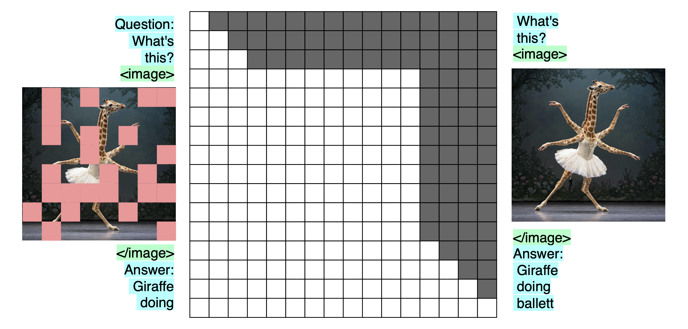
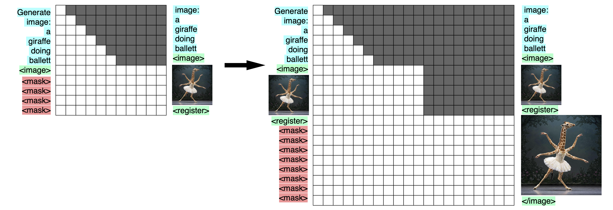
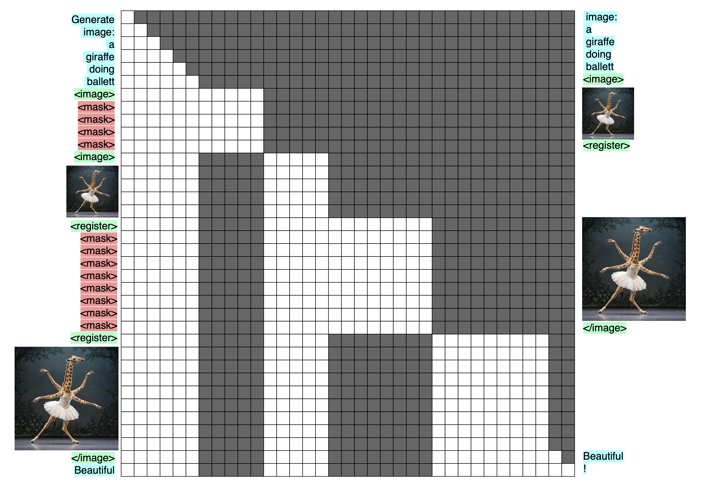

# The perfect VLM

My perfect VLM is DeepSeek's [Janus](https://arxiv.org/abs/2410.13848v1) / [Janus-Pro](https://arxiv.org/abs/2501.17811) model with the following modifications:

- Merge modalities later at the input
- Split them earlier at the output
- Make the attention mask bidirectional for image-understanding
- Actively train image-understanding by de-noising learned mask-tokens
- Multi-scale prediction on masked image-tokens using the image-understanding backend & a diffusion model

This expands on my previous article [Multi-layer language heads: the output latent is for text (and nothing else)](https://snimu.github.io/2025/03/30/multi-layer-language-heads.html). It is very speculative, and while it is my current dream VLM, I have no *proof* that it would actually work well.

This is the starting point (image from the DeepSeek Janus paper):


## Split the heads earlier, merge later

To summarize [my previous article](https://snimu.github.io/2025/03/30/multi-layer-language-heads.html), the first transformer block (attention + MLP) approximately transforms the explicitly text-based representations into abstract ones, and the last layer transforms the abstract representation back into text-space. This is corroborated by [Scaling up Test-Time Compute with Latent Reasoning: A Recurrent Depth Approach](https://www.arxiv.org/abs/2502.05171) about looping a recurrent block.

The obvious consequence of this is that modalities, which look very different when instantiated into text/images/..., will try to push the model towards producing a representation most fit for producing exactly that modality, as opposed to others. This leads to competition for resources inside the model. Putting a transformer block per modality between the model core and the decoders will reduce that competition, and projecting into an abstract space should have a similar effect.

So the first modification that I would do to Janus is to merge inputs from different modalities later, and split their outputs earlier, like this:


## Bidirectional, masked image-understanding

A causal attention mask for image inputs that are subsequently not used for anything makes no sense to me. Images aren't inherently autoregressive; they have no time-component shared by every image. That's a video! So just make the mask bidirectional where the image is, and causal everywhere else.

I also see no reason not to replace some of the patches in the input sequence with learned mask tokens. Then, we can actively train image-understanding embedded into the surrounding text by decoding into the same image-tokens but un-masked (and shifted by one to play nicely with the autoregressive nature of the rest of the model, as is done in [GPT or BERT: Why not both?](https://arxiv.org/abs/2410.24159) or, I think, [LLM2Vec: Large Language Models Are Secretly Powerful Text Encoders](https://arxiv.org/abs/2404.05961)). Masking image tokens is the task from [Masked Autoencoders Are Scalable Vision Learners](https://arxiv.org/abs/2111.06377), just without the encoder-decoder structure that saves compute. It should really help learn to understand images, especially since we work in abstract space.

Below is an illustration of this process. On the left are the inputs, on the right the targets, and in the middle, the transformer, represented by its attention mask. I show the images themselves being masked and produced at the output, but for image-understanding, that what would be masked and produced would be adapted image tokens. After all, this is about image-*understanding*.



I would train some samples without masking, so that the model gets used to seeing the full image and using it for downstream tasks, and train the rest with between 0% and some maximum percentage (e.g. 100%) of masked patches.

*Should we even use SigLIP for this?*

This is a question that I'm uncertain about. The idea behind it is: if we already actively train image understanding, do we not limit ourselves by using a frozen encoder that was trained by projecting into text-space, instead of training end-to-end?

Imagine the following architecture:

1. Image is split into patches
2. Patches are flattened
3. Flat patches are transformed into model dimension D via a Fully Connected (FC) layer
4. The result is projected into the abstract input space of the VLM by a transformer block (attention + MLP)

If this is trained end-to-end, with text and other images in context, then:

- There will inherently be a CLIP/SigLIP-like effect, because as long as the text is useful for predicting image-patches and images are useful for predicting text, their embeddings will be aligned automatically to be maximally useful to each other
- In [Scaling Language-Free Visual Representation Learning](http://arxiv.org/abs/2504.01017), the authors show that scaling self-supervised learning (SSL) methods in large transformers works better than CLIP. So why not save the parameters and just train end-to-end?

> The authors of that paper use methods like DINOv2, not mask-denoising, but I expect that the latter would also work, and we will see why it is useful when we come to image generation.

Some of you may fear representation collapse if we do this: the easiest way for the image-encoder to always be able to un-mask the image-tokens is to always produce 0 at its output.

But as long as the images are useful for understanding the text coming after them, there is another loss signal working against representation collapse. This makes me believe that representation collapse is not a problem in such a VLM.

Abstaining from SigLIP is fully optional, but I'd be interested in seeing how it works out. I will from now on simply refer to image-tokens, and not mention SigLIP; you can decide for yourself where those tokens come from.

## Multi-resolution, multi-scale image-understanding

Image understanding can be taken further by going multi-resolution / multi-scale:


> As you can see, the bidirectional mask at the image positions trivially allows for a kv-cache.

Multi-resolution prediction is what is done in [Ensemble everything everywhere: Multi-scale aggregation for adversarial robustness](https://arxiv.org/abs/2408.05446), where Stanislav Fort and Balaji Lakshminarayanan stack multiple resolutions of the same image along the channel dimension of a CNN, which significantly improves adversarial robustness of the models for basically no extra cost. The same advantage can be used in a transformer, by simply downsampling and masking the image. In transformer, this would of course incur additional costs, but I believe that it would be worth it.

But that's pretty abstract.

*What's a practical example where multi-scale image understanding would be useful?*

Anything where looking at the image at multiple resolutions is useful. For example, there was this brief trend of creating images that look like a normal photograph, but when you zoom out, the elements of the picture show a text, like this:


> I don't know where this image originates from, so I unfortunately can't give a source.

Seeing this image in its original resolution *and* a highly downsampled version will allow a model to see both aspects of it at once.

## Multi-resolution, multi-masking-rate image-understanding + diffusion

Here's where it all comes together: multi-scale prediction is reminicent of the multi-scale aspects of a U-Net, and, more importantly, it is just [Visual Autoregressive Modeling: Scalable Image Generation via Next-Scale Prediction](https://arxiv.org/abs/2404.02905). Combined with masking and diffusion, it would allow for high-quality image generation.

I want the advantages of a bidirectional mask, but for image-generation. This doesn't allow for autoregressive generation, which loses us the aspect of gradual generation which is crucial. But if we re-use the multi-scale image-understanding-encoder, and run a diffusion model on top of its output hidden states, we gain that advantage back, and more on top.

### Inference

For inference, I would follow these steps:

1. Apply mask tokens to the input, as many as there are patches in your lowest-resolution image. To be clear, these are the same mask tokens used for image understanding
2. Use the resulting hidden states to guide a small diffusion model
3. Take the resulting image and replace the masks at the input with it
    - Why not keep the mask tokens and simply append the generated image at the input?
    - Reason 1: Costs. Replacing the mask tokens saves a lot of kv-cache, especially when there are multiple images in context. And the image has to be put to the input anyway
    - Reason 2: To stay closer to the image generation task. Unless we always prepend each scale of each image with a number of masks equal to the number of patches in the image (which would give us plenty of registers, see [Vision Transformers Need Registers](https://arxiv.org/abs/2309.16588) but would be complete overkill to the point of being ridiculous), replacing the mask tokens is needed to make the tasks similar, which is desireable for sharing capabilities between tasks
4. Generate the next scale and repeat

Below, I show this process in two steps. It shows the inputs and targets. The tranformer is represented by its attention mask. You will notice that there are some additional tokens before, after, and between the different image-scales; these are needed to line up the inputs, outputs, and attention mask.



This requires replacing masks at input with the generated image at every scale, which incurs an additional cost. However, not doing so has two disadvantages:

1. It is more expensive, because we have the masks *and* the image in context
2. It is different than how we present the images when we are just doing image-understanding. As I'll lay out below, having a commonality between the two is very valuable, so it would be stupid to throw that away

### Advantages

With this method, I'm after the following advantages:

- We use the image-understanding-encoder to encode the images at the previous scale, so the model automatically sees the images that it has just created through the eyes of image-understanding
  - That's great for creating the next image
  - It's great for creating the next scale of the same image
  - And it's great for other downstream tasks like thinking about the image
- For the same reason, the model can make use of the high-quality representation in the hidden states
- Similarly, we use the same mask-tokens for image-generation as for image-understanding, just more of them. This means that everytime we train the model on image-understanding, we also train it to handle mask tokens
- This method of generation allows us to use a bidirectional mask, which should be superior to a causal mask not just in understanding the image at the previous scale, but also at generating good representations at the current scale. It also means that we can generate the hidden states for the entire image at once (for a single scale), instead of token-by-token, and then just use a cheap diffusion model for a few steps on top
- Multi-scale prediction seems to work very well. GPT-4o probably uses it, for example
- Diffusion works really well for image-generation, especially when it comes to aesthetics. I've seen some speculation that GPT-4o uses it, too

### Training

The image-generation as shown in the [inference](#inference) part above has to be done autoregressively. An important question is whether it can be parallelized for pre-training.

At first glance, the answer is "yes", because we can simply make use of the attention mask, like this:



In the image above, I have left out the diffusion process, but of course that can be parallelized.

My worry is that the distances between the un-masked images at different scales are higher than they will be during inference. This would cause a distribution shift between training and inference.

However, I see three reasons not to worry:

1. We are training image-understanding on the same encoder, where we don't use that masking scheme. So there, the distances will be like the are in image-generation-inference. Since we share most of the model between both tasks, some transfer should happen
2. We can always post-train on the actual usage. I'm confident that what's learned in pre-training will transfer in post-training
3. As mentioned above, if push comes to shove, we can simply keep the masks in context during inference, instead of replacing them with the generated image, though that comes with the drawbacks discussed before. On the other hand, it would allow us to do the following (not sure if it useful):
    - In (for example) 10% of the images, we mask 0% of the input patches and use no decoder; this is to get the model used to using un-masked images in the context of surrounding text
    - In (for example) 25% of the images, we apply 100% mask tokens, as shown above. We apply the image-generation decoder
    - In the rest of cases, we randomly choose an $x$, with $0 \lt x \lt 100$, and mask $x\%$ of image tokens. We apply both decoders.

Of course, if it is easy to modify RoPE positions dynamically, we could very easily go around the problem, but I don't understand RoPE very well, and it's probably not possible.

## Conclusion

While I have no guarantees about any of these modifications, I would love to see someone with a budget and the skills to try them out:

- Merge later and split earlier for thinking in abstract space
- Mask tokens and a bidirectional attention mask for image-understanding
- Multi-scale prediction for image-understanding
- A diffusion model on top of the image-understanding-backend for image-generation

Here is the full pipeline, forced into the Janus architecture diagram again:


## Citation

```bibtex
@misc{snimu2025perfectvlm,
    title={The perfect VLM},
    author={Sebastian M\"uller},
    year={2025},
    month={04},
    url={https://snimu.github.io/2025/04/04/multi-layer-language-heads.html}
}
```
