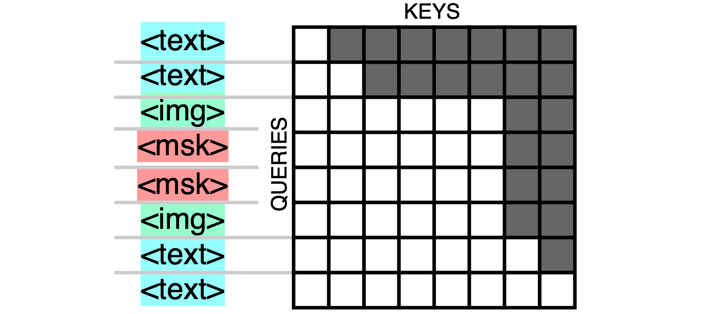

# The perfect VLM

My perfect VLM is a modification of DeepSeek's [Janus](https://arxiv.org/abs/2410.13848v1) / [Janus-Pro](https://arxiv.org/abs/2501.17811) model. This is the starting point (image from the paper):


The modifications are:

- Split the text- and image-head earlier; both should contain a transformer block unique to the modality
- Similarly, merge the modalities later at the input; visual information should come in after the first transformer block acting on text
- Make the attention mask bidirectional where images are at the input
- Actively train image-understanding by masking the adapted SigLIP tokens and letting the model de-noise / un-mask them
- (Optional) Instead of having a dedicated image-generation head, use multi-resolution inputs for the image-understanding branch, and mask the input-image-tokens with between 0% and 100% mask tokens; then train a diffusion model on the hidden states of fully masked images

This expands on my previous article [Multi-layer language heads: the output latent is for text (and nothing else)](https://snimu.github.io/2025/03/30/multi-layer-language-heads.html).

## Split the heads earlier, merge later

To summarize [my previous article](https://snimu.github.io/2025/03/30/multi-layer-language-heads.html), the first transformer block (attention + MLP) transforms the explicitly text-based representations into abstract ones, and the last layer transforms the abstract representation back into text-space. This is corroborated by [Scaling up Test-Time Compute with Latent Reasoning: A Recurrent Depth Approach](https://www.arxiv.org/abs/2502.05171) about looping a recurrent block.

The obvious consequence of this is that modalities, which look very different when instantiated into text/images/..., will try to push the model towards producing a representation most fit for producing exactly that modality, as opposed to others. This leads to competition for resources inside the model. Putting a transformer block per modality between the model core and the decoders will reduce that competition, and projecting into an abstract space should have a similar effect.

So the first modification that I would do to Janus is to merge inputs from different modalities later, and split their outputs earlier, like this:


## Autoregressive, masked image-understanding

A causal attention mask for image inputs that are subsequently not used for anything makes no sense to me. Just make the mask bidirectional where the image is, and causal everywhere else.

I also see no reason not to replace some of the patches in the input sequence with learned mask tokens

Then, we can actively train image-understanding embedded into the surrounding text by decoding into the same image-tokens but un-masked (and shifted by one to play nicely with the autoregressive nature of the rest of the model, as is done in [GPT or BERT: Why not both?](https://arxiv.org/abs/2410.24159) or, I think, [LLM2Vec: Large Language Models Are Secretly Powerful Text Encoders](https://arxiv.org/abs/2404.05961)).



This would obviously help with image understanding, but it could be taken further.

## Multi-resolution, multi-masking-rate image-understanding + diffusion

This part is completely optional, and it's the part that I'm most unsure about.

With the Janus setup of different encoders for image-understanding and -generation, there isn't a huge amount of overlap between the two, at least not inherently; it has to be learned, which costs training capacity. So is there a way to make use of the modifications done to image-understanding above? I believe so.

Remember that during training, we would randomly mask between 0% and 100% of the image-tokens. During inference, I'd use the 0% masking rate for understanding, and the 100% rate for generation. But I'd go further and introduce multi-scale prediction like in [Visual Autoregressive Modeling: Scalable Image Generation via Next-Scale Prediction](https://arxiv.org/abs/2404.02905).

During inference, the process would look like this:

1. Create a 2x2 grid of mask-tokens as an input and let the model predict the SigLIP tokens of the un-masked image-tokens
2. Use a small diffusion model on the hidden states close to the output to produce a low-resolution image from that
3. Replace the masked image-tokens with the low-resolution image-tokens in the context of the transformer; then let it produce a higher-resolution image from a larger batch of mask-tokens (4x4 or whatever)
4. Repeat the process until you have a full-resolution image

This makes use of the image-*understanding* capabilities of the model to produce high-quality hidden states; of multi-scale prediction for producing a high-resolution, globally coherent image; and a diffusion model for producing nice-looking details.

But both the masking and the multi-scale prediction should be advantageous for image-understanding, not just for image generation. This is for two reasons:

- The masking is just the task from [Masked Autoencoders Are Scalable Vision Learners](https://arxiv.org/abs/2111.06377), just without the encoder-decoder structure that saves compute. It should really help learn to understand images, especially since we work in abstract space
- The multi-scale prediction is basically what is done in [Ensemble everything everywhere: Multi-scale aggregation for adversarial robustness](https://arxiv.org/abs/2408.05446), where Stanislav Fort and Balaji Lakshminarayanan stack multiple resolutions of the same image along the channel dimension of a CNN, which significantly improves adversarial robustness of the models for basically no extra cost, and which produces clear images just from adversarial attacks on models trained only on image classification. This should also help a transformer be more adversarially robust, and see the image from different perspectives

The full pipeline would then look like this (but maybe not as ugly):


## Citation

```bibtex
@misc{snimu2025perfectvlm,
    title={The perfect VLM},
    author={Sebastian M\"uller},
    year={2025},
    month={mar},
    url={https://snimu.github.io/2025/03/31/multi-layer-language-heads.html}
}
```
