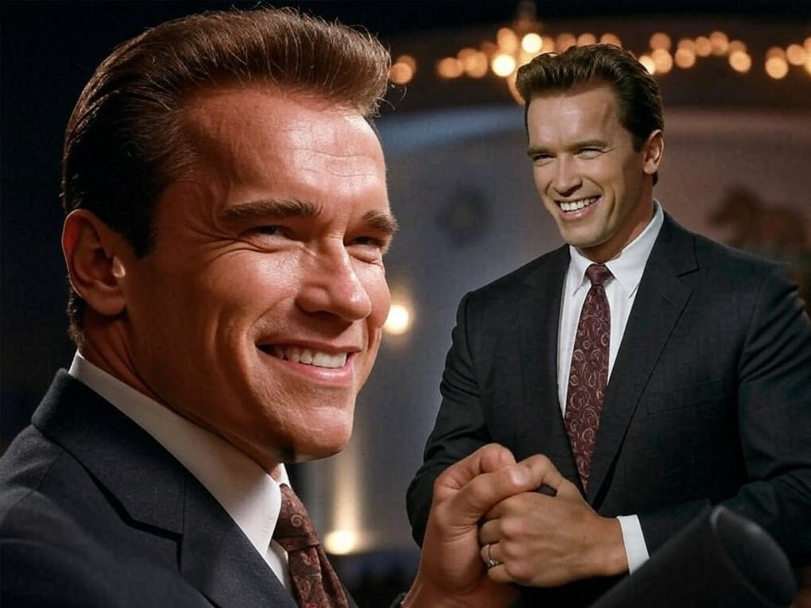

# My dream VLM

My dream VLM has the following properties:

- Text and images enrich each other's representations instead of competing for resources
- Image-understanding is trained actively and end-to-end, embedded into surrounding context
- Image-understanding and -generation use as much of a common backend as possible
- Every trick that boosts intelligence is used, even if it is expensive

I believe that this is best achieved by using DeepSeek's [Janus](https://arxiv.org/abs/2410.13848v1) / [Janus-Pro](https://arxiv.org/abs/2501.17811) model with the following modifications:

- Merge modalities later at the input
- Split them earlier at the output
- Make the attention mask bidirectional for image-understanding
- Actively train image-understanding by de-noising learned mask-tokens
- Multi-scale prediction on masked image-tokens
- Image-generation using the image-understanding backend, the same mask-tokens, and a diffusion model

I need to stress again that these modifications are tuned for giving the *smartest* VLM, not the *fastest* one. There may be tradeoffs to consider, but I want somebody to go all in on intelligence. Optimizations are for the future.

This is the starting point (image from the DeepSeek Janus paper):


> The [Janus Architecture](https://arxiv.org/abs/2410.13848v1).

Let's go through the modifications one by one.

## Split the heads earlier, merge later

To summarize [my previous article](https://snimu.github.io/2025/03/30/multi-layer-language-heads.html), the first transformer block (attention + MLP) approximately transforms the explicitly text-based representations into abstract ones, and the last layer transforms the abstract representation back into text-space. This is corroborated [here](https://x.com/jonasgeiping/status/1906667091324793307) by Jonas Geiping, co-author of [Scaling up Test-Time Compute with Latent Reasoning: A Recurrent Depth Approach](https://www.arxiv.org/abs/2502.05171) about looping a recurrent block.

The obvious consequence of this is that modalities, which look very different when instantiated into text/images/..., will try to push the model towards producing a representation most fit for producing exactly that modality, as opposed to others. This leads to competition for resources inside the model. Putting a transformer block per modality between the model core and the decoders at the output will reduce that competition, and projecting into an abstract space at the input should have a similar effect.

Since the article mentioned above, more evidence for my belief that modalities should be merged later and split earlier has emerged in the form of [Scaling Laws for Native Multimodal Models](http://arxiv.org/abs/2504.07951). The authors show that early fusion models work better than later fusion models, especially when using a Mixture of Experts (MoE) model. Importantly, they also show that the MoE model develops modality-specific experts, and does so *especially in the early and later layers*, not so much the middle layers, which I see as strong evidence for my claims. And while I'd of course also use a MoE model, I belief that merging late and splitting early gives even more separation, because the models each have their own Attention layer instead of just their own experts in the MLP.

So the first modification that I would do to Janus is to merge inputs from different modalities later, and split their outputs earlier, like this:


> The [Janus Architecture](https://arxiv.org/abs/2410.13848v1), adapted to have a common backend between modalities only in abstract space.

### Why attention + MLP instead of a simple linear layer?

I want to be very clear that this is pure intuition, so take it with a massive heap of salt.

Let's first look at the text-encoder only. Why does it only work in abstract space after the first transformer block? My answer is that abstract thought emerges from the connections between words/tokens, not the individual tokens themselves. Only by mixing the tokens along the sequence dimension via attention (or an SSM or whatever), and then along the model dimension via the MLP, can we get the abstract thoughts.
For images, it's similarly very difficult to move into abstract space without seeing the image as a whole, which only happens when the patches are mixed.

As for the output, it's just the inverse situation as the input: in both cases, the fundamental intuition is that moving into and out of abstract space, from/to a specific instantiation of some modality, takes a certain amount of thought/computation which is hard to learn for a single linear layer, and might even be impossible without mixing tokens.

Therefore, I think *at least* one transformer block per modality at the input, and another one at the output, is needed to properly separate the specific quirks of each modality from the shared semantic understanding used and refined by the shared backend.

**Sidenote:** there might be the alternative to just use a single attention layer, but without a residual connection, at least at the output. This is what I did [here](https://x.com/omouamoua/status/1887595667427926345?s=46) with the [Mixture of Tokenizers](https://snimu.github.io/2025/01/28/mixture-of-tokenizers-math.html) architecture, and it worked extremely well. However, I don't want to get into that here; the main point is that there needs to be a way to properly separate the modalities, and that that requires some mixing of the tokens/patches.

## Bidirectional image-understanding

My next modification is to make the attention mask bidirectional within the limits of a single image, like this:


> Bidirectional image-understanding. On the left are the inputs, on the right the targets, and in the middle the transformer, represented by its attention mask. Image-tokens are shown as images for visualization, but are in practice flattened embeddings. The four-armed giraffe was generated by [Imagen-3](https://deepmind.google/technologies/imagen-3/).

Yes, [PaliGemma](https://arxiv.org/abs/2407.07726) and [Gemma](https://huggingface.co/blog/gemma3) use it, which is already a good reason to do it; but I have more reasons than appeal to authority.

A causal attention mask for image inputs that are subsequently not used for anything except downstream text-generation makes no sense to me. Images aren't inherently autoregressive; they have no time-component shared by every image. That would be a video! So just make the mask bidirectional where the image is, and causal everywhere else. This way, every part of the image can see every other part of the image, which seems algorithmically important; and the attention mechanism at the image-tokens is used to full capacity, instead of half (as would be the case with a causal mask).

Those are the theoretical advantages of bidirectional masks, but the thing that made me *feel* those advantages was actually xAI's Aurora model, specifically this image:



> From [this post](https://x.com/fofrai/status/1867629384099934557?s=46) by [@fofrAI](https://x.com/fofrai)

Here is my speculation on why this image looks so weird:


> From [this post](https://x.com/omouamoua/status/1867926507391537260?s=46) by [@omouamoua](https://x.com/omouamoua) (that's me).

A bidirectional mask in an image *is* multi-token prediction, at least in a way. And yes, this is about image-generation, but 1) I want those advantages for image-generation too (see later how it's connected to image-understanding), and 2) I'm convinced that similar considerations apply to image-understanding as well.

### Efficiency and KV-cache

Just to stress: if we do this, we have to forward-pass the entire image at once. This is computationally expensive, but no more than passing a user-input with the same number of tokens as the image. And just like that user-input, we want to do it in parallel anyway, which means this costs us almost nothing more than a causal mask.

And because we can just feed in the entire image at once, and the tokens *after* the image tokens are masked, we can use a kv-cache.

## Masked image-understanding

In Janus, DeepSeek doesn't decode the image-understanding-tokens, instead relying on subsequent text- and image-generation-tokens to provide the loss signal.

I see no reason not to actively train image-understanding by replacing some of the patches in the input sequence with learned mask tokens. Decode the hidden states into the same image-tokens but un-masked (and shifted by one to play nicely with the autoregressive nature of the rest of the model, as is done in [GPT or BERT: Why not both?](https://arxiv.org/abs/2410.24159) or, I think, [LLM2Vec: Large Language Models Are Secretly Powerful Text Encoders](https://arxiv.org/abs/2404.05961)), and we should get much better image-understanding. Masking image tokens is the task from [Masked Autoencoders Are Scalable Vision Learners](https://arxiv.org/abs/2111.06377), just without the encoder-decoder structure that saves compute. It should really help learn to understand images, especially since we work in abstract space.


> Training bidirectional, masked image-understanding. On the left are the inputs, on the right the targets, and in the middle the transformer, represented by its attention mask. I show the images themselves being masked and produced at the output, but for image-understanding, what would be masked and produced would be adapted image tokens. After all, this is about image-*understanding*.

I would train a small percentage of the samples without masking, so that the model gets used to seeing the full image and using it for downstream tasks, and train the rest with, for example, between 25% and 75% of masked patches.

## Go early fusion

Throw away the SigLIP encoder.

Instead, use the following architecture:

1. Image is split into patches
2. Patches are flattened
3. Flat patches are transformed into model dimension D via a Fully Connected (FC) layer
4. The result is projected into the abstract input space of the VLM by a transformer block (attention + MLP)

If this is trained end-to-end, with text and other images in context, then:

- There will inherently be a CLIP/SigLIP-like effect, because as long as the text is useful for predicting image-patches and images are useful for predicting text, their embeddings will be aligned automatically to be maximally useful to each other
- In [Scaling Language-Free Visual Representation Learning](http://arxiv.org/abs/2504.01017), the authors show that scaling self-supervised learning (SSL) methods in large transformers works better than CLIP. So why not save the parameters and just train end-to-end?
- Most importantly, I will again point to [Scaling Laws for Native Multimodal Models](http://arxiv.org/abs/2504.07951). Early-fusion MoEs are significantly better than late-fusion models. Most importantly, it is best to use way more data and fewer parameters for the early-fusion than the late-fusion model, assuming the same training FLOP budget. That means that the early-fusion model of the same or higher quality can be run much more cheaply than the late-fusion model, because it has fewer parameters.
  - *Sidenote:* The authors use a slightly different definition of early-fusion than me, but I'm still calling my models early-fusion because they are trained end-to-end, without any independently trained encoders.

Some of you may fear representation collapse if we do this: the easiest way for the image-encoder to always be able to un-mask the image-tokens is to always produce 0 at its output. But as long as the images are useful for understanding the text coming after them, there is another loss signal working against representation collapse. This makes me believe that representation collapse is not a problem in such a VLM.

## Multi-resolution, multi-scale image-understanding

Image understanding can be taken further by going multi-resolution / multi-scale:


> Multi-scale, masked-token, bidirectional image-understanding. Inputs on the left, targets on the right, transformer in the middle. The images are shown as images, and the mask tokens as red patches on top of them, but both are, in reality, flattened image-tokens.

Multi-resolution prediction is what is done in [Ensemble everything everywhere: Multi-scale aggregation for adversarial robustness](https://arxiv.org/abs/2408.05446), where Stanislav Fort and Balaji Lakshminarayanan stack multiple resolutions of the same image along the channel dimension of a CNN, which significantly improves adversarial robustness of the models for basically no extra cost. The same advantage can be used in a transformer, by simply downsampling and masking the image. In transformer, this would of course incur additional costs, but I believe that it would be worth it. And since we can use fewer tokens for the downsampled images, the extra costs are not exorbitant.

*So what's a practical example where multi-scale image understanding would be useful?*

Anything where looking at the image at multiple resolutions is useful. For example, there was this brief trend of creating images that look like a normal photograph, but when you zoom out, the elements of the picture show a text, like this:


> If you look closely at the image, you will see a bunch of people walking around, but if you squint or look from far away&mdash;in other words, if you reduce the resolution of the image&mdash;the peoples' clothes spell out "OBEY". I don't know where the image originates from, so I unfortunately can't give a source.

Seeing this image in its original resolution *and* a highly downsampled version will allow a model to see both aspects of it at once.

Another example for a task that would benefit from a multi-resolution/multi-scale approach is recognizing people/objects in noisy images, such as this one:


> From [this post](https://x.com/torchcompiled/status/1909878529321222619?s=46) by [@torchcompiled](https://x.com/torchcompiled).

It's pretty easy for humans to recognize this image, but difficult for current VLMs. The difference, I believe, is that humans use multi-resolution vision.

These examples are somewhat toy-like, but they point to an important capability: reliability in image recognition, and an ability to handle complex, previously unseen contexts.

## Add a diffusion model

Now, all we have to do to to generate images too, is to add a diffusion model and separate it from the common backend with its own transformer block. We use the activations of the transformer to guide the diffusion model. For every single image that we see, consisting of between 25% and 75% mask-tokens, we apply both the image-understanding head and the image-generation head (a.k.a. a transformer block + diffusion model). This is illustrated below:


> Decoding the common hidden states into image-tokens and an actual image via two independent heads, separated by their own transformer blocks.

I will get to the details of training and inferencing this setup, but first, some general advantages that we can already determine:

- We will see in a moment that we are doing [Visual Autoregressive Modeling: Scalable Image Generation via Next-Scale Prediction](https://arxiv.org/abs/2404.02905) (multi-scale generation), which seems to work very well. It allows the model to first generate rough outlines of an image at low resolution, then refine them step-by-step. We are predicting one scale, then the next, and so on. And since the model sees its own outputs through the image-encoder, this is meaningful multi-scale generation.
- Because we are using multi-scale generation, a diffusion model, which is naively best at the very local and high-frequency components of an image, can still get the low-frequency, rough outlines right.
- This method of generation allows us to use a bidirectional mask, which should be superior to a causal mask not just in understanding the image at the previous scale, but also at generating good representations at the current scale. It also means that we can generate the hidden states for the entire image at once (per resolution), instead of token-by-token, and then just use a cheap diffusion model for a few steps on top.
- We get all the advantages of diffusion models:
  - Image diversity / easy re-generation with a different noise seed from cached hidden states
  - Great aesthetics
  - Easy adaptability of those aesthetics via cheap LoRAs to the diffusion model alone
  - Multi-step generation for a good efficiency-to-quality trade-off

However, there are a few strange things about this.

*Why do we do image-generation from only 25%-75% mask-tokens?*

During inference, we won't, but I will get to that shortly.

During training, it offers multiple advantages:

- Because we use the image-encoder for both image-understanding and -generation, we don't need any text-labels to condition the diffusion model. After all, 25%-75% of the image are still visible, so the hidden states can act as meaningful conditioning. Of course, we *can* still use text-labels through interleaved text and image data, but we can also train on any image-data, without having to provide a good description of the image.
- We enable inpainting. Just draw mask-tokens into your image, feed it through the image-encoder and common backbone, and apply the diffusion model.
- We can always train both image-understanding and image-generation for every image, which does three things:
  1. It gives a ton of training signal
  2. It aligns the two, so that they can work well together
  3. It avoids representation collapse even without surrounding text, because the diffusion model is trained against a fixed ground-truth instead of the model's own hidden states.
- And just to repeat myself, the transformer blocks separating the two should mean that they don't compete for resources, instead training the common backend to produce highly meaningful representations.

*What about inference?*

We are currently training with 25-75% mask-tokens, but actual image-understanding should happen with 0% mask-tokens, and image-generation with 100% mask-tokens. How do we do that?

The simple answer is: post-training.

For image-generation, train a bit with 100% mask-tokens at the input. After every image-scale, swap the mask-tokens out for the actual image, then generate the next scale. By using 100% mask-tokens at the input, we don't need any pre-existing image. And since we can simply feed in all the mask tokens for a certain resolution in parallel, this is a two-step process per scale: 1) generate image from mask-tokens; 2) swap out mask tokens for actual image and generate. However, step 2 can be done at the same time as the next scale is being generated, which saves even more steps, so this is closer in costs to typical input-tokens than output-tokens.

Here's what that would look like:


> Multi-scale, masked image generation at inference time. To keep the image readable, it does *not* show the diffusion model after the transformer that generates the actual image, nor the transformer block that separates the common backend from the image-understanding- and text-decoders. You will notice that there are some additional tokens before, after, and between the different image-scales; these are needed to line up the inputs, outputs, and attention mask.

As for image-understanding, it's even simpler: post-train on a bunch of interleaved text and image data with 0% mask-tokens over the images, then use the model just like that during inference.

However, there is another way to achieve the same.

## Add the un-masked image

If we simply add the un-masked image after the masked image at every scale, but only decode with the image-understanding and -generation heads on the masked images, at every resolution, we get an even better model, and can get rid of the crutch of replacing mask-tokens with the actual image in image-generation.

First off, here's what that would look like:


> Training a multi-scale, bidirectional-per-scale, masked-token image-generation model with masked and un-masked images at every scale.

There is a single disadvantage to this approach: cost. The number of tokens per image is doubled. Of course, as I've written above, these tokens should be treated more like input-tokens than output-tokens, even in image-generation, so while it has high memory- and compute-intensity, it can be parallelized a lot. For inputs containing many images, though, these extra tokens will be felt.

As for advantages:

- During inference, you can simply append the generated image to the mask-tokens, so the image-generation model inherently sees its own creation in its un-masked form after generation at every scale, which allows for three things:
  1. The image can be used to guide the generation of the next higher resolution
  2. The un-masked image is immediately visible to the model for downstream text or image tasks
  3. The model can see the generated image in full resolution right after having generated it at every scale, and (given the right tools) decide that there is something wrong with the image. Then, we could simply re-generate the image by giving the diffusion model a different noise-input, guided by the same hidden states. To be clear, I don't mean generating *all* resolutions and *then* re-generating; I mean something like evalutating the difference between the activations for the mask-tokens and the actual image at those positions, and re-generating if the difference is too large. This would be cheap because only the diffusion model would have to be run again.
- In fact, I want to stress this: for the purpose of downstream tasks, image-generation is now exactly equivalent to image-understanding.
- As for image-understanding, we can now train that capability with a pretty heavily masked image, and still have the CLIP-like effect of having the full-resolution image in context for downstream text generation.
- In both cases, this setup allows the model to first spell out what it thinks should be under the mask tokens (be there 25% or 100% mask tokens, or anything between), and then see what is actually under them.
  - In the case of image understanding, this allows the model to use surprisal as a strategy for analyzing the image. And yes, I'd use that during inference: mask the image 25-75% (the exact number is an emprical question) at the position where it is masked during training, and leave it un-masked where it is un-masked during training.
  - In the case of image generation, this of course does the same, but with the right training data, it might also allow for something else: the model correcting itself during generation (beyond just re-generating the diffusion output; no, I mean correcting the layout from the low-resolution image in the high-resolution image).
- There is a small chance that the mask-tokens act a bit like registers, see [Vision Transformers Need Registers](https://arxiv.org/abs/2309.16588).

I believe that this method would yield a VLM that is very strong at both image-understanding and image-generation, and would still work well with text. In fact, with the right training data, I think that the modalities will improve each other.

## Conclusion

While I have no guarantees about any of these modifications, I would love to see someone with a budget and the skills to try them out:

- Merge later and split earlier for thinking in abstract space
- Mask tokens and a bidirectional attention mask for image-understanding
- Multi-scale prediction for image-understanding
- A diffusion model on top of the image-understanding-backend for image-generation


> Proposed modifications to the Janus architecture, rough sketch.

## Citation

```bibtex
@misc{snimu2025perfectvlm,
    title={The perfect VLM},
    author={Sebastian M\"uller},
    year={2025},
    month={04},
    url={https://snimu.github.io/2025/04/07/my-dream-vlm.html}
}
```
