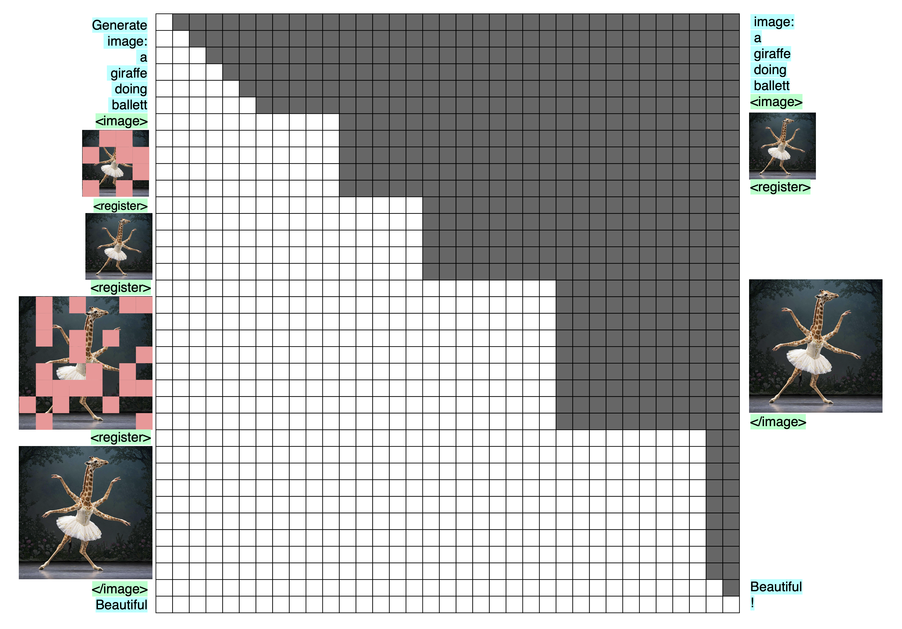

# My dream VLM

My dream VLM has the following properties:

- Text and images enrich each other's representations instead of competing for resources
- Image-understanding is trained actively and end-to-end, embedded into surrounding context
- Image-understanding and -generation use as much of a common backend as possible
- Every trick that boosts intelligence is used, even if it is expensive

I believe that this is best achieved by using DeepSeek's [Janus](https://arxiv.org/abs/2410.13848v1) / [Janus-Pro](https://arxiv.org/abs/2501.17811) model with the following modifications:

- Merge modalities later at the input
- Split them earlier at the output
- Make the attention mask bidirectional for image-understanding
- Actively train image-understanding by de-noising learned mask-tokens
- Multi-scale prediction on masked image-tokens
- Image-generation using the image-understanding backend, the same mask-tokens, and a diffusion model

I need to stress again that these modifications are tuned for giving the *smartest* VLM, not the *fastest* one. There may be tradeoffs to consider, but I want somebody to go all in on intelligence. Optimizations are for the future.

This is the starting point (image from the DeepSeek Janus paper):


> The [Janus Architecture](https://arxiv.org/abs/2410.13848v1).

## Split the heads earlier, merge later

To summarize [my previous article](https://snimu.github.io/2025/03/30/multi-layer-language-heads.html), the first transformer block (attention + MLP) approximately transforms the explicitly text-based representations into abstract ones, and the last layer transforms the abstract representation back into text-space. This is corroborated [here](https://x.com/jonasgeiping/status/1906667091324793307) by Jonas Geiping, co-author of [Scaling up Test-Time Compute with Latent Reasoning: A Recurrent Depth Approach](https://www.arxiv.org/abs/2502.05171) about looping a recurrent block.

The obvious consequence of this is that modalities, which look very different when instantiated into text/images/..., will try to push the model towards producing a representation most fit for producing exactly that modality, as opposed to others. This leads to competition for resources inside the model. Putting a transformer block per modality between the model core and the decoders will reduce that competition, and projecting into an abstract space should have a similar effect.

So the first modification that I would do to Janus is to merge inputs from different modalities later, and split their outputs earlier, like this:


> The [Janus Architecture](https://arxiv.org/abs/2410.13848v1), adapted to have a common backend between modalities only in abstract space.

### Why attention + MLP instead of a simple linear layer?

I want to be very clear that this is pure intuition, so take it with a massive heap of salt.

Let's first look at the text-encoder only. Why does it only work in abstract space after the first transformer block? My answer is that abstract thought emerges from the connections between words/tokens, not the individual tokens themselves. Only by mixing the tokens along the sequence dimension via attention (or an SSM or whatever), and then along the model dimension via the MLP, can we get the abstract thoughts (I would say that the MLP does the actual conversion into abstract space, and attention is just there to steer it into abstract space for the right combination of tokens, but that's not super relevant and I'm also not very confident about it).

For images, it's similarly very difficult to move into abstract space without seeing the image as a whole, which only happens when the patches are mixed.

Therefore, I think *at least* one transformer block per modality at the input, and another one at the output, is needed to properly separate the specific quirks of each modality from the shared semantic understanding used and refined by the shared backend.

## Bidirectional image-understanding

My next modification is to make the attention mask bidirectional within the limits of a single image.

Yes, [PaliGemma](https://arxiv.org/abs/2407.07726) and [Gemma](https://huggingface.co/blog/gemma3) use it, which is a good reason to do it already; but I have more reasons than appeal to authority.

A causal attention mask for image inputs that are subsequently not used for anything makes no sense to me. Images aren't inherently autoregressive; they have no time-component shared by every image. That would be a video! So just make the mask bidirectional where the image is, and causal everywhere else. This way, every part of the image can see every other part of the image, which seems algorithmically important; and the attention mechanism at the image-tokens is used to full capacity, instead of half (as would be the case with a causal mask).

Those are the theoretical advantages of bidirectional masks, but the thing that made me *feel* those advantages was actually xAI's Aurora model, specifically this image:


> From [this post](https://x.com/fofrai/status/1867629384099934557?s=46) by [@fofrAI](https://x.com/fofrai)

Here is my speculation on why this image looks so weird, from [this post](https://x.com/omouamoua/status/1867926507391537260?s=46) by [@omouamoua](https://x.com/omouamoua) (that's me):

```txt
Regarding the weird hands:

I have a hypothesis that generating images autoregressively left-to-right, then top-to-bottom — as I think Aurora does — will lead to errors mostly at the bottom of the image.

Of course, the obtuse way to explain this is by saying that autoregressive errors accumulate.

But in the case of images, there is a more concrete explanation: the model generates plausible patches for the first row it creates. Here, that’s two hairlines from people at different distances to the camera; makes sense. But as the rows are created with plausible looking patches, one by one, a conflict emerges: both Arnolds intersect, and you need to resolve this in a plausible manner when you have never planned for it. That’s a high stakes situation where a single error can derail the whole image.

This is made worse by the tendency of undertrained models to make the highest-probability token pretty repetitive, and not as dependent on previous tokens as would be ideal. This is likely why there are two Arnolds in the image, and also why both must have a hand in the foreground, forcing the model to resolve this by screwing it up.

Essentially, a next-token predictor never explicitly learns to care about the composition of the entire output.

Multi-token prediction would fix this.
```

A bidirectional mask in an image *is* multi-token prediction, at least in a way. And yes, this is about image-generation, but 1) I want those advantages for image-generation too (see later how it's connected to image-understanding), and 2) I'm convinced that similar considerations apply to image-understanding as well.

Here's what this would look like:


> Bidirectional image-understanding. On the left are the inputs, on the right the targets, and in the middle the transformer, represented by its attention mask. Image-tokens are shown as images for visualization, but are in practice flattened embeddings. The four-armed giraffe was generated by [Imagen-3](https://deepmind.google/technologies/imagen-3/)

### Efficiency and KV-cache

Just to stress: if we do this, we have to forward-pass the entire image at once. This is computationally expensive, but no more than passing a user-input with the same number of tokens as the image. And just like that user-input, we want to do it in parallel anyway, which means this costs us almost nothing compared to a causal mask.

And because we can just feed in the entire image at once, and the tokens *after* the image tokens are masked, we can use a kv-cache.

## Masked image-understanding

In Janus, DeepSeek doesn't decode the image-understanding-tokens, instead relying on subsequent text- and image-generation-tokens to provide the loss signal.

I see no reason not to actively train image-understanding by replacing some of the patches in the input sequence with learned mask tokens. Decode the hidden states into the same image-tokens but un-masked (and shifted by one to play nicely with the autoregressive nature of the rest of the model, as is done in [GPT or BERT: Why not both?](https://arxiv.org/abs/2410.24159) or, I think, [LLM2Vec: Large Language Models Are Secretly Powerful Text Encoders](https://arxiv.org/abs/2404.05961)), and we should get much better image-understanding. Masking image tokens is the task from [Masked Autoencoders Are Scalable Vision Learners](https://arxiv.org/abs/2111.06377), just without the encoder-decoder structure that saves compute. It should really help learn to understand images, especially since we work in abstract space.


> Training bidirectional, masked image-understanding. On the left are the inputs, on the right the targets, and in the middle the transformer, represented by its attention mask. I show the images themselves being masked and produced at the output, but for image-understanding, what would be masked and produced would be adapted image tokens. After all, this is about image-*understanding*.

I would train a small percentage of the samples without masking, so that the model gets used to seeing the full image and using it for downstream tasks, and train the rest with between 0% and 100% of masked patches. It will become clear why I want to use up to 100% of the image-tokens when I get to image-generation.

### Should we even use SigLIP for this?

This is a question that I'm uncertain about. The idea behind it is: if we already actively train image understanding, do we not limit ourselves by using a frozen encoder that was trained by projecting into text-space, instead of training end-to-end?

Imagine the following architecture:

1. Image is split into patches
2. Patches are flattened
3. Flat patches are transformed into model dimension D via a Fully Connected (FC) layer
4. The result is projected into the abstract input space of the VLM by a transformer block (attention + MLP)

If this is trained end-to-end, with text and other images in context, then:

- There will inherently be a CLIP/SigLIP-like effect, because as long as the text is useful for predicting image-patches and images are useful for predicting text, their embeddings will be aligned automatically to be maximally useful to each other
- In [Scaling Language-Free Visual Representation Learning](http://arxiv.org/abs/2504.01017), the authors show that scaling self-supervised learning (SSL) methods in large transformers works better than CLIP. So why not save the parameters and just train end-to-end?

*Sidenote:* The authors of that paper use methods like DINOv2, not mask-denoising, but I expect that the latter would also work, and we will see why it is useful when we come to image-generation.

Some of you may fear representation collapse if we do this: the easiest way for the image-encoder to always be able to un-mask the image-tokens is to always produce 0 at its output. But as long as the images are useful for understanding the text coming after them, there is another loss signal working against representation collapse. This makes me believe that representation collapse is not a problem in such a VLM.

I don't know for sure if this will work, but I suspect so. From hereon out, I will assume that this is the case, and refer to the image-inputs as image-tokens.

## Multi-resolution, multi-scale image-understanding

Image understanding can be taken further by going multi-resolution / multi-scale:


> Multi-scale, masked-token, bidirectional image-understanding. Inputs on the left, targets on the right, transformer in the middle. The images are shown as images, and the mask tokens as red patches on top of them, but both are, in reality, flattened image-tokens.

Multi-resolution prediction is what is done in [Ensemble everything everywhere: Multi-scale aggregation for adversarial robustness](https://arxiv.org/abs/2408.05446), where Stanislav Fort and Balaji Lakshminarayanan stack multiple resolutions of the same image along the channel dimension of a CNN, which significantly improves adversarial robustness of the models for basically no extra cost. The same advantage can be used in a transformer, by simply downsampling and masking the image. In transformer, this would of course incur additional costs, but I believe that it would be worth it. And since we can use fewer tokens for the downsampled images, the extra costs are not exorbitant.

*So what's a practical example where multi-scale image understanding would be useful?*

Anything where looking at the image at multiple resolutions is useful. For example, there was this brief trend of creating images that look like a normal photograph, but when you zoom out, the elements of the picture show a text, like this:


> If you look closely at the image, you will see a bunch of people walking around, but if you squint or look from far away&mdash;in other words, if you reduce the resolution of the image&mdash;the peoples' clothes spell out "OBEY". I don't know where the image originates from, so I unfortunately can't give a source.

Seeing this image in its original resolution *and* a highly downsampled version will allow a model to see both aspects of it at once.

## Multi-resolution, multi-masking-rate image-understanding + diffusion

Here's where it all comes together: multi-scale prediction is reminicent of the multi-scale aspects of a U-Net, and, more importantly, it is just [Visual Autoregressive Modeling: Scalable Image Generation via Next-Scale Prediction](https://arxiv.org/abs/2404.02905). Combined with masking and diffusion, it would allow for high-quality image generation.

I want the advantages of a bidirectional mask, but for image-generation. This doesn't allow for autoregressive generation, which loses us the aspect of gradual generation which is crucial. But if we re-use the multi-scale image-understanding-encoder, and run a diffusion model on top of its output hidden states, we gain that advantage back, and more on top.

I will first describe how I imagine inference to work, then training, and finallys the advantages I hope to gain from this method of image-generation.

### Inference

For inference, I would follow these steps:

1. Apply mask tokens to the input, as many as there are patches in your lowest-resolution image. To be clear, these are the same mask tokens used for image understanding, and they are all applied at once, in parallel
2. Separate the resulting hidden states from the abstract space with a transformer block and then use its output to guide a small diffusion model
3. Take the resulting image and replace the masks at the input with it
    - *Why not keep the mask tokens and simply append the generated image at the input?*
    - Reason 1: Costs. Replacing the mask tokens saves a lot of kv-cache, especially when there are multiple images in context. And the image has to be put to the input anyway
    - Reason 2: To stay closer to the image generation task. Unless we always prepend each scale of each image with a number of masks equal to the number of patches in the image (which would give us plenty of registers, see [Vision Transformers Need Registers](https://arxiv.org/abs/2309.16588) but would be complete overkill to the point of being ridiculous), replacing the mask tokens is needed to make the tasks similar, which is desireable for sharing capabilities between tasks
4. Generate the next scale and repeat


> Multi-scale, masked image generation. To keep the image readable, it does *not* show the diffusion model after the transformer that generates the actual image, nor the transformer block that separates the common backend from the image-understanding- and text-decoders. You will notice that there are some additional tokens before, after, and between the different image-scales; these are needed to line up the inputs, outputs, and attention mask.

### Training

The image-generation as shown in the [inference](#inference) part above has to be done autoregressively. An important question is whether it can be parallelized for pre-training.

At first glance, the answer is "yes", because we can simply make use of the attention mask, like this:



> Training a multi-scale, bidirectional-per-scale, masked-token image-generation model. The diffusion model is not shown here, but its training can of course be parallelized.

My worry is that the distances between the un-masked images at different scales are higher than they will be during inference. This would cause a distribution shift between training and inference.

However, I see three reasons not to worry:

1. We are training image-understanding on the same encoder, where we don't use that masking scheme. So there, the distances will be like the are in image-generation-inference. Since we share most of the model between both tasks, some transfer should happen
2. We can always post-train on the actual usage. I'm confident that what's learned in pre-training will transfer in post-training
3. As mentioned above, if push comes to shove, we can simply keep the masks in context during inference, instead of replacing them with the generated image, though that comes with the drawbacks discussed before. On the other hand, it would allow us to do the following (not sure if it useful):
    - In (for example) 10% of the images, we mask 0% of the input patches and use no decoder; this is to get the model used to using un-masked images in the context of surrounding text
    - In (for example) 25% of the images, we apply 100% mask tokens, as shown above. We apply the image-generation decoder
    - In the rest of cases, we randomly choose an $x$, with $0 \lt x \lt 100$, and mask $x\%$ of image tokens. We apply both decoders.

Of course, if it is easy to modify RoPE positions dynamically, we could very easily go around the problem, but I don't understand RoPE well enough to be able to tell (and my expectation is that it's not possible).

#### The diffusion model

Just to include this into the article explicitly, here is a sketch of how the diffusion model can be steered by the image-understanding-encoder, and trained in a parallelized fashion:

### Advantages

With this method, I'm after the following advantages:

- Multi-scale prediction seems to work very well. It allows the model to first generate rough outlines of an image at low resolution, then refine them step-by-step. GPT-4o probably uses it
- We use the image-understanding-encoder to encode the images at the previous scale, so the model automatically sees the images that it has just created through the eyes of image-understanding
  - That's great for creating the next image
  - It's great for creating the next scale of the same image
  - And it's great for other downstream tasks like thinking about the image
- Because it uses the image-understanding-encoder, the model can make use of the high-quality representation in the hidden states. We use the same mask-tokens for image-generation as for image-understanding, just more of them. This means that everytime we train the model on image-understanding, we also train it to handle mask tokens
- This method of generation allows us to use a bidirectional mask, which should be superior to a causal mask not just in understanding the image at the previous scale, but also at generating good representations at the current scale. It also means that we can generate the hidden states for the entire image at once (for a single scale), instead of token-by-token, and then just use a cheap diffusion model for a few steps on top
- Diffusion works really well for image-generation, especially when it comes to aesthetics.
  - We are using high-quality, semantically rich hidden states from the actively trained image-understanding-encoder to guide the diffusion model, which should lead to excellent prompt adherence&mdash;often a limiting factor for pure diffusion models
  - We are using multi-scale generation, so a diffusion model, which is naively best at the very local, high-frequency components of an image, can still get the low-frequency, rough outlines right
  - We get all the advantages of diffusion models:
    - Image diversity / easy re-generation with a different noise seed from cached hidden states
    - Great aesthetics
    - Easy adaptability of those aesthetics via cheap LoRAs to the diffusion model alone
    - Multi-step generation for a good efficiency-to-quality trade-off

## Conclusion

While I have no guarantees about any of these modifications, I would love to see someone with a budget and the skills to try them out:

- Merge later and split earlier for thinking in abstract space
- Mask tokens and a bidirectional attention mask for image-understanding
- Multi-scale prediction for image-understanding
- A diffusion model on top of the image-understanding-backend for image-generation


> Proposed modifications to the Janus architecture, rough sketch.

## Citation

```bibtex
@misc{snimu2025perfectvlm,
    title={The perfect VLM},
    author={Sebastian M\"uller},
    year={2025},
    month={04},
    url={https://snimu.github.io/2025/04/07/my-dream-vlm.html}
}
```
