# Merge tokens in autoregressive generation

Models can produce tokens that could be further merged into a single token. For example: "this is a prompt" would be tokenized as "this", "is", "a", "prompt", but a model might produce is as "t", "h", "i", "s", " ", "i", "s", " ", "a", " ", "p", "r", "o", "m", "o", "t". This could have been significanly compressed by merging the produced tokens.

All training data is tokenized in a maximally compressed fashion. Therefore, if a model produced un-merged tokens during autoregressive generation, it is moved out-of-distribution. Continually merging tokens during generation might thus lead to better performance.

In this article, I perform some ablations to see if model outputs could indeed be merged. I ablate over temperature, model size, and position in the sequence.

## Setup

I use [the Pythia scaling suite](https://huggingface.co/collections/EleutherAI/pythia-scaling-suite-64fb5dfa8c21ebb3db7ad2e1) by EleutherAI, for the following reasons:

- The models are available in a wide range of sizes that I can easily handle: 70M, 160M, 410M, 1B, 1.4B, 2.8B, 6.9B, 12B
- They are trained on fairly little data, less than 300B tokens. This is good because a stronger model might produce mostly fully merged tokens, which would make any effects less visible
- They are available at many checkpoints, which I might use in future experiments

I sweep over the temperatures from 0.0 to 2.0, in steps of 0.2, for each model.

I produce about 1024 auto-generated tokens per inference, though for some reason it varies a bit and I couldn't be bothered to fix it. Those 1024 tokens are split into windows of 64 tokens each.

I compute the compression for both each window and the whole sequence, where the compression is calculated as: *(llm(query) - encode(decode(llm(query)))) / llm(query)*. In other words, the compression measures how much longer the produced sequence is compared to the compressed sequence. The compression is performed by decoding the produced tokens and then re-encoding them.

As prompts, I use 200 random samples from the [Wikitext dataset](https://huggingface.co/datasets/Salesforce/wikitext)&mdash;the test-set, to be precise&mdash;for each setting (model, temperature).

Code can be found [here](https://github.com/snimu/token-merge).

## Metrics

I measure the following metrics:

- **Mean compression**: the mean compression of the sequence / window over all 200 samples
- **Fraction of samples compressed**: the fraction of samples that are compressed over all 200 samples

## Results

I will write the results down as I receive them, and give a little bit of commentary for each. This means that the below might be slightly un-structured.

### Fraction of samples compressed, by model size

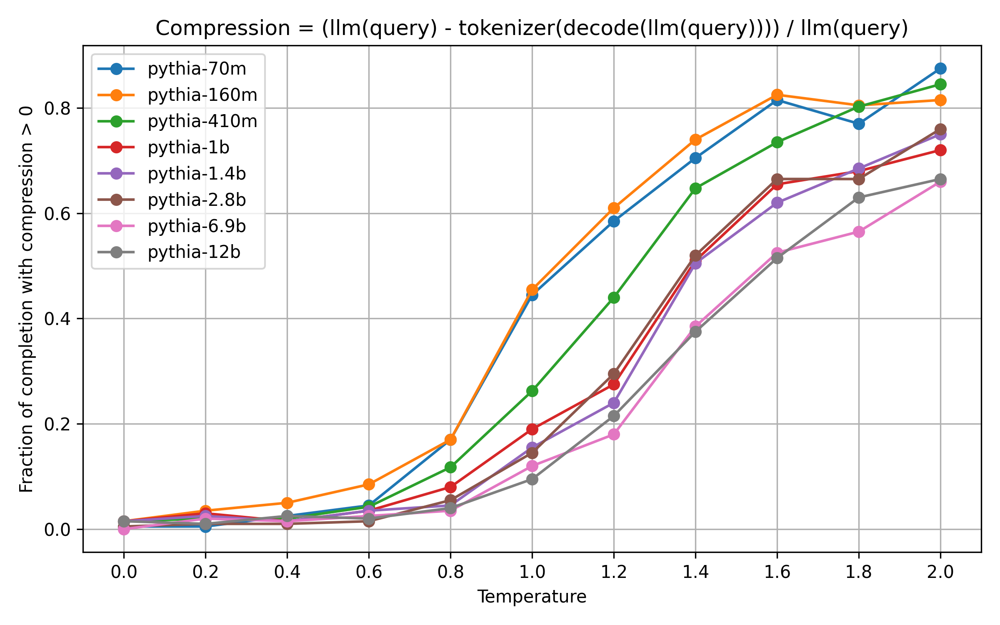

A few takeaways:

- The number of completions in which *some* tokens are merged follows a sigmoid-curve for all models, approaching 1.
- At low temperatures, only few completions have merged tokens.
- At high temperatures, most completions have merged tokens.
- Larger models tend to produce fewer completions with merged tokens. This is expected, because they reflect the training data more closely.

Let's look more closely at the lower temperatures from 0.0 to 0.8:

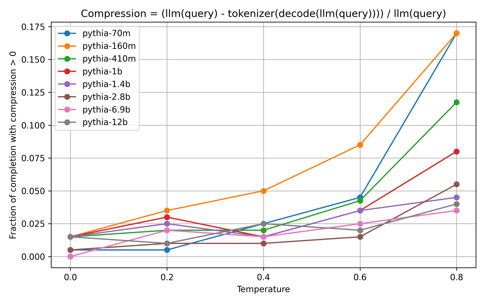

Here, the difference between the model-sizes becomes more pronounced. Large models barely produce any tokens that can be merged.

### Mean compression, by model size

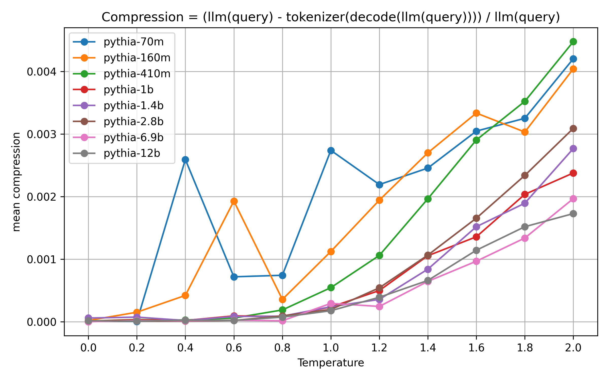

Observations:

- This is not a full sigmoid, but maybe the early stages of one
- At temperature 2.0, the smallest models produce sequences that can be compressed by about 0.5%, while the largest models produce ones that can be compressed by about 0.18%.

Already, those are pretty low compression rates. Let's look at the lower temperatures from 0.0 to 0.8:

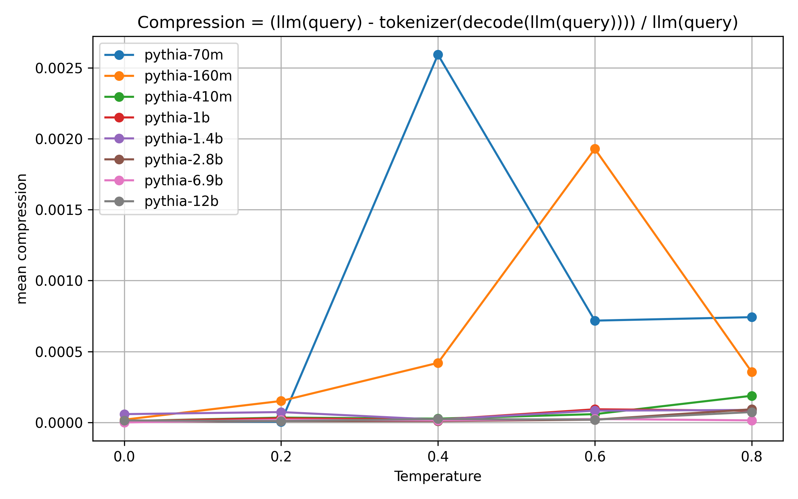

The compression is non-zero for most models even at temperature 0.0. However, it is very close to zero, and barely rises when it reaches temperature 0.8.

This means that the data at low temperatures is so noisy as to be barely usable. I will have to re-run the experiments with way more samples at some point. It also is a pretty strong signal that in the  most common temperature settings, a modern model trained on much more than 300B tokens will not suffer at all from producing un-merged tokens.

Does that change with the sequence length?

### Mean compression, by token position

The short answer is: somewhat, but it's pretty noisy (I probably set the window size too low.)

First, here is the plot of mean compression per chunk/window over all models at temperature 2.0:

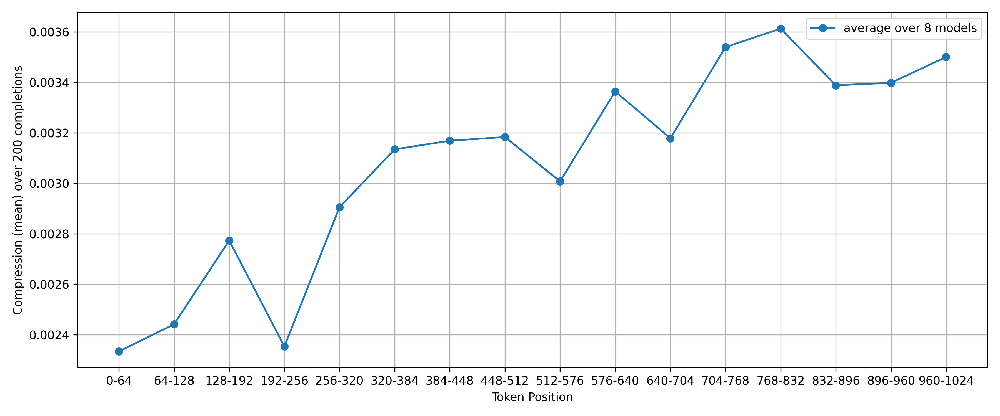

Clearly, un-compressed tokens are used more often later in the model's generation&mdash;in other words, the further away from the (fully compressed) user-input we get, the more un-compressed tokens are produced.

However, there are two limitations to this:

1. this is at a high temperature, where we know that a lot of un-compressed tokens are produced in general
2. this is the average over all models; some of which produce comparatively high values of compression, while others produce low ones. The high-compression curves will obviously dominate the above plot

To adress issue number 1, here is the same plot at temperature 0.8:

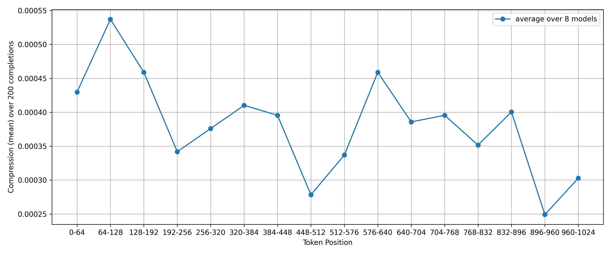

Here, there seems to be an *inverse* relationship between token position and compression! A caveat is of course that only a small fraction of generations see any compression at all at temperature 0.8, and we split this further into chunks. This means that the data is extremely noisy, and we shouldn't draw extremely strong conclusions from it. The temperature 2.0 results are likely more meaningful (in the future, I might repeat these experients with a much larger dataset to get statistically meaningful results, or maybe I won't).

So how does this behavior compare between models? Let's look at the smallest and largets models&mdash;pythia-70m and pythia-12b, respectively&mdash;an see how the relationship between token position and compression develops.

First, pythia-70m:

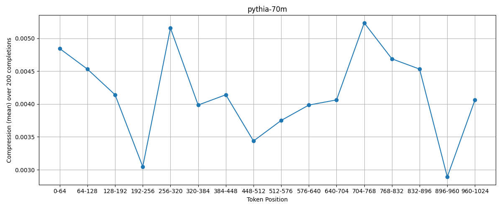

This doesn't look like anything. It's extremely erratic, and there doesn't seem to be a clear trend.

What about pythia-12b:

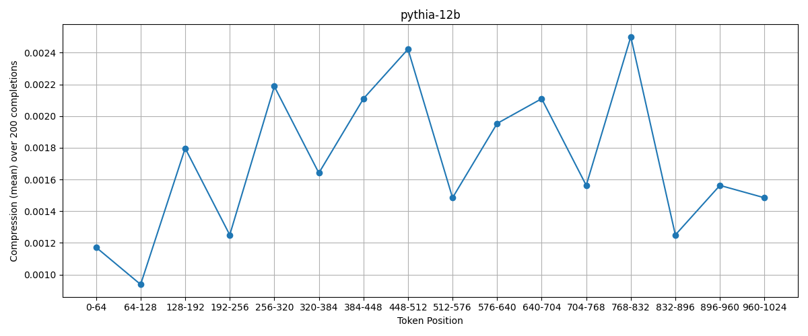

There seems to be a positive correlation between token position and compression, however it falls off towards the end. I don't know how meaningful that is, but I will very carefully posit that in larger models, there is a stronger relationship between token position and compression than in smaller ones.

Just to make sure of that, here is the sampe plot for pythia-6.9b:

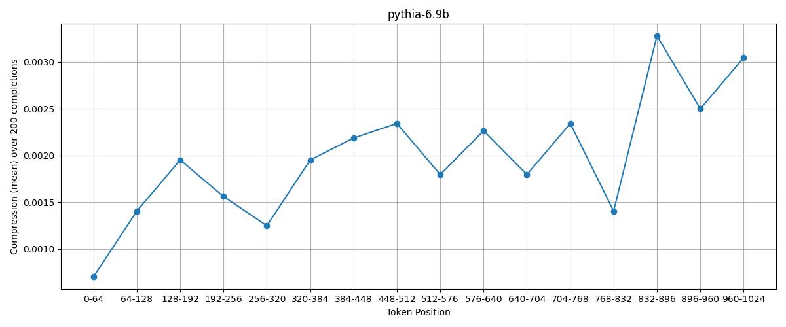

Here, we see a *very* clear relationship!

My hypothesis is that small models such as pythia-70m produce mostly the same few words over and over again at low temperatures, and completely random outputs at high temperatures. They are therefore not very meaningful for this work (though I think it was important to include them). I could be wrong here, though! You can look at the raw data, including all un-compressed and compressed completions, at [the experimental repo for this article](https://github.com/snimu/token-merge) under *results.csv*.

One thing I would expect if larger models are more meaningful than smaller ones is for them to retain the relationship between token position and compression even at lower temperatures.

So here is pythia-12b at temperature 0.8:

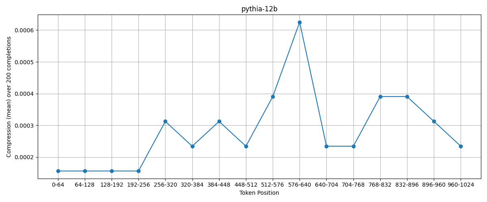

It's pretty noisy, but there remains a broadly positive relationship between token position and compression. This is very good, but let's also look at pythia-6.9b for confirmation:;

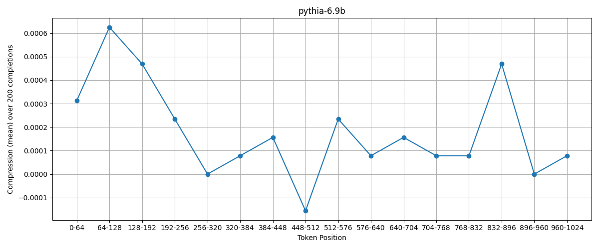

Unfortunately, this doesn't show the same correlation as at temperature 2.0.

Okay, let's go into more detail and plot a heatmap per model, over temperature and token position.

### Mean compression, by token position and temperature

Here is the plot of mean compression over token position and temperature for pythia-12b:

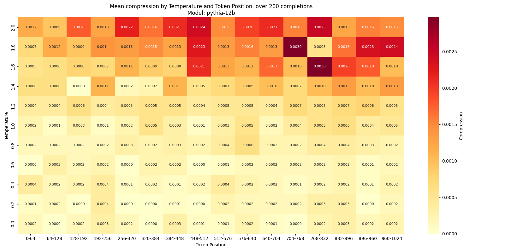

I seem to see a concentration of compression to the right; there is probably a pretty consistent positive relationship between token position and compression, but it is just so noisy that it is not 100% clear.

Here is the same for pythia-6.9b:

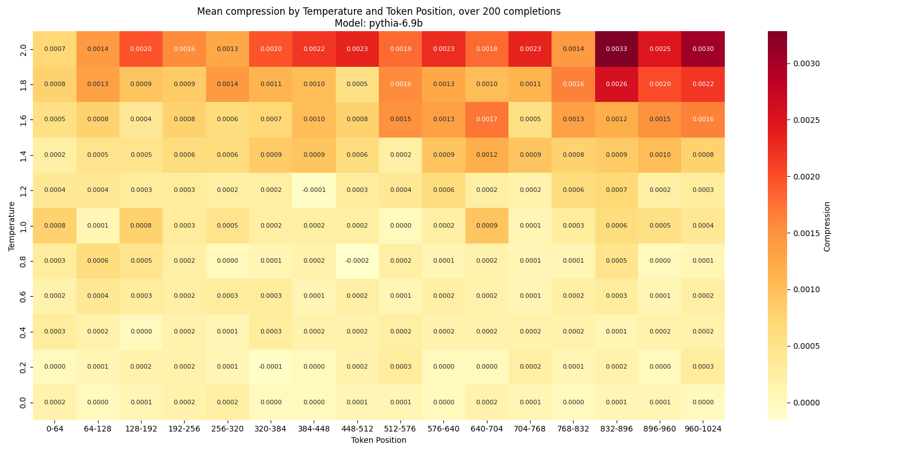

Here, the relationship is the same, but much more clearly.

All this is too noisy for me, though, so to get a clearer picture, I will plot the "center of gravity" of the compression over the token positions, independently for each temperature.

### Center of gravity of compression over token position

Here is the center of gravity of compression over the token positions for pythia-12b:

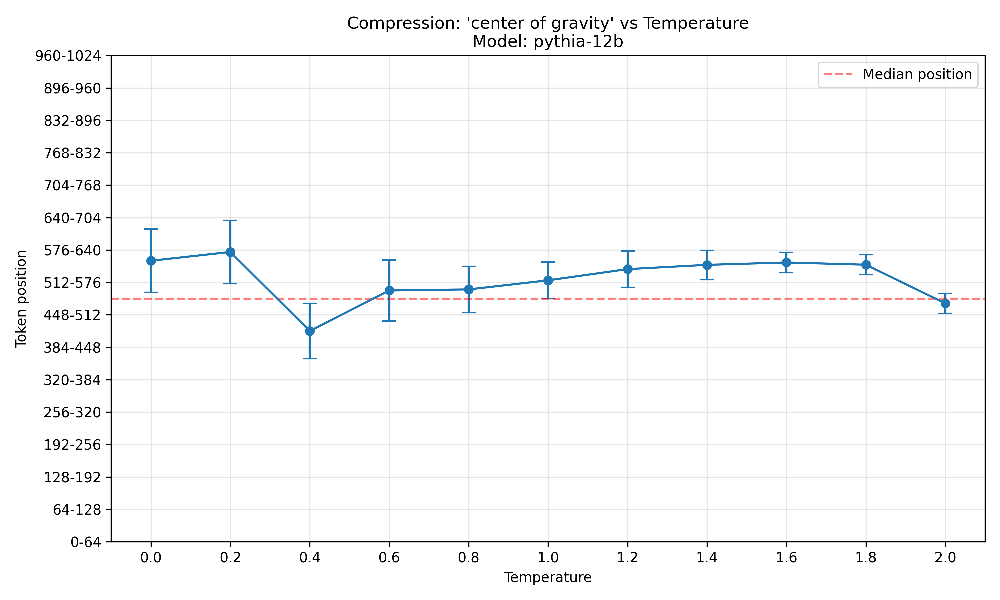

Clearly, the center of gravity is above the median position at most temperatures, and the two outliers are just that: outliers.

Here is the same plot for pythia-6.9b:

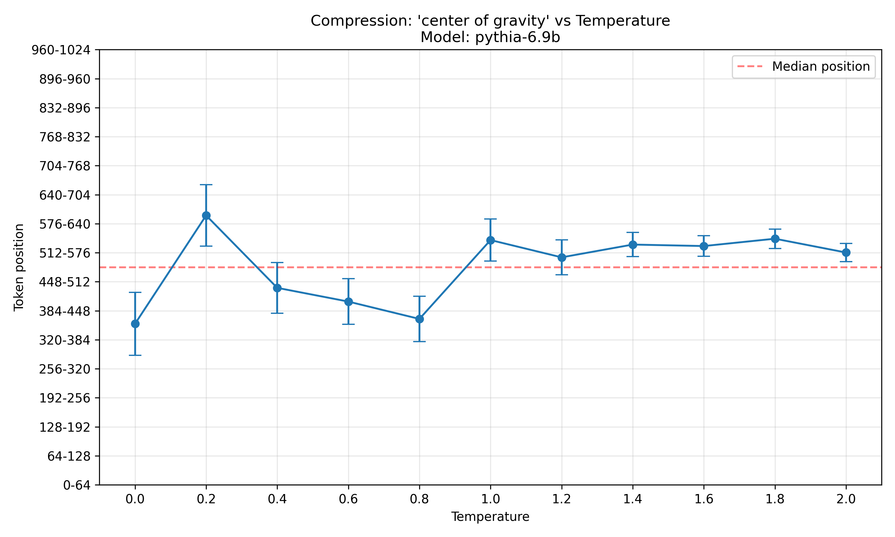

Here, the picture is less clear. At high temperatures, the center of gravity is consistently above the median token position, but at low temperatures, it is mostly below the median position. Again, the plot is more noisy and thus less meaningful at low temperatures, but this does still weaken the evidence.

To get another datapoint, here are the same plot for pythia-1.4b and pythia-2.8b:

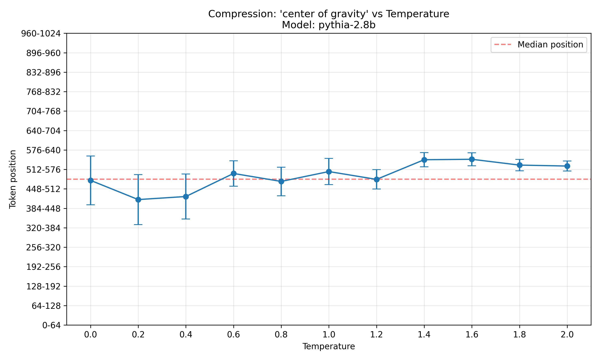

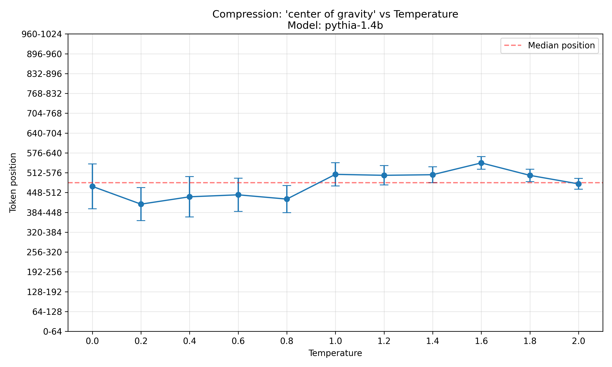

Both seem to follow the same pattern as pythia-6.9b, where at low temperatures, the outputs are more compressible at early output positions, and at high temperatures, they are more compressible at late output positions.

To clear this up, here is the same plot, but averaged over all models:

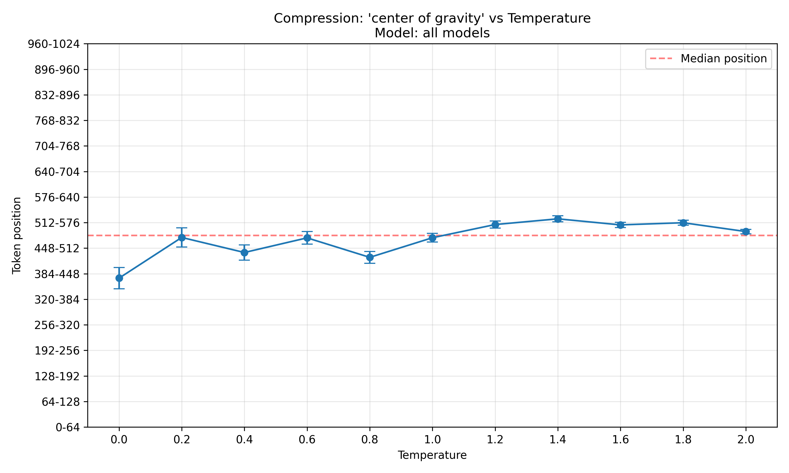

It seems on average, at low temperatures, early tokens are most compressible, while at high temperatures, late tokens are. However, I want to stress again that at low temperatures, so few completions are compressible at all that the low-temperature range is less meaningful than the high-temperature range.

### Intermediary conclusion

In all models, there is a positive relationship between temperature and compression. In the meaningfully capable models, there is an additional positive relationship between token position and compression, at least at high temperatures. It is unclear if any of the low-temperature data is meaningful at all.

## Further work

In general, I should use more than 200 samples per model & teperature, because especially at low temperatures, the data is very noisy. I haven't done this so far, because I wanted to save some compute (also, last week I was too sick to figure out batched inference on the pythia-models without it leading to completely nonsensical completions, might get to that once I'm healthy again.)

I would also like to compare the impact of training set size. To do this, I would do two things:

1. Ablate different checkpoints of the pythia-models
2. Ablate non-pythia models that have been trained on more data

One thing I still don't know how to do is how to run evals for this. Ususally, evals expect only very few completion tokens, so the probability of getting any token-merging at all is extremely low. Additionally, I would expect a model to not get instantly confused by one non-merged token; token-merging is probably only relevant for long output-sequences, if at all. So how would I get any signal from them? The only way to mitigate this is by using terrible models or really high temperatures, which are both not great for evals. If you have an idea for how to do this, feel free to reach out to me on X: [@omouamoua](https://x.com/omouamoua).

One possibility might be to try it on some open reasoning model like [QwQ](https://huggingface.co/Qwen/QwQ-32B-Preview). However, those were likely trained to think without token-merging (I assume, haven't read the paper yet), so merging tokens might actually take them out of distribution instead of into it.

## Citation

If you use this code, please cite it as:

```bibtex
@misc{snimu2024tokenmerge,
    title={Merge tokens in autoregressive generation},
    author={Sebastian M\"uller},
    year={2024},
    month={dec},
    url={https://github.com/snimu/blog/blob/main/contents/token-merge/merge-tokens-in-autoregressive-generation.md}
}
```
