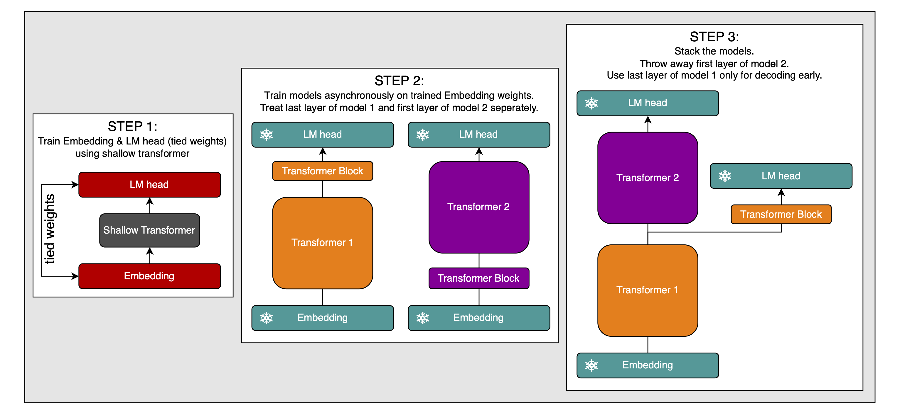
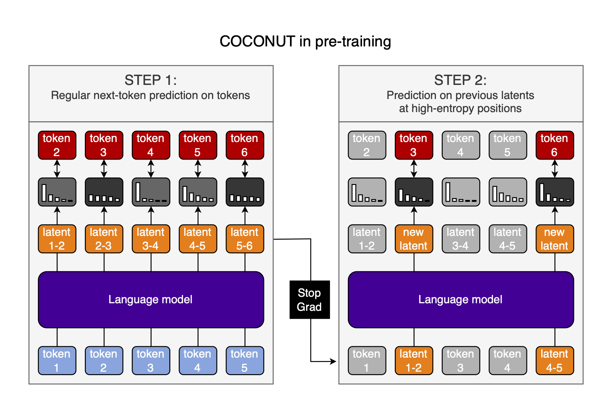

# Truly decentralized training

I have a crazy idea for doing large decentralized, asynchronous training of transformers. This article is *very* speculative.

## Introduction

I will present a method for training an (almost) arbitrary number of LLMs independently from each other, then put them together to form a single large LLM &mdash; a model stack, if you will.

Why would that be good?

**Reason 1:** [Data movement puts a hard limit on AI scaling](https://epoch.ai/blog/data-movement-bottlenecks-scaling-past-1e28-flop). The larger the model, the more parallelized it has to be. The more parallelized the model, the more costs are dominated by communication overhead. Here is a relevant plot from the linked article by EpochAI:


If models can be trained asynchronously, then there needs to be no data movement between them. Therefore, it will make training much more scalable and efficient.

This is very reminicent of test-time scaling models, where you produce many data points through forward passes, then do a single backward pass to update the model parameters (roughly speaking). Both methods can, of course, be combined.

It is also reminiscent of other efforts for decentralized training, though those usually use low-communication optimizers&mdash;which, again, can be combined with the method described in this article, but are different.

I want to stress from the start that we will ultimately still have to do inference on the entire model stack at once, which somewhat limits scaling, but avoiding this during training is already a major win (if it works, this is all just speculation).

## Basic concept

The key insight is that, if we tie the embedding & unembedding weights, the input and output hidden states of the model will be tailored to the same embedding space. This allows for the following simple process:

1. Train one model normally with tied embedding & unembedding weights
2. Train a bunch of models in that embedding space using the frozen embedding & unembedding weights
3. Stack those models into a larger one, and, because they all work in the same embedding space at the input and output, they should simply work together. At worst, a little bit of post-training will make up for any incompatibilities (though I will make suggestions for how to avoid even that little bit of post-training later).

Here is an illustration of this method:


This illustration (and all further explanations) only show two models to be stacked, but of course, we can extend this to as many models as we want.

There are three points we need to take care of:

1. The model used to train the embedding & unembedding weights must have the same embedding dimension as the models we will stack later. I won't write any more about this, because it's just obvious how to do it.
2. It must be trained on enough data to make the embedding & unembedding weights as high-quality as possible. Again, obvious.
3. The outputs of model 1 will be tailored to including as much information as possible about the *next* token, but model 2 ideally needs an abstract representation of the *current* token at its input, because that's how it's trained. We therefore need to align the output-hidden-states of model 1 with the input-hidden-states of model 2.
4. The fact that two models are trained in the same embedding space doesn't guarantee that they work with the same abstractions. There *might* be issues with this.

## Aligning the prediction position of model 1 with the input positions of model 2

There are two ways I see to do this:

1. Only do causal prediction with the shallow model used to train the embedding & unembedding weights. Do BERT/UL2-style denoising with all other models, then stack the shallow model on top of the rest to make the prediction causal.
2. Cut off the last layer from model 1 and the first layer from model 2 when stacking them.

Option 2 should work on its own, but can likely also be combined with option 1.

I will spend the rest of this article going through these two approaches.

### Denoising for hidden-state alignment

The idea is very simple: Train bidirectional models on BERT/UL2-style denoising objectives asynchronously, and stack them. Then, stack the shallow, causal model that was used to train the embedding & unembedding weights on top of the rest:


I can think of the following advantages to this approach:

- Denoising models learn to produce semantically rich hidden states at the output, which should make stacking the models very easy.
- The shallow model isn't wasted.
- We can switch between masked and causal prediction at inference time.
- Bidirectional models have large algorithmic advantages over causal models, like seeing the entire context window at once.
- Causal models have other advantages, meaning that [mixed causal & masked prediction is desirable](https://arxiv.org/abs/2406.04823), which is exactly what's happening here.

There is one possible disadvantage to this: *if* we need to post-train the model stack in order to align the individual models' hidden states, then we need to use a causal mask. Changing a bidirectional model to a causal model is not trivial, and after this post-training we might have to use a causal mask in all models during inference as well, which gets rid of all the advantages discussed above. It is unclear to me if this is worth it *if* we need to post-train the model stack. In the next sections, I will discuss techniques that work for a model stack of either causal or bidirectional models.

### Split head and loop hidden states

I will present the following techniques with causal models, because they seem more useful for those, and I need to pick one type of model to illustrate them. Again, I see no reason why they wouldn't work for bidirectional models as well.

This is optional, and if it doesn't work it would not invalidate the first part of the article.

#### Split head

What do I mean by splitting the head?

I have a contention that we shouldn't see the language head as consisting only of a single FC layer, but at least one prior transformer block, too. In normal transformers, modalities are in conflict with each other, at least if they are trained in an early-fusion manner. I suspect that this is partially because we decode the same hidden state into two different modalities, with only a single FC layer in between. Adding one or two transformer blocks between the shared hidden state and the FC layer might solve this issue. I will write a longer article about this, but it's already relevant here.

In the specific case of stacking models, it would mean that more abstract representations of the input are fed into the second model, which I think would be closer to a model that is trained with all the models' layers from the start. This might be helped by also cutting off the first layer of model 2 when stacking, because the first transformer block only ever deals with the embeddings of one-hot-encoded tokens, not with abstract representations. I will draw it in like that in the illustration, but whether or not it's a good idea must be evaluated empirically.



**Advantages** of this approach:

- Preserve the rich internal representations of the models throughout the model stack, instead of collapsing into a representation that is easy to decode after every model.
- We can now use dynamic compute: simply decode at every model in the stack, and only pass the hidden states on if the prediction distribution has high entropy; a.k.a. when the model is uncertain about the next token, we let the next model refine the hidden states and decode again.
- This might be better for multi-modality, though I'm really not sure about that (and it's a point that is independent of the model-stacking approach).
- Compatability with [DeepSeek V3](https://github.com/deepseek-ai/DeepSeek-V3)-style Multi-Token Prediction (this is just a nice little bonus).

One **disadvantage** of this approach is that it worsens our second concern: that the representations in the hidden states don't align. Without this change, the outputs of model 1 are decoded by the same weights that encode the inputs to model 2, so a certain level of alignment can be expected. However, with this change, that is no longer true. This almost certainly necessitates post-training, as addressed below.

> One thing that might actually help here is to do multi-model training; then, the model will already be trained to include abstract information into its last hidden state, which can be decoded by two different small models: the language decoder and the image decoder. This is truly pure speculation, though.

Still, I believe that&mdash;should we get post-training as described further below to work well&mdash;the advantages of this approach might outweigh the disadvantages. As everything in this article, though, this is a question of empirical testing.

#### Loop hidden states

If we are already talking about using the second-to-last-layer's hidden states as inputs to model 2 to work in a more abstract space, can we make sure that the models are acutally used to working in such an abstract space?

I believe so.

The are already [efforts to recylce hidden states and work in a continuous latent space](https://arxiv.org/abs/2412.06769), and [I have written about training this ability during pre-training](https://github.com/snimu/blog/blob/main/contents/COCONUT-parallel-pretraining/article.md).

Here is an illustration of this approach from the linked article:



(I call the hidden states "latents" because "hidden state" doesn't fit into the little blocks; just replace "latent" with "hidden state" in your mind.)

1. Do a normal forward pass and calculate the gradient
2. Do a second forward pass on the same data, but replace some of the inputs with the output hidden states from the first forward pass; do this at the positions where the model's predictions were high-entropy
    - To save computation, only do this every $n^{th}$ forward pass; for example, every $100$ forward passes
    - Only calculate the loss at the positions where the inputs were replaced with hidden states
3. Accumulate the gradients from both forward passes and update the model parameters

For more details, see the linked article.

The illustration shows using the output hidden states from position $i$ as inputs to the model at position $i+1$; but in our case, it might be better to simply reuse the output of the model from the first forward pass at the exact same position during the second forward pass. It also shows using the last hidden state as input to the model, but it might make more sense to use the second-to-last hidden state instead, as we might do when stacking models. Here is an updated illustration:


What would that give us?

- Models that are used to working with hidden states. This is especially useful for model 2, which will take hidden states from model 1 as inputs.
- The ability to work in a continuous latent space.
- That ability can be used very dynamically (though I'm not sure it should be): loop the hidden states within model 1 for a few steps, then pass them on to model 2, loop again, pass on, etc. Alternatively, you can now see the model stack less as a stack and more as a bunch of experts that can be called in any order you like (though this assumes that the models' representations are aligned by default, and we don't need any post-training as discussed below).
- If a model can recycle its own output hidden state at the same position multiple times and still only predict one token ahead, then we have solved problem #1.

To be clear, I would do this *per model*, before stacking them.

Caveat: this is now speculation built on top of speculation. I think it's a cool idea and that it will likely work with a bit of tuning, but there is currently no strong evidence for it.

## Aligning the output representations of model 1 with the input representations of model 2

There are two options I see here:

1. Normal post-training of the entire stack
2. Special sauce

### Option 1: Post-training the entire stack

This is obviously the simplest option: just train the entire stack at once on some data.

There are some things we might want to do here:

- Train every model in the stack at once (using inputs from the previous model, if available). This way, we encourage the dynamic compute I talked about above.
- This of course only works if all models are causal. For the masked models, you can still have a masked input and predict the un-masked outputs at every model but the last one, or unmasked inputs with which you predict the next tokens at the last model ouput; then interleave these two training settings.

Otherwise, this is pretty straightforward.

The big disadvantage is, of course, that we now have to synchronize all the models' gradients, which limits scaling in a big way, and is expensive. The entire point of this article is to avoid this! So let's try to do better.

### Option 2: Special sauce

Here is an idea for doing post-training for aligning the models in an asynchronous way:

1. Do forward pass through model 1 and collect dataset of hidden states
2. Do forward pass through second model, with hidden states of model 1 as inputs
3. Calculate loss agaist token targets
4. Calculate the gradient with respect to the input-hidden-states at which the first model's output-hidden-states will be entered
5. Update the input-hidden-states with the gradients to get inputs that would have produced the correct targets with high confidence in model 2
6. Create a dataset of such samples&mdash;token inputs, corrected hidden-state-inputs, token targets&mdash; and train model 1 on this
7. That is, token inputs at model 1's inputs; use model 2's hidden-state-inputs as targets for model 1's output-hidden-states; and to ground model 1, use the actual token targets as targets, too (though this is optional)


This way, you can collect a large dataset using model 2, and then, without needing to sync gradients etc., train model 1 to produce hidden states that are maximally useful to model 2. I think you can easily combine this with test-time-compute-style post-training (by just doing it with the inputs and targets of that training), though I'm not 100% certain about that (it might depend on your RL setup)

## Initialization and growth strategies

I see two main ways to initialize the models:

1. You can train a single model to train the embedding weights (and, since they are tied, the language head weights as well) and then initialize the other models with the transformer backend. This is good for avoiding wasted computation
2. Alternatively, you could throw away that original model, or use it as just one of the backends. Then, you'd have more diversity between layers, and a higher chance of a lottery ticket being among the different asynchronously trained models (you could actually train several times as many models as you will ultimately use, and only use the best ones in the end, or run some optimization to find the exact model stack that displays the highest compatibility between the models)

For both of these, you need a way to introduce diversity between the models. This is of course easier for the second approach than the first (because you initialize the models differently), but in both cases, you can do better if you at least shuffle the data that the models see.

## Data

Besides shuffling the data, there are other things you can do to introduce diversity.

I actually think it might make sense to train the different models on at least partially disjunct data (a large overlap is probably desireable). This allows you to effectively use a much larger dataset without having to necessarily train all models on it.

Just for illustration, one possible way to handle this is to have the early models be focussed on knowledge retrieval, and later models on reasoning. This would nicely fit the theme of early stopping if the answer is easy to find, and reasoning for longer if it isn't; in which case, the later models, trained on reasoning, might benefit from the knowledge imparted by the early models.

The only constraint here is that it's unclear to me if this interaction actually works. If model 1 is trained on a piece of information but model 2 isn't, then can model 2 make use of the hidden states from model 1? This would need to be tested empirically.

## Putting it all together

Gaze upon this monstrosity of an illustration:

...

The process: ... need to stress again that I'm talking about two models for illustrative purposes only; you can extend this to many more.

What does this give us? ... (split between causal models and bidirectional models)

-> to combine the advantages of both, we could interleave causally and non-causally trained models!

- use each model on its own, with its own strengths and weaknesses

## Summarizing what needs verification

- Does splitting the head improve performance in multi-modal settings?
- Does looping hidden states during pre-training, followed by COCONUT-style post-training, improve latent thinking as opposed to COCONUT-style post-training only? Does splitting the head here improve this?

## Citation

```bibtex
@misc{snimu2024decentralized,
    title={Truly decentralized training},
    author={Sebastian M\"uller},
    year={2025},
    month={jan},
    url={https://github.com/snimu/blog/blob/main/contents/truly-decentralized-training/article.md}
}
```
