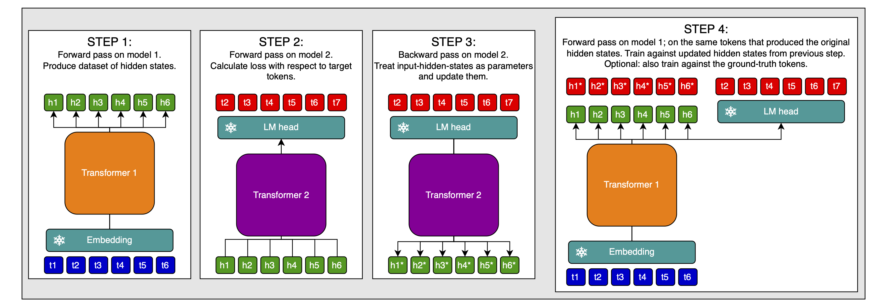

# Truly decentralized training

I have a crazy idea for doing large decentralized, asynchronous training of transformers. This article is *very* speculative.

## Introduction

I will present a method for training an (almost) arbitrary number of LLMs independently from each other, then put them together to form a single large LLM &mdash; a model stack, if you will.

Why would that be good?

[Data movement puts a hard limit on AI scaling](https://epoch.ai/blog/data-movement-bottlenecks-scaling-past-1e28-flop). The larger the model, the more parallelized it has to be. The more parallelized the model, the more costs are dominated by communication overhead. Here is a relevant plot from the linked article by EpochAI:


If models can be trained asynchronously, then there needs to be no data movement between them. Therefore, it will make training much more scalable and efficient.

This is very reminicent of test-time scaling models, where you produce many data points through forward passes, then do a single backward pass to update the model parameters (roughly speaking). Both methods can, of course, be combined.

It is also reminiscent of other efforts for decentralized training, though those usually use low-communication optimizers&mdash;which, again, can be combined with the method described in this article, but are different.

I want to stress from the start that we will ultimately still have to do inference on the entire model stack at once, which somewhat limits scaling, but avoiding this during training is already a major win (if it works; again, this is all just speculation).

## Basic concept

The key insight is that, if we tie the embedding & unembedding weights, the input and output hidden states of the model will be tailored to the same embedding space.

> Tying the embedding & unembedding (or language head) weights means using the exact same parameters both for turning the one-hot-encoded input token into a continuous embedding, and for turning the model's last hidden state embedding into a probability distribution over the vocabulary.

This allows for the following simple process:

1. Train one model normally with tied embedding & unembedding weights
2. Train a bunch of models in that embedding space using the frozen embedding & unembedding weights
3. Stack those models into a larger one, and, because they all work in the same embedding space at the input and output, they should simply work together. At worst, a little bit of post-training will make up for any incompatibilities (though I will make suggestions for how to avoid even that little bit of post-training later).

Here is an illustration of this method:


> This illustration (and all further explanations) only show two models to be stacked, but of course, we can extend this to as many models as we want.

There are four points we need to take care of:

1. The model used to train the embedding & unembedding weights must have the same embedding dimension as the models we will stack later. I won't write any more about this, because it's just obvious how to do it.
2. It must be trained on enough data to make the embedding & unembedding weights as high-quality as possible. Again, obvious.
3. The outputs of model 1 will be tailored to including as much information as possible about the *next* token, but model 2 ideally needs an abstract representation of the *current* token at its input, because that's how it's trained. We therefore need to align the output-hidden-states of model 1 with the input-hidden-states of model 2. I actually think that this won't be a big problem, but in case it is, I will discuss ways to deal with it.
4. The fact that two models are trained in the same embedding space doesn't guarantee that they work with the same abstractions. There *might* be issues with this, and we have to plan for dealing with them.

## Aligning token positions between models

There are three ways I see to do this:

1. Only do causal prediction with the shallow model used to train the embedding & unembedding weights. Do BERT/UL2-style denoising with all other models, then stack the shallow model on top of the rest to make the prediction causal.
2. Looping latents / recycling hidden states
3. Post-training (though I will get to that in its own section)

Post-training obviously works together with both of the other options. I'm less sure whether the other two are compatible, but that doesn't matter.

And again, I suspect that this isn't even a big problem. I just want to preempt any potential problems with possible solutions.

### Denoising for hidden-state alignment

The idea is very simple: Train bidirectional models on BERT/UL2-style denoising objectives asynchronously, and stack them. Then, stack the shallow, causal model that was used to train the embedding & unembedding weights on top of the rest:


**Advantages:** I can think of the following advantages to this approach:

- Denoising models learn to produce semantically rich hidden states at the output, which should make stacking the models very easy, if their representations are aligned, or can be made to be.
- The shallow model isn't wasted.
- We can switch between masked and causal prediction at inference time, by simply decoding the hidden states of earlier models.
- Bidirectional models have algorithmic advantages over causal models, like seeing the entire context window at once.
- Causal models have other advantages, meaning that [mixed causal & masked prediction is desirable](https://arxiv.org/abs/2406.04823), which is exactly what's happening here.

**Disadvantages:** I see two disadvantages to this approach:

1. During inference, we cannot use a kv-cache in bidirectional models. This means that while we can in principle use the model stack as a causal model, we have to compute the entire attention matrix at every step, which is really expensive.
2. *If* we need to post-train the model stack in order to align the individual models' hidden states, then we need to use a causal mask in every model, or we will be unable to train all token positions in parallel. Changing a bidirectional model to a causal model is not trivial, and after this post-training we might have to use a causal mask in all models during inference as well, which gets rid of all the advantages discussed above.

These disadvantages are significant. It seems likly that simply using causal models only is the better choice.

In the next sections, I will discuss techniques that work for a model stack of either causal or bidirectional models.

### Loop hidden states

In [COCONUT]((https://arxiv.org/abs/2412.06769)), the authors post-train a model to recycle its output hidden states at the input to replace Chain of Thought (CoT) traces with latent reasoning, like so (image from linked paper):


They first produce CoT traces, then slowly replace the CoT tokens with the model's own outputs from the previous step. They start with the first CoT token, and increase the number of replaced CoT tokens over training. They report performance improvements over pure CoT with this technique.

The fact that this works well makes me think two things:

1. That the problem of aligning token positions isn't really a big problem
2. That if it is, we can simply use COCONUT-style post-training to align the hidden states

And I think we should be doing COCONUT-style post-training either way, because it would give us the following benefits:

- Models that are used to working with hidden states. This is especially useful for model 2, which will take hidden states from model 1 as inputs.
- The ability to work in a continuous latent space.
- That ability can be used very dynamically (though I'm not sure it should be): loop the hidden states within model 1 for a few steps, then pass them on to model 2, loop again, pass on, etc. Alternatively, we can now see the model stack less as a stack and more as a bunch of experts that can be called in any order we like (though this assumes that the models' representations are aligned by default, and we don't need any post-training as discussed below).
- If a model can recycle its own output hidden state at the same position multiple times and still only predict one token ahead, then we have solved problem #1.

To be clear, I would do this *per model*, before stacking them.

Optionally, we might be able to go further with this. [I have written about training this ability during pre-training](https://github.com/snimu/blog/blob/main/contents/COCONUT-parallel-pretraining/article.md).

Here is an illustration of this approach (slightly updated from the linked article):


> I call the hidden states "latents" because "hidden state" doesn't fit into the little blocks; just replace "latent" with "hidden state" in your mind.

The process:

1. Do a normal forward pass and calculate the gradient
2. Do a second forward pass on the same data, but replace some of the inputs with the output hidden states from the first forward pass; do this at the positions where the model's predictions were high-entropy
    - To save computation, only do this every $n^{th}$ forward pass; for example, every $100$ forward passes
    - Only calculate the loss at the positions where the inputs were replaced with hidden states
3. Accumulate the gradients from both forward passes and update the model parameters

For more details, see the linked article.

Caveat: this is now speculation built on top of speculation. I think it's a cool idea and that it will likely work with a bit of tuning, but there is currently no strong evidence for it.

## Aligning the representations between models

There are two options I see here:

1. Normal post-training of the entire stack
2. Special sauce

### Option 1: Post-training the entire stack

This is obviously the simplest option: just train the entire stack at once on some data.

There are some things we might want to do here:

- Train every model in the stack at once on the same targets, with the same frozen language head, using inputs from the previous model, if available. This way, we encourage the dynamic compute I talked about above.
- This of course only works if all models are causal. For the masked models, we can still have a masked input and predict the un-masked outputs at every model but the last one, or unmasked inputs with which we predict the next tokens at the last model ouput; then interleave these two training settings.

Otherwise, this is pretty straightforward.

The big disadvantage is, of course, that we now have to synchronize all the models' gradients, which limits scaling in a big way, and is expensive. The entire point of this article is to avoid this! So let's try to do better.

### Option 2: Special sauce

Here is an idea for doing post-training for aligning the models in an asynchronous way:

1. Do forward pass through model 1 and collect dataset of hidden states
2. Do forward pass through second model, with hidden states of model 1 as inputs
3. Calculate loss agaist token targets
4. Calculate the gradient with respect to the input-hidden-states at which the first model's output-hidden-states will be entered
5. Update the input-hidden-states with the gradients to get inputs that would have produced the correct targets with high confidence in model 2
6. Create a dataset of such samples&mdash;token inputs, corrected hidden-state-inputs, token targets&mdash; and train model 1 on this
7. That is, token inputs at model 1's inputs; use model 2's hidden-state-inputs as targets for model 1's output-hidden-states; and to ground model 1, use the actual token targets as targets, too. This might be useful for preventing catastrophic forgetting.



This way, you can collect a large dataset using model 2, and then, without needing to sync gradients etc., train model 1 to produce hidden states that are maximally useful to model 2. I think you can easily combine this with test-time-compute-style post-training (by just doing it with the inputs and targets of that training), though I'm not 100% certain about that (it might depend on your RL setup).

## Initialization and growth strategies

I see two main ways to initialize the models:

1. We can train a single model to train the embedding weights, and then initialize the other models with the transformer backend. This is good for avoiding wasted computation
2. Alternatively, we could throw away that original model, or use it as just one of the backends which are all trained with their own random seed. Then, we'd have more diversity between layers, and a higher chance of a lottery ticket being among the different asynchronously trained models (we could actually train several times as many models as we will ultimately use, and only use the best ones in the end, or run some optimization to find the exact model stack that displays the highest compatibility between the models)

For both of these, we need a way to introduce diversity between the models. This is of course easier for the second approach than the first (because we initialize the models differently), but in both cases, we can do better if we at least shuffle the data that the models see.

## Data

But we can go further than shuffling the data.

I think it might make sense to train the different models on at least partially disjunct data (a large overlap is probably desireable). This allows us to effectively use a much larger dataset without having to necessarily train all models on it.

Just for illustration, one possible way to handle this is to have the early models be focussed on knowledge retrieval, and later models on reasoning. This would nicely fit the theme of early stopping if the answer is easy to find, and reasoning for longer if it isn't; in which case, the later models, trained on reasoning, might benefit from the knowledge imparted by the early models.

The only constraint here is that it's unclear to me if this interaction actually works. If model 1 is trained on a piece of information but model 2 isn't, then can model 2 make use of the hidden states from model 1? In other words, would training on disjunct data worsen the problem of incompatible hidden state representations? This would need to be tested empirically.

## Summary

I have presented a method for asynchronous training of multiple LLMs, but using them together in a model stack at inference time.

To do so, they are all trained in the same embedding space, which is achieved tied embedding & unembedding weights in a first training run.

I have identified two possible problems with this setup:

1. The problem of aligning token positions between models
2. The problem of aligning the representations between models

The former is unlikely to be an actual problem, because looping latents is shown to work well&mdash;which is a similar idea to what I'm proposing here. The latter may or may not be a problem. A reason to believe it isn't is that all models work in the same embedding space where they are connected, but it's still possible that there are still points of friction here.

In any case, I have proposed multiple solutions to both of these problems:

- Aligning token positions between models
  - Bidirectional models (though there are problems with this)
  - Loop latents (COCONUT-style post-training, or even adapted COCONUT in pre-training)
  - Post-training
- Aligning the representations between models
  - Normal post-training
  - Post-training in an asynchronous manner

I think that this is a promising research direction and would love to work on it in the near future.

## Citation

```bibtex
@misc{snimu2024decentralized,
    title={Truly decentralized training},
    author={Sebastian M\"uller},
    year={2025},
    month={jan},
    url={https://github.com/snimu/blog/blob/main/contents/truly-decentralized-training/article.md}
}
```
